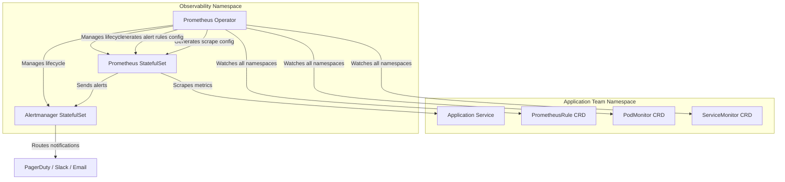
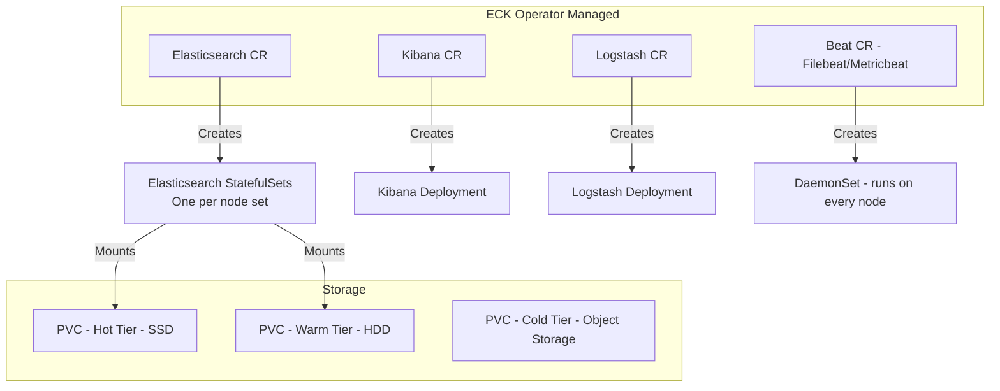
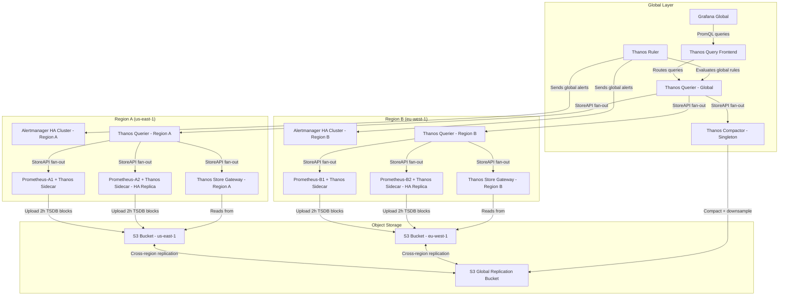

# 13 — Deployment Architecture

---

## Objective

Define the Kubernetes-native deployment architecture for the entire observability platform: how each component is packaged, operated, upgraded, and scaled. The platform must itself be production-grade — it monitors production systems and must be available when those systems have incidents. Operational complexity is the primary risk; every operator, CRD, and Helm release adds toil and failure surface.

---

## Design Decisions

### 1. Operator-First Philosophy

Every stateful component in the observability stack is managed via a Kubernetes Operator, not raw StatefulSets. Operators encode operational knowledge (upgrades, scaling, failure recovery) into controller logic, reducing human toil and error.

| Component | Operator | Custom Resources |
|---|---|---|
| Prometheus + Alertmanager | Prometheus Operator (kube-prometheus-stack) | `Prometheus`, `Alertmanager`, `PrometheusRule`, `ServiceMonitor`, `PodMonitor`, `Probe` |
| Elasticsearch + Kibana | Elastic Cloud on Kubernetes (ECK) | `Elasticsearch`, `Kibana`, `Logstash`, `Beat` |
| Kafka + ZooKeeper/KRaft | Strimzi Operator | `Kafka`, `KafkaTopic`, `KafkaUser`, `KafkaConnect`, `KafkaMirrorMaker2` |
| Grafana | Grafana Operator or Helm chart | `GrafanaDashboard`, `GrafanaDatasource` (if using operator) |
| Thanos | Thanos Operator or Helm (bitnami/thanos) | Deployed as Deployments + Services alongside Prometheus |
| OpenTelemetry Collectors | OpenTelemetry Operator | `OpenTelemetryCollector`, `Instrumentation` |
| Tempo / Jaeger | Grafana Operator or Jaeger Operator | `Jaeger`, `TempoStack` |

### 2. Prometheus Operator and Custom Resources

The Prometheus Operator is the cornerstone of the deployment. It eliminates manual scrape config management and allows application teams to self-service their own monitoring registration.

**Key Custom Resources:**

**`ServiceMonitor`:** Tells the Prometheus Operator which Kubernetes Services to scrape. Application teams create a ServiceMonitor in their own namespace; the Prometheus Operator discovers it and adds the target to Prometheus's scrape configuration. This decouples the observability platform from application deployment pipelines.

```
ServiceMonitor selects Services by:
  - namespaceSelector (which namespaces to watch)
  - selector (which Service labels to match)
  - endpoints (which port names, path, interval, scrapeTimeout)
```

**`PodMonitor`:** Like ServiceMonitor but targets individual Pods directly. Used when metrics are exposed per-pod rather than through a Service (common for stateful workloads like Kafka brokers).

**`PrometheusRule`:** Defines alerting rules and recording rules as a Kubernetes-native resource. Teams own their alert definitions alongside their application code. The Prometheus Operator merges all PrometheusRule resources into the running Prometheus configuration without requiring a restart.

**`Probe`:** Used for blackbox monitoring (HTTP probes, TCP probes) via the Blackbox Exporter. Defines URLs and protocols to probe.

**Prometheus Operator Architecture:**



### 3. ECK (Elastic Cloud on Kubernetes) for Elasticsearch

ECK manages Elasticsearch cluster lifecycle including rolling upgrades, certificate management (TLS between nodes is configured automatically), and persistent volume management.

**ECK Resource Structure:**



**Elasticsearch Node Roles (ECK NodeSets):**
- **Master-eligible nodes** (3): 4 vCPU, 8GB RAM, 20GB SSD. Never co-located with data nodes to prevent OOM from heap killing the master.
- **Hot data nodes** (3+): 8 vCPU, 32GB RAM, 500GB NVMe SSD. Recent 7-day indices.
- **Warm data nodes** (3+): 4 vCPU, 16GB RAM, 2TB HDD. 8–90 day indices.
- **Cold data nodes** (2+): 2 vCPU, 8GB RAM, no local storage (uses searchable snapshots from S3).
- **Coordinating-only nodes** (2): Receive query traffic, route to data nodes. Prevents data nodes from being overwhelmed by query parsing.

**JVM Heap Tuning:**
- Set to 50% of available RAM, capped at 31GB (above 31GB, JVM cannot use compressed object pointers, wasting memory)
- Disable swap on all Elasticsearch nodes (use `vm.swappiness=1` or `memoryLock: true` in ECK config)
- Set `bootstrap.memory_lock: true` to prevent OS from swapping Elasticsearch heap

### 4. Strimzi Operator for Kafka

Strimzi manages Kafka cluster lifecycle, including topic management, user authentication (mTLS or SCRAM-SHA-512), and MirrorMaker2 for cross-cluster replication.

Key Strimzi resources:
- `Kafka` CR: Defines broker count, storage (persistent PVCs), Kafka version, listener configs, authentication modes
- `KafkaTopic` CR: Declarative topic management (partition count, replication factor, retention)
- `KafkaUser` CR: Creates Kafka ACLs; each consumer/producer gets a dedicated user with least-privilege ACLs
- `KafkaMirrorMaker2` CR: Mirrors topics between regional clusters for disaster recovery

### 5. Grafana via Helm

Grafana is deployed via the official Helm chart. The Grafana Operator is an alternative but adds CRD complexity for marginal benefit at most scales.

**Key configuration:**
- Dashboards provisioned via Kubernetes ConfigMaps (sidecar pattern using `grafana-sc-dashboard` sidecar container that watches ConfigMaps with a specific label)
- Datasources provisioned via Kubernetes Secrets (for credentials) + ConfigMaps (for datasource YAML)
- Grafana deployed behind an Ingress with OAuth2 proxy for SSO (OIDC against corporate identity provider)
- Grafana runs as a Deployment (stateless), state externalized to PostgreSQL (user preferences, dashboard ownership, team memberships)

---

## Multi-Region Architecture: Thanos for Global View

Single-region Prometheus is a single point of observability failure. The Thanos architecture enables globally-consistent long-term metrics storage and cross-region querying.

### Thanos Components

| Component | Role | Deployment |
|---|---|---|
| **Thanos Sidecar** | Runs alongside each Prometheus pod, uploads TSDB blocks to object storage, exposes StoreAPI | Sidecar container in Prometheus Pod |
| **Thanos Store Gateway** | Serves queries from object storage, translates StoreAPI requests to S3/GCS reads | Deployment per region + global |
| **Thanos Querier** | Merges results from multiple Prometheus + Store Gateways, deduplicates replicas | Deployment, can fan out globally |
| **Thanos Query Frontend** | Caches query results, splits queries into sub-ranges, retry logic | Deployment in front of Querier |
| **Thanos Compactor** | Runs compaction and downsampling on object storage blocks (singleton, not horizontally scalable) | Single Deployment with PVC for scratch space |
| **Thanos Ruler** | Evaluates recording and alerting rules against Thanos data (for rules spanning multiple Prometheus instances) | Deployment |

### Multi-Region Deployment Diagram



### Thanos Block Lifecycle

Object storage blocks follow a compaction schedule:
- Raw Prometheus blocks: 2-hour blocks uploaded by sidecar
- Compactor merges 2h blocks → 1-day compacted blocks
- Compactor merges 1-day blocks → 2-week compacted blocks
- Downsampling: 5-minute resolution after 40 days, 1-hour resolution after 1 year
- Retention enforced by Compactor: delete blocks older than configured retention

---

## Resource Sizing

### Prometheus

| Resource | Sizing Guidance |
|---|---|
| CPU | 2–4 cores for 1M active series; query-heavy workloads need more |
| Memory | ~2–3 bytes per sample in head block; 1M series × 4 bytes = ~4GB baseline; add 2x for overhead |
| Storage | Fast local NVMe SSD required for TSDB WAL; 500GB–2TB per instance depending on retention and cardinality |
| Network | Scrape bandwidth proportional to number of targets and sample count |

**Critical: Prometheus requires fast local SSD.** The TSDB WAL uses sequential writes. If the WAL writes are slow, Prometheus will fall behind on ingestion. Network-attached storage (NFS, EFS) is explicitly not supported for Prometheus TSDB.

Kubernetes `StorageClass` for Prometheus PVCs must specify:
- `volumeBindingMode: WaitForFirstConsumer` (ensures PVC is created in the same AZ as the Pod)
- A storage class backed by NVMe SSD (e.g., `gp3` with provisioned IOPS on AWS, or `pd-ssd` on GCP)

### Elasticsearch

| Role | CPU | Memory | Storage |
|---|---|---|---|
| Master | 2–4 vCPU | 8–16GB RAM (4–8GB heap) | 20GB SSD (metadata only) |
| Hot Data | 8–16 vCPU | 32–64GB RAM (16–31GB heap) | 1–4TB NVMe SSD |
| Warm Data | 4–8 vCPU | 16–32GB RAM (8–16GB heap) | 4–8TB HDD |
| Coordinating | 4–8 vCPU | 16–32GB RAM | None |

**JVM heap must never exceed 31GB.** Above this, the JVM switches from 4-byte compressed object pointers to 8-byte pointers, effectively wasting memory. The sweet spot is 26–30GB for data nodes.

### Kafka (via Strimzi)

| Resource | Sizing Guidance |
|---|---|
| Broker CPU | 4–8 vCPU per broker |
| Broker Memory | 8–16GB RAM; JVM heap kept small (4–6GB), rest for OS page cache |
| Storage | SSD preferred; partition count × replication factor × retention = total storage |
| Network | Primary bottleneck for high-throughput Kafka; use 10Gbps+ NICs |

---

## StatefulSets and PersistentVolumes

Prometheus and Elasticsearch are deployed as StatefulSets. Key considerations:

**StatefulSet identity:** Each pod in a StatefulSet gets a stable hostname (e.g., `prometheus-0`, `prometheus-1`). This is essential for Prometheus remote write configurations and Elasticsearch node discovery.

**PersistentVolumeClaim templates:** Defined in the StatefulSet spec; each pod replica gets its own PVC. Critically, deleting a StatefulSet pod does NOT delete its PVC — data survives pod restarts and node replacements.

**Volume expansion:** Prometheus and Elasticsearch PVCs can run out of space. Use a `StorageClass` with `allowVolumeExpansion: true` and a CSI driver that supports online expansion to avoid downtime during capacity increases.

**Anti-affinity rules:** Configure `podAntiAffinity` to prevent multiple Prometheus replicas or Elasticsearch data nodes from landing on the same physical node. A single node failure should not lose an HA pair.

---

## Rolling Upgrades with Zero Data Loss

### Prometheus Upgrades

Prometheus upgrades (version bumps, config changes) are handled by the Prometheus Operator. The operator performs a rolling restart of the StatefulSet. Since Prometheus replicas independently scrape targets and the Thanos Sidecar uploads completed blocks continuously, a rolling restart loses at most the current 2-hour in-memory block (not yet uploaded). The HA replica continues scraping during the restart, providing continuous coverage.

**Zero data loss guarantee:** Thanos stores completed 2-hour blocks in object storage. In-progress blocks live in the WAL and are replayed on restart. The only data at risk is the current in-memory block if the pod crashes without a clean shutdown — WAL replay recovers most of this on restart.

### Elasticsearch Zero-Downtime Upgrades

Elasticsearch upgrades are operationally complex. ECK automates the process:

**Step 1:** ECK checks cluster health (must be green) before beginning.
**Step 2:** ECK cordons the first node to be upgraded (via `_cluster/settings` routing allocation exclude).
**Step 3:** ECK waits for all shards to migrate off the node (cluster returns to green).
**Step 4:** ECK stops the pod, upgrades the image, and restarts the pod.
**Step 5:** ECK re-enables routing allocation for the node.
**Step 6:** Cluster rebalances. Repeat for next node.

This process is slow. Upgrading a 10-node cluster with shard rebalancing can take 30–60 minutes. ECK orchestrates this automatically but requires the cluster to be in a healthy state before starting.

**Manual intervention required when:**
- Cluster is yellow or red — ECK will pause upgrades
- Upgrade crosses a major version boundary where rolling upgrades are not supported (ES 7 → ES 8 requires specific procedures)
- Custom plugins that are version-dependent

### Blue-Green for Query Layer (Thanos Querier / Query Frontend)

The query layer (Thanos Querier, Thanos Query Frontend, Grafana) is stateless. Blue-green deployment is straightforward:
- Deploy the new version alongside the old (separate Deployment with separate Service)
- Run smoke tests (verify PromQL queries return expected results, dashboards load)
- Switch the Ingress or Service selector from blue to green
- Keep blue running for 15 minutes for rapid rollback, then tear down

Blue-green eliminates query downtime during upgrades and provides instant rollback without data risk.

---

## CI/CD Pipeline

```mermaid
graph LR
    A[Git Push: Alert Rule Change] --> B[CI: Validate PrometheusRule YAML]
    B --> C[CI: promtool check rules]
    B --> D[CI: Alert unit tests with promtool test rules]
    C --> E{Tests Pass?}
    D --> E
    E -->|Yes| F[Create PR]
    F --> G[Code Review]
    G --> H[Merge to main]
    H --> I[CD: kubectl apply PrometheusRule to staging]
    I --> J[Staging: Verify rule loaded in Prometheus /rules API]
    J --> K[Manual approval gate for production]
    K --> L[CD: kubectl apply PrometheusRule to production]
    L --> M[Production: Verify rule loaded]
    M --> N[Synthetic alert fire test - if applicable]
```



**GitOps (ArgoCD / Flux):** All observability configuration lives in a Git repository as the source of truth. ArgoCD syncs the desired state from Git to the cluster. Manual kubectl changes are detected as drift and overwritten.

**Helm chart values per environment:** `values-dev.yaml`, `values-staging.yaml`, `values-prod.yaml`. Production values have higher resource requests, more replicas, and production-grade storage classes.

**Alert rule testing pipeline:**
- `promtool test rules` runs alert rule unit tests (YAML-defined test scenarios)
- Tests verify that specific mock metric series cause expected alerts to fire (or not fire)
- Block merges if alert rule tests fail

**Terraform for cloud resources:** S3 buckets for Thanos storage, IAM roles for S3 access (IRSA on EKS), DNS records, load balancer certificates managed via Terraform.

---

## Local Development with Docker Compose

For engineers developing dashboards, testing alert rules, or building integrations, a minimal local stack removes cloud dependency.

**Minimal Stack (docker-compose):**

| Service | Image | Purpose |
|---|---|---|
| Prometheus | `prom/prometheus:latest` | Scrapes local services, serves PromQL |
| Alertmanager | `prom/alertmanager:latest` | Routes test alerts to local webhook receiver |
| Grafana | `grafana/grafana:latest` | Dashboards, uses local Prometheus as datasource |
| Node Exporter | `prom/node-exporter:latest` | Provides real host metrics to scrape |
| Elasticsearch (single node) | `docker.elastic.co/elasticsearch/elasticsearch:8.x` | Log storage, set `discovery.type: single-node` |
| Kibana | `docker.elastic.co/kibana/kibana:8.x` | Log exploration UI |
| Kafka (KRaft mode) | `confluentinc/cp-kafka:latest` | Single-node Kafka for ingestion testing |
| Alert Webhook Receiver | Simple HTTP server | Catches test alerts for verification |

**Not included in local dev:** Thanos (no need for long-term storage), multi-region federation, dedicated master/data node separation in ES.

**Limitations of local dev:**
- Elasticsearch runs with `discovery.type: single-node` — no replication, different behavior from production
- No persistent volumes — data lost on container restart (intentional for local dev)
- No TLS between components (development convenience)
- Single Prometheus instance — no HA or deduplication testing

---

## Interview Discussion Points

**Q: How do you upgrade Elasticsearch with zero downtime?**

The key insight is that Elasticsearch's shard replication enables rolling upgrades without data loss. The process requires the cluster to be green (all primary AND replica shards assigned). You upgrade one node at a time by first migrating all shards off that node (via `_cluster/settings` routing allocation exclusion), waiting for the cluster to return to green, then upgrading the node, then re-enabling routing.

ECK automates this, but engineers must understand when to intervene: if the cluster goes yellow mid-upgrade (e.g., another node fails during the upgrade), ECK will pause. Manual intervention requires assessing shard allocation health and resolving any unassigned shards before resuming.

For major version upgrades (e.g., ES 7 to ES 8), Elasticsearch requires a specific upgrade path: all nodes must be on the latest minor version of the previous major before upgrading to the next major. Cross-major rolling upgrades are not always supported.

**Q: How does the Prometheus Operator handle dynamic scrape target discovery?**

The operator watches for `ServiceMonitor` and `PodMonitor` resources across configured namespaces. When a new ServiceMonitor is created (e.g., when a team deploys a new microservice), the operator generates the corresponding scrape configuration and triggers a Prometheus configuration reload (using the `/-/reload` endpoint). This happens without restarting Prometheus and without modifying the Prometheus Deployment or StatefulSet spec.

**Q: What happens if the Thanos Compactor runs concurrently with the Store Gateway reading from S3?**

Thanos uses an atomic block upload protocol. The Compactor marks blocks for deletion (via a `tombstone` file) but does not delete them immediately. Store Gateways have a configurable delay before acting on tombstones. This prevents a race condition where the Gateway starts serving a block that the Compactor has begun deleting. Blocks are only physically deleted after the retention delay passes and no Gateways are known to be serving them.

**Q: How do you handle node failure during a Kafka upgrade?**

Strimzi upgrades Kafka brokers one at a time, similar to Elasticsearch's rolling approach. Before restarting a broker, Strimzi verifies that no under-replicated partitions exist. If partitions are under-replicated (e.g., from a previous failure), the upgrade pauses. This requires operator intervention to resolve the under-replication before the upgrade can continue.

**Q: Why is fast local SSD critical for Prometheus and not just any network storage?**

Prometheus's TSDB writes the WAL (Write-Ahead Log) on every sample ingestion. At 1M series with 15-second scrape intervals, this is ~66K samples/second of sequential WAL writes. Network-attached storage introduces additional latency and throughput variability (especially under burst conditions). If WAL writes fall behind, the TSDB backpressure mechanism drops incoming samples. NVMe SSD provides consistent sub-millisecond write latency that network storage cannot reliably guarantee at this throughput.
