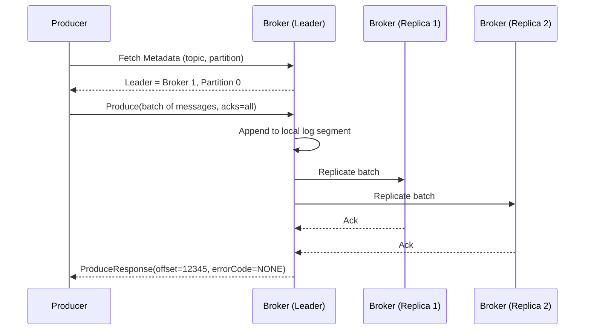
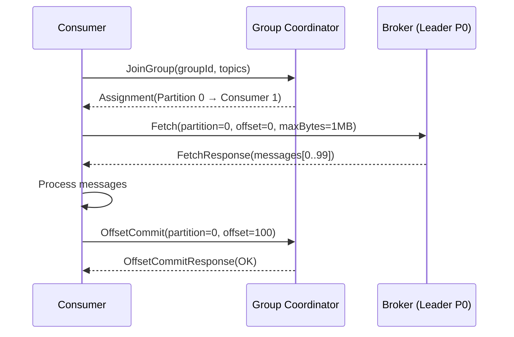
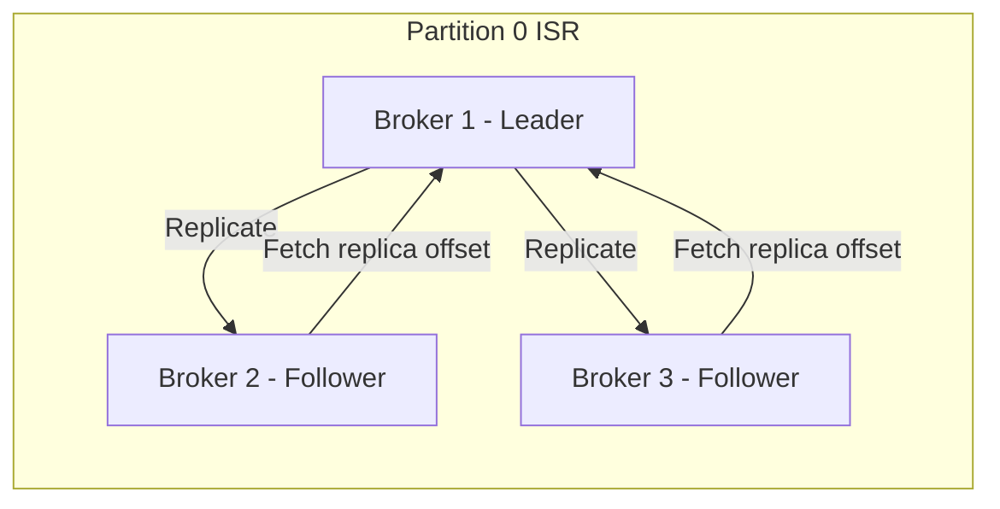

# 01 — High-Level Architecture: Kafka-like Event Streaming System

---

## Objective

Define the overall system architecture, component responsibilities, communication patterns, and rationale for architectural choices in a production-grade distributed event streaming platform.

---

## Architecture Choice: Distributed Log with Centralized Metadata Coordination

### Why NOT a traditional message queue (RabbitMQ-style)?

| Dimension | Traditional MQ | Distributed Log (Kafka-style) |
|---|---|---|
| Message retention | Deleted on consumption | Retained by time/size policy |
| Consumer model | Push to consumer | Pull by consumer |
| Replay | Not supported | Full replay at any offset |
| Ordering | Per-queue, approximate | Strict per-partition |
| Throughput | ~100K msg/sec | 1M+ msg/sec per broker |
| Consumer scaling | Competing consumers on same queue | Independent consumer groups |

**Decision**: Distributed log architecture. The immutable append-only log is the foundation — it decouples producers from consumers completely, enables replay, and turns the broker into a durable buffer rather than a routing switch.

### Why NOT a peer-to-peer gossip topology?

Gossip (e.g., Cassandra-style) distributes metadata organically but has high convergence latency and makes consistent partition leadership difficult. A centralized metadata controller (ZooKeeper or KRaft) gives consistent, fast metadata reads with leader election — acceptable given the controller is not in the hot data path.

---

## System Components

```
┌─────────────────────────────────────────────────────────────────────────┐
│                          CLIENT LAYER                                    │
│  ┌──────────────┐    ┌──────────────┐    ┌────────────────────────────┐ │
│  │  Producer    │    │  Consumer    │    │  Admin Client              │ │
│  │  Client      │    │  Client      │    │  (topic mgmt, metrics)     │ │
│  └──────┬───────┘    └──────┬───────┘    └───────────┬────────────────┘ │
└─────────│──────────────────│────────────────────────│──────────────────┘
          │                  │                         │
          ▼                  ▼                         ▼
┌─────────────────────────────────────────────────────────────────────────┐
│                        BROKER CLUSTER                                    │
│                                                                          │
│  ┌──────────────┐  ┌──────────────┐  ┌──────────────┐                  │
│  │  Broker 1    │  │  Broker 2    │  │  Broker 3    │  ...             │
│  │  (Leader:    │  │  (Leader:    │  │  (Replica:   │                  │
│  │  P0, P3)     │  │  P1, P4)     │  │  P0, P1, P2) │                  │
│  │              │  │              │  │              │                  │
│  │  Log Storage │  │  Log Storage │  │  Log Storage │                  │
│  │  (NVMe SSD)  │  │  (NVMe SSD)  │  │  (NVMe SSD)  │                  │
│  └──────────────┘  └──────────────┘  └──────────────┘                  │
└──────────────────────────────┬──────────────────────────────────────────┘
                               │
                    ┌──────────▼──────────┐
                    │  Metadata           │
                    │  Controller         │
                    │  (KRaft / ZooKeeper)│
                    └──────────┬──────────┘
                               │
                    ┌──────────▼──────────┐
                    │  Schema Registry    │
                    │  (optional)         │
                    └─────────────────────┘
```

---

## Component Responsibilities

### Broker
- Stores partition logs as segment files on local disk
- Handles producer `Produce` requests: append to leader partition, replicate to ISR
- Handles consumer `Fetch` requests: read from offset, serve from page cache
- Manages segment rolling (size/time threshold), log compaction, retention cleanup
- Participates in replication as leader or follower
- Registers with metadata controller on startup

### Metadata Controller (KRaft — preferred over ZooKeeper)
- Single active controller elected via Raft consensus among controller nodes
- Maintains: broker registry, topic/partition metadata, ISR lists, partition leadership
- Handles: broker join/leave, partition reassignment, leader election on failure
- Serves metadata to clients (cached in client metadata cache)
- **KRaft removes ZooKeeper dependency** — simplifies operations, improves scalability to 1M+ partitions

### Producer Client
- Fetches metadata (partition leaders) on startup and caches
- Routes messages to correct broker/partition based on partition key
- Batches messages for throughput (configurable `linger.ms`, `batch.size`)
- Handles retries with idempotence (`enable.idempotence=true`)
- Optional: transactional API for atomic multi-partition writes

### Consumer Client
- Fetches metadata to find partition leaders
- Polls broker for messages at its committed offset
- Manages offset commits to `__consumer_offsets` internal topic
- Participates in group coordinator protocol for consumer group rebalancing
- Implements backpressure naturally via poll rate control

### Schema Registry
- Stores Avro/Protobuf/JSON Schema definitions per topic
- Validates producer messages before accepting
- Provides schema evolution with forward/backward compatibility rules
- Not in the hot write path — producers cache schema IDs locally

---

## High-Level Request Flow Diagrams

### Producer Write Flow



### Consumer Fetch Flow



### Partition Replication Flow



---

## Deployment Architecture Overview

```
┌─────────────────────────────────────────────────────────────────┐
│                    AVAILABILITY ZONE A                           │
│  ┌──────────┐  ┌──────────┐  ┌──────────────────────────────┐  │
│  │ Broker 1 │  │ Broker 4 │  │ Controller Node 1 (Raft)     │  │
│  └──────────┘  └──────────┘  └──────────────────────────────┘  │
└─────────────────────────────────────────────────────────────────┘
┌─────────────────────────────────────────────────────────────────┐
│                    AVAILABILITY ZONE B                           │
│  ┌──────────┐  ┌──────────┐  ┌──────────────────────────────┐  │
│  │ Broker 2 │  │ Broker 5 │  │ Controller Node 2 (Raft)     │  │
│  └──────────┘  └──────────┘  └──────────────────────────────┘  │
└─────────────────────────────────────────────────────────────────┘
┌─────────────────────────────────────────────────────────────────┐
│                    AVAILABILITY ZONE C                           │
│  ┌──────────┐  ┌──────────┐  ┌──────────────────────────────┐  │
│  │ Broker 3 │  │ Broker 6 │  │ Controller Node 3 (Raft)     │  │
│  └──────────┘  └──────────┘  └──────────────────────────────┘  │
└─────────────────────────────────────────────────────────────────┘
```

Partition leaders distributed across AZs to balance load and survive single-AZ failure.

---

## Communication Protocols

| Interaction | Protocol | Rationale |
|---|---|---|
| Producer → Broker | Custom binary TCP (Kafka Wire Protocol) | Low overhead, batching support |
| Consumer → Broker | Custom binary TCP (Kafka Wire Protocol) | Same wire protocol, unified client |
| Broker → Broker (replication) | Same wire protocol fetch | Reuse existing fetch path |
| Admin Client → Controller | Same wire protocol | Unified client library |
| Controller election | Raft (KRaft) | Proven consensus algorithm |

**Why not gRPC?** The Kafka wire protocol is battle-tested for high-throughput binary streaming. gRPC adds HTTP/2 overhead for this use case. For a new design, gRPC is viable but adds complexity without clear gain.

---

## Architecture Patterns

### Immutable Append-Only Log
Every write is a sequential append. No update, no delete in the hot path. This is the fundamental design choice enabling:
- OS page cache efficiency (sequential reads == cache-friendly)
- Zero-copy `sendfile` for consumer delivery
- Simple replication (follower just fetches from leader's log)
- Replay semantics

### Partition-Based Parallelism
A topic is split into N partitions. Each partition is an independent ordered log. This enables:
- Producer parallelism (write to multiple partitions simultaneously)
- Consumer parallelism (each consumer in a group reads different partitions)
- Independent replication per partition
- Bounded ordering scope (order within partition, not across)

### Pull-Based Consumer
Consumer drives its own fetch loop. Benefits:
- Natural backpressure — slow consumer doesn't overwhelm broker
- Replay by re-seeking to any offset
- Consumer can batch-fetch at its own pace

---

## Tradeoffs

| Decision | Why | Cost |
|---|---|---|
| Pull-based | Backpressure, replay, consumer autonomy | Higher latency for low-volume topics (poll interval) |
| Fixed partitions | Simple routing, ordering guarantee | Repartitioning is operationally disruptive |
| ISR replication | Strong durability without 2PC | ISR shrink under load can block acks=all writes |
| No global ordering | Horizontal scalability | Clients must design around partition-local ordering |
| KRaft over ZooKeeper | Simpler ops, higher partition count scalability | KRaft is newer; ZooKeeper is more battle-tested at extreme scale |

---

## Interview Discussion Points

- **Why is sequential I/O critical?** Random IOPS on HDD: ~150/sec; sequential throughput: 200 MB/sec+. Kafka achieves disk throughput comparable to RAM by exploiting OS page cache + sequential writes
- **How does zero-copy work?** `sendfile` syscall transfers data from page cache directly to NIC buffer — bypasses user-space copy. Essential for high-throughput consumer delivery
- **What happens when the controller fails?** Raft triggers new election among controller nodes (~seconds). Brokers continue serving from their cached metadata until new controller takes over
- **Why separate controllers from brokers?** Dedicated controller nodes prevent broker load from affecting consensus latency. In small clusters, brokers can also be controllers (mixed mode)
- **How does a new broker join?** Registers with controller, controller assigns partition replicas, log replication begins. No traffic until fully caught up (ISR membership)
