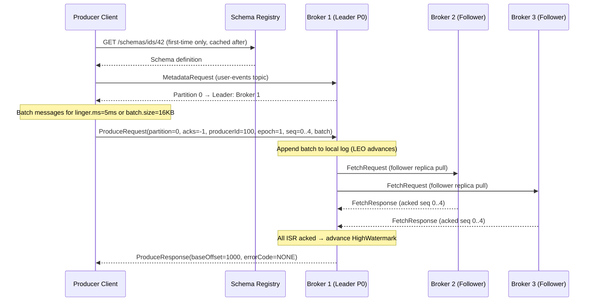
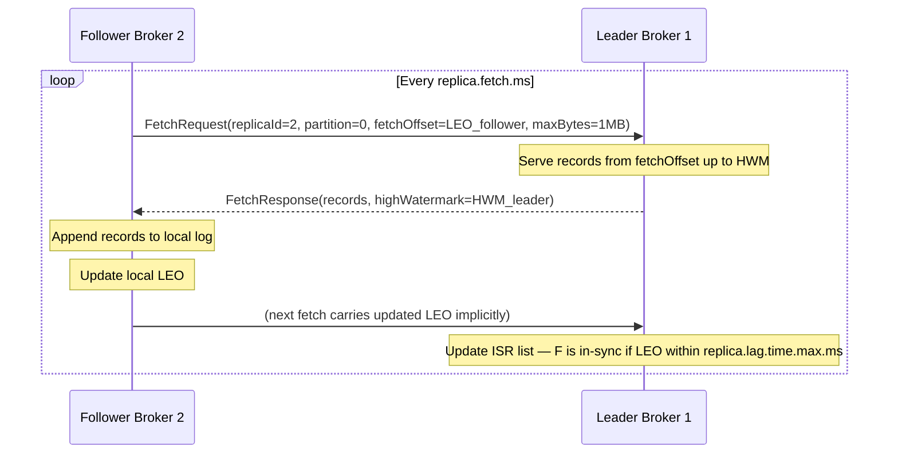
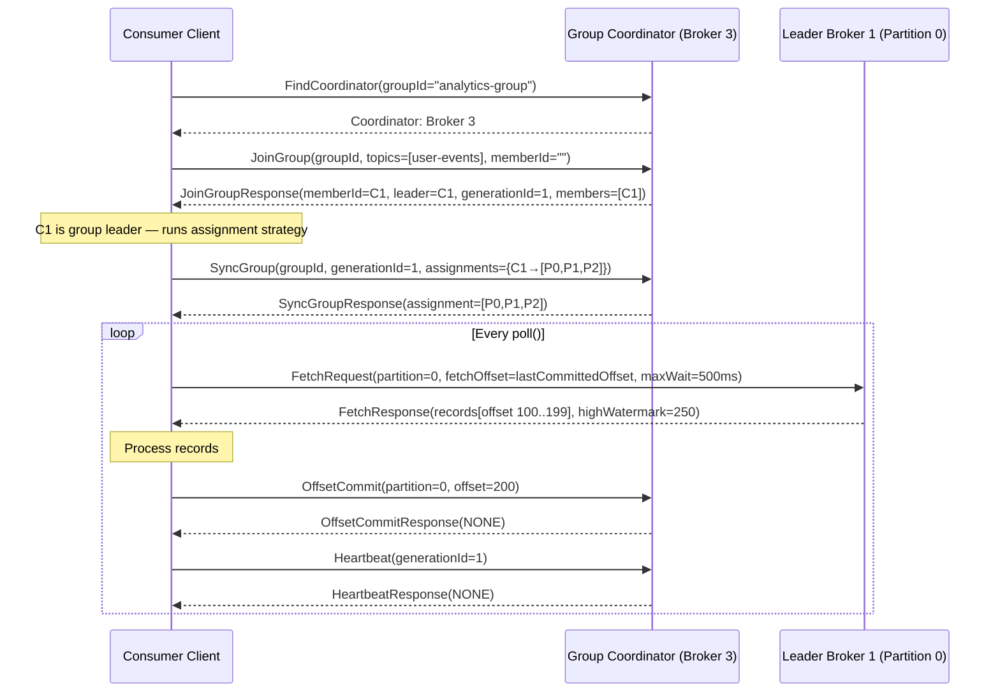
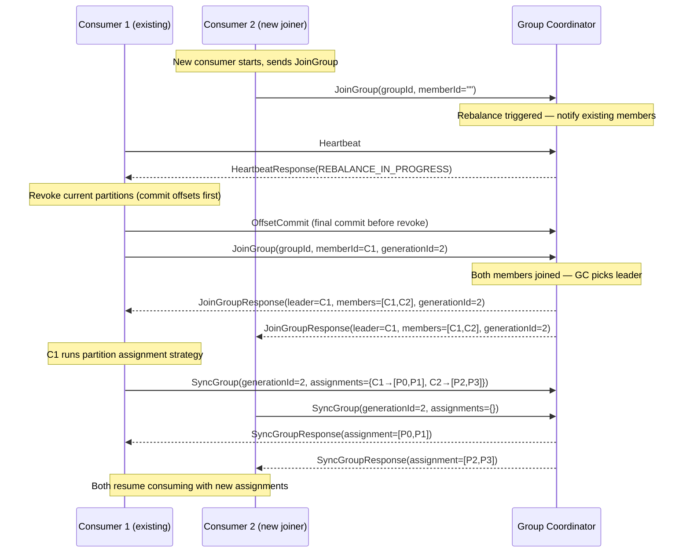
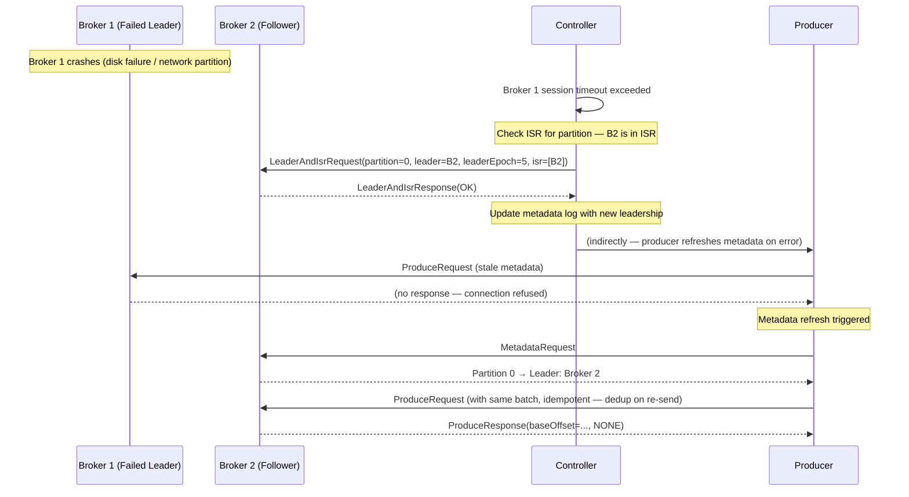
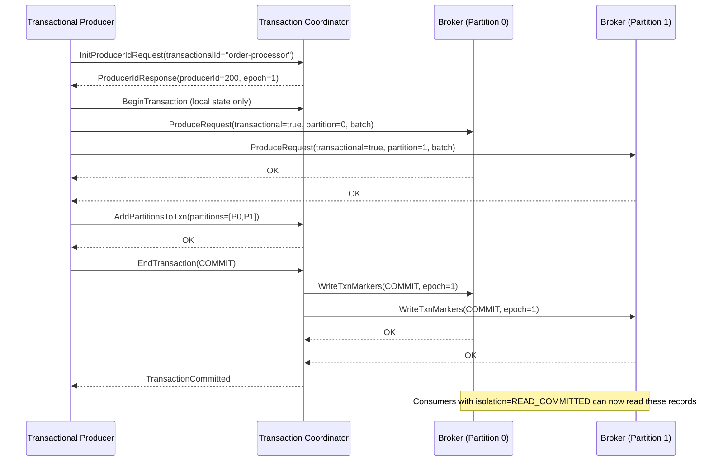
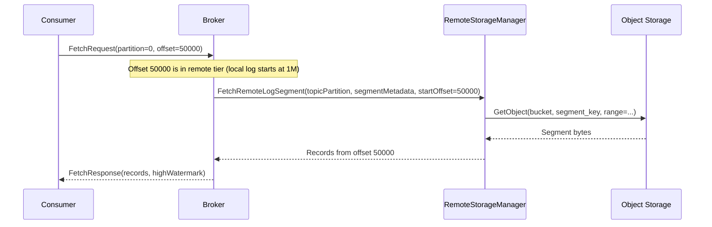

# 06 — Event Flow: Kafka-like Event Streaming System

---

## Objective

Trace message lifecycle from producer publish to consumer processing. Cover internal replication flow, consumer group rebalance flow, leader failover, and offset commit flow with sequence diagrams.

---

## Flow 1: Producer Write (acks=all, Idempotent)



**Key Events in Write Path:**
1. Producer batches records (amortizes per-message overhead)
2. Batch sent with idempotency metadata (producerId, epoch, sequence)
3. Leader appends to its log segment first
4. Followers replicate via pull (not push from leader)
5. HWM advances only after all ISR members acknowledge
6. Leader responds to producer only after HWM advance (for acks=all)

---

## Flow 2: Follower Replica Fetch (Internal)



**ISR Management:**
- If follower's LEO falls behind leader LEO by more than `replica.lag.time.max.ms` (default 30s), it's removed from ISR
- Removed from ISR = writes with acks=all won't wait for this replica
- If follower catches up, it's re-added to ISR
- HWM = min(LEO across all ISR members)

---

## Flow 3: Consumer Fetch (Normal Path)



**Critical: Poll() drives everything**
- Fetch + heartbeat both happen within `poll()`
- If `poll()` not called within `max.poll.interval.ms` (default 5 min), broker triggers rebalance
- Long message processing between polls risks session timeout → rebalance

---

## Flow 4: Consumer Group Rebalance



**Rebalance Cost:**
- All consumers stop consuming during rebalance (stop-the-world)
- Duration: `max.poll.interval.ms` in worst case (waiting for slow member)
- **Cooperative rebalance** (KIP-429): only revoke partitions that must move — reduces pause significantly

---

## Flow 5: Leader Failover



**Leader Epoch Fencing:**
When B2 becomes leader at epoch 5, it truncates its log to the last committed HWM at epoch 4. Any records from B1 that were past HWM (not fully replicated) are discarded. This ensures no divergence.

---

## Flow 6: Transactional Producer (Exactly-Once)



**Two-Phase Commit via Transaction Log:**
1. Transaction coordinator persists transaction state to `__transaction_state` topic
2. Phase 1: mark transaction PREPARE_COMMIT in log
3. Phase 2: write COMMIT markers to all participating partitions
4. If coordinator crashes after phase 1, recovery reads `__transaction_state` and completes commit

---

## Flow 7: Tiered Storage Read



---

## Message Lifecycle Summary

```
Producer → [batch] → Broker Leader → [replicate] → ISR Followers
                                   → [advance HWM]
                                   ↓
                            Consumer Fetch
                                   ↓
                         Consumer Processing
                                   ↓
                          Offset Commit
                                   ↓
                     [retention period expires]
                                   ↓
                        Segment Deletion / Compaction
```

---

## Key Timing Parameters

| Parameter | Default | Impact |
|---|---|---|
| `linger.ms` | 0 (send immediately) | Batching trade-off: latency vs throughput |
| `batch.size` | 16 KB | Max batch size per partition before send |
| `max.block.ms` | 60s | Max time producer blocks when buffer full |
| `replica.fetch.max.bytes` | 1 MB | Max bytes per follower fetch |
| `max.poll.interval.ms` | 5 min | Max time between consumer polls before rebalance |
| `session.timeout.ms` | 45s | Heartbeat miss tolerance |
| `heartbeat.interval.ms` | 3s | Heartbeat frequency (should be 1/3 session.timeout) |
| `fetch.min.bytes` | 1 byte | Min data for broker to respond to fetch |
| `fetch.max.wait.ms` | 500ms | Max wait before responding regardless of min.bytes |

---

## Tradeoffs

| Flow | Decision | Cost |
|---|---|---|
| Replication | Pull-based follower fetch | Slight latency vs push; natural rate limiting for slow replicas |
| Rebalance | Stop-the-world rebalance | Consumer pause; cooperative rebalance (KIP-429) mitigates |
| Transactions | 2PC via coordinator | ~2x latency overhead; coordinator is bottleneck for high txn volume |
| Tiered storage | Remote storage for old segments | Extra latency for historical reads; consumer SLA must account for this |

---

## Interview Discussion Points

- **What happens if a consumer crashes mid-processing after fetching but before committing?** Records are re-delivered on restart (at-least-once). Consumer must handle duplicates (idempotent processing or exactly-once via transactions)
- **Why does Kafka use pull for replication (not leader-push)?** Same reason as consumer pull: natural rate control. If follower is slow (GC, disk), pull-based catch-up doesn't overwhelm it. Leader just accumulates in its log
- **What is the rebalance blast radius?** All consumers in a group stop. For a group with 100 consumers and 1000 partitions, a single new joiner causes all 100 consumers to revoke all 1000 partitions and redistribute — O(n) disruption. Cooperative rebalance moves only the necessary subset
- **How does exactly-once prevent duplicate delivery even across broker failover?** Transaction coordinator persists commit state before responding. On failover, new coordinator reads `__transaction_state` and completes any in-flight transactions in deterministic way
- **Can a consumer read faster than producer writes?** Yes — fetch returns empty if nothing new, and long-polling ensures immediate delivery when new records arrive. Consumer is never woken up spuriously
