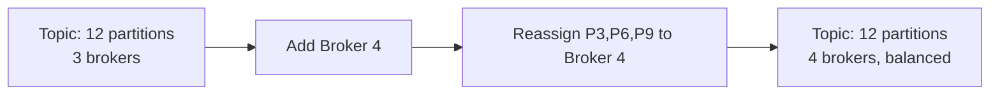

# 07 — Scaling Strategy: Kafka-like Event Streaming System

---

## Objective

Define horizontal and vertical scaling strategies for brokers, partitions, consumers, and the metadata controller. Identify bottlenecks, hot partitions, and the mechanisms to handle traffic growth without degrading latency or durability guarantees.

---

## Scaling Dimensions

| Dimension | Scaling Unit | Mechanism |
|---|---|---|
| Write throughput | Partition (on broker) | Add partitions, add brokers |
| Read throughput | Consumer (per partition) | Add consumers to group (up to partition count) |
| Storage capacity | Broker disk | Add brokers, increase disk, tiered storage |
| Metadata throughput | Controller | KRaft controller quorum (separate from brokers) |
| Connection capacity | Broker network threads | Vertical (more cores/NICs), more brokers |

---

## Broker Horizontal Scaling

### Adding Brokers
1. New broker registers with controller (sends `BrokerRegistration`)
2. Controller does NOT automatically rebalance partitions — operator must trigger
3. Use `kafka-reassign-partitions.sh` or admin API to migrate partition leadership
4. New broker starts receiving produce/fetch traffic only after partitions assigned

**Why not auto-rebalance?**
Partition movement = full log segment copy over network. Auto-rebalancing during traffic spike can saturate network and worsen the situation. Manual trigger is safer.

**Rule of thumb:** Add 1 broker for every 100 MB/sec additional write throughput needed (assuming NVMe SSD, 10 GbE).

### Broker Capacity Model

| Resource | Limit | Action at 70% |
|---|---|---|
| Disk write throughput | ~500 MB/sec (NVMe) | Add broker |
| Network bandwidth | ~1 GB/sec (10 GbE) | Add broker or upgrade NIC |
| JVM heap | ~6 GB (above = GC pressure) | Tune off-heap; more brokers |
| Open file handles | ~100K (OS limit) | Increase ulimit; reduce partition count per broker |
| Partition count per broker | ~2000–4000 | Reduce via topic consolidation or more brokers |

---

## Partition Scaling

### Partition Count Determines Maximum Consumer Parallelism

```
Max parallel consumers = partition count (per consumer group)

If topic has 12 partitions:
  - 1 consumer: reads all 12 partitions (sequential per partition, parallel across)
  - 12 consumers: each reads 1 partition (maximum parallelism)
  - 13 consumers: 1 idle (no partition to assign)
```

**When to increase partitions:**
- Consumer processing lag is growing and CPU bound (can't scale consumers further)
- Producer write throughput exceeds single-partition leader capacity (~100 MB/sec)
- Need more consumer parallelism

**Risk of too many partitions:**
- Each partition = open file handles + memory on every broker
- 10,000 topics × 100 partitions = 1M partitions — leader election becomes slow
- Consumer rebalance time grows O(partition count)

### Partition Reassignment During Rebalance



During reassignment:
1. Controller adds new replicas on target broker (partition count increases temporarily)
2. New replicas catch up (log copy)
3. New replica added to ISR
4. Controller moves leader to target broker
5. Old replicas removed

**Throttle reassignment** to avoid starving producer/consumer traffic:
`kafka-configs.sh --alter --entity-type brokers --add-config 'leader.replication.throttled.rate=50MB'`

---

## Consumer Scaling

### Consumer Group Scale-Out

```
Low lag:    [C1: P0,P1,P2,P3]  → no action needed

High lag:   [C1: P0,P1,P2,P3]  → add C2, C3
            → Rebalance →
            [C1: P0,P1] [C2: P2,P3]
```

**Auto-scaling consumers (Kubernetes HPA):**
- Metric: consumer group lag (`kafka_consumer_group_lag` in Prometheus)
- Scale up when lag > threshold for > 5 minutes
- Scale down when lag < threshold for > 10 minutes (hysteresis)
- Max replicas = partition count (hard ceiling)

### Static Membership (KIP-345)
Problem: Rolling deploys cause unnecessary rebalances (each pod restart = member leave + join).
Solution: `group.instance.id` — consumer has stable identity. Rejoining with same instance ID reclaims previous assignment without full rebalance.

```
Before static membership:
  Deploy new pod → old pod leaves → rebalance → new pod joins → rebalance (2 rebalances)

After static membership:
  Deploy new pod with same instance.id → old pod leaves → session.timeout wait → new pod joins with same assignment (0 rebalances if within timeout)
```

---

## Hot Partition Problem

### Cause
Key-based partitioning can create hot partitions when key distribution is skewed:
- E-commerce: most orders from top 100 merchants → merchant-keyed topic → 100 hot partitions
- Social media: celebrity posts → userId-keyed topic → 1 extremely hot partition

### Detection
```
kafka-consumer-groups.sh --describe: lag per partition
Prometheus: kafka_server_brokertopicmetrics_bytesoutpersec per partition
```

### Mitigations

| Technique | How | Tradeoff |
|---|---|---|
| Key salting | Append random suffix to hot key: `celebrity_123_0`, `celebrity_123_1` | Breaks ordering; requires join step |
| Composite keys | `userId_subentity` → fan out hot user across partitions | Requires careful design; can still hot-spot |
| Null key (round-robin) | Remove message key → round-robin distribution | No ordering guarantee; not valid for CDC |
| Topic-level isolation | Dedicated topic for hot producers with more partitions | Operational overhead; fan-in complexity |
| Producer-side rate limiting | Throttle hot producer at source | Applies back-pressure on producer |

---

## Replication and Durability Scaling

### ISR Scaling
More ISR members = stronger durability, higher write latency.

| Config | Durability | Write Latency |
|---|---|---|
| acks=1, RF=1 | Weak (leader failure = loss) | Lowest |
| acks=1, RF=3 | Medium (async background) | Low |
| acks=-1, RF=3, min.isr=2 | Strong (2 of 3 acked) | Medium |
| acks=-1, RF=3, min.isr=3 | Strongest (all 3 acked) | Highest; any replica down blocks writes |

**Production recommendation:** RF=3, acks=-1, min.insync.replicas=2. Tolerates 1 broker failure without blocking writes.

### Rack-Aware Replica Placement
Assign replicas across racks/AZs:
- Leader in AZ-A, replica 1 in AZ-B, replica 2 in AZ-C
- Tolerates full AZ failure without data loss
- Configure: `broker.rack=az-a` on each broker; controller places replicas rack-aware automatically

---

## Controller Scaling (KRaft)

### Bottlenecks
- All metadata writes go through Raft leader → single-threaded bottleneck
- Large partition counts increase metadata log size → slower snapshots
- Partition reassignment storm (many concurrent reassignments) → controller queue saturation

### Scaling Tactics
- Dedicated controller nodes (3 or 5): separate from broker workload
- KRaft supports 1M+ partitions (vs ZooKeeper's ~200K practical limit)
- Metadata snapshots reduce replay time on restart
- Throttle reassignment to cap controller load

---

## Network Scaling

### Zero-Copy for Consumer Read Throughput

`sendfile` syscall on Linux allows direct page cache → NIC transfer:
- Consumer reads: no user-space copy
- 10 GbE NIC: 1.25 GB/sec per broker from cache
- Consumer read throughput limited by NIC, not CPU

### TCP Connection Pooling
- Producer client: 1 TCP connection per broker
- Consumer client: 1 TCP connection per broker
- 1000 producers × 30 brokers = 30,000 connections cluster-wide — within broker socket capacity

### Compression
Enable at producer side for high-throughput topics:

| Codec | CPU overhead | Compression ratio | Best for |
|---|---|---|---|
| None | Zero | 1x | Low latency required |
| LZ4 | Very low | 2–3x | Default recommendation |
| Snappy | Low | 2–3x | Good CPU/ratio balance |
| GZIP | High | 4–5x | Bandwidth-constrained links |
| ZSTD | Medium | 4–5x | Best ratio/CPU tradeoff |

---

## Rate Limiting & Backpressure

### Producer Backpressure
```
ProducerConfig:
  buffer.memory = 32MB      ← in-memory buffer before blocks
  max.block.ms = 60000      ← block time before throwing BufferExhaustedException

When brokers are slow:
  → Buffer fills
  → Producer blocks on send()
  → Application naturally slows down
```

### Per-Client Quotas (Cluster-Level)
```
kafka-configs.sh --alter --entity-type users --entity-name app1 \
  --add-config 'producer_byte_rate=1MB,consumer_byte_rate=5MB'
```

Quota enforcement: token bucket per client. When quota exceeded, broker sets `throttleTimeMs` in response — client waits before next request. No connection drops.

### Consumer Lag Alerting
```
Alert: consumer_group_lag > 100000 messages for > 5 minutes
Action: scale out consumers (up to partition count)
        OR increase consumer processing throughput
        OR offload to batch processing
```

---

## Throughput Benchmarks (Reference)

| Configuration | Throughput |
|---|---|
| Single broker, no replication, acks=0 | ~800 MB/sec (network-limited) |
| 3 brokers, RF=3, acks=-1, LZ4 | ~300 MB/sec per broker |
| Consumer (zero-copy, page cache) | ~600 MB/sec per broker |
| Consumer (cold read from disk) | ~200 MB/sec per broker |

---

## Tradeoffs

| Decision | Why | Cost |
|---|---|---|
| Manual partition reassignment | Avoids traffic spike from auto-rebalance | Operator burden; must monitor proactively |
| Fixed partition count | Ordering guarantee, simple routing | Adding partitions breaks key routing; repartition is disruptive |
| Pull-based backpressure | Natural flow control, no special protocol | Higher latency for bursty writes (producer buffer absorbs) |
| Rack-aware replicas | AZ fault tolerance | Cross-AZ replication adds ~1–2ms latency |

---

## Interview Discussion Points

- **What is the throughput limit of a single Kafka broker?** Bounded by: disk sequential write ~500 MB/sec, NIC ~1 GB/sec, JVM GC at high heap. In practice ~300–500 MB/sec ingest per broker
- **Why can't you have more consumers than partitions?** Each partition assigned to exactly one consumer per group. Extra consumers are idle — there's no partition to give them
- **How does Kafka handle a 10x traffic spike?** Short term: producer buffer absorbs burst; broker batches efficiently. Long term: add brokers + partitions + consumers. But partition increase requires client restart and rebalance
- **What breaks first under extreme load?** Controller metadata throughput (ZooKeeper era). With KRaft: NIC bandwidth or disk write throughput. JVM GC is often the hidden bottleneck — pause causes follower lag → ISR shrink → acks=all blocks
- **How do you size partitions for a new topic?** Rule of thumb: target throughput / single-partition max throughput (100 MB/sec) = min partitions. Then multiply by retention factor. But also consider consumer parallelism requirements
