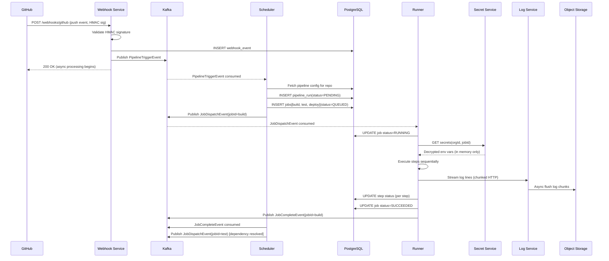

# 01 — High-Level Architecture: CI/CD Platform

---

## Objective

Define overall system architecture, component responsibilities, communication patterns, and rationale for key design decisions in a distributed CI/CD pipeline execution platform.

---

## Architecture Choice: Event-Driven Microservices

### Why Microservices Over Modular Monolith?

| Dimension | Modular Monolith | Microservices |
|---|---|---|
| Independent scaling | No — scale whole app | Yes — scale runner pool independently from API |
| Fault isolation | Process crash = all down | Runner pool failure doesn't affect control plane |
| Deployment | Single deploy unit | Independent deploy cadence per service |
| Complexity | Lower initially | Higher — distributed systems concerns |

**Decision: Microservices** — specifically because runners must scale independently (10K pods) from the control plane (10 pods). Runner pool is compute-intensive; control plane is coordination-intensive. Co-locating forces overprovisioning of the control plane to match runner scale.

### Why Event-Driven?

Pipeline execution is inherently asynchronous:
1. Webhook arrives → parse → validate → queue jobs
2. Runner picks job → executes → streams logs → updates status
3. Job completes → trigger dependent jobs → notify

Each step is decoupled by time. Event-driven architecture (via Kafka or SQS) provides:
- Durability: job requests survive control plane restarts
- Backpressure: if runners are busy, job queue absorbs burst without dropping triggers
- Auditability: event log captures full pipeline lifecycle for debugging

---

## System Components

```
┌─────────────────────────────────────────────────────────────────────────────┐
│                           CLIENT LAYER                                        │
│  ┌──────────┐   ┌────────────────┐   ┌────────────────┐   ┌──────────────┐  │
│  │ Web UI   │   │ CLI (gh/gitops) │   │ Git Provider   │   │ API Clients  │  │
│  │ (React)  │   │                │   │ (Webhooks)     │   │              │  │
│  └────┬─────┘   └───────┬────────┘   └───────┬────────┘   └──────┬───────┘  │
└───────│─────────────────│─────────────────────│─────────────────────────────┘
        │                 │                     │
        ▼                 ▼                     ▼
┌──────────────────────────────────────────────────────────────────────────────┐
│                           API GATEWAY / NGINX                                  │
│              (routing, rate limiting, auth validation)                         │
└───────────────────────────────────────┬──────────────────────────────────────┘
                                        │
        ┌───────────────┬───────────────┼───────────────┬───────────────┐
        ▼               ▼               ▼               ▼               ▼
┌──────────────┐ ┌──────────────┐ ┌──────────────┐ ┌──────────────┐ ┌──────────────┐
│  Webhook     │ │  Pipeline    │ │  Run Status  │ │  Secret      │ │  Artifact    │
│  Service     │ │  API Service │ │  API Service │ │  Service     │ │  Service     │
│  (ingest     │ │  (CRUD for   │ │  (runs,jobs, │ │  (store,     │ │  (upload,    │
│  webhooks)   │ │  pipelines)  │ │  logs query) │ │  inject)     │ │  download)   │
└──────┬───────┘ └──────────────┘ └──────┬───────┘ └──────┬───────┘ └──────┬───────┘
       │                                  │                │                │
       ▼                                  │                │                │
┌──────────────┐                          │                │                │
│  Scheduler   │◄─────────────────────────┘                │                │
│  Service     │                                           │                │
│  (job queue  │                                           │                │
│  + dispatch) │                                           │                │
└──────┬───────┘                                           │                │
       │                                                   │                │
       ▼                                                   │                │
┌──────────────────────────────────────────────────────────────────────────────┐
│                           JOB QUEUE (Kafka / SQS)                             │
└───────────────────────────────────────┬──────────────────────────────────────┘
                                        │
        ┌───────────────┬───────────────┼───────────────┐
        ▼               ▼               ▼               ▼
┌─────────────┐  ┌─────────────┐  ┌─────────────┐  ┌─────────────┐
│  Runner 1   │  │  Runner 2   │  │  Runner 3   │  │  Runner N   │
│  (K8s Pod)  │  │  (K8s Pod)  │  │  (K8s Pod)  │  │  (K8s Pod)  │
│  Job step   │  │  Job step   │  │  Job step   │  │  Job step   │
│  execution  │  │  execution  │  │  execution  │  │  execution  │
└─────────────┘  └─────────────┘  └─────────────┘  └─────────────┘
       │                                                    │
       ▼                                                    ▼
┌──────────────────────────────────────────────────────────────────────────────┐
│                    OBJECT STORAGE (S3 / GCS)                                   │
│         Log files, artifacts, pipeline definition cache                        │
└──────────────────────────────────────────────────────────────────────────────┘
```

---

## Component Responsibilities

### Webhook Service
- Receives webhook events from Git providers (GitHub push, PR events)
- Validates webhook signatures (HMAC-SHA256)
- Persists raw event to PostgreSQL
- Publishes `PipelineTriggerEvent` to Kafka topic `pipeline-triggers`
- Responds to Git provider within 10s (async processing after ack)

### Pipeline API Service
- CRUD for pipeline definitions (read from repo YAML or stored in DB)
- Resolves YAML → internal Pipeline object model (validate schema)
- Lists pipelines, workflows, triggers for a repository
- Does NOT execute pipelines — stateless CRUD only

### Scheduler Service
- Consumes from `pipeline-triggers` topic
- Evaluates trigger conditions (branch match, path filters, cron schedule)
- Creates Run + Job records in PostgreSQL
- Publishes `JobDispatchEvent` to `job-queue` Kafka topic (one event per job)
- Re-queues failed jobs up to max retries
- Handles job dependencies: only dispatches job when all `needs:` jobs complete

### Runner Pool
- Workers consuming from `job-queue` Kafka topic
- Each runner is a Kubernetes pod with Docker-in-Docker or Kaniko for container builds
- Fetches pipeline YAML from object storage (or source control)
- Fetches secrets from Secret Service at job start
- Executes steps sequentially within job
- Streams log lines to Log Streaming Service
- Reports step/job status updates to Status Service (via REST or Kafka)
- Uploads artifacts to Artifact Service at job end

### Secret Service
- Stores secrets encrypted at rest (KMS-wrapped AES-256)
- Injects secrets as environment variables into runner environment at job start
- Access control: runner can only fetch secrets for its assigned job's organization
- Secret values never returned in API responses — write-only from user perspective
- Audit logs all secret access

### Log Streaming Service
- Receives log line chunks from runners (via WebSocket or HTTP streaming)
- Buffers recent lines in Redis (last 1000 lines per job for fast retrieval)
- Asynchronously flushes to object storage (S3) in gzipped chunks
- Serves log tail to browser via Server-Sent Events (SSE)
- Enables log replay from object storage for completed jobs

### Artifact Service
- Presigned URL generation for direct runner→S3 upload (avoids routing through service)
- Artifact metadata stored in PostgreSQL (size, content-type, retention)
- Download via presigned URL or proxied through service
- Enforces per-project artifact storage quota

### Status/Run API Service
- Serves pipeline run and job status to UI and API clients
- Aggregates status from PostgreSQL (job state transitions)
- WebSocket endpoint for real-time status push to browser

---

## Request Flow: Push Trigger → Job Execution



---

## Communication Protocols

| Interaction | Protocol | Rationale |
|---|---|---|
| Git provider → Webhook Service | HTTP POST (webhook) | Git providers only support HTTP webhooks |
| Browser → Status Service | WebSocket / SSE | Real-time status without polling |
| Browser → Log Service | SSE (Server-Sent Events) | One-directional streaming; simpler than WebSocket for logs |
| Runner → Log Service | HTTP chunked POST | Efficient log batching |
| Runner → Secret Service | gRPC over mTLS | Low latency; mutual auth enforces runner identity |
| Service → Service (async) | Kafka | Decoupled, durable, replay-capable |
| Service → Service (sync) | REST/gRPC | Low-latency queries (status check, secret fetch) |
| Runner → Object Storage | Presigned S3 URLs | Direct upload without service proxy — bandwidth efficiency |

---

## Deployment Architecture

```
┌─────────────────────────────────────────────────────────────────┐
│  Control Plane Namespace (cicd-control)                          │
│  webhook-service (3 pods)                                        │
│  pipeline-api (3 pods)                                           │
│  scheduler (2 pods, leader-elected)                              │
│  secret-service (3 pods)                                         │
│  log-service (5 pods, stateless)                                 │
│  artifact-service (3 pods)                                       │
│  status-api (3 pods)                                             │
└─────────────────────────────────────────────────────────────────┘

┌─────────────────────────────────────────────────────────────────┐
│  Runner Namespace (cicd-runners)                                 │
│  runner-0000 ... runner-N (autoscaled, up to 10,000 pods)       │
│  Each pod: 2 CPU, 4 GB RAM                                       │
│  Horizontal Pod Autoscaler: scale by job-queue depth            │
└─────────────────────────────────────────────────────────────────┘
```

---

## Architecture Tradeoffs

| Decision | Why | Cost |
|---|---|---|
| Kafka for job queue | Durable job dispatch, replay on scheduler crash | Operational overhead of Kafka cluster |
| Runners as K8s pods | Elastic scale, K8s lifecycle management | Cold start ~30s for pod scheduling + container pull |
| Object storage for logs | Cheap, durable, scalable | Slight latency vs in-memory log |
| Secret injection at job start | Single decryption point, no per-step overhead | Secret service is critical path dependency |
| SSE for log streaming | Simple, HTTP-based, browser-native | One-way only; no client-to-server log control |

---

## Interview Discussion Points

- **Why not use Jenkins?** Jenkins is stateful (build history in file system), hard to scale horizontally, lacks native container isolation, complex plugin dependency management. Cloud-native design (K8s-native runners, event-driven dispatch) solves these
- **How does the scheduler ensure a job is dispatched exactly once?** Kafka consumer group for scheduler: each `JobDispatchEvent` consumed exactly once per consumer group. Scheduler writes job to DB before publishing dispatch event (transactional outbox). Runner marks job as `RUNNING` atomically (compare-and-swap in DB)
- **What happens if a runner dies mid-job?** Runner heartbeat timeout → scheduler detects orphaned job → re-queues job (if within retry limit). Runner cleanup: K8s detects pod crash → pod restarted or new pod scheduled. Job re-runs from start (no mid-job checkpoint in MVP)
- **How do you prevent log injection attacks?** Logs are streamed as opaque byte streams from runner. Log Service does NOT render HTML/ANSI from runners. UI sanitizes output before rendering. Secret masking runs as regex replacement before storage
