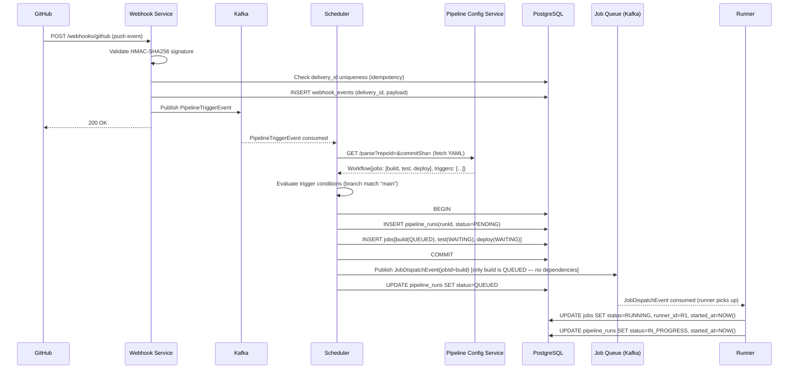
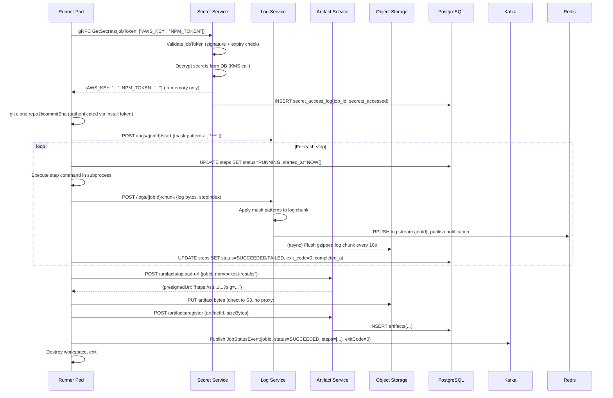
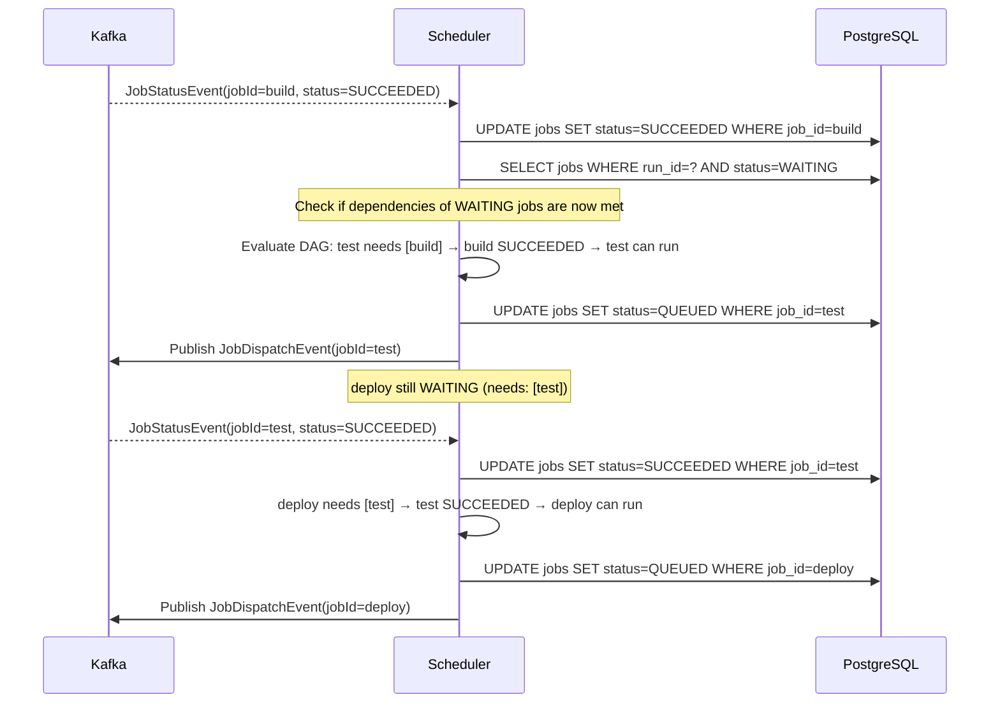
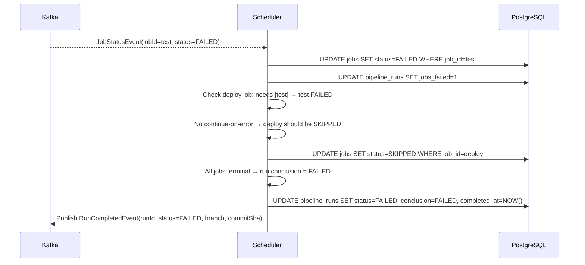
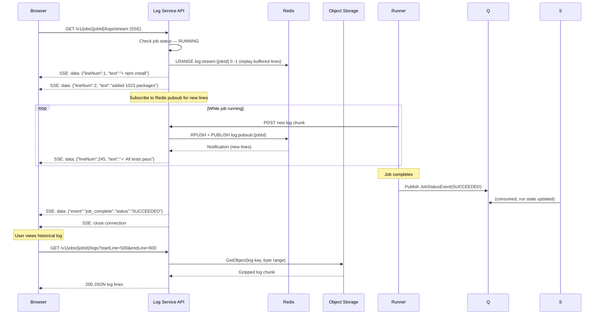
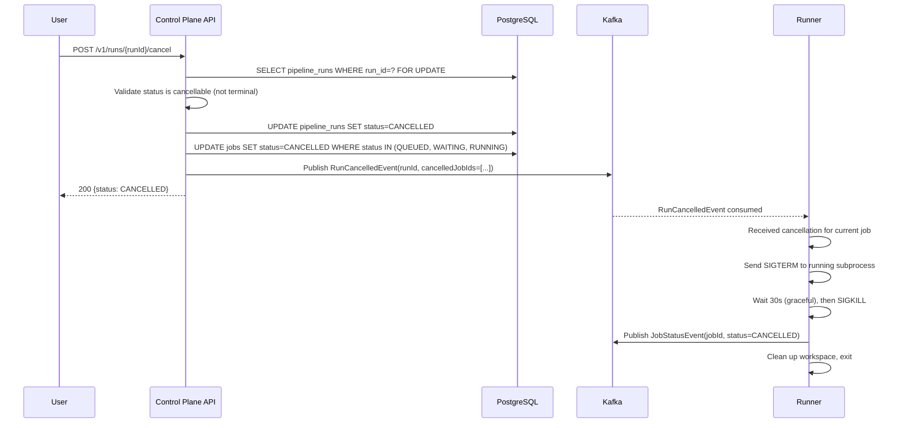
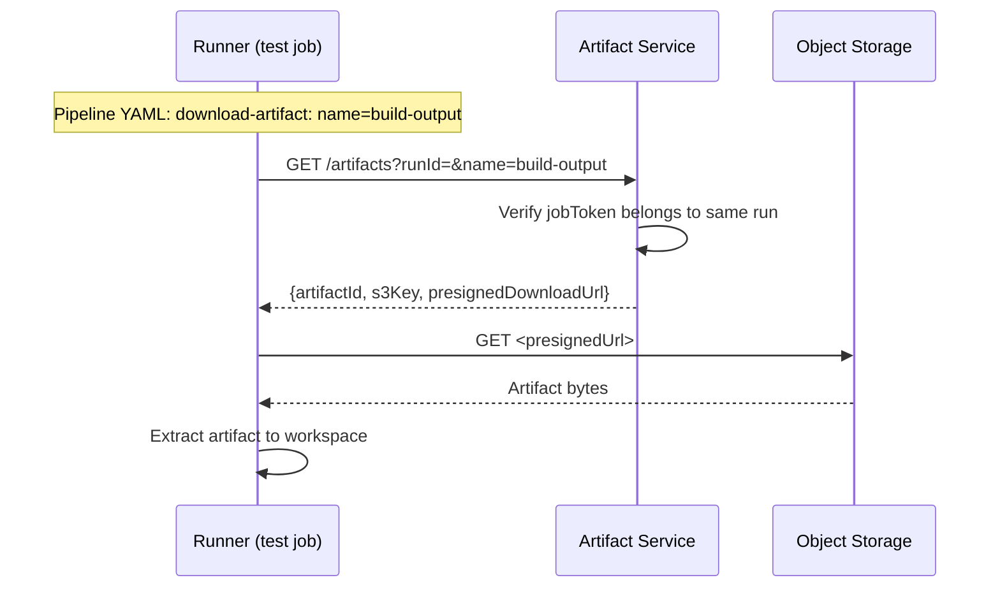

# 06 — Event Flow: CI/CD Platform

---

## Objective

Trace the complete lifecycle of a pipeline run from Git push through job execution, artifact upload, and notification delivery. Include failure paths, timeout handling, and the job dependency resolution flow.

---

## Flow 1: Git Push → Pipeline Trigger → Job Dispatch



**Why only dispatch `build` initially?** `test` has `needs: [build]` and `deploy` has `needs: [test]`. Scheduler evaluates DAG — only jobs with no unmet dependencies are dispatched. This prevents test from starting before build completes.

---

## Flow 2: Job Execution on Runner



---

## Flow 3: Job Completion → Dependency Resolution → Next Job Dispatch



---

## Flow 4: Job Failure with Dependency Cascade



---

## Flow 5: Real-Time Log Streaming to Browser



---

## Flow 6: Runner Heartbeat and Orphaned Job Recovery

```mermaid
sequenceDiagram
    participant R as Runner Pod
    participant S as Scheduler
    participant DB as PostgreSQL
    participant Q as Kafka

    loop Every 30 seconds (heartbeat)
        R->>S: gRPC Heartbeat(runnerId, jobId, status)
        S->>DB: UPDATE runners SET last_heartbeat=NOW()
        S-->>R: HeartbeatResponse(CONTINUE / CANCEL)
    end

    Note over R: Runner pod crashes (OOM, node failure)
    Note over S: Heartbeat timeout detector (background thread)

    S->>DB: SELECT runners WHERE last_heartbeat < NOW() - INTERVAL '2min'
              AND status = 'BUSY'
    S->>DB: [Result: runner R1 with job_id=build is orphaned]

    S->>DB: UPDATE runners SET status=OFFLINE WHERE runner_id=R1
    S->>DB: SELECT jobs WHERE runner_id=R1 AND status='RUNNING'
    Note over S: Check retry count
    alt retry_count < max_retries
        S->>DB: UPDATE jobs SET status=QUEUED, runner_id=NULL, retry_count=retry_count+1
        S->>Q: Publish JobDispatchEvent(jobId=build) [re-dispatch]
    else max_retries exceeded
        S->>DB: UPDATE jobs SET status=FAILED, conclusion='RUNNER_FAILURE'
        S->>S: Trigger dependency cascade (skip downstream jobs)
    end
```

---

## Flow 7: Manual Cancellation



---

## Flow 8: Scheduled (Cron) Pipeline Trigger

```mermaid
sequenceDiagram
    participant Cron as Scheduler (Cron Component)
    participant DB as PostgreSQL
    participant Q as Kafka

    loop Every minute
        Cron->>DB: SELECT workflows WHERE cron_schedule IS NOT NULL
                   AND next_run_at <= NOW()
                   AND is_enabled = TRUE
        Note over Cron: Distributed lock prevents duplicate triggers
        Cron->>DB: SELECT pg_try_advisory_lock(hash(workflowId + minute))
        Note over Cron: Only one scheduler instance holds lock
        Cron->>DB: UPDATE workflows SET next_run_at = cron_next(schedule, NOW())
        Cron->>Q: Publish PipelineTriggerEvent(source=CRON, repoId, branch)
        Cron->>DB: pg_advisory_unlock(...)
    end
```

**Distributed lock for cron:** Multiple Scheduler instances run for HA. Without locking, all would fire the same cron trigger simultaneously. `pg_try_advisory_lock` on the workflow-minute composite key ensures only one scheduler fires each cron event.

---

## Flow 9: Artifact Download by Downstream Job



---

## Event Schemas (Key Events)

**PipelineTriggerEvent:**
```json
{
  "eventId": "uuid",
  "repoId": "uuid",
  "orgId": "uuid",
  "triggerType": "PUSH",
  "branch": "main",
  "commitSha": "abc123",
  "actor": "user123",
  "timestamp": "ISO8601",
  "webhookDeliveryId": "github-uuid"
}
```

**JobDispatchEvent:**
```json
{
  "jobId": "uuid",
  "runId": "uuid",
  "orgId": "uuid",
  "workflowJobId": "build",
  "runsOn": "ubuntu-22.04",
  "repoCloneUrl": "https://...",
  "commitSha": "abc123",
  "workflowYaml": "base64...",
  "secretNames": ["AWS_KEY", "NPM_TOKEN"],
  "jobToken": "short-lived-jwt",
  "timeoutMinutes": 30,
  "retryCount": 0
}
```

**RunCompletedEvent:**
```json
{
  "runId": "uuid",
  "orgId": "uuid",
  "status": "FAILED",
  "branch": "main",
  "commitSha": "abc123",
  "workflowName": "ci",
  "durationSeconds": 245,
  "jobsSummary": {"total": 3, "succeeded": 2, "failed": 1, "skipped": 0},
  "triggeredBy": "PUSH",
  "actor": "developer123"
}
```

---

## Tradeoffs

| Flow | Decision | Cost |
|---|---|---|
| Dependency resolution | Scheduler re-evaluates DAG on each job completion | Extra DB reads per job completion; negligible at scale |
| Orphaned job recovery | Heartbeat timeout (2 min) | 2-minute window of "zombie" job occupying runner slot |
| Cron distributed lock | Advisory lock in PostgreSQL | Single DB call per cron check per minute; PG dependency |
| Log streaming via Redis | Real-time without SSE long-poll delays | Redis memory usage; log data in flight during Redis failure |

---

## Interview Discussion Points

- **What happens if the Scheduler crashes while dispatching jobs?** Jobs in DB with status=QUEUED but not yet in Kafka queue. On Scheduler restart: query jobs with QUEUED status, re-dispatch. Idempotent: Kafka job key ensures no duplicate dispatch if event was already sent
- **How do you prevent a job from running twice?** Runner performs compare-and-swap on job status: `UPDATE jobs SET status=RUNNING WHERE job_id=? AND status=QUEUED` → if 0 rows updated, another runner claimed it. Exactly-once assignment via optimistic locking
- **What is the maximum depth of a job dependency chain?** No hard limit in the design. Platform imposes soft limit (e.g., max 20 levels) to prevent infinite dependency chains. Cycle detection runs at pipeline parse time — circular dependencies are validation errors
- **How do you handle a step that hangs indefinitely?** Each step has a configurable timeout. Runner monitors step execution time, sends SIGTERM after timeout, SIGKILL after grace period. Job fails with exit code 124 (timeout). Scheduler also monitors job-level timeout independently
