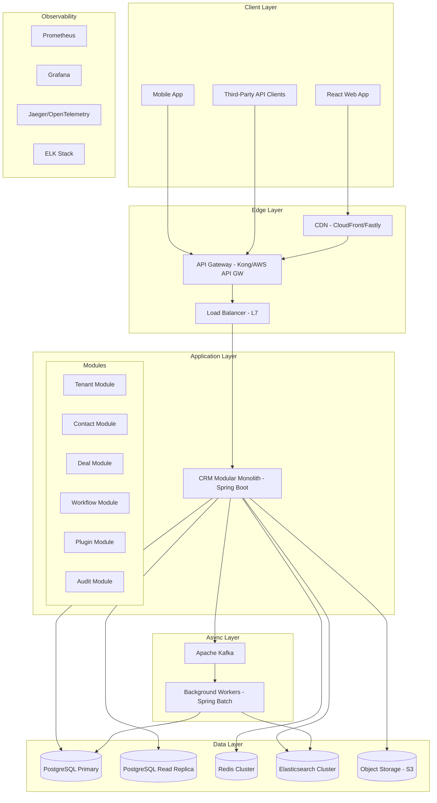
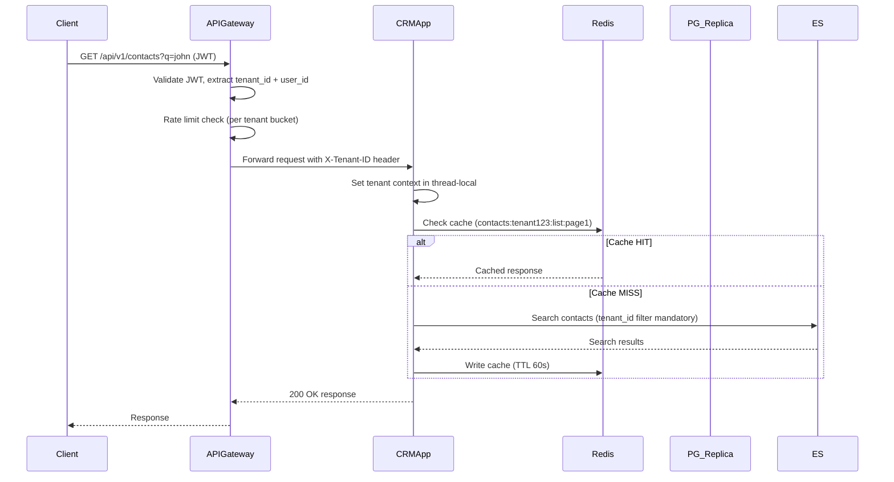
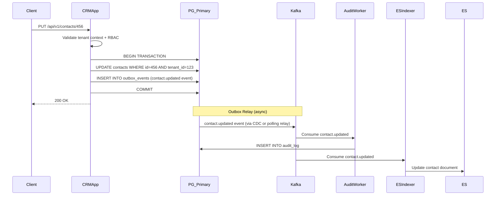

# 01 — High-Level Architecture

## Objective

Define the top-level architectural shape of the Multi-Tenant SaaS CRM: how components are organized, why the architecture was chosen, and what the request flow looks like end-to-end.

---

## Architecture Decision: Modular Monolith with DDD (Phase 1) → Microservices (Phase 2+)

### Why NOT Start with Microservices

The team-size anti-pattern: microservices require multiple independent teams operating independently. A startup or early-stage SaaS product with a small team will spend 60% of engineering time on infrastructure (service mesh, distributed tracing, inter-service auth, contract testing) instead of product. The cognitive load of distributed systems design is enormous when the business domain is still evolving.

For a CRM, the domains are deeply interrelated:
- A Deal references a Contact
- A Task references both a Deal and a Contact
- An Audit event references any entity
- A Workflow trigger fires based on changes to Contact, Deal, or Task

Splitting these into microservices immediately forces distributed joins or data duplication, adding eventual consistency complexity before the product even ships.

### Why Modular Monolith with DDD

A modular monolith enforces clean bounded context boundaries (via Java package structure and module-level access rules) without the operational overhead of microservices. Modules communicate through well-defined interfaces. When the time comes to extract a service, the extraction is a deployment decision, not an architectural one — the interface already exists.

| Factor | Modular Monolith | Microservices |
|---|---|---|
| Team size | 5–30 engineers | 50+ engineers |
| Deployment complexity | Single artifact | Dozens of services |
| Distributed tracing | Optional | Mandatory |
| Data consistency | ACID across modules | Eventual consistency |
| Initial velocity | High | Low |
| Operational cost | Low | High |
| Independent scaling | Module-level (limited) | Per-service |
| Refactoring risk | Low | High (contract changes) |

### Migration Path: Monolith → Microservices

Extract modules to services only when they hit independent scaling needs:
1. **Notification Service** (first to extract — high volume, stateless)
2. **Search Service** (extract Elasticsearch indexing and query)
3. **Workflow Engine** (extract when workflow complexity increases)
4. **Analytics/Reporting Service** (OLAP queries pollute the OLTP database)
5. **Plugin Execution Service** (sandboxed execution, must be isolated)

---

## Tenant Isolation Strategy Decision

Three primary strategies exist:

| Strategy | Description | Pros | Cons | Use When |
|---|---|---|---|---|
| Database-per-Tenant | Each tenant gets a dedicated database instance | Strongest isolation, easy backup per tenant | Expensive, thousands of DB connections, operational nightmare at 10K tenants | < 100 enterprise tenants |
| Schema-per-Tenant | Each tenant gets a schema within shared PostgreSQL cluster | Strong isolation, easy backup per tenant schema, familiar admin tooling | Schema explosion at 10K tenants, migration complexity | 100–2,000 tenants |
| Row-Level Security (RLS) | Single schema, `tenant_id` column everywhere, enforced by PostgreSQL RLS policies | Scales to 100K tenants, single codebase, simple migrations | Must never forget `tenant_id`, RLS policy bugs = data breach, harder per-tenant backup | > 2,000 tenants, SaaS at scale |

**Decision: Row-Level Security with defense-in-depth**

At 10,000+ tenants, schema-per-tenant creates 10,000 schemas per database cluster. PostgreSQL catalog bloat alone becomes a performance issue. Database-per-tenant requires connection pool management and provisioning automation at a scale that rivals a cloud provider.

RLS is the correct choice at this scale, augmented by:
- Application-level `tenant_id` filter on every query (defense layer 1)
- PostgreSQL RLS policies as the enforcement backstop (defense layer 2)
- Integration tests that verify cross-tenant queries return zero rows (defense layer 3)
- Security scanning that flags queries missing `tenant_id` filters (defense layer 4)

---

## System Components

---

## Request Flow (Standard CRM Read)

---

## Request Flow (Write with Audit)

---

## Technology Choices Justified

| Component | Choice | Justification |
|---|---|---|
| Application | Spring Boot + Java | Enterprise ecosystem, mature multi-tenant libraries, strong PostgreSQL integration |
| API Gateway | Kong (self-hosted) or AWS API Gateway | Rate limiting, tenant-aware routing, JWT validation at edge |
| Database | PostgreSQL | ACID compliance, mature RLS support, JSONB for dynamic fields, pg_partman for partitioning |
| Cache | Redis Cluster | Tenant-namespaced keys, TTL-based invalidation, distributed lock support |
| Search | Elasticsearch | Full-text contact search, faceted filters, index per tenant or filtered index |
| Message Queue | Apache Kafka | Durable event log, replay capability for audit/ES sync, partitioned by tenant |
| Frontend | React + TypeScript | Component reuse, tenant-aware theming, feature flag UI |
| Object Store | S3 | File attachments, GDPR export packages, database backups |

---

## What Would Break First at Scale

1. **PostgreSQL single primary** becomes bottleneck at ~500-1000 writes/sec — needs read replicas and connection pooling (PgBouncer) first.
2. **RLS policy evaluation overhead** — every query re-evaluates RLS. Benchmark at 10K tenants with 50K concurrent queries before going live.
3. **Elasticsearch index bloat** — at 10K tenants with millions of contacts, a single index needs aliasing strategy and per-shard routing to stay performant.
4. **Session/JWT validation at API Gateway** — high QPS JWT validation against a Redis token store can become latency-sensitive. Move to stateless JWT verification with short-lived tokens.

---

## Startup vs FAANG Differences

| Aspect | Startup Approach | FAANG Approach |
|---|---|---|
| Tenant isolation | RLS only | RLS + network segmentation + dedicated clusters for Enterprise |
| Deployment | Single region | Multi-region active-active |
| Database | Single PostgreSQL with read replicas | Distributed SQL (CockroachDB, Spanner) or sharded PostgreSQL |
| Observability | Basic Prometheus + Grafana | Full OpenTelemetry pipeline, custom SLO dashboards |
| Plugin safety | Basic API key validation | Sandboxed WASM execution, formal security review per plugin |
| On-call | All engineers | Dedicated SRE team per service domain |

---

## Interview Discussion Points

- **Why RLS over schema-per-tenant at 10K tenants?** → Schema explosion in PostgreSQL catalog causes bloat, complex migration tooling, and connection management nightmares. RLS scales to 100K+ tenants with proper indexing and application-layer defense.
- **How do you ensure the RLS policy never leaks data?** → Defense-in-depth: application filter, PostgreSQL policy, automated cross-tenant test suite, security scanning CI gate.
- **Why not GraphQL from day one?** → GraphQL federation across modules adds complexity. REST with strict pagination is simpler to rate-limit, cache, and reason about. GraphQL can be added as a secondary API for enterprise integrations in V2.
- **What is the failure mode if Kafka goes down?** → Writes still succeed (they commit to PostgreSQL outbox), but audit events and search indexing lag. The outbox relay retries when Kafka recovers. Acceptable for a CRM.
