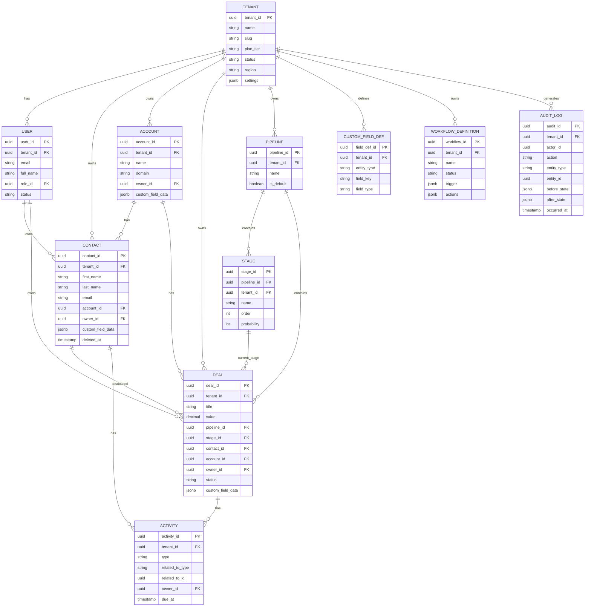

# 02 — Domain Modeling

## Objective

Define the core domain entities of the Multi-Tenant SaaS CRM, their relationships, aggregate boundaries, and the constraints that govern them. This model drives database schema, API surface, and module boundaries.

---

## Core Domain Entities

### Tenant (Aggregate Root)
Represents an organization using the CRM. Every other entity belongs to exactly one tenant.

**Attributes:**
- `tenant_id` (UUID, globally unique)
- `name`, `slug` (subdomain identifier)
- `plan_tier` (STARTER, GROWTH, ENTERPRISE)
- `status` (ACTIVE, SUSPENDED, OFFBOARDING)
- `region` (US, EU, APAC — for data residency)
- `created_at`, `trial_ends_at`
- `settings` (JSONB — timezone, currency, locale, branding)
- `feature_flags` (JSONB — overrides on top of plan defaults)

### User (Entity, within Tenant context)
A human actor within a tenant organization.

**Attributes:**
- `user_id` (UUID)
- `tenant_id` (FK — always scoped)
- `email`, `full_name`
- `role_id` (FK to Role)
- `status` (ACTIVE, INVITED, SUSPENDED)
- `sso_provider`, `external_user_id`
- `last_login_at`, `mfa_enabled`

### Contact (Aggregate Root)
A person that the tenant tracks. The central CRM entity.

**Attributes:**
- `contact_id` (UUID)
- `tenant_id`
- `first_name`, `last_name`, `email`, `phone`
- `account_id` (FK — optional company association)
- `owner_id` (FK to User)
- `lead_status`, `lifecycle_stage`
- `tags` (text array)
- `created_at`, `updated_at`, `deleted_at` (soft delete)
- `custom_field_data` (JSONB — per-tenant dynamic fields)

### Account (Aggregate Root)
A company or organization. Contacts belong to accounts.

**Attributes:**
- `account_id` (UUID)
- `tenant_id`
- `name`, `domain`, `industry`, `size`
- `owner_id` (FK to User)
- `custom_field_data` (JSONB)

### Deal (Aggregate Root)
A sales opportunity in a pipeline.

**Attributes:**
- `deal_id` (UUID)
- `tenant_id`
- `title`, `value`, `currency`
- `pipeline_id`, `stage_id`
- `contact_id`, `account_id`
- `owner_id`
- `expected_close_date`
- `status` (OPEN, WON, LOST)
- `custom_field_data` (JSONB)

### Pipeline (Entity)
A sales process with ordered stages, owned by a tenant.

**Attributes:**
- `pipeline_id` (UUID)
- `tenant_id`
- `name`, `is_default`
- `stages` (ordered list of Stage entities)

### Stage (Value Object within Pipeline)
- `stage_id`, `pipeline_id`, `name`, `order`, `probability`

### Activity (Entity — Polymorphic)
Any interaction or event tied to a CRM record.

**Types:** NOTE, CALL, EMAIL, MEETING, TASK

**Attributes:**
- `activity_id` (UUID)
- `tenant_id`
- `type`, `subject`, `body`
- `related_to_type` (contact, deal, account)
- `related_to_id`
- `owner_id`
- `due_at`, `completed_at`
- `outcome`

### CustomFieldDefinition (Entity)
Defines a dynamic field available on a given entity type for a tenant.

**Attributes:**
- `field_def_id` (UUID)
- `tenant_id`
- `entity_type` (contact, deal, account)
- `field_key` (slug, immutable once created)
- `display_label`
- `field_type` (TEXT, NUMBER, DATE, BOOLEAN, PICKLIST, MULTI_SELECT, LOOKUP)
- `picklist_options` (JSONB — for picklist types)
- `is_required`, `is_system` (system fields cannot be deleted)
- `order`

### WorkflowDefinition (Aggregate Root)
A trigger-action automation rule.

**Attributes:**
- `workflow_id` (UUID)
- `tenant_id`
- `name`, `status` (ACTIVE, DRAFT, PAUSED)
- `trigger` (JSONB — entity type, event type, conditions)
- `actions` (JSONB array — ordered action steps)
- `version`

### AuditLog (Append-Only Entity)
Immutable record of every state change.

**Attributes:**
- `audit_id` (UUID)
- `tenant_id`
- `actor_id` (user_id or system)
- `action` (CREATE, UPDATE, DELETE, LOGIN, etc.)
- `entity_type`, `entity_id`
- `before_state` (JSONB — snapshot before)
- `after_state` (JSONB — snapshot after)
- `changed_fields` (text array)
- `ip_address`, `user_agent`
- `occurred_at`
- `correlation_id`

---

## Entity Relationship Diagram



---

## Aggregate Boundaries

Aggregates define transactional consistency boundaries. Within an aggregate, all changes are strongly consistent. Across aggregates, consistency is eventual.

| Aggregate | Root | Contains | Why Boundary Here |
|---|---|---|---|
| Tenant | Tenant | Settings, feature flags, billing state | Tenant config changes are independent of CRM data |
| Contact | Contact | Custom field data | Contact + custom fields always change together |
| Account | Account | Custom field data | Same reason |
| Deal | Deal | Stage transition history, custom field data | Deal state machine is self-contained |
| Pipeline | Pipeline | Stages (value objects) | Stages are meaningless without their pipeline |
| Workflow | WorkflowDefinition | Trigger, Actions (DSL) | Workflow definition is an atomic unit |

**Cross-aggregate references use IDs only, never object references.**

Example: `Deal` references `Contact` by `contact_id`, not by embedding the Contact object. This prevents loading an entire Contact graph when only a Deal is needed.

---

## Dynamic Schema Design

The `custom_field_data` JSONB column on entities stores tenant-defined field values:

```
{
  "lead_score": 87,
  "preferred_language": "Spanish",
  "renewal_date": "2026-01-15",
  "product_interests": ["Enterprise Plan", "API Access"]
}
```

`CustomFieldDefinition` acts as the schema registry — defining what keys are valid, what types they must be, and what display metadata to use.

**Validation** happens at the application layer (not database constraints) because JSONB is schema-less. The application validates field values against `CustomFieldDefinition` before write.

**Querying custom fields**: Handled via JSONB operators in PostgreSQL. For frequent query patterns, generated columns can be created for specific custom fields on high-volume tenants. Elasticsearch indexes all custom fields as nested properties for full-text search.

---

## Domain Events

Every meaningful state change emits a domain event:

| Event | Trigger | Consumers |
|---|---|---|
| `contact.created` | Contact POST | AuditLog, ESIndexer, WorkflowEngine |
| `contact.updated` | Contact PUT/PATCH | AuditLog, ESIndexer, WorkflowEngine |
| `contact.deleted` | Contact DELETE (soft) | AuditLog, ESIndexer (tombstone) |
| `deal.stage_changed` | Deal stage updated | AuditLog, WorkflowEngine, Notifications |
| `deal.won` | Deal marked WON | AuditLog, WorkflowEngine (trigger celebrations) |
| `tenant.user_invited` | User invite | NotificationService |
| `tenant.plan_changed` | Tier upgrade/downgrade | FeatureFlagService, BillingService |
| `workflow.triggered` | Workflow fires | WorkflowEngine, AuditLog |

---

## Soft Delete Strategy

All core CRM entities (Contact, Deal, Account, Activity) use soft deletion:
- `deleted_at` timestamp column (null = active, non-null = deleted)
- RLS policies include `deleted_at IS NULL` for normal queries
- Admin/compliance queries can reach deleted records
- Hard deletion only occurs during GDPR erasure or tenant offboarding (scheduled job)
- Elasticsearch documents are tombstoned, not immediately removed

---

## Overengineering Risks

- **Custom objects too early**: Allowing tenants to define entirely new entity types (beyond custom fields) adds extreme modeling complexity. Custom objects should be a V3 feature, not V1.
- **Event sourcing for everything**: Full event sourcing of all CRM entities adds operational complexity for little gain at this scale. Append-only audit log achieves the same compliance requirement.
- **Polymorphic associations at scale**: `related_to_type` + `related_to_id` on Activity is convenient but prevents foreign key constraints. At 100M+ activity rows, queries across polymorphic joins become expensive. Consider separate join tables for Contact-Activity and Deal-Activity as a future optimization.

---

## Interview Discussion Points

- **Why JSONB for custom fields instead of EAV (Entity-Attribute-Value) tables?** → EAV tables (separate rows for each field value) require joins across millions of rows to reconstruct a single contact. JSONB stores all custom fields in one column, making reads O(1) per contact. The tradeoff is loss of foreign key constraints on custom field values.
- **How do you validate custom field data types?** → Application-layer validation against `CustomFieldDefinition` registry. The registry is cached in Redis per tenant to avoid database hits on every write.
- **What happens when a tenant deletes a custom field definition?** → Soft-delete the definition, keep the data in JSONB (it becomes "orphaned" but preserves history). On next write to that contact, the orphaned key can be stripped. Never hard-delete custom field data immediately — audit trails may reference it.
- **How do you handle a tenant with 500 custom fields?** → Impose a tier-based limit (Starter: 10, Growth: 50, Enterprise: 200). Beyond Enterprise limit, engage custom contracts. JSONB documents with 500 keys still perform well in PostgreSQL, but Elasticsearch mapping explosions are a risk — use `dynamic: false` for unmapped keys.
