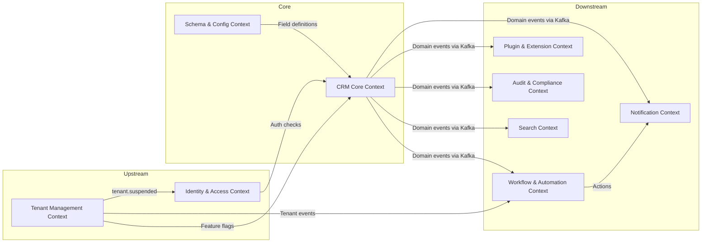

# 03 — DDD Bounded Contexts

## Objective

Define the Bounded Contexts of the Multi-Tenant SaaS CRM, the responsibilities of each context, how they communicate, and how module boundaries translate to eventual service extraction boundaries.

---

## What is a Bounded Context (Production Definition)

A bounded context is not just a module — it is a semantic boundary where a term has a consistent meaning. "Contact" in the CRM core context means a full person with history, custom fields, and owner. "Contact" in the Notification context means just an email address and a name. The same word means different things, and that difference must be codified into separate models.

Violating this leads to a single bloated Contact object that tries to serve every use case, becoming unmaintainable.

---

## Bounded Contexts Identified

### 1. Identity & Access Context
**Responsibility**: Authentication, authorization, tenant membership, role and permission management, SSO integration.

**Key Concepts**: User, Role, Permission, TenantMembership, ApiKey, SsoConfig

**Why isolated**: Auth logic has zero business logic overlap with CRM entities. It evolves on its own cadence (MFA, SSO providers, OAuth flows). It is the most security-critical module — isolating it reduces blast radius.

**Communicates via**:
- Inbound: All other contexts validate tokens/permissions through this context's interfaces
- Outbound: Publishes `user.created`, `user.suspended`, `role.changed` events

---

### 2. Tenant Management Context
**Responsibility**: Tenant lifecycle (onboarding, plan management, feature flags, suspension, offboarding), billing integration, data residency management.

**Key Concepts**: Tenant, PlanTier, FeatureFlag, TenantSettings, DataRegion, TenantStatus

**Why isolated**: Tenant lifecycle is an operational concern, not a CRM concern. A tenant can be suspended without affecting the CRM data model. Billing integration (Stripe, etc.) lives here and has its own failure modes.

**Communicates via**:
- Outbound: Publishes `tenant.created`, `tenant.plan_changed`, `tenant.suspended`
- Inbound: Receives billing events from payment processor webhook

---

### 3. CRM Core Context
**Responsibility**: The heart of the system. Contacts, Accounts, Deals, Pipelines, Activities, and the relationships between them.

**Key Concepts**: Contact, Account, Deal, Pipeline, Stage, Activity, Lead

**Why isolated**: This is the product. It evolves most rapidly. Keeping it isolated from workflow, notification, and audit concerns ensures it doesn't become a kitchen sink.

**Communicates via**:
- Outbound: Publishes domain events (`contact.updated`, `deal.stage_changed`, `deal.won`) to Kafka
- Inbound: Queries Identity context for permission checks, queries Tenant context for feature flag checks

---

### 4. Schema & Configuration Context
**Responsibility**: Custom field definitions, custom object types, field validation rules, pipeline configuration, stage configuration, view layouts.

**Key Concepts**: CustomFieldDefinition, ObjectSchema, FieldValidation, ViewLayout, PipelineTemplate

**Why isolated**: Schema changes are configuration changes, not data changes. A tenant modifying a custom field definition should not require touching the Contact service. Schema registry is read-heavy (cached), write-rare.

**Communicates via**:
- Outbound: Publishes `field_definition.created`, `field_definition.deleted`
- Inbound: CRM Core reads field definitions to validate writes

---

### 5. Workflow & Automation Context
**Responsibility**: Workflow definition storage, trigger evaluation, action execution, workflow execution history.

**Key Concepts**: WorkflowDefinition, Trigger, Action, WorkflowExecution, ExecutionStep

**Why isolated**: Workflow evaluation runs asynchronously. Its failure must not affect CRM core writes. Its scaling needs (potentially many triggered events per second) differ from core CRUD.

**Communicates via**:
- Inbound: Consumes domain events from Kafka (`contact.updated`, `deal.stage_changed`)
- Outbound: Publishes `workflow.triggered`, `workflow.action_failed`; calls external webhooks

---

### 6. Notification Context
**Responsibility**: Email, in-app, and push notifications. Template management, notification preferences, delivery tracking.

**Key Concepts**: NotificationTemplate, NotificationPreference, DeliveryRecord

**Why isolated**: Notification delivery is inherently async and has external dependencies (email providers, push services). Failures here must not propagate to core CRM writes.

**Communicates via**:
- Inbound: Consumes events from Kafka (`user.invited`, `deal.assigned`, `task.due_soon`)
- Outbound: Calls email service (SendGrid/SES), push notification providers

---

### 7. Search Context
**Responsibility**: Elasticsearch index management, search query API, real-time index updates.

**Key Concepts**: SearchIndex, SearchQuery, IndexDocument, FacetConfig

**Why isolated**: Search is read-only from the perspective of CRM core. Elasticsearch consistency model differs from PostgreSQL. Index updates are async.

**Communicates via**:
- Inbound: Consumes domain events to update Elasticsearch index
- Outbound: Serves search queries, returns IDs which CRM Core hydrates from PostgreSQL

---

### 8. Audit & Compliance Context
**Responsibility**: Immutable audit log storage, audit query API, GDPR data export, erasure orchestration, retention policy enforcement.

**Key Concepts**: AuditEvent, DataSubjectRequest, ErasureJob, ExportPackage, RetentionPolicy

**Why isolated**: Audit storage must be append-only and immutable. GDPR erasure is a complex multi-system operation. Compliance queries have very different access patterns from CRM reads.

**Communicates via**:
- Inbound: Consumes all domain events from Kafka to build audit trail
- Outbound: Generates GDPR export packages to S3, publishes `erasure.completed`

---

### 9. Plugin & Extension Context
**Responsibility**: Plugin marketplace, plugin installation per tenant, plugin execution sandbox, plugin API key management, webhook management.

**Key Concepts**: Plugin, PluginInstallation, PluginManifest, Webhook, WebhookDelivery, WebhookAttempt

**Why isolated**: Plugin execution must be sandboxed from all other contexts. A misbehaving plugin must not affect CRM operations. Plugin authentication is separate from user authentication.

**Communicates via**:
- Inbound: Subscribes to domain events to trigger webhooks
- Outbound: Makes HTTP calls to external webhook endpoints, enforced with timeouts and circuit breakers

---

## Context Map



---

## Upstream vs Downstream Context Relationships

| Relationship | Pattern | Description |
|---|---|---|
| Identity → CRM Core | Conformist | CRM Core must conform to Identity's auth model |
| Tenant Mgmt → CRM Core | Published Language | Feature flags via well-defined JSON schema |
| CRM Core → Search | Event-Driven | Search is downstream, subscribes to events |
| CRM Core → Audit | Event-Driven | Audit is downstream, subscribes to events |
| CRM Core → Workflow | Event-Driven | Workflow triggers on CRM events |
| CRM Core → Plugin | Event-Driven | Plugins subscribe to CRM events |
| Schema → CRM Core | Shared Kernel | CustomFieldDefinition is shared concept |

---

## Anti-Corruption Layer

When CRM Core calls Identity Context for permission checks, it uses an Anti-Corruption Layer (ACL) — an adapter that translates between the Identity context's permission model and the CRM Core's domain language.

Example: Identity says `PERMISSION_CODE=CRM_CONTACT_READ_OWN`. The ACL translates this to a CRM Core concept: `ContactAccessPolicy.ownedByCurrentUser()`. This prevents Identity's internal representation from leaking into CRM Core's domain model.

---

## Module Package Structure (Java)

```
com.crm
  ├── identity/
  │     ├── domain/
  │     ├── application/
  │     ├── infrastructure/
  │     └── api/
  ├── tenant/
  │     ├── domain/
  │     ├── application/
  │     ├── infrastructure/
  │     └── api/
  ├── crm/
  │     ├── contact/
  │     ├── account/
  │     ├── deal/
  │     ├── pipeline/
  │     └── activity/
  ├── schema/
  ├── workflow/
  ├── notification/
  ├── search/
  ├── audit/
  └── plugin/
```

Each module exposes interfaces via its `application/` layer. Inter-module communication uses interfaces only, never concrete implementations.

---

## Extraction Sequence to Microservices

When scale demands extraction:

| Order | Service | Trigger for Extraction |
|---|---|---|
| 1 | Notification | High volume, needs own queue consumer, stateless |
| 2 | Search | Elasticsearch ops team, independent scaling |
| 3 | Audit | Immutable store, separate retention, high write volume |
| 4 | Workflow Engine | Complex execution, needs independent scaling |
| 5 | Plugin Execution | Security isolation, sandboxed runtime |
| 6 | CRM Core | Last to extract — when team size justifies per-entity services |

Never extract a service before its module boundary is clean in the monolith. A poorly bounded module extracted to a microservice just becomes a distributed monolith.

---

## Interview Discussion Points

- **How do you enforce bounded context isolation in a monolith?** → Java module system (JPMS) or Gradle multi-module project with `internal` packages not exported to other modules. Architectural fitness functions in ArchUnit tests can enforce no cross-module class imports.
- **What is the risk of sharing the database across all contexts?** → Schema coupling — one module's migration can break another's queries. Mitigate with module-owned table prefixes and strict no-cross-module foreign keys (reference by ID only).
- **How does the Workflow context trigger actions without knowing CRM internals?** → Workflow actions are expressed as abstract commands (`CREATE_TASK`, `SEND_EMAIL`, `CALL_WEBHOOK`) resolved by CRM Core. The Workflow context never directly manipulates CRM tables.
- **When would you use a Shared Kernel vs separate models?** → Shared Kernel for concepts that both teams truly co-own and change together (e.g., CustomFieldDefinition shared between Schema and CRM Core). Separate models when the same word means different things in different contexts (e.g., `Contact` in CRM Core vs Notification).
