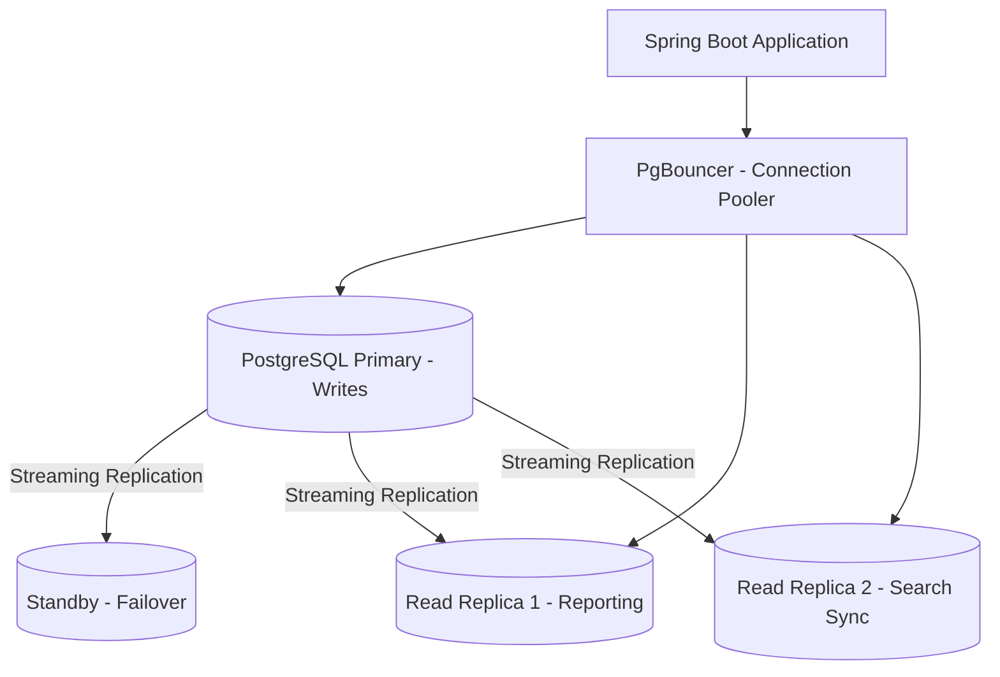

# 05 — Database Design

## Objective

Design the PostgreSQL schema for the Multi-Tenant SaaS CRM with a focus on tenant isolation via Row-Level Security, partitioning strategy, indexing for common access patterns, dynamic field storage, and audit architecture.

---

## Database Architecture Overview



**PgBouncer** in transaction pooling mode: maintains a small pool of real PostgreSQL connections shared across many application threads. At 10,000 tenants with 100 users each, the theoretical max concurrent connections is massive — PgBouncer collapses this to a manageable pool (~200 connections to PostgreSQL).

---

## Row-Level Security Design

Every table has a `tenant_id UUID NOT NULL` column. PostgreSQL RLS policies enforce that each database session can only see rows for its tenant.

**Implementation Pattern**:
1. Application sets `SET app.current_tenant_id = 'uuid'` as a session parameter before any query
2. RLS policy references `current_setting('app.current_tenant_id')::uuid`
3. Policy is enabled on all tenant-scoped tables: `ALTER TABLE contacts ENABLE ROW LEVEL SECURITY`

**RLS Policy Example (conceptual)**:
```
Policy: contacts_tenant_isolation
Target: ALL operations (SELECT, INSERT, UPDATE, DELETE)
Expression: tenant_id = current_setting('app.current_tenant_id')::uuid
```

**Defense in Depth**:
- Layer 1: Application always adds `WHERE tenant_id = ?` (explicit)
- Layer 2: PostgreSQL RLS policy enforces at DB level (safety net)
- Layer 3: Integration tests query cross-tenant IDs and assert zero rows returned
- Layer 4: CI gate: any query without `tenant_id` filter fails static analysis

**Performance Consideration**: RLS adds a condition to every query. With proper indexes on `(tenant_id, id)` and `(tenant_id, ...)` composite indexes, this overhead is negligible. Benchmark: < 5% overhead on indexed queries.

---

## Core Table Schemas

### tenants
```sql
CREATE TABLE tenants (
    tenant_id       UUID PRIMARY KEY DEFAULT gen_random_uuid(),
    name            VARCHAR(255) NOT NULL,
    slug            VARCHAR(100) UNIQUE NOT NULL,  -- subdomain
    plan_tier       VARCHAR(20) NOT NULL DEFAULT 'STARTER',
    status          VARCHAR(20) NOT NULL DEFAULT 'ACTIVE',
    region          VARCHAR(10) NOT NULL DEFAULT 'US',
    settings        JSONB NOT NULL DEFAULT '{}',
    feature_flags   JSONB NOT NULL DEFAULT '{}',
    created_at      TIMESTAMPTZ NOT NULL DEFAULT NOW(),
    trial_ends_at   TIMESTAMPTZ,
    suspended_at    TIMESTAMPTZ,
    INDEX: (slug), (status), (region), (plan_tier)
);
-- No RLS on tenants table — it is the anchor
```

### users
```sql
CREATE TABLE users (
    user_id         UUID PRIMARY KEY DEFAULT gen_random_uuid(),
    tenant_id       UUID NOT NULL REFERENCES tenants(tenant_id),
    email           VARCHAR(255) NOT NULL,
    full_name       VARCHAR(255),
    role_id         UUID NOT NULL,
    status          VARCHAR(20) NOT NULL DEFAULT 'INVITED',
    password_hash   VARCHAR(255),  -- null for SSO-only users
    sso_provider    VARCHAR(50),
    external_id     VARCHAR(255),
    mfa_enabled     BOOLEAN NOT NULL DEFAULT FALSE,
    last_login_at   TIMESTAMPTZ,
    created_at      TIMESTAMPTZ NOT NULL DEFAULT NOW(),
    UNIQUE(tenant_id, email),
    INDEX: (tenant_id, status), (tenant_id, role_id)
);
ALTER TABLE users ENABLE ROW LEVEL SECURITY;
```

### contacts
```sql
CREATE TABLE contacts (
    contact_id          UUID NOT NULL DEFAULT gen_random_uuid(),
    tenant_id           UUID NOT NULL,
    first_name          VARCHAR(255),
    last_name           VARCHAR(255),
    email               VARCHAR(255),
    phone               VARCHAR(50),
    account_id          UUID,
    owner_id            UUID,
    lead_status         VARCHAR(50),
    lifecycle_stage     VARCHAR(50),
    tags                TEXT[],
    custom_field_data   JSONB NOT NULL DEFAULT '{}',
    created_at          TIMESTAMPTZ NOT NULL DEFAULT NOW(),
    updated_at          TIMESTAMPTZ NOT NULL DEFAULT NOW(),
    deleted_at          TIMESTAMPTZ,
    PRIMARY KEY (tenant_id, contact_id),  -- composite PK for partitioning
    INDEX: (tenant_id, email),
    INDEX: (tenant_id, owner_id),
    INDEX: (tenant_id, account_id),
    INDEX: (tenant_id, created_at DESC),
    INDEX: (tenant_id, deleted_at) WHERE deleted_at IS NOT NULL,
    GIN INDEX: (tags),
    GIN INDEX: (custom_field_data)
) PARTITION BY HASH (tenant_id);
ALTER TABLE contacts ENABLE ROW LEVEL SECURITY;
```

### deals
```sql
CREATE TABLE deals (
    deal_id             UUID NOT NULL DEFAULT gen_random_uuid(),
    tenant_id           UUID NOT NULL,
    title               VARCHAR(500) NOT NULL,
    value               DECIMAL(15,2),
    currency            CHAR(3) DEFAULT 'USD',
    pipeline_id         UUID NOT NULL,
    stage_id            UUID NOT NULL,
    contact_id          UUID,
    account_id          UUID,
    owner_id            UUID NOT NULL,
    expected_close_date DATE,
    status              VARCHAR(20) NOT NULL DEFAULT 'OPEN',
    custom_field_data   JSONB NOT NULL DEFAULT '{}',
    created_at          TIMESTAMPTZ NOT NULL DEFAULT NOW(),
    updated_at          TIMESTAMPTZ NOT NULL DEFAULT NOW(),
    closed_at           TIMESTAMPTZ,
    deleted_at          TIMESTAMPTZ,
    PRIMARY KEY (tenant_id, deal_id),
    INDEX: (tenant_id, pipeline_id, stage_id),
    INDEX: (tenant_id, owner_id, status),
    INDEX: (tenant_id, expected_close_date),
    INDEX: (tenant_id, status, closed_at)
) PARTITION BY HASH (tenant_id);
ALTER TABLE deals ENABLE ROW LEVEL SECURITY;
```

### audit_log
```sql
CREATE TABLE audit_log (
    audit_id        UUID NOT NULL DEFAULT gen_random_uuid(),
    tenant_id       UUID NOT NULL,
    actor_id        UUID,  -- null for system actions
    action          VARCHAR(50) NOT NULL,
    entity_type     VARCHAR(50) NOT NULL,
    entity_id       UUID NOT NULL,
    before_state    JSONB,
    after_state     JSONB,
    changed_fields  TEXT[],
    ip_address      INET,
    user_agent      TEXT,
    correlation_id  UUID,
    occurred_at     TIMESTAMPTZ NOT NULL DEFAULT NOW(),
    PRIMARY KEY (tenant_id, audit_id, occurred_at),  -- for partition pruning
    INDEX: (tenant_id, entity_type, entity_id, occurred_at DESC),
    INDEX: (tenant_id, actor_id, occurred_at DESC),
    INDEX: (tenant_id, occurred_at DESC)
) PARTITION BY RANGE (occurred_at);
-- Monthly partitions: audit_log_2026_01, audit_log_2026_02, ...
ALTER TABLE audit_log ENABLE ROW LEVEL SECURITY;
```

**Audit log uses RANGE partitioning by `occurred_at`** — enables efficient time-range queries, easy archival of old partitions, and parallel query across months.

---

## Partitioning Strategy

| Table | Partition Type | Partition Key | Rationale |
|---|---|---|---|
| contacts | HASH(tenant_id) | tenant_id | Distribute large tenants evenly across storage nodes |
| deals | HASH(tenant_id) | tenant_id | Same as contacts |
| activities | HASH(tenant_id) | tenant_id | High volume, even distribution needed |
| audit_log | RANGE(occurred_at) | occurred_at | Time-range queries, archival by month |

**Hash partitioning on tenant_id**: Spreads hot tenants across partitions. A query for `tenant_id=X` only scans the relevant partition (partition pruning). Initial target: 32 partitions. Can be increased via pg_partman.

**Why not partition by tenant_id range?** Range partitioning by UUID is useless (random UUIDs don't cluster). Hash partitioning provides even distribution.

---

## Indexing Strategy

### Composite Indexes Follow Query Patterns

The most common CRM queries:
1. "Show me all contacts owned by me" → `(tenant_id, owner_id, deleted_at)`
2. "Show me all open deals in pipeline X" → `(tenant_id, pipeline_id, status)`
3. "Search contacts by email" → `(tenant_id, email)`
4. "Audit trail for contact 456" → `(tenant_id, entity_type, entity_id, occurred_at DESC)`
5. "All activities due today" → `(tenant_id, due_at, completed_at)`

### JSONB Indexing for Custom Fields

GIN indexes on `custom_field_data` support queries like:
- "All contacts where lead_score > 80" → requires generated column index for range queries
- "All contacts with tag 'VIP'" → GIN index on `tags` array

For frequently queried custom fields, create generated columns:
```
ALTER TABLE contacts ADD COLUMN custom_lead_score INT
  GENERATED ALWAYS AS ((custom_field_data->>'lead_score')::int) STORED;
CREATE INDEX ON contacts (tenant_id, custom_lead_score);
```

---

## Dynamic Schema: Custom Field Storage

**Design Decision: JSONB column on entity tables**

Three alternatives considered:

| Approach | Description | Pros | Cons |
|---|---|---|---|
| EAV (Entity-Attribute-Value) | Separate table: entity_id + field_key + value | Fully relational, constraints possible | N+M joins to reconstruct record, catastrophically slow at scale |
| JSONB Column | JSON blob on entity row | O(1) read, simple query, flexible | No FK constraints, schema-less, GIN index needed for querying |
| Separate custom_data table per entity type | contacts_custom_data with JSONB | Separates concerns | Extra join on every read |

**Decision**: JSONB column on the entity row. The application-layer `CustomFieldDefinition` registry provides schema enforcement. The GIN index enables querying. The extra join of EAV kills performance at scale.

---

## Outbox Pattern Table

```sql
CREATE TABLE outbox_events (
    event_id        UUID PRIMARY KEY DEFAULT gen_random_uuid(),
    tenant_id       UUID NOT NULL,
    aggregate_type  VARCHAR(50) NOT NULL,
    aggregate_id    UUID NOT NULL,
    event_type      VARCHAR(100) NOT NULL,
    payload         JSONB NOT NULL,
    status          VARCHAR(20) NOT NULL DEFAULT 'PENDING',
    created_at      TIMESTAMPTZ NOT NULL DEFAULT NOW(),
    published_at    TIMESTAMPTZ,
    retry_count     INT NOT NULL DEFAULT 0,
    INDEX: (status, created_at) WHERE status = 'PENDING'
);
```

The outbox relay polls for `status = 'PENDING'` rows and publishes to Kafka. On successful publish, marks `status = 'PUBLISHED'`. This ensures at-least-once delivery and transactional consistency between DB write and event publish.

---

## Multi-Region Data Residency

For tenants in regulated regions (EU GDPR):

1. **Region-pinned clusters**: EU tenants' data lives in an EU PostgreSQL cluster (different AWS region). The `tenants.region` column determines which cluster connection the application uses.
2. **Application-level routing**: The application maintains a `TenantConnectionRouter` that selects the correct PgBouncer pool based on `tenant.region`.
3. **No cross-region joins**: EU tenant data never travels to US clusters, even for global analytics. Cross-region reporting uses anonymized aggregates only.

---

## Database Migration Strategy

At 10,000 tenants on shared schema, a migration that adds a column to `contacts` affects ALL tenants simultaneously.

**Zero-downtime migration process**:
1. **Phase 1 (backward compatible)**: Add new nullable column with no default. Old code ignores it, new code reads it.
2. **Phase 2**: Deploy new code that reads and writes the new column.
3. **Phase 3**: Backfill existing rows (via background job, not in the migration script).
4. **Phase 4**: Add NOT NULL constraint only after backfill completes.
5. **Phase 5 (cleanup)**: Drop old column in a separate migration after all code references are removed.

Tools: Flyway for migration versioning, with a stricter convention: migrations must be additive-only in Phase 1, never drop or rename in the same migration as the feature change.

---

## GDPR Data Management

**Erasure (Right to be Forgotten)**:
1. Soft-delete the Contact record (`deleted_at = NOW()`)
2. Publish `contact.gdpr_erasure_requested` event
3. Async job: Overwrite PII fields (`first_name`, `last_name`, `email`, `phone`) with tombstone values
4. Audit log: Replace PII in `before_state`/`after_state` JSONB with `[REDACTED]` using a scheduled scrubber
5. Elasticsearch: Delete document
6. S3: Delete any uploaded files linked to the contact
7. Backups: Use **crypto-shredding** — encrypt PII fields with a per-contact key stored in AWS KMS. Erase the KMS key → PII in backups becomes unreadable without processing the backups.

**Data Export (Portability)**:
Async job triggered by `POST /v1/contacts/export`:
1. Query all contact records for the tenant
2. Write to CSV/JSON in S3 (tenant-namespaced bucket)
3. Generate pre-signed URL valid for 24 hours
4. Notify user via email

---

## Interview Discussion Points

- **Why composite primary keys `(tenant_id, entity_id)` instead of just `entity_id`?** → Partition pruning: PostgreSQL can prune hash partitions when `tenant_id` is in the WHERE clause. Also makes cross-tenant queries on the same entity_id return no rows naturally.
- **How do you handle schema migrations when a single migration affects 10K tenants simultaneously?** → Additive-only migrations in production. No column drops or renames in the same deploy as code changes. Use feature flags to gate new columns until backfill completes.
- **At what point does a single PostgreSQL cluster become insufficient?** → Around 10TB+ of active data or 5,000+ writes/second on the primary. Solutions: add more read replicas for read distribution, introduce PgBouncer tuning, then eventually consider Citus (distributed PostgreSQL) or vertical scaling before horizontal sharding.
- **What is crypto-shredding and why is it better than scrubbing backups?** → Encrypting PII with a per-record key. Erasing the encryption key makes the data mathematically unrecoverable without touching backup files. Scrubbing production backups is operationally expensive and risky (you can corrupt backups). Crypto-shredding is the GDPR-compliant solution at scale.
