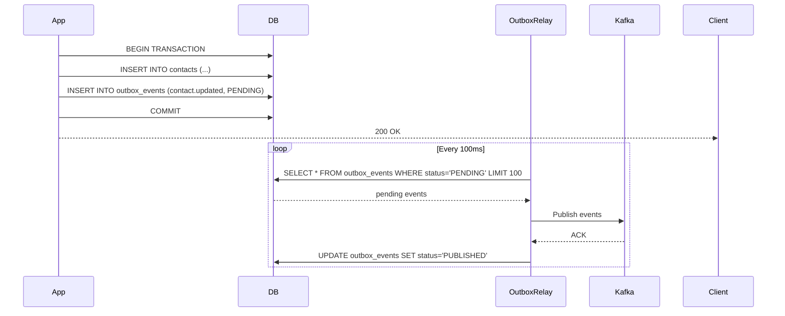
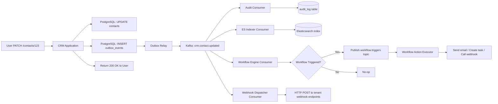
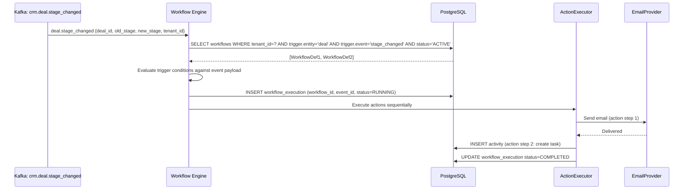

# 06 — Event Flow

## Objective

Define the event-driven architecture of the Multi-Tenant SaaS CRM: what events are produced, by whom, on which Kafka topics, consumed by which services, and how the system guarantees at-least-once delivery with idempotent consumers.

---

## Why Event-Driven for a CRM

CRM writes have immediate-value side effects that should NOT block the user response:
- Audit log writes (compliance requirement, but async is acceptable)
- Elasticsearch index updates (search consistency can lag 1-2 seconds)
- Workflow trigger evaluation (complex condition checking)
- Webhook delivery to third-party integrations (external HTTP calls — must be async)
- Notification delivery (email/push — must be async)

If any of these were synchronous in the write path, a slow webhook call (or a broken ES cluster) would make contact saves slow or fail. Event-driven decoupling means the write path is: validate → persist to DB → publish event to outbox → return 200. Everything else is async.

---

## Outbox Pattern (Transactional Consistency)

The fundamental challenge: how do you guarantee that a domain event is published to Kafka if and only if the database write succeeds?

Naive approach (wrong): Write to DB, then publish to Kafka. If the application crashes between DB commit and Kafka publish, the event is lost.

**Outbox Pattern**:
1. Within the same ACID transaction: write to `contacts` + write to `outbox_events`
2. A separate **Outbox Relay** process polls the `outbox_events` table
3. For each `PENDING` event, publish to Kafka
4. On successful Kafka acknowledgment: mark event as `PUBLISHED`

This guarantees: event is published if and only if the DB write succeeded.



**Alternative**: Debezium CDC (Change Data Capture) — reads PostgreSQL WAL log and publishes changes to Kafka automatically without a relay process. More operationally complex but eliminates the polling overhead and reduces latency. Recommended for high-throughput scenarios (>1,000 writes/sec).

---

## Kafka Topic Design

### Topic Naming Convention
`{domain}.{entity}.{event_type}`

Examples:
- `crm.contact.updated`
- `crm.deal.stage_changed`
- `crm.deal.won`
- `tenant.user.invited`
- `tenant.plan.changed`
- `workflow.execution.completed`
- `audit.event.written`

### Topic Configuration

| Topic | Partitions | Retention | Replication |
|---|---|---|---|
| crm.contact.* | 32 | 7 days | RF=3 |
| crm.deal.* | 32 | 7 days | RF=3 |
| crm.activity.* | 16 | 7 days | RF=3 |
| workflow.triggers | 32 | 7 days | RF=3 |
| audit.events | 64 | 30 days | RF=3 |
| notifications.outbound | 16 | 3 days | RF=3 |
| webhooks.delivery | 32 | 7 days | RF=3 |
| tenant.lifecycle | 4 | 90 days | RF=3 |
| gdpr.erasure | 4 | 90 days | RF=3 |

**Partition key**: Always `tenant_id`. This ensures all events for a given tenant are processed in order within a partition, and events from different tenants are processed in parallel.

**Why 30-day retention on audit.events**: Allows the audit consumer to replay events if it falls behind (e.g., during an outage or deployment).

---

## Event Schemas

All events follow an envelope schema:

```json
{
  "event_id": "uuid",
  "event_type": "crm.contact.updated",
  "schema_version": "1.0",
  "tenant_id": "uuid",
  "aggregate_type": "contact",
  "aggregate_id": "uuid",
  "actor_id": "uuid",
  "correlation_id": "uuid",
  "occurred_at": "2026-05-18T10:30:00Z",
  "payload": {
    "before": { "email": "old@example.com" },
    "after": { "email": "new@example.com" },
    "changed_fields": ["email"]
  }
}
```

Schema versioning is managed via a **Schema Registry** (Confluent Schema Registry). Producers must register schemas. Consumers validate against registered schema. Breaking schema changes require a new `schema_version` and consumer code that handles both versions during a migration window.

---

## Consumer Groups and Processing

### Audit Consumer
- **Group**: `audit-writer`
- **Subscribes**: All `crm.*` topics + `tenant.*` topics
- **Action**: Writes to `audit_log` table
- **Idempotency**: Uses `event_id` as deduplication key. Before insert, check `EXISTS (SELECT 1 FROM audit_log WHERE correlation_id = ?)`. At-least-once delivery with idempotent consumer.

### Elasticsearch Indexer Consumer
- **Group**: `es-indexer`
- **Subscribes**: `crm.contact.*`, `crm.deal.*`, `crm.account.*`
- **Action**: Upsert document in Elasticsearch using `tenant_id + aggregate_id` as document ID
- **Idempotency**: ES upsert is inherently idempotent

### Workflow Trigger Consumer
- **Group**: `workflow-engine`
- **Subscribes**: All `crm.*` topics
- **Action**: Evaluate all active WorkflowDefinitions for the tenant against the event. For matching workflows, enqueue workflow execution.
- **Idempotency**: Check `workflow_executions` table before triggering. Use `(workflow_id, event_id)` as unique key.

### Notification Consumer
- **Group**: `notification-dispatcher`
- **Subscribes**: `crm.deal.*`, `crm.activity.task_due`, `tenant.user.invited`, `workflow.action.send_email`
- **Action**: Generate notification from template, send via provider (SendGrid, FCM)
- **Idempotency**: Notification delivery is not strictly idempotent (duplicate emails possible). Use `(notification_template_id, event_id)` to detect and suppress duplicates.

### Webhook Delivery Consumer
- **Group**: `webhook-dispatcher`
- **Subscribes**: All `crm.*` topics
- **Action**: For each tenant's active webhook subscriptions, deliver the event via HTTP POST
- **Idempotency**: Webhook deliveries tracked in `webhook_delivery_log` with `(webhook_id, event_id)` unique key

---

## Full Event Flow: Contact Updated



---

## Workflow Event Flow



---

## Dead Letter Queue Strategy

When a consumer fails to process a message after N retries:

1. Move the message to a **Dead Letter Topic** (DLT): `{original_topic}.dlq`
2. Alert via PagerDuty (for audit and workflow failures — these are critical)
3. DLT messages are queryable via a backoffice UI
4. Operations team can: investigate the failure, fix the root cause, replay the DLT message

**Retry policy per consumer**:

| Consumer | Max Retries | Backoff Strategy | DLT Alert Severity |
|---|---|---|---|
| Audit Writer | 10 | Exponential (1s, 2s, 4s, ...) | High (compliance risk) |
| ES Indexer | 5 | Exponential | Medium (search lag) |
| Workflow Engine | 3 | Linear (5s) | Medium |
| Webhook Dispatcher | 3 | Exponential | Low |
| Notification Dispatcher | 3 | Linear | Low |

---

## Noisy Tenant Mitigation

A single large Enterprise tenant doing a bulk import of 100,000 contacts could flood the `crm.contact.created` topic and starve other tenants' events from being processed.

**Mitigation strategies**:
1. **Partition by tenant_id**: Large tenant only fills its partition(s). Other tenants' partitions are unaffected.
2. **Per-tenant rate limiting on event production**: The outbox relay throttles event publishing for a single tenant to prevent queue saturation.
3. **Dedicated consumer groups for Enterprise tier**: High-value Enterprise tenants get their own consumer group instances with priority processing.
4. **Bulk event batching**: Bulk imports publish a single `contacts.bulk_imported` event with a job_id, rather than one event per contact. The audit and ES workers process the job result separately.

---

## Event Ordering Guarantees

**Within a partition**: Kafka guarantees strict ordering. Since all events for a tenant map to the same partition (by `tenant_id` partition key), all events for a given tenant are processed in the order they were produced.

**Across tenants**: No ordering guarantee needed — tenants are fully independent.

**What if an event is reprocessed out of order?** (Consumer lag scenario):
- Audit consumer: Events have `occurred_at` timestamps. Out-of-order writes to audit_log are acceptable — audit log is sorted by `occurred_at` in queries.
- ES Indexer: Uses event's `occurred_at` as document version. If an older event is reprocessed after a newer one, the ES update is rejected (version conflict). This prevents stale data overwriting fresh data.

---

## Interview Discussion Points

- **Why Outbox Pattern instead of directly publishing to Kafka in the application?** → Atomicity: without the outbox, a crash between DB commit and Kafka publish loses the event permanently. With the outbox, the event is always recoverable from the DB.
- **What happens if the Outbox Relay goes down?** → Events accumulate in `outbox_events` table. When the relay recovers, it processes the backlog. Downstream systems lag (search becomes stale, audit events delayed) but no data is lost. Write operations continue unaffected.
- **How do you handle event schema evolution?** → Schema Registry with Avro schemas. Producers register schema. Consumers validate. Breaking changes require a new schema version. Consumers handle both old and new versions during transition window.
- **Could Debezium CDC replace the outbox pattern?** → Yes. Debezium reads PostgreSQL WAL and publishes CDC events to Kafka. It eliminates the polling overhead. The tradeoff: Debezium is an additional operational component, WAL read position must be maintained, and CDC events are lower-level (table row changes) rather than domain events. For Phase 2+ at high throughput, Debezium is the right choice.
