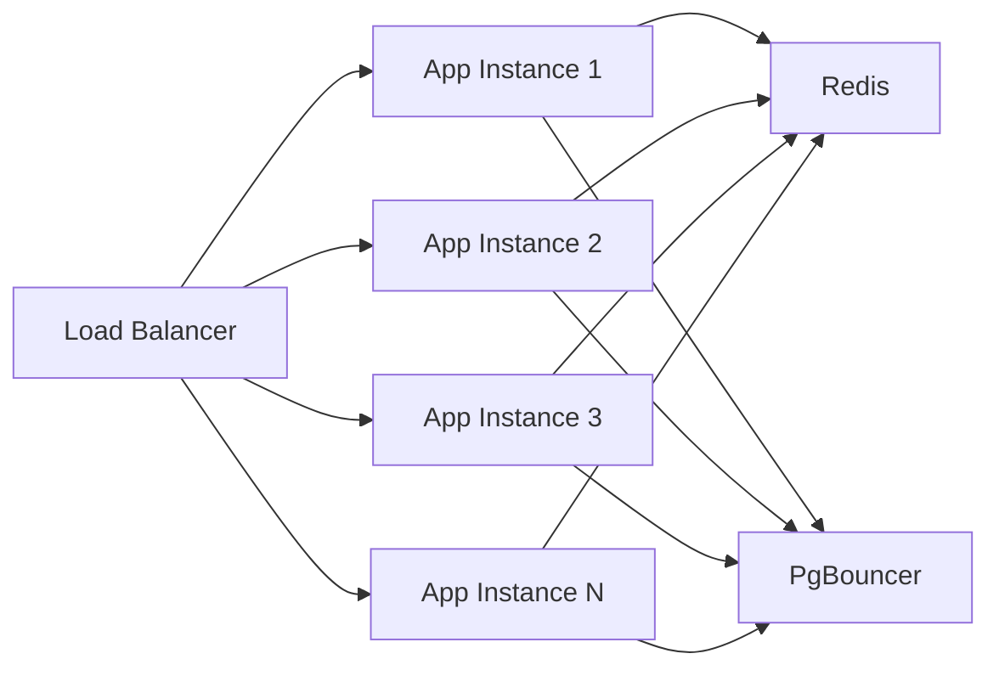

# 07 — Scaling Strategy

## Objective

Define how the Multi-Tenant SaaS CRM scales from 10K tenants to 100K+ tenants, what bottlenecks appear at each growth stage, and the evolutionary scaling path that avoids premature optimization while ensuring the system never falls behind demand.

---

## Scaling Evolution Phases

### Phase 1: MVP (0 – 1,000 tenants, ~100K users)

**Infra**:
- Single Spring Boot monolith (2–4 instances behind load balancer)
- Single PostgreSQL primary + 1 read replica + PgBouncer
- Single Redis instance (non-clustered)
- Kafka cluster (3 brokers)
- Single Elasticsearch cluster (3 nodes)

**Peak load**: ~200 RPS — all on a single app cluster

**Scaling risk**: None at this phase. Vertical scaling (bigger instances) handles most growth.

**What to monitor**: P99 query latency, connection pool utilization, Redis memory usage.

---

### Phase 2: Growth (1,000 – 10,000 tenants, ~1M users)

**Bottlenecks appearing**:
- PostgreSQL primary connection pool saturation
- Read-heavy CRM dashboard queries competing with write path
- Redis single-node memory ceiling
- Elasticsearch heap pressure

**Interventions**:
1. **PgBouncer connection pooling**: Collapse thousands of app connections to ~200 real DB connections. Switch to transaction-mode pooling.
2. **Read replicas**: Route all read queries (contact lists, deal views, search) to read replicas. Writes only go to primary.
3. **Redis Cluster**: Expand to 6-node Redis Cluster (3 shards × 2 replicas). Keys are tenant-namespaced, so shard routing is by key prefix.
4. **Elasticsearch scaling**: Scale to 6-9 data nodes. Use index aliases and shard routing by `tenant_id` hash for hot tenant isolation.
5. **Application horizontal scaling**: 4–8 instances. Stateless — session data in Redis, no in-process state.

**Architecture change**: Extract **Notification Service** as first microservice extraction. High message volume, stateless, independent failure domain.

---

### Phase 3: Scale (10,000 – 50,000 tenants, ~5M users)

**Bottlenecks appearing**:
- PostgreSQL HASH partitions becoming uneven (hot tenants in the same partition as each other)
- Kafka consumer lag for workflow engine during bulk imports
- ES indexing lag during large tenant imports
- Application layer CPU bound during workflow condition evaluation

**Interventions**:
1. **Citus (distributed PostgreSQL)**: Shard PostgreSQL horizontally by `tenant_id` across multiple nodes. Citus is PostgreSQL-compatible, making the migration transparent to Spring Boot (with minor query changes).
2. **Dedicated Kafka clusters per region**: EU tenants on EU Kafka cluster, US tenants on US Kafka cluster. Data residency compliance + reduced cross-region latency.
3. **Extract Workflow Engine**: High CPU cost of condition evaluation warrants its own horizontally-scaled service.
4. **Elasticsearch per-tenant index (for Enterprise)**: Large Enterprise tenants get dedicated ES indices for better query isolation and backup granularity. SMB tenants remain on shared indices with routing.
5. **CDN for static API responses**: Tenant settings, custom field definitions, pipeline configs — these change rarely. Cache at CDN layer with aggressive TTLs (5 minutes). Invalidate on change.

---

### Phase 4: Hyperscale (50,000+ tenants)

**Interventions**:
1. **Full microservices**: CRM Core splits into Contact Service, Deal Service, Account Service — each with its own database partition set.
2. **Multi-region active-active**: US, EU, APAC regions with tenant-region affinity routing. Cross-region reads only for global admin.
3. **Dedicated database clusters for Enterprise tenants**: Enterprise SLA requires dedicated PostgreSQL cluster — no shared noisy-neighbor risk.
4. **Kafka tiered storage**: Offload Kafka log segments to S3 for cost-efficient long-term retention (audit events).
5. **Global load balancer**: Route tenant requests to their home region based on subdomain/tenant-region mapping.

---

## Horizontal Scaling Details

### Application Layer

The Spring Boot application is stateless by design:
- No in-process session state (sessions in Redis)
- No in-process cache that diverges across instances (all caches in Redis)
- No file system state (files in S3)

Horizontal scaling is purely: add more application instances behind the load balancer. Kubernetes HPA (Horizontal Pod Autoscaler) scales based on CPU or custom RPS metrics.



### Database Layer

**Read scaling**: Add read replicas. Route reads via Spring's `@Transactional(readOnly=true)` to replica datasource. PgBouncer separates read vs write connection pools.

**Write scaling**: Cannot horizontally scale writes without sharding. At Phase 2-3:
- Batch operations go to a dedicated "batch" connection pool with lower priority
- Write-heavy bulk import jobs are rate-throttled per tenant
- Connections from application are multiplexed via PgBouncer

**Sharding with Citus (Phase 3)**:
- Citus distributes tables across worker nodes using `tenant_id` as distribution key
- All queries with `WHERE tenant_id = ?` are routed to the correct shard
- Cross-shard queries are avoided by design (no cross-tenant queries in normal operations)
- Reference tables (tenants, pipelines, custom_field_definitions) are replicated to all shards

---

## Caching Layers

| Cache Layer | What is Cached | TTL | Invalidation |
|---|---|---|---|
| CDN (CloudFront) | Static assets, public API docs | 24h | Versioned URL |
| API Gateway | Tenant settings responses | 5 min | Event-driven purge |
| Application L1 (Caffeine) | Per-request caches (field defs, role perms) | Request lifetime | N/A |
| Redis L2 | Contact list pages, deal views, search results | 60s | Key-based invalidation on write |
| Redis L2 | Session tokens | 15 min (access token) | Explicit logout |
| Redis L2 | Feature flags per tenant | 5 min | Event-driven purge on plan change |
| Redis L2 | Rate limit counters | 1 min window | Rolling window, auto-expire |

---

## Load Balancing Strategy

**L7 Load Balancer (NGINX / AWS ALB)**:
- Sticky sessions NOT used (app is stateless, JWT carries all needed context)
- Health check: `GET /actuator/health` (Spring Boot Actuator)
- Circuit breaker at load balancer: remove instance from pool if health check fails 3 consecutive times
- Weighted routing: canary deployments at 5%, 20%, 100% traffic shift

**API Gateway (Kong)**:
- Rate limiting plugin per tenant
- JWT validation plugin (offloads from application)
- Request transformation plugin: injects `X-Tenant-ID` header from JWT claim
- Analytics plugin: logs request metrics to Prometheus

---

## Noisy Neighbor Prevention

Multi-tenancy's core operational risk: one tenant's activity degrading another's experience.

**Strategies**:

1. **Per-tenant rate limiting**: Hard cap at API Gateway. Enterprise tenants get higher caps. Cannot borrow from other tenants' budgets.
2. **Separate connection pools per tier**: Enterprise tenants' DB queries go through a higher-priority PgBouncer pool. Starter tenants' bulk imports cannot exhaust the Enterprise pool.
3. **Kafka partition isolation**: Tenant partitions in Kafka. Large tenant floods its own partition. Consumer groups pick up from all partitions but weighted consumers prioritize Enterprise partition consumers.
4. **Elasticsearch routing**: `routing=tenant_id` parameter on all ES queries. Documents for each tenant route to specific shards. A heavy-query tenant doesn't scan all shards.
5. **Database workload tagging**: Tag queries with tenant tier in `pg_stat_activity` comment. Monitoring alerts if Starter tier queries consume disproportionate query time.

---

## Vertical vs Horizontal Scaling Decision Matrix

| Signal | Action |
|---|---|
| CPU > 70% sustained | Horizontal scale app instances |
| DB connection pool > 80% utilized | Add PgBouncer pool size (vertical) |
| DB read IOPS > 80% | Add read replica (horizontal) |
| DB write IOPS > 80% | Vertical scale primary or introduce sharding |
| Redis memory > 70% | Add Redis cluster shards |
| Kafka consumer lag > 60s sustained | Add consumer instances or increase partitions |
| ES query P99 > 500ms | Add data nodes or tune shard count |

---

## Back-of-Envelope Scaling Validation

```
At 10,000 tenants, 1M users, 5% peak concurrent = 50,000 users

50,000 users × 5 requests/minute = 250,000 req/min = ~4,200 RPS

4 app instances × 2,000 RPS capacity each = 8,000 RPS capacity
→ 4 instances with ~50% headroom. Comfortable.

PostgreSQL:
  4,200 RPS × 20% writes = 840 writes/sec
  840 writes/sec on modern PostgreSQL with NVMe SSD ≈ manageable
  PgBouncer: 100 connections shared across 4 app instances (25 each) → pool of 100 real DB connections

Redis:
  50,000 active users × session (2KB) = 100MB sessions
  Contact list cache: 10,000 tenants × 10 cached list pages × 20KB = 2GB cache
  Total Redis: ~5-10GB working set → single large instance or small cluster
```

---

## Interview Discussion Points

- **What is the first thing that will break at 10,000 tenants?** → PostgreSQL connection pool saturation, assuming no PgBouncer. With PgBouncer: read replica capacity if dashboards are heavy.
- **How do you scale the workflow engine independently?** → It's CPU-intensive (evaluating trigger conditions against event payloads). Extract as a separate service, scale horizontally. The Kafka partition count for `workflow.triggers` sets the maximum consumer parallelism.
- **What is the risk of Citus for Phase 3?** → All queries MUST include the distribution key (`tenant_id`) or they become cross-shard scatter-gather queries, which are slow. Requires careful query auditing before migration. Reference tables must be explicitly designated in Citus DDL.
- **How do you handle a tenant with 10M contacts?** → Hash partitions distribute their contacts across 32 partitions. Elasticsearch uses `routing=tenant_id` to route their documents to dedicated shards. Redis pagination cache has a short TTL to avoid holding 10M contacts in memory. Bulk export is async.
