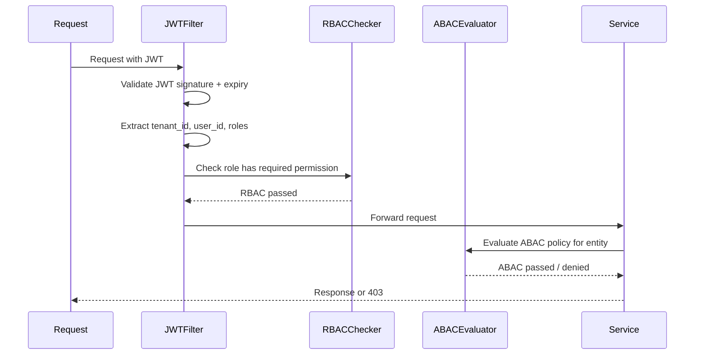

# 08 — Security Design

## Objective

Define the complete security architecture for the Multi-Tenant SaaS CRM: authentication, authorization (RBAC + ABAC), tenant isolation enforcement, API security, secrets management, encryption, audit logging, and compliance controls.

---

## Threat Model

The primary threats for a multi-tenant SaaS CRM:

| Threat | Description | Impact |
|---|---|---|
| Cross-tenant data leakage | Bug allows Tenant A to read Tenant B's contacts | Catastrophic — business-ending |
| Privilege escalation | User gains role they weren't assigned | High |
| Account takeover | Password/token compromise | High |
| API abuse | Scraping competitor's contact data via API | High |
| Insider threat | Employee with DB access reads tenant data | Medium |
| Plugin malice | Third-party plugin exfiltrates tenant data | High |
| GDPR non-compliance | PII exposed after erasure request | High (regulatory) |
| Injection attacks | SQL injection via API parameters | Critical |

---

## Authentication

### JWT Architecture

**Access Token** (short-lived, 15 minutes):
- Signed with RS256 (asymmetric) — application has public key, Auth service has private key
- Contains: `sub` (user_id), `tid` (tenant_id), `roles`, `scope`, `exp`, `jti` (JWT ID)
- Stateless validation: no database lookup required for every request (performance benefit)
- Revocation: short expiry limits revocation window. Emergency revocation via token blocklist in Redis (keyed by `jti`)

**Refresh Token** (long-lived, 7 days):
- Opaque random token (not JWT)
- Stored in `refresh_tokens` table as `HMAC-SHA256(token)` — never plaintext
- HTTP-only, Secure, SameSite=Strict cookie (cannot be accessed via JavaScript, prevents XSS theft)
- Single-use rotation: each refresh issues a new refresh token and invalidates the old one

**Why RS256 not HS256?** HS256 requires all services to share the secret key — a key compromise affects all services. RS256 means only the Auth service can issue tokens; all other services only need the public key to verify.

### Session Security

- Concurrent session limits per tenant tier (Starter: 3 devices, Enterprise: unlimited)
- Session invalidation on password change, MFA enrollment, and admin force-logout
- Suspicious login detection: new country/device triggers step-up authentication

### Multi-Factor Authentication

- TOTP (Google Authenticator, Authy) — available to all tiers
- SMS OTP — Growth tier and above
- Hardware keys (WebAuthn/FIDO2) — Enterprise tier
- Per-tenant enforcement: Enterprise admins can require MFA for all users

### SSO / SAML 2.0 / OAuth2

- Tenants configure their Identity Provider (Okta, Azure AD, Google Workspace)
- SAML 2.0 for Enterprise customers (legacy IdP compatibility)
- OIDC/OAuth2 for modern IdPs
- SSO is soft-enforced per tenant: admin can require SSO-only login (disable password login)
- JIT (Just-In-Time) user provisioning: first SSO login auto-creates user record with default role

---

## Authorization: RBAC + ABAC

### Role-Based Access Control (RBAC)

Per-tenant roles with predefined permission sets:

| Role | Description | Key Permissions |
|---|---|---|
| Owner | Single owner per tenant, cannot be removed | All permissions + billing |
| Admin | Organization administrator | All CRM permissions + user management |
| Manager | Team lead | View all records, assign records, manage team's deals |
| Rep | Sales representative | CRUD own records, view assigned records |
| Read-Only | Viewer | Read-only across all CRM data |
| Custom Role | Tenant-defined | Admin composes permissions from permission set |

**Permission model**:
```
Permission = {resource_type, action}
Examples:
  CONTACT_READ, CONTACT_CREATE, CONTACT_UPDATE_OWN, CONTACT_UPDATE_ALL
  DEAL_READ_OWN, DEAL_READ_ALL, DEAL_WON_MARK
  USER_INVITE, USER_ROLE_ASSIGN
  AUDIT_LOG_READ, REPORT_EXPORT
  WORKFLOW_MANAGE, API_KEY_MANAGE
```

### Attribute-Based Access Control (ABAC)

RBAC alone cannot express: "a Rep can only read contacts they own OR contacts in their territory."

ABAC adds runtime conditions evaluated against entity attributes and user attributes:

| Policy | ABAC Expression |
|---|---|
| Rep sees own deals only | `deal.owner_id == current_user.id` |
| Manager sees team deals | `deal.owner_id IN current_user.team_member_ids` |
| Deal visible if in territory | `account.region IN current_user.territories` |
| Enterprise contact restriction | `contact.account.tier == 'ENTERPRISE' AND user.has_permission(ENTERPRISE_CONTACT_ACCESS)` |

ABAC policies are evaluated in the application service layer, not at the database level. The query is first fetched, then filtered by ABAC. For list endpoints, ABAC conditions are compiled into SQL WHERE clauses to avoid N+1 filtering.

### Permission Evaluation Flow



---

## Tenant Isolation Security Controls

### Control 1: Application-Layer Tenant Context

Every request establishes a `TenantContext` (thread-local or reactive context propagation):
```
TenantContext { tenantId, userId, roles, region }
```

Every repository method that queries tenant-scoped data receives `tenantId` and includes it in the WHERE clause. Code review enforces this via automated analysis.

### Control 2: PostgreSQL Row-Level Security

PostgreSQL RLS policies provide a safety net independent of the application. Even if application code forgets to add `tenant_id` filter, the DB rejects the cross-tenant read.

The database session variable `app.current_tenant_id` is set by the connection pool management layer before any query executes.

### Control 3: Cross-Tenant Query Detection

A CI gate runs a static analysis pass that flags any query string not containing `tenant_id` as a WARNING. A separate integration test suite performs:
- Login as Tenant A user
- Attempt to read Tenant B's contact by known ID
- Assert: HTTP 404 (not 403 — never confirm existence of another tenant's data)

### Control 4: Network-Level Isolation

- The database is in a private VPC — not accessible from the public internet
- Only the application cluster (within the same VPC) can reach the database
- Kafka and Redis are also in the private network
- Principle of least privilege: each service has its own database user with only the permissions it needs (no superuser in application code)

---

## API Security

### Input Validation
- All request bodies validated via Spring Validation + Hibernate Validator
- Custom validators for tenant-specific constraints (e.g., picklist values must be in `CustomFieldDefinition.picklist_options`)
- Max request body size enforced at load balancer level (1MB default, 10MB for bulk endpoints)
- Path parameter UUIDs validated before use (prevents `../../` path traversal)

### SQL Injection Prevention
- Zero raw string concatenation in SQL queries — exclusively parameterized queries via Spring Data JPA / QueryDSL
- Integration test suite includes intentional injection payloads in all string parameters — any that execute SQL cause test failure

### CSRF Protection
- REST API with JWT (Authorization header): CSRF not applicable (cookies not used for auth)
- However, if any endpoint uses cookie-based session: Spring Security CSRF protection enabled

### Security Headers
Every API response includes:
```
Strict-Transport-Security: max-age=31536000; includeSubDomains
X-Content-Type-Options: nosniff
X-Frame-Options: DENY
X-XSS-Protection: 1; mode=block
Content-Security-Policy: default-src 'self'
Referrer-Policy: no-referrer
```

---

## Secrets Management

**Never hardcode secrets.** All secrets managed via:
- **AWS Secrets Manager** (production): Database passwords, API keys, encryption keys
- **Spring Cloud Vault** or **AWS Secrets Manager SDK**: Secrets injected at application startup, rotated without redeployment
- **Kubernetes Secrets**: For container-level secrets (mounted as environment variables or files, NOT in configmaps)
- **Encryption keys in AWS KMS**: Per-tenant encryption keys for GDPR crypto-shredding

**Secret Rotation**:
- Database passwords: rotated every 90 days via Secrets Manager rotation Lambda
- JWT signing keys: rotated every 30 days with a 1-hour overlap period (both old and new keys valid during rotation)
- API keys: tenant-controlled rotation via API (immediate revocation supported)

---

## Encryption

### At Rest
- PostgreSQL volume encryption: AWS RDS with AES-256 (managed by AWS)
- Per-contact PII encryption: Sensitive fields (`ssn`, `passport_number` if stored) encrypted at application layer with KMS-managed keys before database write
- S3 buckets: Server-Side Encryption (SSE-S3 or SSE-KMS)
- Redis: Encryption at rest enabled (AWS ElastiCache)

### In Transit
- TLS 1.2 minimum, TLS 1.3 preferred for all connections
- Internal service-to-service: mutual TLS (mTLS) in Phase 2+ with service mesh (Istio)
- Database connections: SSL required (`sslmode=require`)
- Kafka: TLS + SASL authentication

### GDPR Crypto-Shredding
- Each contact has an associated KMS data key stored in `contact_encryption_keys` table
- PII fields in the contact record are encrypted with the contact's data key
- On erasure request: delete the KMS data key → data in backups becomes unreadable
- This approach avoids the cost and risk of scrubbing backup files

---

## Plugin Security

Third-party plugins represent the most complex security boundary:

**Control 1: Permission Manifest**
Each plugin declares required permissions in its manifest:
```json
{
  "permissions": ["contact.read", "deal.read"],
  "webhook_events": ["crm.deal.won"]
}
```
Tenant admin must explicitly approve the permission set during installation.

**Control 2: Scoped API Keys**
Plugins authenticate via API keys scoped only to the declared permissions. A plugin with `contact.read` cannot call `DELETE /contacts`. Enforced at the API Gateway.

**Control 3: No Direct DB Access**
Plugins NEVER have database credentials. They interact only via the published API.

**Control 4: Webhook Signature Verification**
Webhook events sent to plugins are signed with `HMAC-SHA256(tenant_webhook_secret, payload)`. Plugin must verify the signature before processing.

**Control 5: Execution Sandbox (Phase 2)**
For server-side plugin execution (e.g., custom functions): execute in isolated WASM sandbox or separate JVM process with no shared state, memory limits, CPU time limits, and no network access except explicitly allowed endpoints.

---

## Compliance Controls

### SOC2 Type II
- Access logging: all API calls logged with user, tenant, timestamp, action
- Change management: Terraform for infra changes, PR review required
- Encryption: at rest and in transit (documented above)
- Incident response: documented runbook + PagerDuty escalation
- Vendor risk: all third-party integrations reviewed annually

### GDPR
- Data processing register: documented per data type
- Consent management: tracked via `contact.gdpr_consent` fields
- Right to access: `GET /v1/me/data-export` generates full personal data export
- Right to erasure: `DELETE /v1/me` triggers crypto-shredding pipeline
- Data retention: configurable per tenant, enforced by scheduled archival jobs
- DPA (Data Processing Agreement): required for all EU tenants

### Audit Logging for Compliance
- Every authentication event (login, logout, failed attempt, MFA enrolled)
- Every authorization decision (access granted, access denied)
- Every data access to sensitive records (contact view, bulk export)
- Every admin action (user suspended, role changed, data deleted)
- Every API key created or revoked
- Audit logs are immutable (append-only), signed with HMAC, and replicated to separate tamper-evident storage (AWS CloudTrail or a dedicated audit log service)

---

## Interview Discussion Points

- **How do you prevent cross-tenant data leakage in ABAC policies?** → ABAC policies only receive entity attributes and current user attributes — never references to other tenants' data. Policy expressions are sandboxed and evaluated in a DSL that has no filesystem or network access.
- **Why HTTP-only cookies for refresh tokens instead of localStorage?** → LocalStorage is accessible to JavaScript. An XSS attack can steal tokens from localStorage. HTTP-only cookies cannot be accessed by JavaScript, even in an XSS scenario.
- **What happens if a developer adds a new query and forgets the tenant_id filter?** → PostgreSQL RLS catches it. Additionally, CI static analysis flags the query. Integration tests would catch it if it exposes another tenant's test data. Defense in depth means a single mistake does not cause a breach.
- **How do you test your ABAC policies?** → Property-based testing: for each policy, generate random combinations of user attributes and entity attributes and assert the expected access outcome. Mutation testing: change one attribute at a time and verify that access changes as expected.
- **What is your incident response if you detect a cross-tenant leakage?** → Immediate: revoke all active sessions for affected tenants (clear Redis token store), block impacted API endpoint, escalate to security team. Investigation: audit log analysis to determine scope. Disclosure: notify affected tenants within 72 hours per GDPR Article 33.
