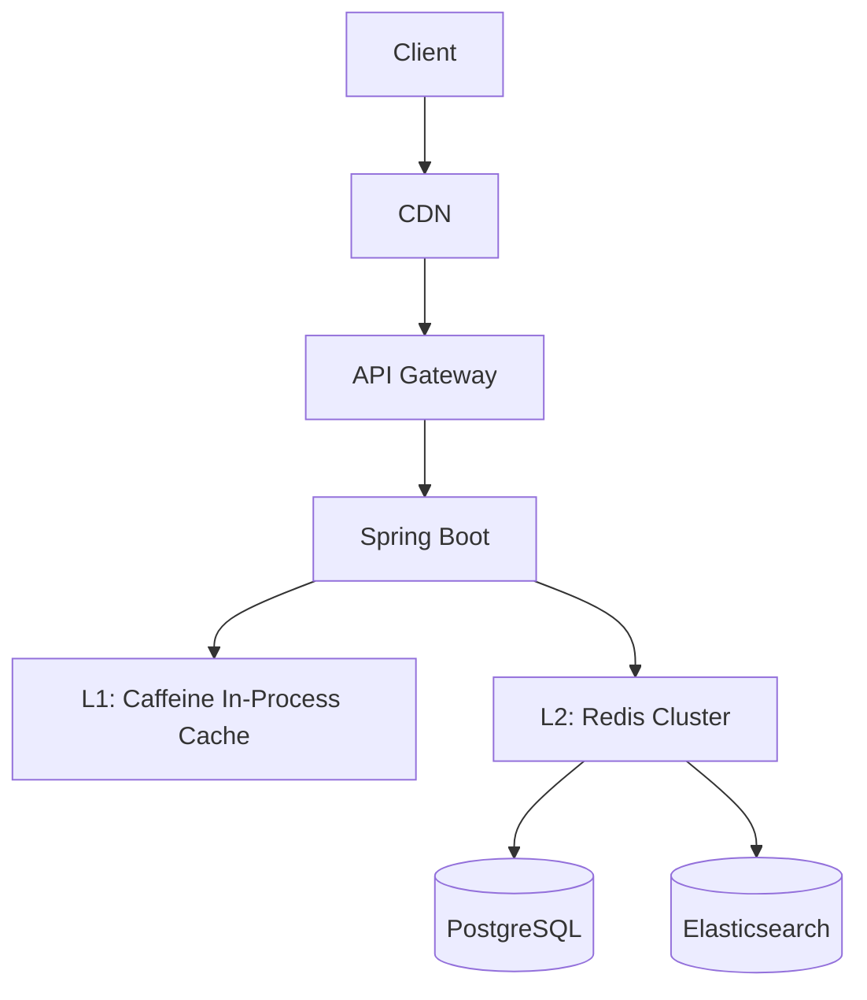

# 09 — Caching Strategy

## Objective

Define a multi-layer caching architecture that reduces database load, improves API response times, and handles tenant-specific cache isolation — while preventing stale data from causing correctness issues in a SaaS context.

---

## Caching Philosophy for Multi-Tenant SaaS

Caching in a multi-tenant system has a critical constraint: **tenant cache isolation**. A cache hit for Tenant A must never return Tenant B's data. Every cache key must be tenant-namespaced.

Second constraint: **tier-based cache fairness**. An Enterprise tenant with 100,000 contacts should not evict an SMB tenant's cached data from Redis due to memory pressure. Cache quotas per tenant tier prevent this.

Third constraint: **ABAC-aware caching**. A contact list cached for a Manager shows all contacts in their territory. The same endpoint called by a Rep shows only their own contacts. The cache key must encode the user's effective permission scope, not just the endpoint URL.

---

## Cache Layers



---

## Layer 1: CDN Cache (CloudFront / Fastly)

**What to cache at CDN**:
- Static frontend assets (JS, CSS, images): Cache indefinitely (versioned filenames)
- Public documentation and onboarding pages
- Tenant logo and branding assets (tenant-specific S3 path, cached by URL)

**What NOT to cache at CDN**:
- API responses containing CRM data (tenant-private data)
- Authenticated endpoints (JWT in header makes every request unique to CDN)

CDN caching of API responses is only valid for fully public, unauthenticated endpoints (e.g., public-facing forms, pricing pages).

---

## Layer 2: API Gateway Cache (Kong / AWS API GW)

**What to cache at API Gateway**:
- Tenant feature flags: `GET /v1/tenant/feature-flags` — changes rarely (on plan change), cacheable for 5 minutes
- Pipeline and stage definitions: `GET /v1/pipelines` — changes rarely, cacheable for 5 minutes
- Custom field definitions: `GET /v1/custom-fields` — changes rarely, cacheable for 10 minutes

**Cache key**: `tenant_id + endpoint path + query params`

**Invalidation**: When a tenant changes their pipeline configuration, publish a `cache_invalidation` event. An API Gateway cache invalidation consumer purges the relevant keys.

**Why at API Gateway level?** Reduces load on the application and database for highly-repeated configuration fetches. A sales team of 100 users all opening the CRM would otherwise trigger 100 identical `/custom-fields` queries in quick succession.

---

## Layer 3: Application In-Process Cache (Caffeine)

**Purpose**: Cache data that is needed multiple times within a single request — but too costly to fetch from Redis repeatedly.

**What to cache in Caffeine**:
- Current request's resolved permissions (role → permission set lookup)
- Custom field definitions for the current tenant (used to validate every write)
- Pipeline stage mappings (used to validate stage transitions)

**TTL**: Request-scoped (evicted after request completes) or 30-second TTL for frequently reused data within a JVM instance.

**Key**: `tenant_id:cache_type` — all Caffeine keys are tenant-scoped.

**Eviction**: LRU (Least Recently Used). Size-bounded (max 1,000 entries per instance to prevent memory bloat).

**Why not Redis for this?** A Redis call for permission lookup on every RBAC check adds 1-5ms network latency per check. With 10+ RBAC checks per request, this becomes 10-50ms overhead. Caffeine is in-process (nanosecond access).

---

## Layer 4: Redis Cluster Cache

This is the primary shared cache layer across all application instances.

### Cache Key Naming Convention

All Redis keys follow: `{tenant_id}:{resource_type}:{scope}:{identifier}:{version}`

Examples:
```
tenant:abc-123:contacts:list:owner=def-456:page=1:v2
tenant:abc-123:deal:id=xyz-789:v1
tenant:abc-123:pipeline:all:v3
tenant:abc-123:search:contacts:q=john:page=1:v1
tenant:abc-123:feature_flags:v1
tenant:abc-123:session:user=def-456
```

The `tenant_id` prefix in every key provides two benefits:
1. Namespace isolation — impossible to accidentally serve one tenant's data to another
2. Bulk eviction: `SCAN` + `DEL` with tenant prefix to invalidate all caches for a tenant (useful on tenant suspension or configuration change)

### What to Cache in Redis

| Cache Type | Key Pattern | TTL | Invalidation Trigger |
|---|---|---|---|
| Contact list page | `{tid}:contacts:list:{filters}:page={n}` | 60s | Any contact write for tenant |
| Contact detail | `{tid}:contact:id={id}` | 120s | Contact update |
| Deal list | `{tid}:deals:list:{filters}:page={n}` | 60s | Any deal write |
| Deal detail | `{tid}:deal:id={id}` | 120s | Deal update |
| Pipeline config | `{tid}:pipelines:all` | 5min | Pipeline configuration change |
| Custom field defs | `{tid}:field_defs:{entity_type}` | 5min | Field definition change |
| Feature flags | `{tid}:feature_flags` | 5min | Plan change event |
| User sessions | `{tid}:session:{user_id}` | 15min (sliding) | Logout, password change |
| Search results | `{tid}:search:{entity}:q={hash}:page={n}` | 30s | Short TTL — ES is near-realtime |
| Rate limit counters | `{tid}:ratelimit:{endpoint}` | 60s | Auto-expire |
| Idempotency keys | `{tid}:idem:{key}` | 24h | Auto-expire |

### Cache-Aside Pattern (Lazy Loading)

The application uses cache-aside (not write-through) for most data:
1. Check Redis for key
2. If MISS: fetch from PostgreSQL, write to Redis, return
3. If HIT: return cached value

**Why cache-aside over write-through?** Write-through updates cache on every write, regardless of whether the data is actually read. Cache-aside only populates cache for data that is actually requested. At 10,000 tenants, proactively caching everything would exhaust Redis memory.

### Cache Invalidation Strategy

**Event-driven invalidation** (preferred):
When a contact is updated, the write handler publishes a `cache_invalidation` event with the affected cache keys. A lightweight invalidation consumer deletes those keys from Redis.

**TTL-based expiry** (fallback):
Even without explicit invalidation, all cache entries have TTLs. Worst case: a user sees 60-second stale data on a contact list after another user updates a contact. For a CRM, this is acceptable.

**Write-path cache invalidation**:
On any write (PATCH /contacts/123), the application:
1. Deletes `{tid}:contact:id=123` from Redis immediately
2. Deletes all matching list cache keys via Redis SCAN with prefix `{tid}:contacts:list:*` (or uses a versioned cache key that naturally invalidates — faster than SCAN)

**Versioned cache keys** (preferred over SCAN for list invalidation):
Store a `{tid}:contacts:version` counter in Redis. All list cache keys include this version number. On any contact write, increment the version counter. All old list cache keys become unreachable (no explicit deletion needed — they expire on TTL).

```
Key: {tid}:contacts:list:v{version_counter}:{filters}:{page}
On contact write: INCR {tid}:contacts:version
Old keys: become unreachable, expire naturally
New requests: build key with new version number → MISS → fetch from DB
```

---

## ABAC-Aware Cache Keys

For endpoints where ABAC filters results differently per user, the cache key must encode the user's effective scope:

- Manager: can see all contacts in their territory → cache key includes `scope=territory:{region}`
- Rep: can see only their own contacts → cache key includes `scope=owner:{user_id}`

This prevents Manager's broad cache entry from being served to a Rep.

Implementation: the `CacheKeyResolver` computes the scope suffix based on the user's ABAC context before generating the cache key.

**Tradeoff**: Per-user caching reduces hit rate (each user has their own cache entries). For high-permission roles (Admin, Manager) this is acceptable. For Reps with large teams, consider pre-computing their filtered result set and caching it explicitly.

---

## Redis Configuration

**Eviction Policy**: `allkeys-lru` — when Redis memory is full, evict the least recently used key across all keyspaces. This naturally evicts stale, infrequently-accessed tenant caches.

**Memory quota per tenant tier**:
- Enforced via Redis keyspace notifications + application-level quota tracking
- Not a native Redis feature — requires application logic to enforce
- Alternative: use Redis `OBJECT IDLETIME` to age out large tenants' keys faster

**Persistence**:
- For session data and idempotency keys: RDB + AOF persistence (data must survive Redis restart)
- For pure cache data: AOF disabled (can be reconstructed from DB)
- Separate Redis instances for session vs cache to apply different persistence policies

---

## Cache Anti-Patterns to Avoid

| Anti-Pattern | Risk | Mitigation |
|---|---|---|
| Caching without tenant_id prefix | Cross-tenant data leakage | All keys MUST include tenant_id first |
| Caching ABAC-filtered results without scope in key | Rep sees Manager's data | Cache key includes effective permission scope |
| Infinite TTL on mutable data | Users see stale data forever | Max TTL 5 minutes for any mutable data |
| Thundering herd on cold start | All requests miss cache simultaneously, slam DB | Probabilistic early expiration + per-key mutex lock |
| Caching security-sensitive data too long | User suspended but session still cached | Short TTL (15 min) + active revocation on Redis session keys |

---

## Thundering Herd Protection

When a cache key expires, multiple concurrent requests may all miss and simultaneously query PostgreSQL.

**Mitigation: Cache Stampede Lock**:
1. First request to miss: acquire a per-key Redis lock (SETNX with 5s TTL)
2. Fetch from PostgreSQL
3. Write to cache, release lock
4. Other requests that missed: spin-wait (50ms intervals) for the lock to release, then read from cache

For non-critical cache keys: use **probabilistic early expiration** — before TTL expires, with a small probability, preemptively refresh the cache in the background.

---

## Interview Discussion Points

- **How do you prevent one tenant from filling Redis and evicting another tenant's data?** → Tenant-tier-based memory budgets enforced at application level. `allkeys-lru` eviction naturally ages out least-accessed entries. Redis Cluster sharding can segregate Enterprise tenant keyspaces.
- **Is 60-second stale data acceptable for a CRM?** → Yes for list views. No for the detail view immediately after the user saves a contact. Solution: on successful PUT/PATCH, delete the detail cache key immediately (synchronous invalidation), while list caches use short TTL.
- **How do you handle cache invalidation for complex ABAC-filtered lists?** → Versioned cache keys: increment version counter on any write, all old list keys become unreachable. Simpler than selective invalidation based on ABAC filters.
- **Why not use Spring's `@Cacheable` annotation?** → `@Cacheable` doesn't natively support tenant-aware cache keys or quota enforcement. A custom `TenantAwareCacheManager` wrapping Redis provides the tenant-namespacing logic in one place.
