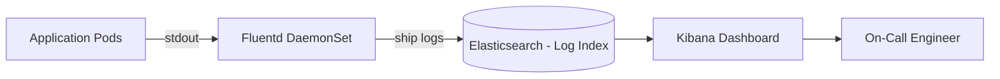

# 12 — Observability

## Objective

Define the complete observability strategy for the Multi-Tenant SaaS CRM: structured logging, distributed tracing, metrics collection, dashboards, alerting, SLI/SLO definition, and the tooling stack that makes the system debuggable in production.

---

## The Three Pillars + One

**Logs**: What happened, in human-readable form. Answer: "What error did this request produce?"

**Metrics**: What is the system doing, numerically over time. Answer: "Is error rate above threshold?"

**Traces**: How did a request travel through the system. Answer: "Which component caused the 400ms latency spike?"

**Profiles** (advanced): Where is CPU/memory time being spent? Answer: "Which method is causing memory pressure?"

For a multi-tenant SaaS CRM, all observability data must carry `tenant_id` and `user_id` context — otherwise debugging a complaint from Tenant ABC requires searching through logs from all 10,000 tenants.

---

## Structured Logging

### Log Format

All logs are JSON-structured (not free-text), enabling Elasticsearch/Kibana full-text search and field-level filtering.

```json
{
  "timestamp": "2026-05-18T10:30:45.123Z",
  "level": "ERROR",
  "service": "crm-api",
  "instance": "crm-api-pod-7f4d9",
  "version": "v2.14.3",
  "tenant_id": "abc-123",
  "user_id": "def-456",
  "correlation_id": "req-7f8a-9b23-cc45",
  "trace_id": "0af7651916cd43dd",
  "span_id": "b7ad6b7169203331",
  "http_method": "PATCH",
  "http_path": "/v1/contacts/xyz-789",
  "http_status": 500,
  "duration_ms": 342,
  "message": "Database connection timeout while updating contact",
  "exception": "org.postgresql.util.PSQLException: Connection refused",
  "stack_trace": "..."
}
```

**Mandatory context fields on every log line**:
- `correlation_id`: Set by API Gateway on request entry, propagated through all downstream calls
- `tenant_id`: Set when the tenant context is established (JWT validation)
- `trace_id` + `span_id`: OpenTelemetry trace context (W3C Trace Context header)

**Log levels**:
- `ERROR`: Something failed that requires investigation
- `WARN`: Unusual condition, not yet failing
- `INFO`: Normal business events (request processed, contact created)
- `DEBUG`: Detailed context for debugging (disabled in production by default, enable per-tenant or per-instance)

**Never log**:
- PII (contact email, name, phone) in log messages — use entity IDs only
- Passwords, tokens, secrets
- JSONB `before_state`/`after_state` (too large, contains sensitive data)

### Log Aggregation Stack



Fluentd (or Fluent Bit, lower resource) runs as a Kubernetes DaemonSet, tailing stdout from all pods, enriching with pod metadata, and shipping to Elasticsearch.

Log retention:
- Production error/warn logs: 90 days
- Production info logs: 30 days
- Debug logs: 7 days

---

## Distributed Tracing

### OpenTelemetry Integration

The application exports traces via OpenTelemetry (OTEL) SDK:
- **Automatic instrumentation**: Spring Boot OTEL starter instruments HTTP requests, JDBC queries, Kafka produce/consume, Redis calls automatically
- **Manual instrumentation**: Add custom spans for business-level operations (workflow evaluation, GDPR erasure orchestration)

### Trace Propagation

Correlation ID + OTEL TraceContext headers are propagated through:
- HTTP: `traceparent` header (W3C standard)
- Kafka messages: propagated in message headers
- Async tasks: TraceContext passed as argument, not thread-local

### Trace Sampling

- 100% sampling for: error traces, traces with P99 latency > threshold
- 5% sampling for: normal successful requests (reduce storage cost)
- 100% sampling for: specific `debug` tenants (enrolled for full tracing during support)

### Trace Backend

**Jaeger** (self-hosted) or **AWS X-Ray** (managed):
- Jaeger recommended for full control and no egress cost
- X-Ray recommended if fully on AWS and don't want to operate Jaeger
- Traces linked from error logs via `trace_id` → one-click from Kibana log to Jaeger trace

---

## Metrics Collection

### Prometheus + Micrometer

Spring Boot Actuator exposes Micrometer metrics at `/actuator/prometheus`. Prometheus scrapes every 15 seconds.

### Key Metrics to Instrument

#### Business Metrics (per-tenant)
```
crm_contacts_created_total{tenant_id, tier}
crm_deals_won_total{tenant_id, tier}
crm_deals_lost_total{tenant_id}
crm_workflow_executions_total{tenant_id, status}
crm_api_requests_total{tenant_id, endpoint, status_code}
```

#### Infrastructure Metrics
```
# HTTP
http_server_requests_seconds{method, uri, status, exception}

# Database
datasource_connections_active
datasource_connections_pending
db_query_duration_seconds{query_type, tenant_tier}

# Kafka
kafka_consumer_lag{consumer_group, topic, partition}
kafka_producer_record_send_total{topic}

# Redis
redis_cache_hits_total{cache_type, tenant_tier}
redis_cache_misses_total{cache_type, tenant_tier}
redis_memory_used_bytes

# JVM
jvm_memory_used_bytes{area}
jvm_gc_pause_seconds
jvm_threads_live
```

#### Tenant-Level Metrics
These are aggregated per tenant_tier to avoid high-cardinality label explosion (10,000 tenant_ids as labels would destroy Prometheus performance):
- Use label `tier` (STARTER, GROWTH, ENTERPRISE) not `tenant_id` in Prometheus labels
- Per-tenant metrics stored in a separate analytics store (ClickHouse or PostgreSQL) via batch aggregation

---

## Dashboards (Grafana)

### Dashboard 1: System Health Overview
- Current RPS (total, by tier)
- HTTP error rate (4xx, 5xx)
- P50/P95/P99 API latency
- Database connection pool utilization
- Kafka consumer lag (all groups)
- Redis memory utilization
- Active pod count

### Dashboard 2: Tenant Operations
- Tenant count by tier, by region
- New tenant onboarding rate
- Tenant API call distribution (who are the top callers?)
- Per-tier average response time

### Dashboard 3: Database Health
- Query throughput (reads/writes per second)
- Slow query log (queries > 1s)
- Replication lag (primary → replica)
- Index hit rate (should be > 99%)
- Table bloat (autovacuum effectiveness)

### Dashboard 4: Kafka Health
- Messages in/out per second per topic
- Consumer lag by consumer group (critical dashboard)
- DLT message count (alert if non-zero)
- Producer error rate

### Dashboard 5: Security
- Failed authentication attempts (per tenant, globally)
- Unusual access patterns (off-hours access, new IP)
- Rate limit violations by tenant
- GDPR erasure request completion rate

---

## SLI / SLO / SLA Definitions

### SLIs (Service Level Indicators)

Measurable signals of service quality:

| SLI | Measurement |
|---|---|
| Availability | `(total_requests - 5xx_requests) / total_requests` (rolling 30d) |
| Latency | `P99 of http_server_requests_seconds` for standard endpoints |
| Error Rate | `5xx_requests / total_requests` (rolling 1h) |
| Search Quality | `(successful_search_requests / total_search_requests)` |
| Audit Completeness | `(audit_events_written / domain_events_produced)` ratio |

### SLOs (Service Level Objectives)

| Tier | Availability SLO | P99 Latency SLO | Error Rate SLO |
|---|---|---|---|
| Starter | 99.9% (8.7h downtime/year) | < 500ms | < 0.5% |
| Growth | 99.95% (4.4h downtime/year) | < 300ms | < 0.1% |
| Enterprise | 99.99% (52min downtime/year) | < 200ms | < 0.01% |

### SLA (Service Level Agreement)

SLA is the contractual commitment to customers. It is typically set below the SLO to provide engineering headroom:
- Starter SLA: 99.9% (matches SLO)
- Growth SLA: 99.9% (SLO is 99.95% — 0.05% headroom)
- Enterprise SLA: 99.95% (SLO is 99.99% — significant headroom)

**SLA violation credits**: Enterprise customers receive 10% monthly credit per 0.01% availability below SLA.

### Error Budgets

Error budget = allowed downtime before SLO is violated.

```
Enterprise SLO: 99.99% → Error budget = 0.01% × 30 days = 4.3 minutes/month
Growth SLO: 99.95% → Error budget = 0.05% × 30 days = 21.6 minutes/month
```

Error budget consumption is tracked in real-time. When error budget is 50% consumed:
- Freeze non-critical deployments
- Focus engineering on reliability improvements

When error budget is 100% consumed:
- No new feature deployments until budget resets
- Mandatory reliability sprint

---

## Alerting Strategy

### Alert Routing

| Severity | Channel | Response Time |
|---|---|---|
| Critical (P0) | PagerDuty → on-call engineer, immediate | < 5 minutes |
| High (P1) | PagerDuty → on-call engineer, urgently | < 30 minutes |
| Medium (P2) | Slack #ops-alerts | < 4 hours |
| Low (P3) | Slack #ops-low-priority | Next business day |

### Alert Examples

```
P0: Error rate > 5% for Enterprise tier (sustained 5 minutes)
P0: Cross-tenant data access detected in audit log
P0: PostgreSQL primary unreachable
P0: All application instances unhealthy

P1: Kafka consumer lag > 10,000 for audit-writer
P1: P99 latency > 2000ms for > 5 minutes
P1: Redis cluster node failure

P2: Kafka consumer lag > 1,000 for any consumer group
P2: P99 latency > 500ms for > 10 minutes
P2: DLT messages written for any consumer group

P3: Cache miss rate > 50% (indicates cold cache or high invalidation)
P3: Slow query count > 10/minute
P3: GDPR erasure job delayed > 24 hours
```

### Alert Noise Reduction

- **Alert grouping**: Multiple related alerts grouped into a single PagerDuty incident
- **Alert suppression during deployment**: Silence P2/P3 alerts for 10 minutes after deployment (expected transient spikes)
- **Alert fatigue prevention**: Review and prune alerts quarterly. If an alert never fires in 6 months: raise threshold or remove. If an alert fires and nobody acts: it's either wrong threshold or wrong owner.

---

## Tenant-Level Observability

Enterprise tenants need visibility into their own system health:

**Tenant Dashboard** (in-product):
- API call volume and error rate (their own API keys)
- Workflow execution history and success rate
- Webhook delivery success rate and recent failures
- Audit log export (filtered to their tenant)

**Tenant Status Page**:
- Real-time service status
- Incident history
- Planned maintenance windows

**Tenant Usage Metrics** (for billing):
- Total contacts, deals, activities
- API calls this month
- Bulk import/export jobs
- Storage used

---

## Interview Discussion Points

- **How do you debug a tenant-specific performance issue?** → Filter traces and logs by `tenant_id`. Use Jaeger to find traces with high duration for that tenant. Identify the slow spans. Check if it's a slow DB query (look at JDBC spans with query text), a cache miss cascade, or a slow external webhook.
- **What is the risk of high-cardinality labels in Prometheus?** → If `tenant_id` is used as a Prometheus label, with 10,000 tenants each producing 100 time series, that's 1M time series. Prometheus performance degrades significantly. Solution: use `tier` as the label for Prometheus; store per-tenant metrics in a separate analytics store.
- **How do you know if your SLO is working?** → Error budget tracking: if the budget is consistently underconsumed, the SLO may be too loose. If it's regularly exhausted, too tight. Adjust annually based on actual performance data and customer expectations.
- **What is the difference between SLO and SLA?** → SLO is an internal engineering target. SLA is the external contractual commitment. SLO should be stricter than SLA to give engineers a warning before breaching customer contracts.
