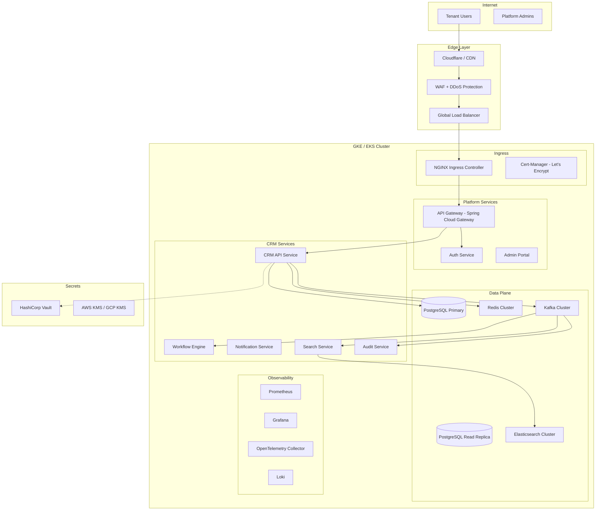
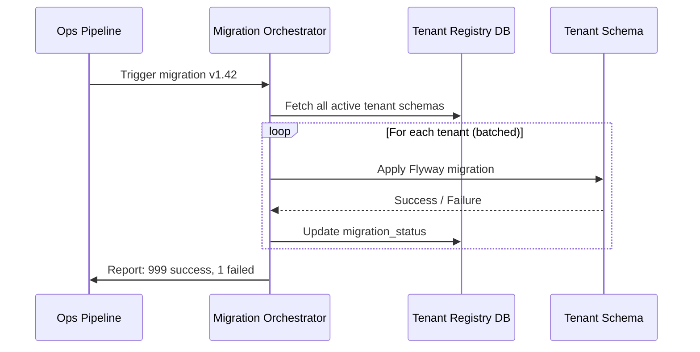

# 13 — Deployment Architecture

## Objective

Define the complete deployment topology for a Multi-Tenant SaaS CRM: containerization strategy, Kubernetes orchestration, CI/CD pipeline, environment separation, secrets management, and database migration coordination — all with tenant isolation as a first-class concern.

---

## Infrastructure Overview

---

## Kubernetes Architecture

### Namespace Strategy

Two options were considered for tenant isolation at the Kubernetes level:

| Strategy | Description | Pros | Cons |
|---|---|---|---|
| Single Namespace | All tenants share one namespace | Simple, low overhead | No isolation, blast radius is entire cluster |
| Per-Tenant Namespace | Each tenant gets a dedicated namespace | Strong isolation, per-tenant quotas | Namespace sprawl at scale (1000+ tenants) |
| Tier-Based Namespaces | Premium tenants get dedicated namespaces; standard share | Balanced isolation | More complex routing |

**Decision**: Tier-based namespaces. Enterprise tenants (dedicated namespace + node affinity), Standard tenants (shared namespace with NetworkPolicy isolation).

### Resource Quotas per Tenant Tier

Each tenant namespace is bounded by `ResourceQuota` and `LimitRange` objects:

- **Free tier**: 0.25 CPU, 256Mi RAM per pod, max 2 replicas
- **Standard tier**: 1 CPU, 1Gi RAM, max 5 replicas
- **Enterprise tier**: Dedicated node pool, custom quotas, guaranteed QoS class

### Network Policies

`NetworkPolicy` objects enforce that pods in Tenant A's namespace cannot communicate with Tenant B's. All inter-service communication is restricted to defined selectors. External egress is controlled per namespace.

### Pod Disruption Budgets

All stateful services maintain a `PodDisruptionBudget` to guarantee minimum availability during rolling updates. CRM API: `minAvailable: 2`, Auth Service: `minAvailable: 1`.

---

## CI/CD Pipeline

```mermaid
flowchart LR
    DEV[Developer Push] --> PR[Pull Request]
    PR --> CI[GitHub Actions CI]
    CI --> BUILD[Maven Build + Unit Tests]
    BUILD --> SAST[SAST - SonarQube]
    SAST --> DOCKER[Docker Build + Push to ECR/GCR]
    DOCKER --> STAGING[Deploy to Staging - Helm Upgrade]
    STAGING --> INT[Integration Tests + Contract Tests]
    INT --> APPROVE{Manual Approval Gate}
    APPROVE -- approved --> PROD[Deploy to Production]
    PROD --> CANARY[Canary - 5% Traffic]
    CANARY --> METRICS[Monitor Error Rate + Latency 30min]
    METRICS -- healthy --> ROLLOUT[Full Rollout]
    METRICS -- degraded --> ROLLBACK[Automatic Rollback]
```

### Pipeline Stages

| Stage | Tool | SLA | Failure Action |
|---|---|---|---|
| Build + Unit Test | Maven + JUnit | < 5 min | Block merge |
| Static Analysis | SonarQube | < 3 min | Block merge if quality gate fails |
| Container Build | Docker + ECR | < 3 min | Block deploy |
| Integration Tests | Testcontainers | < 10 min | Block deploy |
| Contract Tests | Pact | < 5 min | Block deploy |
| Staging Deploy | Helm | < 5 min | Alert team |
| Production Canary | Argo Rollouts | 30 min observation | Auto-rollback |

### Deployment Strategy: Canary over Blue-Green

**Blue-Green** was considered but rejected for the following reasons:
- Requires double the infrastructure cost during transitions
- Database schema changes complicate simultaneous dual-stack operation
- Better suited for stateless, single-tenant systems

**Canary** via Argo Rollouts is preferred:
- Gradual traffic shift (5% → 25% → 50% → 100%)
- Automated rollback based on Prometheus metric thresholds (error rate > 1%, p99 latency > 2x baseline)
- Supports per-tenant canary routing for enterprise clients who opt into early access

---

## Environment Separation

| Environment | Purpose | Tenant Data | Infra Size | Promotion Gate |
|---|---|---|---|---|
| Local Dev | Feature development | Synthetic only | Docker Compose | None |
| Preview | Per-PR ephemeral environment | Synthetic only | Minimal K8s | Auto on PR open |
| Staging | Integration + regression | Anonymized prod snapshot | 30% of prod | Manual approval |
| Production | Live tenants | Real | Full | Canary + approval |

**Preview Environments**: Each PR spins up an ephemeral environment using a unique subdomain (e.g., `pr-123.preview.crm.io`). Torn down automatically on PR merge or close. Powered by Helm and a namespace-per-PR strategy.

---

## Secrets Management

### HashiCorp Vault Integration

All secrets are stored in Vault, never in environment variables or Kubernetes Secrets in plaintext:

- **Database credentials**: Vault Dynamic Secrets with 1-hour TTL. Each service gets auto-rotated credentials.
- **Tenant encryption keys**: Per-tenant KEK (Key Encryption Key) stored in Vault, sealed by AWS KMS / GCP KMS.
- **JWT signing keys**: Stored in Vault, rotated every 30 days with overlap period.
- **Third-party API keys**: Per-tenant secrets stored under `secret/tenants/{tenant_id}/integrations/*`

The Vault Agent Sidecar or Vault Secrets Operator injects secrets into pod environment at startup. No application code reads Vault directly.

**Risk**: Vault becomes a single point of failure. Mitigated by: Vault HA with Raft storage, cross-region replication, and emergency break-glass procedures with KMS-backed recovery.

---

## Database Migration Strategy

Multi-tenant migrations are operationally complex. The strategy depends on the isolation model:

### Row-Level Security (RLS) Model

- Single schema, so a single Flyway migration applies to all tenants simultaneously.
- Risk: A bad migration affects all tenants at once.
- Mitigation: Schema changes are always backward-compatible (additive). No destructive changes in a single release. Two-phase: add column → deploy → backfill → remove old column in next release.

### Schema-Per-Tenant Model

- Flyway multi-schema support with a Tenant Migration Orchestrator service.
- On new tenant onboarding: run baseline migration against their schema.
- On platform upgrade: migrate schemas in batches (100 tenants/minute), monitoring for errors. Failed tenants are queued for retry.
- Enterprise tenants: optionally migrated during a maintenance window.

---

## Local Development Setup

Local dev uses Docker Compose with:
- PostgreSQL (single instance, shared schema with tenant switching via `SET app.current_tenant`)
- Redis single node
- Kafka single broker + Zookeeper
- Elasticsearch single node
- Vault dev mode (in-memory, unsealed automatically)
- All Spring Boot services via `./mvnw spring-boot:run` with `local` profile

Tenant seeding script provisions 3 test tenants with synthetic data. A local admin portal at `localhost:8080/admin` allows tenant switching for development.

---

## Risks and Bottlenecks

| Risk | Likelihood | Impact | Mitigation |
|---|---|---|---|
| Migration failure on large tenant | Medium | High | Dry-run migrations, rollback scripts |
| Vault outage blocks all service startups | Low | Critical | Vault HA, cached secrets with TTL |
| Canary rollout affects shared-tier tenants | Medium | Medium | Per-tier canary routing |
| Namespace sprawl with 10k tenants | High | Medium | Shared namespaces for standard tier |
| CI/CD pipeline becomes bottleneck | Medium | Medium | Parallelization, selective test execution |

---

## Interview Discussion Points

- Why canary over blue-green for a SaaS with shared database? Schema compatibility constraints.
- How do you migrate 10,000 tenant schemas without a multi-hour maintenance window?
- What is the blast radius of a bad Kubernetes node? How do PodDisruptionBudgets protect tenants?
- How does Vault dynamic secret rotation work without restarting pods?
- How would you implement zero-downtime database column renames across thousands of tenant schemas?
