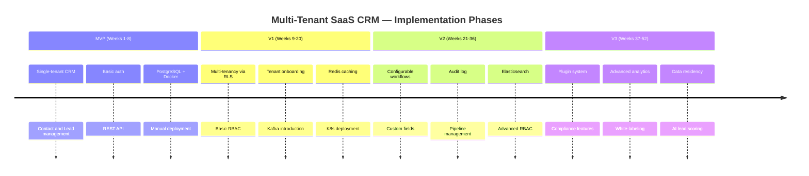
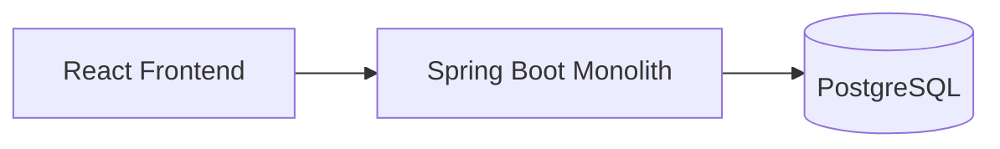
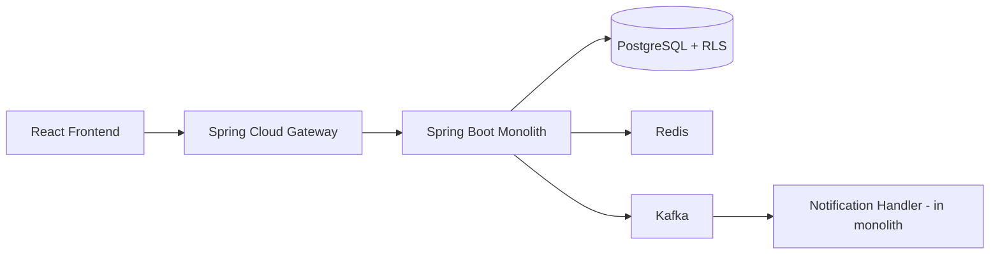
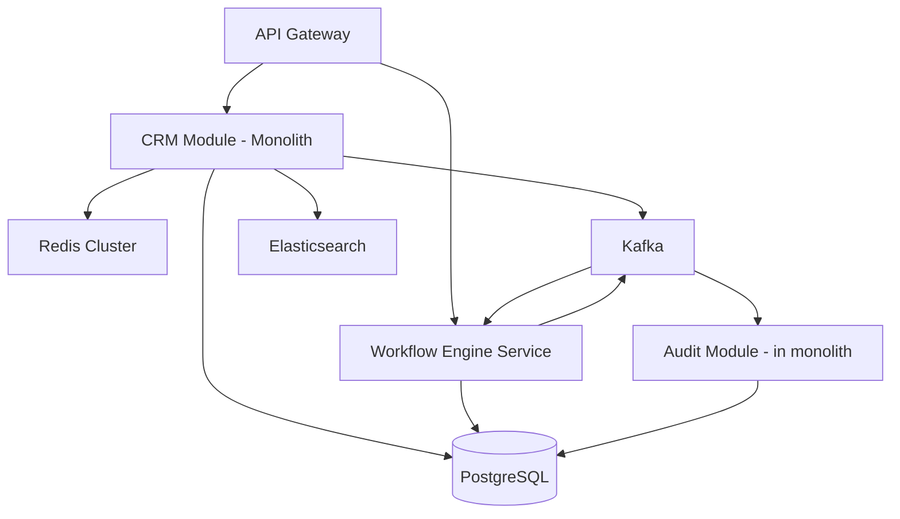
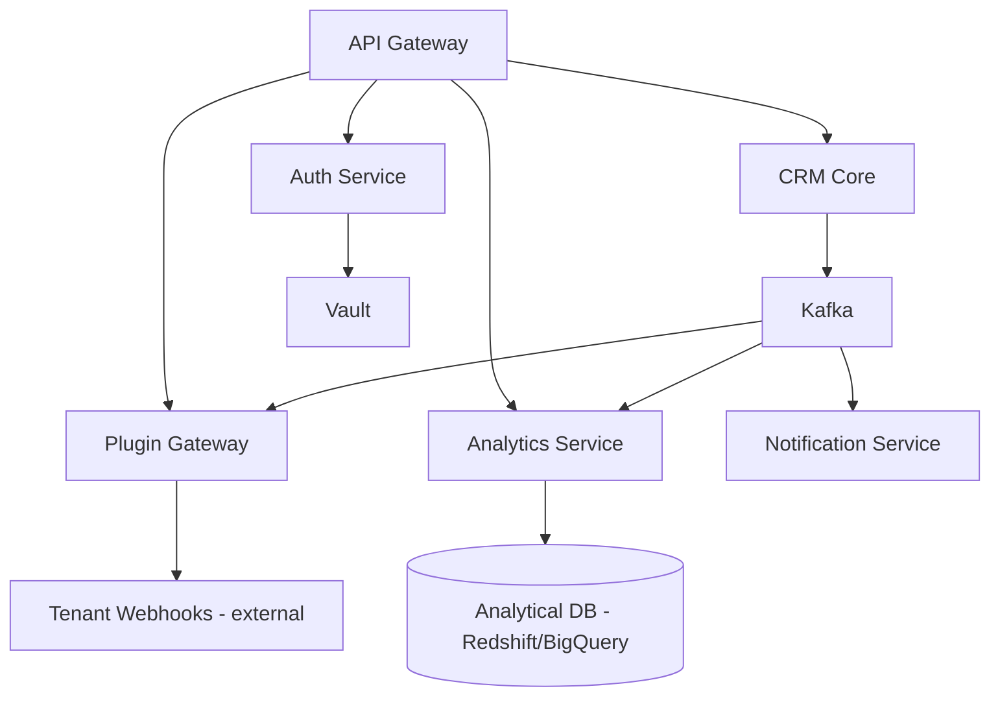

# 15 — Implementation Roadmap

## Objective

Define a phased, realistic roadmap from a working single-tenant MVP to a production-grade Multi-Tenant SaaS CRM with compliance, extensibility, and enterprise readiness. Each phase has explicit scope, architecture evolution, infrastructure evolution, risks, and team scaling considerations.

---

## Roadmap Overview

---

## Phase 0: MVP (Weeks 1–8)

### Goal

A working, single-tenant CRM that proves the core product value: managing contacts, leads, and deals. No multi-tenancy. Focus on correctness and developer velocity.

### Features

- Contact management: create, read, update, soft-delete contacts with basic fields (name, email, phone, company, notes)
- Lead management: leads with stage tracking (New → Contacted → Qualified → Converted/Lost)
- Deal management: deals linked to contacts with value, close date, and owner
- User authentication: JWT-based login, registration, password reset
- Basic dashboard: counts of contacts, open leads, deal pipeline value
- REST API with OpenAPI documentation

### Architecture

Single Spring Boot monolith. PostgreSQL (single instance). No Kafka, no Redis, no Elasticsearch.

All features live in one service. Domain packages: `contact`, `lead`, `deal`, `user`, `auth`. No distributed systems concerns.

### Infrastructure

- Local: Docker Compose
- Deployment: single VM or container on a managed service (Fly.io, Render, or ECS Fargate single task)
- Database: RDS PostgreSQL or managed instance
- No load balancer needed

### Team

1–2 backend engineers, 1 frontend engineer.

### Risks

| Risk | Mitigation |
|---|---|
| Scope creep into multi-tenancy too early | Explicitly defer; keep the schema tenant-naive |
| No test coverage | Write integration tests per feature as they are built |
| No observability | Add structured JSON logging from day one |

### Success Criteria

A real user (even internal) can manage 50 contacts and 10 deals end-to-end without errors.

---

## Phase 1: Multi-Tenancy + Basic RBAC (Weeks 9–20)

### Goal

Transform the single-tenant system into a multi-tenant platform. Add tenant onboarding, Row-Level Security, and a role-based access control foundation.

### Features

- Tenant registration and onboarding flow (self-service signup)
- Row-Level Security via PostgreSQL policies + `app.current_tenant` session variable
- Tenant isolation verified via automated integration tests
- Basic RBAC: platform roles (Admin, Manager, Sales Rep, Viewer)
- Per-tenant user management: invite users, assign roles, deactivate accounts
- Subdomain routing: `{tenant}.crm.io` → resolves to correct tenant context
- Soft tenant deletion with data archival
- Redis introduction: session caching, rate limiting per tenant
- Kafka introduction: async email notifications (welcome, password reset, deal assigned)

### Architecture Evolution

The monolith gains tenant-awareness without splitting into microservices. Key additions:
- `TenantContextFilter`: intercepts every request, extracts tenant from subdomain, sets `app.current_tenant`
- `TenantRepository`: manages tenant metadata (id, name, plan, status, created_at)
- `RBACService`: checks permissions on every protected endpoint
- Outbox pattern for Kafka events to guarantee delivery

### Infrastructure Evolution

- Kubernetes deployment (EKS or GKE)
- Horizontal Pod Autoscaler for the API service
- PgBouncer for connection pooling
- Redis single node (switch to cluster in V2)
- Kafka with 3 brokers, basic topic configuration

### Team

2–3 backend engineers, 1 DevOps/Platform engineer added.

### Risks

| Risk | Mitigation |
|---|---|
| RLS misconfiguration causing data leak | Automated cross-tenant isolation test suite |
| Tenant onboarding is manual and error-prone | Build onboarding as a state machine with rollback |
| RBAC logic scattered across controllers | Centralize in AOP interceptors or method-level annotations |

### Success Criteria

10 distinct tenants can operate simultaneously with zero data leakage. RBAC prevents unauthorized access to resources.

---

## Phase 2: Configurable Workflows, Custom Fields, Audit Log (Weeks 21–36)

### Goal

Deliver the features that make a CRM "sticky": per-tenant customization, workflow automation, and a complete audit trail. This is where the product becomes competitive.

### Features

- **Custom fields**: tenants can define additional fields on Contact, Lead, Deal (text, number, date, dropdown, multi-select). Stored as JSONB with tenant-defined schema metadata.
- **Pipeline management**: tenants define custom pipeline stages. Drag-and-drop ordering in the UI.
- **Configurable workflows**: event-driven rules ("when a deal moves to stage X, send an email and assign a task"). Workflow engine executes steps asynchronously via Kafka.
- **Audit log**: every create/update/delete event is captured with: who, what changed (field-level diff), when, from what IP. Retained for 2 years.
- **Advanced RBAC**: custom roles, scope-based permissions (Own / Team / All), field-level visibility rules.
- **Elasticsearch introduction**: full-text search across contacts, leads, deals, notes. Search-as-you-type.
- **Activity timeline**: unified feed of all interactions (emails, calls, notes, stage changes) per contact/deal.
- **Task management**: tasks linked to deals/contacts, assignable, with due dates and reminders.

### Architecture Evolution

The monolith is refactored into modules with clear boundaries. Consider extracting the Workflow Engine as the first separate service, since it has independent scaling needs (long-running jobs, heavy CPU for rule evaluation).

The Audit Module captures Kafka events and writes to an append-only audit table. A separate background job archives audit records older than 90 days to S3.

### Infrastructure Evolution

- Redis upgraded to cluster mode (3 shards)
- Elasticsearch: 3-node cluster, separate index per entity type
- Database read replicas for reporting queries
- Dedicated node pool for Workflow Engine (CPU-optimized)
- Vault integration for secrets management

### Team

3–4 backend engineers, 1 data/search engineer, 1 platform engineer, 1 frontend engineer.

### Risks

| Risk | Mitigation |
|---|---|
| JSONB custom fields cause slow queries | Indexing strategy: GIN indexes on JSONB, partial indexes for common field names |
| Workflow engine runaway loops | Max execution depth limit, circuit breaker on workflow step failures |
| Audit log table grows too large | Partitioning by month, archival job to S3, retention policies |
| Search index drift from DB | Kafka-driven sync, periodic reconciliation job |

### Success Criteria

A tenant can define a 5-step workflow that executes end-to-end within 10 seconds of the trigger event. Full-text search returns results within 500ms. Audit log captures 100% of mutations.

---

## Phase 3: Plugin System, Compliance, Advanced Analytics (Weeks 37–52)

### Goal

Enterprise readiness. This phase makes the CRM suitable for large enterprises with compliance requirements, extensibility needs, and advanced reporting demands.

### Features

- **Plugin/integration system**: webhook-based event subscriptions + OAuth2 app marketplace for third-party integrations (Slack, HubSpot, Salesforce, email providers)
- **GDPR compliance**: self-service data export, right to deletion, data residency configuration, consent management
- **White-labeling**: tenants can configure their own logo, color scheme, custom domain, and email sender identity
- **Advanced analytics**: pre-built reports (conversion rates, pipeline velocity, rep performance), scheduled report delivery
- **Data residency**: per-tenant region selection enforced at the database, cache, and event streaming layer
- **SSO / SAML 2.0**: enterprise tenants can connect their corporate identity provider
- **AI lead scoring**: rule-based scoring in this phase (ML model in Advanced Improvements)
- **SLA monitoring**: per-tenant uptime SLO tracking, incident history visible to tenant admins

### Architecture Evolution

Microservices extraction accelerates. Recommended extractions by this phase:
- **Auth Service** (handles SSO, JWT, session management — high change frequency)
- **Notification Service** (multi-channel: email, Slack, SMS — independent scaling)
- **Analytics Service** (read-heavy, separate read models via CQRS)
- **Plugin Gateway** (manages webhook delivery, OAuth app registry, rate limiting per app)

### Infrastructure Evolution

- Per-tenant namespace for enterprise tier in Kubernetes
- Regional deployments (US, EU, APAC) for data residency
- Managed Kafka (Confluent Cloud or MSK) replaces self-managed
- OLAP database for analytics (separate from operational PostgreSQL)
- HashiCorp Vault fully deployed in HA mode

### Team

5–8 engineers total: 2 platform, 3 product engineers, 1 security engineer, 1 data engineer.

### Risks

| Risk | Mitigation |
|---|---|
| Plugin webhooks cause outbound DDoS to tenant endpoints | Rate limiting, circuit breaker, exponential backoff |
| GDPR deletion crosses regional boundaries | Deletion orchestrator coordinates all regional stores |
| OLAP pipeline latency makes reports stale | Clear SLA: reports are T+1 hour; real-time dashboards use OLTP |
| SSO misconfiguration locks tenant out of their account | Break-glass admin override procedure, tested quarterly |

### Success Criteria

An enterprise tenant can configure SSO, request a GDPR export, define custom roles, and integrate with Slack — all without contacting the platform support team.

---

## Phase Comparison Table

| Dimension | MVP | V1 | V2 | V3 |
|---|---|---|---|---|
| Tenant model | Single tenant | RLS multi-tenant | RLS + schema option | Regional isolation |
| Architecture | Monolith | Modular monolith | Monolith + 1 service | Multiple services |
| Team size | 3 | 4-5 | 5-6 | 7-9 |
| Database | Single PG | PG + RLS + Redis | PG + replicas + ES | Regional PG clusters |
| Deployment | VM / Fargate | K8s | K8s + Vault | Multi-region K8s |
| Compliance | None | Basic RBAC | Audit log | GDPR, data residency |
| Extensibility | None | None | Custom fields, workflows | Plugins, SSO, white-label |
| Estimated cost (infra) | $50/month | $500/month | $2,000/month | $10,000+/month |
