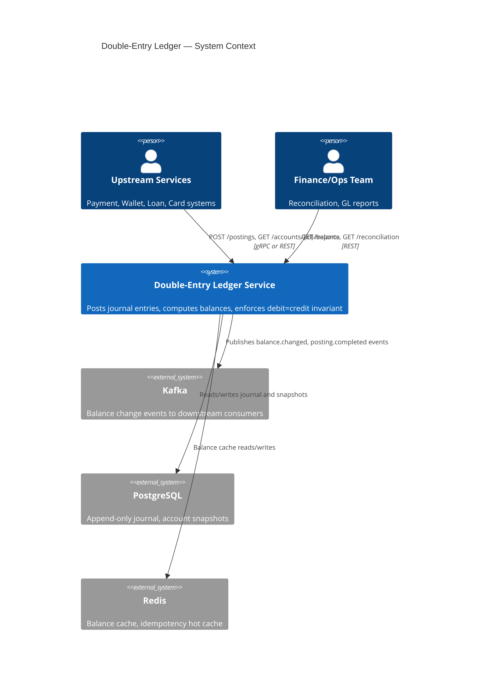
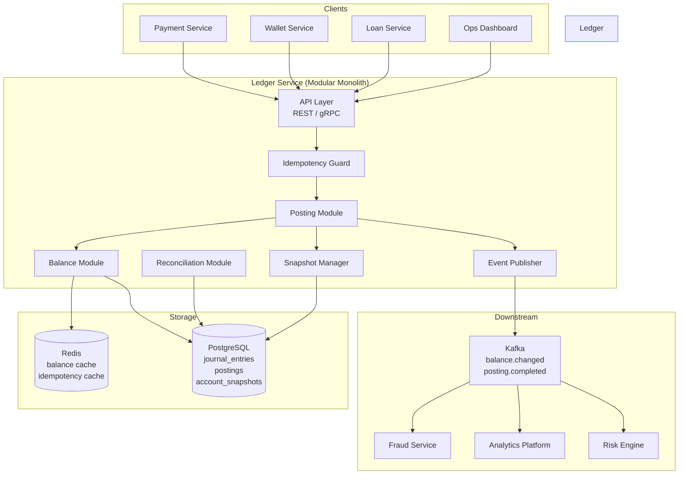
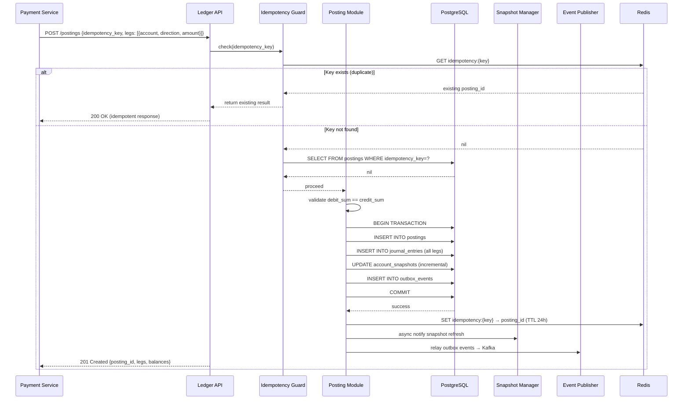
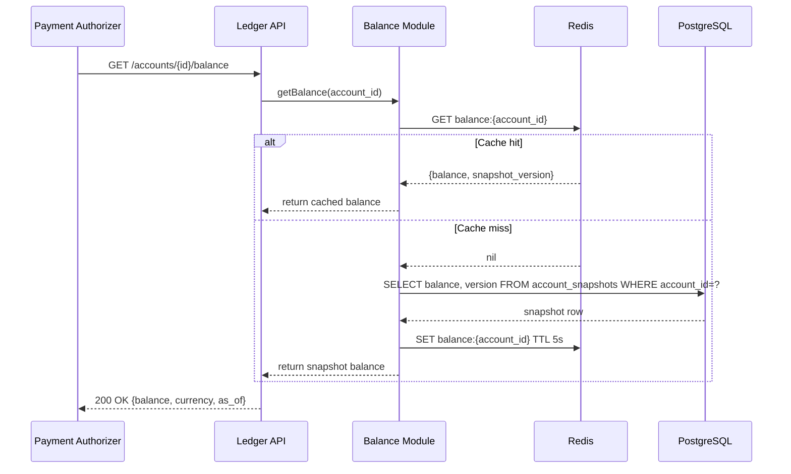
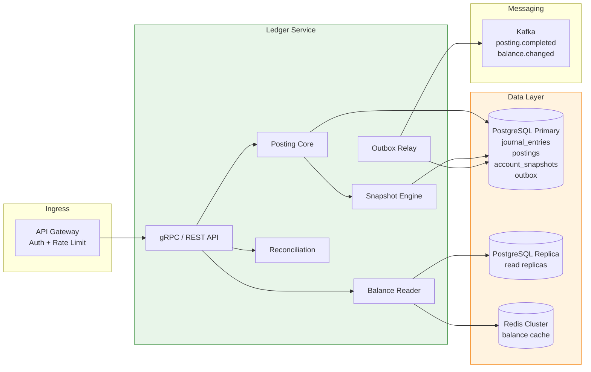

# 01 — High-Level Architecture: Double-Entry Ledger Service

---

## Objective

Define the architectural style, service boundaries, and component interaction model for the double-entry ledger service. Justify the chosen architecture and explain migration paths.

---

## Architecture Decision: Modular Monolith with DDD (Event-Sourced Core)

### Chosen Architecture: Modular Monolith + Event Sourcing on the Journal

The ledger is not a microservice. It is a **strongly consistent, domain-rich, financial core** that must guarantee atomic multi-leg postings. Distributing this across multiple services without a distributed transaction protocol (XA or Saga) introduces split-brain risk — a critical financial error.

**Why Modular Monolith?**

- Strong ACID guarantees across all legs of a posting — critical for debit=credit invariant
- Single database transaction scope for multi-leg atomicity
- Simpler operational model for a team that owns the financial source of truth
- The ledger is a bounded context unto itself — it does not need to reach into other domains
- Avoids 2PC (two-phase commit) complexity that distributed microservices would require

**Why Event Sourcing on the Journal Layer?**

The append-only journal IS event sourcing. Journal entries are the event log. Balances are projections derived from the log. This gives us:
- Complete audit trail by design
- Point-in-time replay for any account balance
- Ability to rebuild derived models (balance snapshots, GL views) from the journal
- Natural idempotency (entries are facts, not state mutations)

**When NOT to Use This Architecture**

- If the ledger must span multiple databases in different jurisdictions (use distributed saga with compensating entries instead)
- If posting throughput exceeds 50,000 TPS on a single PostgreSQL instance (then shard and accept eventual GL aggregation)
- If the team is large (10+ engineers) and needs independent deployability — then extract posting service and read service as separate deployments sharing one database

---

## System Context

---

## Component Architecture

---

## Module Responsibilities

| Module | Responsibility |
|---|---|
| **API Layer** | Input validation, auth, rate limiting, protocol translation |
| **Idempotency Guard** | Check Redis then DB for existing posting by idempotency_key; short-circuit duplicates |
| **Posting Module** | Enforce debit=credit, persist all legs atomically, trigger snapshot update |
| **Balance Module** | Serve balance from cache → snapshot → journal fallback chain |
| **Snapshot Manager** | Maintain materialized balance snapshot per account; update incrementally on each posting |
| **Reconciliation Module** | Accept external data, compare to journal, produce discrepancy report |
| **Event Publisher** | Publish posting events to Kafka via Outbox pattern (not direct Kafka write in transaction) |

---

## Request Flow: Posting a Transaction

---

## Balance Read Flow

---

## High-Level Architecture Diagram

---

## Architectural Tradeoffs

| Decision | Pro | Con |
|---|---|---|
| Modular monolith over microservices | Single DB transaction for multi-leg atomicity | Harder to scale individual modules independently |
| Event sourcing via journal | Complete audit trail, time-travel queries | Storage grows unboundedly; snapshot management adds complexity |
| Synchronous balance snapshot update | Balance always current after posting | Hot-account contention on snapshot row |
| Redis balance cache | Sub-5ms reads for payment authorization | Cache invalidation complexity; brief stale window |
| Outbox for Kafka publishing | Exactly-once delivery guarantee | Extra table, polling relay job required |

---

## Migration Path: Monolith → Microservices (if scale demands)

1. **Phase 1 (current):** Single deployable JAR, single PostgreSQL, single Redis
2. **Phase 2:** Extract read service (Balance Module) to a separate deployment, reading from PostgreSQL replica — still same DB
3. **Phase 3:** Separate posting writes and balance reads at the network boundary — CQRS split
4. **Phase 4:** Shard journal by account_id range across multiple PostgreSQL instances — GL aggregation becomes eventually consistent across shards
5. **Phase 5:** Extract reconciliation and GL reporting to separate service with its own read-optimized data store (ClickHouse or Redshift for large aggregations)

---

## Interview Discussion Points

- **Why not use a distributed ledger (blockchain)?** Distributed consensus is 100–1000x slower than ACID PostgreSQL for the same durability. Enterprise finance does not need trustless consensus — it needs correctness and auditability
- **What would break first?** The `account_snapshots` row for a hot account becomes a lock contention point at high posting frequency. Mitigation: snapshot update via `FOR UPDATE SKIP LOCKED` with a queue, or batch snapshot updates
- **How do you handle cross-service postings?** The Saga pattern — each service posts its own ledger entries; if downstream fails, a compensating reversal entry is posted, not a DB rollback
- **What is the outbox pattern here?** INSERT into `outbox_events` table in the same DB transaction as the journal entries. A separate relay job reads the outbox and publishes to Kafka. Guarantees Kafka gets the event if and only if the DB commit succeeded
