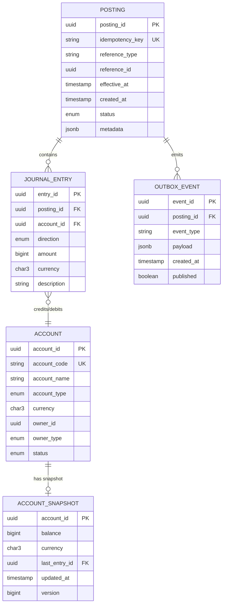

# 02 — Domain Modeling: Double-Entry Ledger Service

---

## Objective

Define the core domain model for the double-entry ledger using DDD aggregates, entities, value objects, and domain events. Establish the language shared between engineers and accountants.

---

## Ubiquitous Language

| Term | Definition |
|---|---|
| **Journal Entry** | A single line item in the ledger: one account, one direction (DEBIT or CREDIT), one amount |
| **Posting** | A group of journal entries that form one atomic financial event; the posting is the unit of work |
| **Account** | A named bucket that tracks money flowing in/out; has a type (ASSET, LIABILITY, etc.) |
| **Balance** | Net position of an account derived from all its journal entries |
| **Idempotency Key** | Caller-supplied unique key that prevents the same financial event from being posted twice |
| **Direction** | DEBIT or CREDIT — relative to the account's normal balance side |
| **Normal Balance** | The direction that increases an account: ASSET/EXPENSE increase with DEBIT; LIABILITY/EQUITY/INCOME increase with CREDIT |
| **Posting Invariant** | sum(debit_amounts) == sum(credit_amounts) for any posting |
| **Snapshot** | Materialized running balance for an account up to a specific journal sequence number |
| **Reversal** | A compensating posting that nullifies a previous posting (not a DELETE) |
| **Period Close** | Administrative lock preventing backdated entries beyond a cutoff date |

---

## Aggregate Design

### Aggregate 1: `Posting` (Root)

The `Posting` aggregate is the write-side unit of consistency. It owns all journal entry legs and enforces the debit=credit invariant before persisting.

```
Posting (Aggregate Root)
├── posting_id: UUID (identity)
├── idempotency_key: String (unique, from caller)
├── reference_type: String (e.g., "PAYMENT", "REVERSAL", "FEE")
├── reference_id: UUID (foreign key into calling domain, e.g., payment_id)
├── effective_at: Instant (business date of the posting, may differ from created_at)
├── created_at: Instant
├── status: PENDING | POSTED | REVERSED
├── metadata: Map<String, String>
└── legs: List<JournalEntry>
    └── JournalEntry (Entity, owned by Posting)
        ├── entry_id: UUID
        ├── account_id: UUID (ref to Account)
        ├── direction: DEBIT | CREDIT
        ├── amount: Money (Value Object)
        └── description: String

Invariants enforced by Posting aggregate:
  1. legs.size >= 2
  2. sum(legs where direction=DEBIT, amount) == sum(legs where direction=CREDIT, amount)
  3. Each leg has amount > 0
  4. All legs in same currency (or FX legs included for multi-currency)
```

**Domain Events emitted by Posting:**
- `PostingCreated { posting_id, legs, effective_at }`
- `PostingReversed { posting_id, reversal_posting_id }`

---

### Aggregate 2: `Account` (Root)

The `Account` aggregate governs account lifecycle and metadata. It does NOT own the journal entries — those are owned by `Posting`. The account is the reference entity that journal entries point to.

```
Account (Aggregate Root)
├── account_id: UUID (identity)
├── account_code: String (human-readable, e.g., "1001-CHECKING-USD")
├── account_name: String
├── account_type: ASSET | LIABILITY | EQUITY | INCOME | EXPENSE
├── normal_balance: DEBIT | CREDIT (derived from account_type)
├── currency: CurrencyCode (ISO 4217)
├── owner_id: UUID (references user, org, or internal cost center)
├── owner_type: USER | ORGANIZATION | INTERNAL
├── status: ACTIVE | FROZEN | CLOSED
├── created_at: Instant
└── closed_at: Instant (nullable)

Invariants:
  1. Closed accounts cannot receive new journal entries
  2. Frozen accounts cannot receive new journal entries (read-only)
  3. Account currency must match journal entry currency (unless multi-currency explicitly enabled)
```

---

### Aggregate 3: `AccountSnapshot` (Read-side Projection)

Not a true DDD aggregate — it is a materialized projection maintained for read performance. It is eventually consistent with the journal but must converge within one posting cycle.

```
AccountSnapshot
├── account_id: UUID
├── balance: Money
├── normal_balance_direction: DEBIT | CREDIT
├── last_entry_id: UUID (watermark — last journal entry included)
├── last_posting_id: UUID
├── updated_at: Instant
└── version: Long (optimistic lock)
```

---

## Value Objects

### `Money`

```
Money
├── amount: Long (integer, in smallest currency unit — cents, paise)
├── currency: CurrencyCode (ISO 4217 3-letter code)

Behaviour:
  - add(Money other): requires same currency
  - negate(): returns negated amount
  - isZero(): amount == 0
  - isPositive(): amount > 0
```

### `CurrencyCode`

```
CurrencyCode
├── code: String (e.g., "USD", "INR", "EUR")
- Validated against ISO 4217 at construction
- Immutable value object
```

### `PostingInvariantResult`

```
PostingInvariantResult
├── valid: boolean
├── debitSum: Money
├── creditSum: Money
├── imbalance: Money (debitSum - creditSum, should be zero)
```

---

## Domain Services

### `PostingValidator`

- Checks debit=credit invariant across all legs
- Validates all referenced `account_id`s exist and are ACTIVE
- Validates currency consistency (or presence of FX conversion entries)
- Returns `PostingInvariantResult`

### `BalanceCalculator`

- Strategy pattern: snapshot-first, then aggregate remaining entries since snapshot watermark
- `calculateBalance(accountId, asOf: Instant)` — point-in-time query
- `calculateCurrentBalance(accountId)` — snapshot + delta since snapshot

### `IdempotencyService`

- `checkAndReserve(idempotencyKey)` — atomic check-and-set, returns existing posting if found
- `confirm(idempotencyKey, postingId)` — marks the key as settled after commit

---

## Domain Events

| Event | Trigger | Consumers |
|---|---|---|
| `PostingCreated` | Posting committed to journal | Fraud, Analytics, Risk, Snapshot updater |
| `PostingReversed` | Reversal posting committed | Downstream systems that acted on original posting |
| `AccountFrozen` | Admin freezes account | Prevents new postings |
| `AccountClosed` | Account closed | Hard stop on new postings |
| `BalanceThresholdBreached` | Balance crosses configured threshold | Risk alerts |

---

## Entity Relationship Overview



---

## Bounded Context Interactions

The Ledger is its own bounded context. It integrates with upstream domains only through its API — no shared database tables.

```
Payment Domain          →  Ledger (POST /postings with reference_type=PAYMENT)
Wallet Domain           →  Ledger (POST /postings with reference_type=TRANSFER)
Loan Domain             →  Ledger (POST /postings with reference_type=DISBURSEMENT, EMI)
Card Authorization      →  Ledger (GET /accounts/{id}/balance for pre-auth check)
Fraud Domain            ←  Kafka posting.completed event (read-only)
Analytics               ←  Kafka posting.completed event (read-only)
```

**Anti-Corruption Layer:** Each upstream domain maps its business language to ledger account codes and posting structures in its own ACL. The ledger speaks only accounting language — it does not know what a "payment" or "loan disbursement" is.

---

## Interview Discussion Points

- **Why is Posting the aggregate root, not Account?** Journal entries must be posted atomically. The posting is the unit of consistency. Accounts are referenced entities — they don't own their entries; postings do
- **Why not store balance in the Account aggregate?** Balance is a derived fact, not a stored truth. Storing it in the Account aggregate creates an update-on-every-posting contention hotspot. Snapshot table separates this concern
- **How do you model a reversal?** A reversal is a new Posting with mirrored legs (DEBIT becomes CREDIT and vice versa) and a `reversal_of` reference to the original posting_id. The original posting is never modified
- **What is the normal balance direction used for?** Presentation logic. An ASSET account's balance increases with DEBITs — so when you display the balance, a DEBIT-side surplus is positive. For LIABILITY accounts, CREDITs are positive. The accounting sign convention is handled in the Balance Calculator, not in raw journal entries
- **How do you handle FX multi-currency postings?** Each leg can have its own currency, but the posting invariant is checked per currency — debit INR = credit INR, debit USD = credit USD. FX conversion is modeled as a 4-leg posting: debit source account (INR), credit FX clearing (INR), debit FX clearing (USD), credit destination account (USD)
