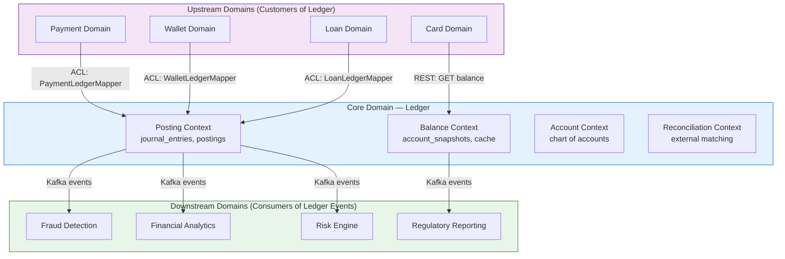

# 03 — DDD Boundaries: Double-Entry Ledger Service

---

## Objective

Define bounded contexts, context mapping, module boundaries within the ledger service, and the anti-corruption layers that isolate ledger semantics from upstream domain language.

---

## Bounded Context Map



---

## Context Relationships

| Relationship | Type | Description |
|---|---|---|
| Payment → Ledger | Customer/Supplier | Payment is a customer; Ledger is the upstream supplier with a stable API |
| Wallet → Ledger | Customer/Supplier | Same pattern — Wallet calls Ledger's API |
| Loan → Ledger | Customer/Supplier | Loan posts disbursement/EMI entries to Ledger |
| Card → Ledger | Customer/Supplier (read-only) | Card reads balance for pre-authorization |
| Ledger → Fraud | Publisher/Subscriber | Ledger publishes, Fraud subscribes — no coupling back |
| Ledger → Analytics | Published Language (Kafka) | Posting events are stable published contracts |
| Ledger → Reporting | Conformist (partial) | Reporting adapts to Ledger's event schema |

---

## Internal Module Boundaries

Within the ledger monolith, strict package-level boundaries prevent cross-module coupling.

```
com.fintech.ledger
├── posting/                    ← Posting Bounded Context
│   ├── domain/
│   │   ├── Posting.java
│   │   ├── JournalEntry.java
│   │   ├── PostingStatus.java
│   │   └── events/
│   │       └── PostingCreatedEvent.java
│   ├── application/
│   │   ├── PostingService.java
│   │   └── IdempotencyService.java
│   ├── infrastructure/
│   │   ├── PostingRepository.java
│   │   └── JournalEntryRepository.java
│   └── api/
│       └── PostingController.java
│
├── balance/                    ← Balance Bounded Context
│   ├── domain/
│   │   ├── AccountSnapshot.java
│   │   └── BalanceCalculator.java
│   ├── application/
│   │   └── BalanceQueryService.java
│   ├── infrastructure/
│   │   ├── SnapshotRepository.java
│   │   └── BalanceCacheAdapter.java
│   └── api/
│       └── BalanceController.java
│
├── account/                    ← Account Bounded Context
│   ├── domain/
│   │   ├── Account.java
│   │   ├── AccountType.java
│   │   └── AccountStatus.java
│   ├── application/
│   │   └── AccountService.java
│   ├── infrastructure/
│   │   └── AccountRepository.java
│   └── api/
│       └── AccountController.java
│
├── reconciliation/             ← Reconciliation Bounded Context
│   ├── domain/
│   │   ├── ReconciliationRun.java
│   │   └── Discrepancy.java
│   ├── application/
│   │   └── ReconciliationService.java
│   └── api/
│       └── ReconciliationController.java
│
└── shared/                     ← Shared Kernel (minimal)
    ├── Money.java
    ├── CurrencyCode.java
    └── IdempotencyKey.java
```

**Module Rules:**
- `posting` may call `account` (to validate account existence) — one-way dependency
- `balance` may call `posting` (to compute delta from watermark) — one-way dependency
- `reconciliation` calls `balance` and `posting` — read-only, no writes
- NO module calls `posting` directly except through its application service — never bypass to repository
- `shared` kernel has zero dependencies on other modules

---

## Anti-Corruption Layers

### PaymentLedgerMapper (in Payment Domain, not Ledger)

The Payment domain owns the ACL. It translates payment business language into ledger primitives.

```
PaymentLedgerMapper.toPostingRequest(Payment payment):
    → PostingRequest {
        idempotencyKey: "payment:" + payment.paymentId,
        referenceType: "PAYMENT",
        referenceId: payment.paymentId,
        effectiveAt: payment.settledAt,
        legs: [
            { accountId: payment.sourceAccount, direction: CREDIT, amount: payment.amount },
            { accountId: payment.destinationAccount, direction: DEBIT, amount: payment.amount }
        ]
    }
```

The Ledger service never sees the word "payment" internally — it only sees accounts, directions, and amounts.

### LoanLedgerMapper (in Loan Domain)

```
LoanLedgerMapper.toDisbursementPosting(LoanDisbursement disbursement):
    → PostingRequest {
        idempotencyKey: "disbursement:" + disbursement.disbursementId,
        referenceType: "LOAN_DISBURSEMENT",
        legs: [
            { accountId: LOAN_RECEIVABLE_ACCOUNT, direction: DEBIT, amount: principal },
            { accountId: BORROWER_WALLET_ACCOUNT, direction: CREDIT, amount: principal }
        ]
    }
```

---

## Published Language: Kafka Event Schema

The Ledger publishes stable event contracts that downstream consumers depend on. Schema versioning is mandatory.

```json
// posting.completed event (v1)
{
  "schema_version": "1.0",
  "event_id": "uuid",
  "event_type": "posting.completed",
  "posting_id": "uuid",
  "idempotency_key": "payment:abc123",
  "reference_type": "PAYMENT",
  "reference_id": "uuid",
  "effective_at": "2024-01-15T10:30:00Z",
  "legs": [
    {
      "entry_id": "uuid",
      "account_id": "uuid",
      "direction": "DEBIT",
      "amount": 10000,
      "currency": "INR"
    },
    {
      "entry_id": "uuid",
      "account_id": "uuid",
      "direction": "CREDIT",
      "amount": 10000,
      "currency": "INR"
    }
  ]
}
```

**Schema Evolution Rules:**
- New optional fields: backward compatible — add freely
- Remove fields: never; deprecate with a version bump
- Change field type: version bump with parallel publishing period
- Downstream consumers must tolerate unknown fields (ignore-unknown policy)

---

## Shared Kernel

The `Money` and `CurrencyCode` value objects may be published as a shared library used by both the Ledger and its ACL mappers in upstream domains. This is the ONLY intentional coupling allowed across bounded contexts.

| Shared Artifact | Consumers | Risk |
|---|---|---|
| `Money` value object | Ledger, Payment, Loan, Wallet ACLs | Version drift if Ledger changes Money representation |
| `CurrencyCode` enum | All financial domains | Stable — ISO 4217 changes rarely |
| Kafka event schema (published language) | Fraud, Analytics, Risk, Reporting | Consumer breakage on incompatible schema change |

---

## Bounded Context Isolation Guarantees

| Rule | Enforcement |
|---|---|
| No shared database tables between Ledger and upstream domains | Separate DB schemas or separate databases |
| No direct method calls from upstream to Ledger internals | API only (REST or gRPC) |
| No shared JPA entities across bounded contexts | Each context owns its own entity classes |
| Ledger never queries Payment/Wallet/Loan databases | All data flows into Ledger via API calls |
| Kafka consumers never write back to Ledger | Ledger is write-authoritative; downstream is read-only |

---

## Interview Discussion Points

- **Why does the Ledger not know about payments or loans?** The ledger models accounting concepts — accounts, debits, credits. Domain-specific language (payment, disbursement) lives in the upstream domain's ACL. This lets the ledger be reused across any financial product without modification
- **How do you handle the shared Money value object?** Options: (1) publish as a versioned library artifact, (2) each domain has its own Money class and maps at the boundary, (3) use primitive types in the API contract and instantiate Money internally. Option 2 is safest for long-term independence
- **What happens when Kafka schema changes?** Use a schema registry (Confluent or AWS Glue). Producers must register schema before publishing. Consumers specify compatibility mode (BACKWARD, FORWARD, FULL). Breaking changes require explicit version negotiation
- **Why separate reconciliation as its own context?** Reconciliation reads from the ledger but also ingests external data (bank files, processor reports). Keeping it isolated prevents reconciliation logic from polluting the core posting path
