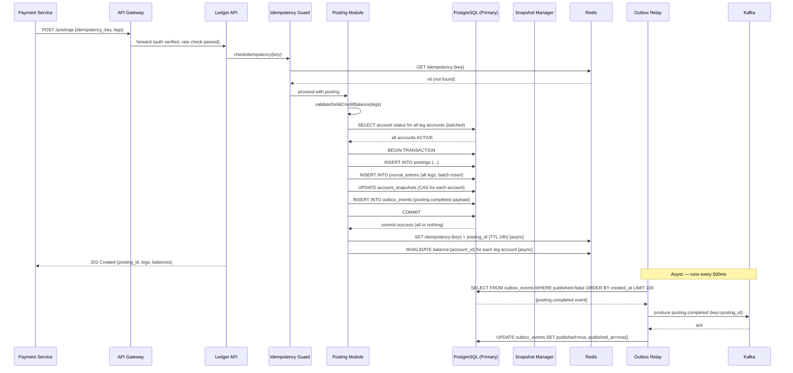
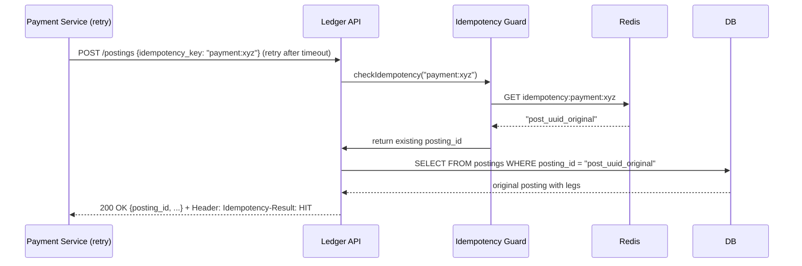
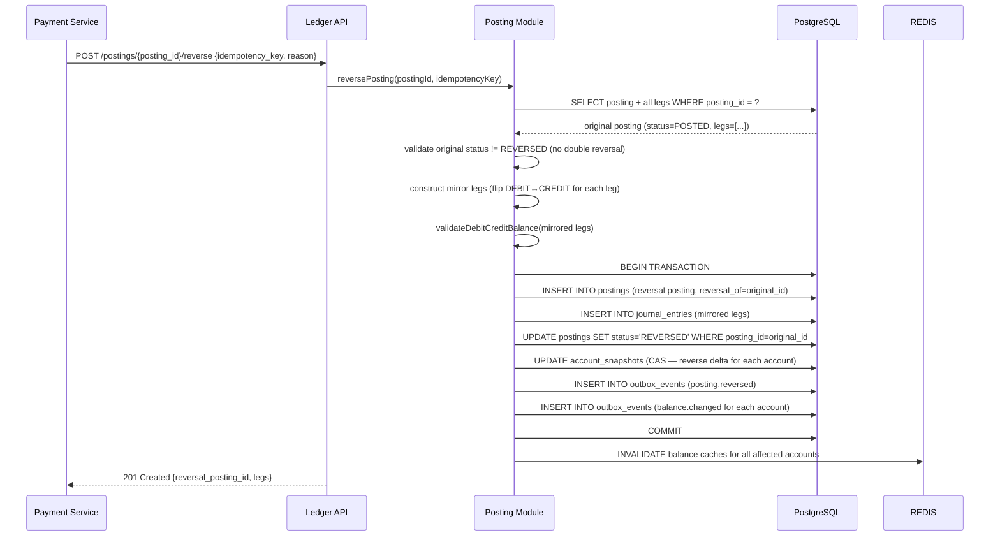
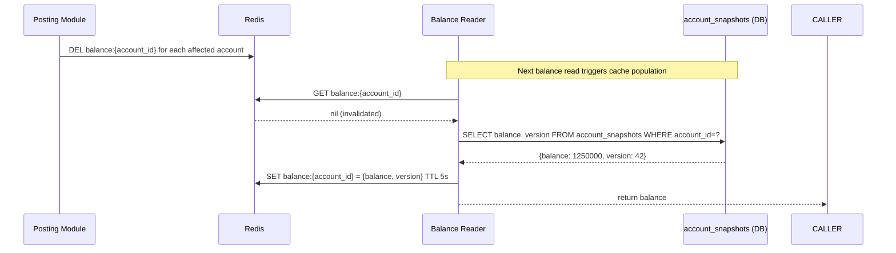
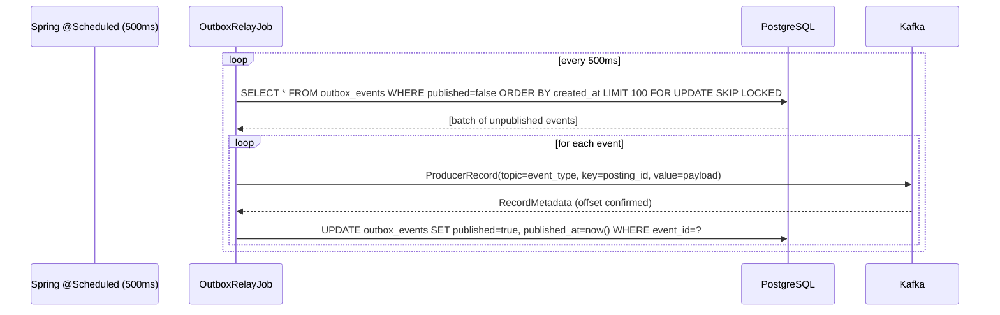
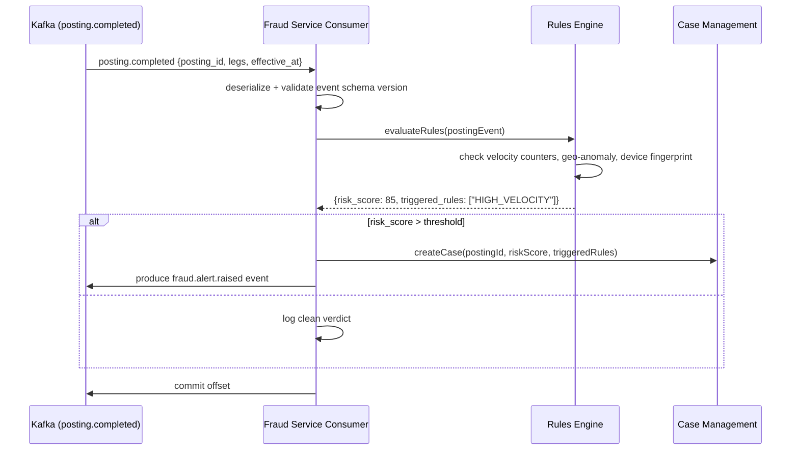
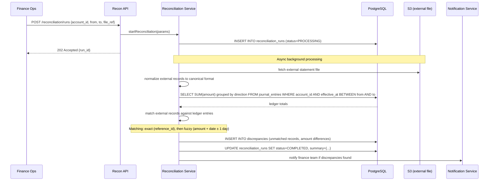

# 06 — Event Flow: Double-Entry Ledger Service

---

## Objective

Document the complete event flows for posting creation, reversal, balance updates, outbox relay, and downstream event consumption. Includes sequence diagrams, timing parameters, and failure paths.

---

## Event Flows Overview

| Flow | Trigger | Key Events |
|---|---|---|
| 1. Normal Posting | Caller POST /postings | PostingCreated → balance.changed |
| 2. Idempotent Repeat | Duplicate POST | No new events — returns cached response |
| 3. Posting Reversal | POST /postings/{id}/reverse | PostingReversed → balance.changed (x2) |
| 4. Account Freeze | Admin PATCH /accounts/{id}/status | AccountFrozen |
| 5. Outbox Relay | Background scheduler (every 500ms) | outbox → Kafka |
| 6. Balance Cache Refresh | Post-posting invalidation | Async snapshot + cache update |
| 7. Reconciliation Run | Admin trigger | ReconciliationCompleted, DiscrepancyFound |

---

## Flow 1: Normal Posting

**Timing Budget:**
| Step | Target Duration |
|---|---|
| Idempotency Redis check | < 2ms |
| Account status DB read | < 5ms |
| DB transaction (2-leg posting) | < 15ms |
| Redis async writes | < 2ms (fire-and-forget) |
| Total API response | < 30ms P50, < 100ms P99 |
| Outbox → Kafka | < 1 second end-to-end |

---

## Flow 2: Idempotent Repeat (Duplicate Request)

**No new DB writes, no new journal entries, no Kafka events. Pure cache-hit path.**

---

## Flow 3: Posting Reversal

**Key constraint:** An already-reversed posting cannot be reversed again. Enforced by checking `status != REVERSED` before proceeding.

---

## Flow 4: Balance Cache Refresh

This flow runs asynchronously after every successful posting.

**Trade-off:** Cache invalidation (delete on write) vs. cache update (write-through). Invalidation is chosen because:
- Snapshot update and cache update cannot be atomic (different stores)
- A brief stale window is preferable to serving a stale balance that survived a failed snapshot update
- 5-second TTL ensures maximum staleness is bounded even if invalidation is missed

---

## Flow 5: Outbox Relay (Background Job)

**`FOR UPDATE SKIP LOCKED`:** Allows multiple relay instances without double-publishing. Instance A locks row 1, instance B skips row 1 and processes row 2. Safe for horizontal scaling of the relay.

**Kafka producer config:**
- `acks=all` — all ISR replicas must acknowledge
- `enable.idempotence=true` — exactly-once producer semantics
- `retries=Integer.MAX_VALUE` — retry until delivered
- `max.in.flight.requests.per.connection=5` — ordering within partition maintained

---

## Flow 6: Downstream Consumer — Fraud Detection

**Consumer group:** `fraud-ledger-consumer`
- Separate consumer group per downstream domain
- Each consumer group maintains its own offset — fraud service failure does not block analytics

---

## Flow 7: Reconciliation Run

---

## Event Schema Catalog

| Topic | Key | Description | Consumers |
|---|---|---|---|
| `ledger.posting.completed` | posting_id | Posted successfully to journal | Fraud, Analytics, Risk, Reporting |
| `ledger.posting.reversed` | posting_id | Reversal committed | Payment, Loan (for saga compensation) |
| `ledger.balance.changed` | account_id | Balance changed after posting | Risk alerts, dashboards |
| `ledger.account.frozen` | account_id | Account frozen by admin | Payment gatekeeper |
| `ledger.account.closed` | account_id | Account closed | All upstream systems |

---

## Failure Paths

| Failure Point | Impact | Recovery |
|---|---|---|
| DB commit fails (constraint violation) | Posting not created; caller gets 4xx | Caller retries with same idempotency key |
| Redis down during idempotency check | Fall through to DB UNIQUE constraint check | Slightly slower but correct |
| Snapshot CAS fails (concurrent posting) | Retry snapshot update — up to 3 attempts | After 3 failures, log for async snapshot reconciliation |
| Outbox relay fails to produce to Kafka | Event stays unpublished; relay retries on next tick | At-least-once guaranteed; Kafka consumer must be idempotent |
| Kafka consumer falls behind | Downstream data lag; ledger unaffected | Consumer scaling, consumer group lag monitoring |

---

## Interview Discussion Points

- **Why outbox instead of direct Kafka produce in the transaction?** You cannot atomically commit to two different systems (PostgreSQL + Kafka). The outbox ensures the Kafka event is published if and only if the DB commit succeeds. Without the outbox: if the service dies after DB commit but before Kafka produce, the event is lost
- **What if the outbox relay produces to Kafka but crashes before marking published?** The event is published twice (at-least-once). Downstream consumers must be idempotent — deduplicate by `event_id` or `posting_id`
- **How does the fraud service know the posting is not reversed later?** It subscribes to `ledger.posting.reversed` and updates its case management accordingly. Fraud decisions based on a posting that was later reversed are flagged for review
- **What is the maximum delay from posting commit to Kafka delivery?** Outbox polls every 500ms. Kafka produce adds < 50ms. Total: < 600ms end-to-end. Acceptable for fraud scoring — within the fraud system's real-time processing SLA
