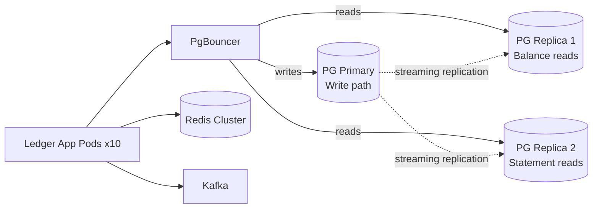
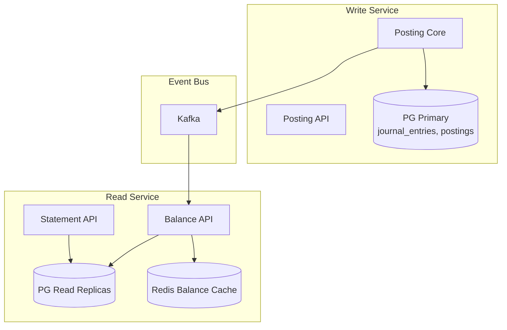

# 07 — Scaling Strategy: Double-Entry Ledger Service

---

## Objective

Define the horizontal and vertical scaling strategy for the ledger service, covering database scaling, read/write separation, hot account mitigation, snapshot contention, and the evolution from single-node to sharded architecture.

---

## Scaling Dimensions

| Dimension | Current Bottleneck | Strategy |
|---|---|---|
| Posting write throughput | Single PostgreSQL primary | Vertical scale → connection pooling → read/write split → eventual sharding |
| Balance read throughput | Primary DB for consistency | Redis cache → read replicas → CQRS split |
| Hot account contention | CAS on snapshot row for popular accounts | Virtual account splitting, batch snapshot update |
| API layer | Stateless — scale horizontally | Kubernetes HPA on CPU/RPS |
| Outbox relay | Single-threaded by default | `SKIP LOCKED` + multiple relay instances |
| Kafka throughput | Partition count | Partition by account_id hash for ordered delivery |

---

## Phase 1: Single Region (0 → 5,000 posting RPS)

**Architecture:**
- Single PostgreSQL 16 (primary + 2 replicas)
- Spring Boot app, 5–10 pods, HPA
- Redis cluster (3 nodes) for balance cache
- PgBouncer connection pooler in transaction mode
- Single Kafka cluster, 3 brokers

**Configuration targets:**
- PostgreSQL: 32 vCPU, 128 GB RAM, NVMe SSD (AWS RDS `db.r6g.8xlarge` or equivalent)
- Shared buffers: 25% of RAM (32 GB) — keeps hot partitions in memory
- `max_connections`: 200 (PgBouncer multiplexes app pool of 2000)
- PgBouncer pool mode: transaction — releases connection between statements, not just between requests

**What breaks first at this phase:**
- `account_snapshots` row contention for hot accounts (the platform float account receiving all payments)
- Outbox relay falling behind if relay is single-threaded and Kafka produce is slow

**Mitigation at Phase 1:**
- Virtual account splitting for hot accounts
- Deploy 3 outbox relay instances with `SKIP LOCKED`

---

## Phase 2: Read/Write Separation (5,000 → 20,000 posting RPS)

**Changes:**
- Route all balance reads to read replicas
- Write path (postings, snapshot updates) stays on primary
- Application-level datasource routing: write operations → `@Primary` datasource, reads → `@Replica` datasource
- Spring `AbstractRoutingDataSource` for transparent routing

**Read replica lag consideration:**
- Replica lag is typically < 100ms for streaming replication
- Balance reads served from replica may be up to 100ms stale
- For payment pre-authorization where accuracy is critical: force read from primary with `/*+ read_from_primary */` hint in service call
- For dashboards and statements: replica reads acceptable

**Kafka scaling:**
- Increase partitions from 6 → 18 for `ledger.posting.completed` topic
- Partition key: `account_id` — preserves per-account ordering for downstream consumers

---

## Phase 3: Hot Account Mitigation

**Problem:** A single platform float account receives 10,000 postings/sec (all incoming payments credit this account). The `account_snapshots` CAS update serializes on this one row.

**Solution: Virtual Account Splitting**

Split the hot account into N virtual sub-accounts (e.g., `float-account-shard-001` through `float-account-shard-100`). Route each incoming payment to a shard using a hash of the payment_id.

- Each shard receives 1/N of the load — contention reduced N-fold
- A nightly consolidation posting sweeps shards into the canonical parent account
- Balance query aggregates across all shards and the parent account

**Alternative: Batch Snapshot Updates**

Instead of updating the snapshot in-transaction per posting, collect snapshot deltas in a queue and apply them in micro-batches (every 100ms):

- Posting commits journal_entry + outbox without touching snapshot
- A separate snapshot-update worker reads the delta queue and applies batched `UPDATE account_snapshots SET balance = balance + sum_of_deltas`
- Balance query: `snapshot.balance + SUM(journal_entries since snapshot.last_sequence_num)`
- Trade-off: balance reads always require a delta query on top of snapshot — more complex but eliminates write-path contention

---

## Phase 4: CQRS Split (20,000+ posting RPS)

Separate the write-side (posting creation) and read-side (balance queries, statement retrieval) into distinct deployable services.

**CQRS trade-offs:**
- Write and read services can scale independently — balance readers often need 5x more instances than writers
- Read service can use a denormalized read model (account + snapshot in one table) optimized for query
- Complexity: two deployments, two health checks, event-driven read model updates

---

## Phase 5: Database Sharding (50,000+ posting RPS)

When a single PostgreSQL cannot handle posting volume:

**Sharding key: `account_id` (hash-based)**

- 16 shards: `account_id % 16` → shard index
- Each shard is a full PostgreSQL instance with its own partitioned `journal_entries`
- Application-layer shard routing: Spring `AbstractRoutingDataSource` with shard ID computation

**Cross-shard challenges:**
- Multi-leg postings that span accounts on different shards: use a distributed saga — each leg's shard commits independently; a compensating reversal is posted if any shard fails
- This breaks the ACID guarantee of multi-leg atomic commit — a critical architectural concession. Accepted only when single-node throughput is truly exhausted

**GL aggregation on sharded data:**
- Trial balance and P&L run against a separate OLAP system (ClickHouse, BigQuery, Redshift)
- Kafka streams all posting events to OLAP — eventual consistency accepted for analytical reports
- Real-time balance remains per-shard; OLAP provides cross-shard aggregated views

---

## Connection Pooling

| Component | Config | Reason |
|---|---|---|
| PgBouncer | Transaction mode, pool_size=200 | PostgreSQL `max_connections` is expensive; pooler multiplexes |
| Spring HikariCP | max_pool_size=10 per pod | 10 pods × 10 connections = 100 app connections to PgBouncer |
| Kafka producer | `batch.size=16384`, `linger.ms=5` | Batch small events to increase throughput |
| Redis | Lettuce connection pool, max=20 per pod | Async Lettuce reuses connections |

---

## Rate Limiting & Backpressure

| Layer | Mechanism | Limit |
|---|---|---|
| API Gateway | Token bucket per `caller_id` | 10,000 RPS per caller |
| PgBouncer | Max queue length | 1000 pending connections → reject with 503 |
| Kafka consumer | `max.poll.records=100`, `fetch.min.bytes=1MB` | Prevent consumer overload |
| Outbox relay | `LIMIT 100` per poll | Bound relay batch size |

**Circuit breaker (Resilience4j):**
- On posting service: circuit opens if PostgreSQL response time > 500ms for 50% of requests in 10s window
- On balance read: circuit opens → serve stale cache value with `staleness=DEGRADED` flag in response

---

## Scaling Metrics to Watch

| Metric | Alert Threshold | Action |
|---|---|---|
| PostgreSQL `wait_event=Lock` | > 5% of queries | Investigate hot account contention |
| Replica lag | > 500ms | Scale replica, pause read replica routing for critical reads |
| Outbox unpublished event count | > 10,000 | Scale outbox relay pods |
| Redis memory usage | > 80% max | Increase Redis cluster size |
| Snapshot CAS retry rate | > 10% of postings | Introduce virtual account splitting |
| P99 posting latency | > 200ms | Check PgBouncer queue, PostgreSQL vacuum lag, index bloat |

---

## Interview Discussion Points

- **What breaks first?** The `account_snapshots` row for the platform float account. Any system that funnels all payments through one ledger account creates a hot row — the most common scaling mistake in ledger design
- **Why not use pessimistic locking for snapshots?** `SELECT FOR UPDATE` on the snapshot row serializes all concurrent postings to the same account — effectively single-threaded for hot accounts. CAS (optimistic) allows parallel attempt with retry on conflict, which is better for low-contention accounts (the majority)
- **How do you scale to 100K posting RPS?** Shard by account — accept the loss of cross-shard atomic commit. Financial systems at Visa/Mastercard scale use eventual consistency with compensating entries, not distributed ACID transactions
- **Why not use a NewSQL database (CockroachDB, Spanner) instead of sharding PostgreSQL?** NewSQL provides distributed ACID, but adds 10–50ms of consensus latency per transaction (Paxos/Raft). For a ledger that targets < 30ms P50, this is unacceptable. PostgreSQL on a single node is always faster — shard only when forced
