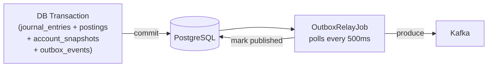

# 10 — Message Queue Design: Double-Entry Ledger Service

---

## Objective

Define the Kafka topic design, partitioning strategy, producer configuration, consumer group setup, and delivery guarantees for ledger events. The outbox pattern is the core mechanism — Kafka events are a side effect of journal commits, not a parallel write path.

---

## Why Kafka for Ledger Events

| Requirement | Kafka Feature |
|---|---|
| Durable event log | Kafka topic with replication factor 3 + min.insync.replicas=2 |
| Ordered delivery per account | Partition by account_id — ordering within partition |
| Fan-out to multiple consumers | Consumer groups — each consumer group maintains independent offset |
| Replay capability | Configurable retention (7 days default, 1 year for audit topic) |
| High throughput | 50M journal entries/day ≈ 600 events/sec average — Kafka handles this comfortably |
| Backpressure handling | Consumer lag monitoring + auto-scaling |

**Alternative considered: RabbitMQ**

Rejected: No built-in replay, partition-ordered delivery, or consumer group fan-out model. Kafka's durable log model aligns perfectly with the ledger's immutable event stream.

---

## Topic Design

| Topic | Key | Partitions | Retention | Consumers |
|---|---|---|---|---|
| `ledger.posting.completed` | posting_id | 24 | 7 days | fraud, analytics, risk, reporting |
| `ledger.posting.reversed` | posting_id | 12 | 7 days | payment, loan, wallet (saga compensation) |
| `ledger.balance.changed` | account_id | 24 | 24 hours | risk alerts, dashboard |
| `ledger.account.status.changed` | account_id | 6 | 30 days | all upstream services |
| `ledger.audit.events` | posting_id | 12 | 1 year (S3 sink) | SIEM, compliance |

**Partition count reasoning:**
- `ledger.posting.completed`: 24 partitions → allows 24 parallel consumer threads per consumer group
- `ledger.balance.changed`: account_id keyed → ordered per account; 24 partitions handles ~2,500 hot accounts per partition
- `ledger.audit.events`: 12 partitions → compliance reads are bursty but not latency-critical

---

## Partitioning Strategy

### `ledger.posting.completed` — Partitioned by `posting_id`

- Posting events do not require strict ordering relative to each other
- Distributing by posting_id provides uniform load distribution
- Consumer groups process events in parallel without cross-partition dependencies

### `ledger.balance.changed` — Partitioned by `account_id`

- Balance change events for the same account must be processed in order
- Downstream risk system needs to see balance changes in sequence to detect anomalies
- Hash of account_id → partition index ensures same-account events land on same partition

```
partition_index = hash(account_id) % num_partitions
```

**Hot account mitigation:** If a single account generates 80% of balance events (platform float), one partition becomes hot. Mitigation:
- Use virtual account sharding (see Scaling Strategy)
- Or accept hot partition — Kafka handles it; the consumer for that partition works harder but doesn't block others

---

## Outbox Pattern: Producer Side

The ledger never calls Kafka directly within a posting transaction. Instead:



**Why not call Kafka in the DB transaction?**

Kafka is a network call — it can fail, timeout, or the service can crash between the DB commit and the Kafka produce. If Kafka is called in-transaction and succeeds before DB commits (and DB then fails), the event is published but the posting was not committed — phantom event. If Kafka is called after DB commit and the service crashes — event is lost. The outbox table, written in the same DB transaction as the posting, guarantees the event is published if and only if the DB commit succeeded.

---

## Producer Configuration

```yaml
spring.kafka.producer:
  bootstrap-servers: kafka-broker-1:9092,kafka-broker-2:9092,kafka-broker-3:9092
  acks: all                          # Wait for all ISR replicas to acknowledge
  retries: 2147483647               # Retry indefinitely (bounded by delivery.timeout.ms)
  delivery-timeout-ms: 120000       # 2 minutes max delivery attempt window
  enable-idempotence: true          # Exactly-once producer semantics (dedupes in-flight)
  max-in-flight-requests-per-connection: 5  # Ordering maintained with idempotence=true
  batch-size: 16384                 # 16KB batch size
  linger-ms: 5                      # Wait 5ms to accumulate batch
  compression-type: lz4             # Fast compression for event payloads
  key-serializer: org.apache.kafka.common.serialization.StringSerializer
  value-serializer: io.confluent.kafka.serializers.KafkaAvroSerializer
  schema-registry-url: http://schema-registry:8081
```

**`acks=all` + `min.insync.replicas=2`**: The broker only acknowledges when at least 2 ISR replicas have written the message. Prevents message loss on single broker failure.

**`enable.idempotence=true`**: Kafka producer assigns a sequence number per partition. The broker deduplicates retried produce requests. Combined with `acks=all`, this achieves exactly-once produce semantics (PID + sequence number deduplication).

---

## Consumer Group Design

Each downstream domain has its own Kafka consumer group — independent offset tracking.

| Consumer Group | Topic | Parallelism | Processing SLA |
|---|---|---|---|
| `fraud-detection` | `ledger.posting.completed` | 24 threads (1 per partition) | < 100ms per event |
| `analytics-pipeline` | `ledger.posting.completed` | 12 threads | < 5s per batch |
| `risk-engine` | `ledger.balance.changed` | 24 threads | < 200ms per event |
| `regulatory-reporting` | `ledger.posting.completed` | 6 threads | < 60s per event |
| `audit-sink` | `ledger.audit.events` | 12 threads → S3 | < 30 minutes batch |

**Consumer failure isolation:** If the `analytics-pipeline` consumer group falls behind by 10,000 events (slow processing), this does not affect `fraud-detection` — each group maintains independent offsets.

---

## Consumer Configuration

```yaml
spring.kafka.consumer:
  bootstrap-servers: kafka-broker-1:9092,...
  group-id: fraud-detection          # Per consumer group
  auto-offset-reset: earliest        # On new consumer group: start from beginning
  enable-auto-commit: false          # Manual commit — only after successful processing
  max-poll-records: 100             # Process 100 events per poll
  fetch-min-bytes: 1048576          # 1MB minimum fetch (batch efficiency)
  fetch-max-wait-ms: 500            # Wait up to 500ms to accumulate 1MB
  isolation-level: read_committed   # Only read committed messages (producer idempotence)
  key-deserializer: StringDeserializer
  value-deserializer: KafkaAvroDeserializer
  schema-registry-url: http://schema-registry:8081
  specific-avro-reader: true
```

**Manual offset commit:** Consumer only commits the offset after successfully processing the event (writing to fraud database, completing risk score update, etc.). If processing fails, the event is retried. Combined with consumer idempotency, this achieves exactly-once processing semantics end-to-end.

---

## Schema Registry

All Kafka event schemas are registered in the Confluent Schema Registry.

**Benefits:**
- Schema validation at produce time — malformed events rejected at source
- Schema versioning with compatibility modes
- Consumer schema evolution without code changes (new optional fields are ignored)

**Compatibility modes per topic:**
- `ledger.posting.completed`: `BACKWARD` — new consumers can read old events
- `ledger.audit.events`: `FULL` — both forward and backward compatible (audit data is long-lived)

**Example Avro schema (posting.completed):**
```json
{
  "type": "record",
  "name": "PostingCompleted",
  "namespace": "com.fintech.ledger.events.v1",
  "fields": [
    {"name": "event_id", "type": "string"},
    {"name": "event_type", "type": "string"},
    {"name": "posting_id", "type": "string"},
    {"name": "idempotency_key", "type": "string"},
    {"name": "reference_type", "type": "string"},
    {"name": "reference_id", "type": ["null", "string"], "default": null},
    {"name": "effective_at", "type": "string"},
    {"name": "legs", "type": {"type": "array", "items": {
      "type": "record",
      "name": "JournalLeg",
      "fields": [
        {"name": "entry_id", "type": "string"},
        {"name": "account_id", "type": "string"},
        {"name": "direction", "type": "string"},
        {"name": "amount", "type": "long"},
        {"name": "currency", "type": "string"}
      ]
    }}}
  ]
}
```

---

## Dead Letter Queue (DLQ) Pattern

Each consumer group has a corresponding DLQ topic for events that fail after max retries.

| Consumer Group DLQ | Topic | Retry Policy |
|---|---|---|
| `fraud-detection.DLQ` | `ledger.posting.completed.fraud.dlq` | 3 retries with exponential backoff (1s, 5s, 30s) |
| `analytics.DLQ` | `ledger.posting.completed.analytics.dlq` | 5 retries with backoff |

**DLQ processing:**
- A separate consumer polls the DLQ topic
- Events are either reprocessed manually after root cause fix, or escalated to ops for investigation
- DLQ events are never silently dropped

---

## Consumer Lag Monitoring

| Metric | Alert Threshold | Action |
|---|---|---|
| `fraud-detection` consumer lag | > 1,000 events | Scale consumer pods, investigate processing slowdown |
| `analytics` consumer lag | > 50,000 events | Scale analytics pods |
| `risk-engine` consumer lag | > 500 events | P0 alert — risk decisions depend on fresh data |
| DLQ event count | > 10 events | Investigate root cause within 1 hour |

---

## Comparison: Outbox vs Direct Kafka vs Change Data Capture

| Approach | Pros | Cons | Used By |
|---|---|---|---|
| **Outbox (this design)** | Atomic with DB commit; no CDC infra needed | Extra table; relay polling latency (< 1s) | Ledger (chosen) |
| Direct Kafka in transaction | Simpler code | Cannot atomically commit DB + Kafka — lost events on crash | Not used |
| CDC (Debezium) | No outbox table; sub-second latency | Requires Kafka Connect infra; complex schema management | Analytics pipelines |

CDC via Debezium would be a viable alternative for the outbox pattern — reads the PostgreSQL WAL and publishes to Kafka without a relay job. Trade-off: operational complexity of running Kafka Connect cluster.

---

## Interview Discussion Points

- **Why `acks=all` and not `acks=1`?** `acks=1` means the leader acknowledges before replicas replicate. If the leader crashes immediately after acknowledging, the message is lost. `acks=all` with `min.insync.replicas=2` ensures durability — a message is never lost unless two brokers fail simultaneously
- **What is the delivery guarantee with outbox + producer idempotence?** At-least-once delivery from the outbox relay (may retry on timeout). Exactly-once produce within a single producer session (PID + sequence dedup). End-to-end exactly-once requires the consumer to also be idempotent (deduplicate by event_id)
- **How do you handle schema evolution when the fraud service needs new fields?** Add the field as optional in the Avro schema (with default). Register the new schema version in the schema registry. Old producers continue publishing old schema; fraud service uses the new schema deserializer and reads the default for missing fields in old events — backward compatible
- **Why use Kafka for `ledger.balance.changed` if balance is cached in Redis?** Redis cache is internal to the ledger service. External consumers (risk engine, dashboard) cannot directly read the ledger's Redis cluster. The Kafka event is the external notification mechanism. Consumers can maintain their own balance projection from these events — never querying the ledger API for balance on every check
