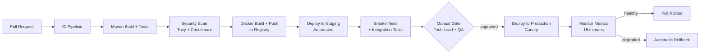

# 13 — Deployment Architecture: Double-Entry Ledger Service

---

## Objective

Define the containerization, Kubernetes deployment, CI/CD pipeline, and environment strategy for the double-entry ledger. Financial services require zero-downtime deployments and strict environment promotion gates.

---

## Container Strategy

### Docker Image

- Base image: `eclipse-temurin:21-jre-alpine` (smallest secure JRE for Java 21)
- Multi-stage build: compile in `maven:3.9-eclipse-temurin-21`, copy JAR to runtime image
- No secrets baked into the image — all injected at runtime via Kubernetes Secrets
- Image signed with cosign for supply chain security
- Image scanning: Trivy in CI pipeline — fail on CRITICAL CVEs

**Image layers (optimized for layer caching):**
1. JRE layer (rarely changes)
2. Dependencies JAR layer (changes on dependency updates)
3. Application JAR layer (changes on every code change)

---

## Kubernetes Deployment

### Namespace Strategy

```
ledger-prod/          — Production
ledger-staging/       — Staging (production-like data volume, synthetic data)
ledger-dev/           — Development (small scale, local developer test)
```

### Deployment Spec: `ledger-service`

```yaml
apiVersion: apps/v1
kind: Deployment
metadata:
  name: ledger-service
  namespace: ledger-prod
spec:
  replicas: 10
  strategy:
    type: RollingUpdate
    rollingUpdate:
      maxSurge: 3        # Allow 3 extra pods during rollout
      maxUnavailable: 0  # Never reduce below desired replica count
  selector:
    matchLabels:
      app: ledger-service
  template:
    spec:
      affinity:
        podAntiAffinity:
          requiredDuringSchedulingIgnoredDuringExecution:
          - labelSelector:
              matchLabels:
                app: ledger-service
            topologyKey: kubernetes.io/hostname  # No two pods on same node
      containers:
      - name: ledger
        image: registry.company.com/ledger-service:1.2.3
        resources:
          requests:
            cpu: "2"
            memory: "4Gi"
          limits:
            cpu: "4"
            memory: "8Gi"
        env:
        - name: SPRING_DATASOURCE_URL
          valueFrom:
            secretKeyRef:
              name: ledger-db-secret
              key: url
        readinessProbe:
          httpGet:
            path: /actuator/health/readiness
            port: 8080
          initialDelaySeconds: 30
          periodSeconds: 5
          failureThreshold: 3
        livenessProbe:
          httpGet:
            path: /actuator/health/liveness
            port: 8080
          initialDelaySeconds: 60
          periodSeconds: 10
          failureThreshold: 3
        lifecycle:
          preStop:
            exec:
              command: ["sh", "-c", "sleep 15"]  # Drain in-flight requests before termination
```

### HPA (Horizontal Pod Autoscaler)

```yaml
apiVersion: autoscaling/v2
kind: HorizontalPodAutoscaler
metadata:
  name: ledger-service-hpa
spec:
  scaleTargetRef:
    apiVersion: apps/v1
    kind: Deployment
    name: ledger-service
  minReplicas: 10
  maxReplicas: 50
  metrics:
  - type: Resource
    resource:
      name: cpu
      target:
        type: Utilization
        averageUtilization: 60
  - type: Pods
    pods:
      metric:
        name: ledger_posting_rps   # Custom metric from Prometheus
      target:
        type: AverageValue
        averageValue: 500          # Scale up when each pod handles > 500 RPS
```

**Why 10 minimum replicas?**
- Financial core — should never go below 10 replicas to maintain capacity headroom
- Pod distribution across 3 AZs: at least 3 pods per AZ (anti-affinity ensures spread)

### Pod Disruption Budget

```yaml
apiVersion: policy/v1
kind: PodDisruptionBudget
metadata:
  name: ledger-service-pdb
spec:
  minAvailable: 8    # Always keep at least 8 pods available during node maintenance
  selector:
    matchLabels:
      app: ledger-service
```

---

## Database Deployment (PostgreSQL)

### Production Configuration

| Component | Configuration |
|---|---|
| Primary | AWS RDS PostgreSQL 16, `db.r6g.8xlarge` (32 vCPU, 256 GB RAM), Multi-AZ |
| Read Replicas | 2 × `db.r6g.4xlarge` in separate AZs |
| Storage | 10 TB gp3 SSD, 12,000 IOPS |
| Backup | Daily automated snapshots, 35-day retention, point-in-time recovery |
| Failover | Automatic Multi-AZ failover (< 30 seconds) |
| Encryption | AES-256 at rest (AWS KMS), TLS in transit |
| Connection Pooling | PgBouncer DaemonSet on each K8s worker node |

### PgBouncer (Connection Pooler)

Deployed as a DaemonSet (one per node) to minimize network hops:

```yaml
apiVersion: apps/v1
kind: DaemonSet
metadata:
  name: pgbouncer
spec:
  template:
    spec:
      containers:
      - name: pgbouncer
        image: pgbouncer:1.22
        env:
        - name: DB_HOST
          value: ledger-db.cluster.local
        - name: POOL_MODE
          value: transaction
        - name: MAX_CLIENT_CONN
          value: "2000"
        - name: DEFAULT_POOL_SIZE
          value: "20"
```

---

## Service Mesh (Istio)

Istio sidecar injected into all ledger pods provides:
- Automatic mTLS between ledger pods and all callers
- Circuit breaker (Istio `DestinationRule`)
- Traffic shaping for canary releases
- Request tracing (propagates OpenTelemetry headers)

```yaml
apiVersion: networking.istio.io/v1beta1
kind: DestinationRule
metadata:
  name: ledger-service
spec:
  host: ledger-service
  trafficPolicy:
    connectionPool:
      http:
        http2MaxRequests: 1000
        pendingRequests: 200
    outlierDetection:
      consecutive5xxErrors: 10
      interval: 30s
      baseEjectionTime: 30s    # Eject misbehaving pods for 30s
```

---

## CI/CD Pipeline



### CI Stages (GitHub Actions / Jenkins)

| Stage | Tool | Gate |
|---|---|---|
| Unit Tests | JUnit 5 + Mockito | 100% pass required |
| Integration Tests | TestContainers (real PostgreSQL + Redis + Kafka) | 100% pass required |
| Financial Invariant Tests | Custom test suite: posting invariant, snapshot correctness | 100% pass required |
| Static Analysis | Checkstyle + PMD + SpotBugs | No critical findings |
| Security Scan | Trivy (image), Semgrep (SAST) | No CRITICAL vulnerabilities |
| Test Coverage | JaCoCo | Minimum 80% line coverage |
| Docker Build | Docker BuildKit | Image pushed to private registry |

### Deployment Strategy: Canary Release

For a financial service, blue-green is wasteful (100% resource doubling). Canary is preferred:

1. **Deploy canary:** 1 pod of new version alongside 9 pods of current version (10% traffic)
2. **Monitor for 15 minutes:** Watch P99 latency, error rate, invariant violations
3. **Progressive rollout:** 25% → 50% → 75% → 100% every 5 minutes if metrics are healthy
4. **Automatic rollback:** If `ledger_postings_total{status="failure"}` rate > 2%, Argo Rollouts triggers automatic rollback to previous version

**Istio traffic splitting for canary:**
```yaml
apiVersion: networking.istio.io/v1beta1
kind: VirtualService
metadata:
  name: ledger-canary
spec:
  hosts:
  - ledger-service
  http:
  - route:
    - destination:
        host: ledger-service
        subset: v1
      weight: 90
    - destination:
        host: ledger-service
        subset: canary
      weight: 10
```

---

## Environment Strategy

| Environment | Purpose | Data | Scale |
|---|---|---|---|
| `dev` | Developer local testing | Synthetic, lightweight | 2 pods, H2/local PG |
| `integration` | CI integration tests (automated) | Synthetic | 3 pods, TestContainers |
| `staging` | Pre-production validation | Production-like (anonymized clone) | 5 pods, AWS RDS |
| `production` | Live traffic | Real financial data | 10–50 pods, AWS RDS Multi-AZ |

**Staging data:** A daily job clones the production PostgreSQL snapshot, anonymizes all `metadata` JSONB fields (PII removal), and restores to the staging RDS instance. Staging tests run against realistic data volume without PII exposure.

---

## Feature Flags

Feature flags prevent the need for hot code changes in a financial service:

| Flag | Purpose | Default |
|---|---|---|
| `ledger.multi_currency.enabled` | Enable multi-currency posting legs | false (V2) |
| `ledger.snapshot.async_update` | Move snapshot update out of DB transaction | false (emergency mode) |
| `ledger.balance.force_primary` | Force all balance reads to primary | false |
| `ledger.period_close.enforced` | Enable accounting period close enforcement | false (V2) |

Managed via AWS AppConfig or LaunchDarkly — change without redeploy.

---

## Local Development Setup

```yaml
# docker-compose.yml for local dev
services:
  postgres:
    image: postgres:16
    environment:
      POSTGRES_DB: ledger_dev
    ports: ["5432:5432"]

  redis:
    image: redis:7-alpine
    ports: ["6379:6379"]

  kafka:
    image: confluentinc/cp-kafka:7.5.0
    ports: ["9092:9092"]

  schema-registry:
    image: confluentinc/cp-schema-registry:7.5.0
    ports: ["8081:8081"]

  ledger-service:
    build: .
    environment:
      SPRING_PROFILES_ACTIVE: local
      SPRING_DATASOURCE_URL: jdbc:postgresql://postgres:5432/ledger_dev
    ports: ["8080:8080"]
    depends_on: [postgres, redis, kafka]
```

---

## Interview Discussion Points

- **Why `maxUnavailable: 0` in rolling update?** The ledger is a financial core — zero downtime is non-negotiable. `maxUnavailable: 0` ensures the cluster never operates below desired capacity during rollout. The trade-off: rollout requires `maxSurge` extra capacity (3 extra pods during rollout)
- **How do you do zero-downtime DB schema migrations?** Expand-contract pattern: (1) Deploy new version that writes both old and new columns; (2) Run migration to backfill new column; (3) Deploy version that reads new column; (4) Drop old column. Never ALTER TABLE that locks a production journal_entries partition — use `pg_partman` to manage partitions and run DDL on new partitions only
- **How do you roll back if a bad deployment corrupts journal data?** Database migrations are forward-only for journal tables (append-only). For application bugs that post incorrect entries: post reversal entries (compensating transactions) rather than rolling back the DB. The application deployment is rolled back via Argo Rollouts
- **What does the `preStop: sleep 15` do?** When Kubernetes terminates a pod, it first removes it from the service endpoints (stops new requests) and simultaneously sends SIGTERM. Without the sleep, in-flight requests are abruptly terminated. The 15-second sleep allows all in-flight posting transactions to complete before the JVM is shut down — critical for financial correctness
