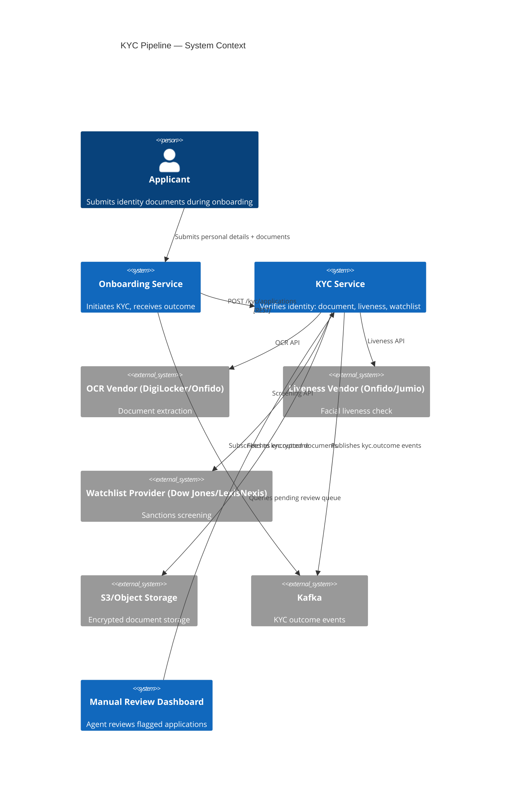
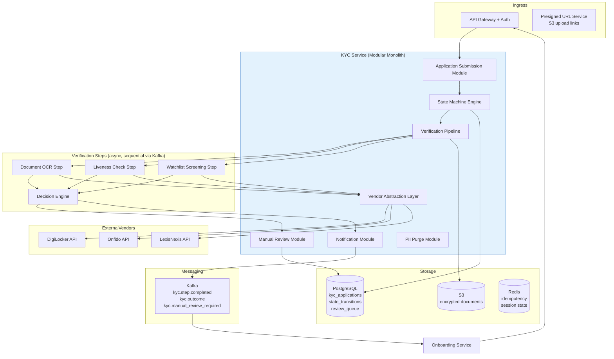
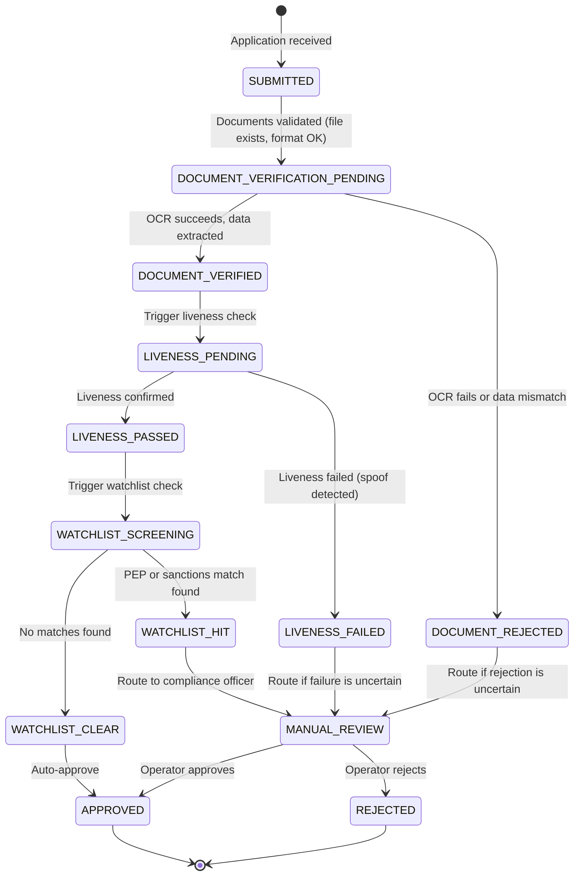
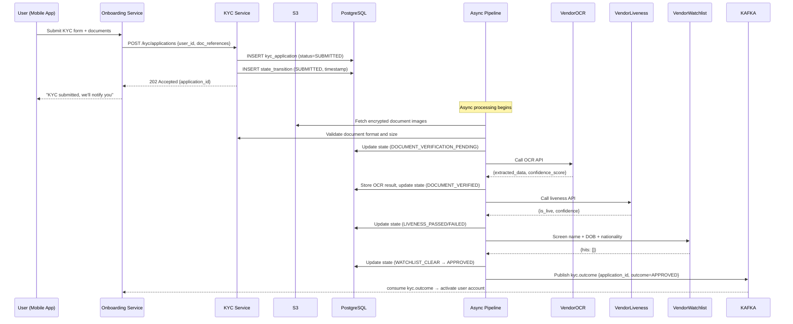

# 01 — High-Level Architecture: KYC / Identity Verification Pipeline

---

## Objective

Define the architectural style, component breakdown, and interaction model for the KYC identity verification pipeline. Justify the event-driven async architecture and explain the state machine at the core of the design.

---

## Architecture Decision: Event-Driven Pipeline with State Machine Core

### Chosen Architecture: Event-Driven Microservice (or Modular Monolith Module) + Saga

**Why event-driven pipeline?**

KYC verification is inherently a multi-step async workflow:
1. Document uploaded → OCR triggered (vendor API: 1–3s)
2. OCR result → liveness check triggered (vendor API: 2–5s)
3. Liveness result → watchlist screening (vendor API: 200–500ms)
4. All checks passed → approval decision

Each step depends on the previous step's result. Each step involves a vendor API call that can fail, timeout, or return ambiguous results. The workflow must be:
- **Resumable:** if the service restarts mid-workflow, the application picks up from where it left off (state persisted in DB)
- **Retryable:** vendor API failures trigger retry, not application restart
- **Auditable:** every step and its outcome recorded immutably

A synchronous REST chain would block a thread for 5–10 seconds per application. At 10,000/day × peak bursts, this requires an impractical thread pool. Event-driven pipeline: each step completes and emits an event for the next step — no thread held waiting.

**Why NOT direct microservices (separate OCR service, liveness service, watchlist service)?**

At 10,000 applications/day (not 10M), the operational overhead of 5 separate microservices is not justified. A modular monolith with distinct modules per verification step, communicating via internal events (or a lightweight Kafka), provides the resilience of event-driven without the deployment overhead.

**When to extract to microservices:** If the OCR processing or watchlist screening becomes a shared capability used by other products (loan origination, card onboarding), extract that module as a service.

---

## System Context



---

## Component Architecture



---

## KYC State Machine

The state machine is the core correctness guarantee. Every application transitions through a predefined sequence. No state can be skipped.



**State transition rules:**
- Every transition requires a `reason` field (system-generated or operator-entered)
- Transitions are appended to `state_transition_history` — never overwritten
- APPROVED and REJECTED are terminal states — no further transitions permitted on the same application
- A rejected applicant must submit a new application (new `application_id`)

---

## Request Flow: KYC Application Submission



---

## Vendor Abstraction Layer

The vendor abstraction layer is the key extensibility point. Each vendor implements a common interface:

```
VendorClient (interface)
├── performDocumentOCR(documentReference, documentType) → OCRResult
├── performLivenessCheck(selfieReference) → LivenessResult
├── performWatchlistScreening(name, dob, nationality) → WatchlistResult

Implementations:
├── DigiLockerVendorClient → calls DigiLocker API for Aadhaar verification
├── OnfidoVendorClient → calls Onfido for document OCR + liveness
├── JumioVendorClient → calls Jumio for document verification
├── LexisNexisVendorClient → calls LexisNexis for watchlist screening
```

**Vendor routing strategy:**
- Primary vendor configured per verification type and jurisdiction
- Fallback vendor activated on: HTTP 5xx, connection timeout (3s), circuit breaker open
- Vendor performance metrics tracked (accuracy rate, latency, cost per call) — feed into routing decisions

**Cost consideration:** Each vendor API call costs money (₹5–₹50 per call). The abstraction layer enables cost optimization: use cheaper vendors for basic checks, expensive vendors only for high-risk applications.

---

## Architectural Tradeoffs

| Decision | Pro | Con |
|---|---|---|
| Async pipeline | Non-blocking submission, retryable, resumable | Status is eventual — callers must poll or subscribe |
| Kafka for step orchestration | Decoupled steps, independent retry, durability | Kafka infra required; more complex than synchronous chain |
| State machine in DB | Correctness guarantee, audit trail | Every step requires a DB write |
| Vendor abstraction layer | Switch vendors without API changes | Mapping overhead; vendor-specific features unavailable |
| S3 presigned URL for uploads | Documents never transit through KYC service | URL expiry management; S3 dependency for every check |

---

## Migration Path: Modular Monolith → Microservices

1. **Current (Modular Monolith):** OCR, Liveness, Watchlist are modules in the same deployment
2. **Phase 2:** If OCR becomes shared across products, extract `OCR Service` — still calls the same vendor abstraction
3. **Phase 3:** If watchlist screening is used by AML team, extract `Watchlist Screening Service`
4. **Phase 4:** If video KYC requires real-time streaming infra, extract `Video KYC Service` with WebRTC support

Each extraction: the Kafka event contract remains stable — the KYC state machine doesn't change, only the executor of each step changes.

---

## Interview Discussion Points

- **Why not just call vendor APIs synchronously in the request handler?** Synchronous chain: if OCR takes 3s and liveness takes 5s, the HTTP request blocks for 8+ seconds. Mobile clients time out, connection pools exhaust, upstream services get timeouts. Async pipeline: submit returns in 200ms, processing happens in background, result pushed via Kafka/webhook
- **How do you handle a vendor being down during processing?** The step is retried with exponential backoff (1s, 5s, 30s, 5min). If all retries fail, the application transitions to `MANUAL_REVIEW` with reason `VENDOR_UNAVAILABLE`. A human reviewer can re-trigger the vendor check when service is restored
- **Why a state machine instead of a simple status column?** A status column (VARCHAR) with UPDATE statements does not enforce valid transitions. A state machine enforces: (1) only valid transitions are allowed, (2) all transitions are recorded in history (not just the current state), (3) terminal states are actually terminal (no further updates). This is a regulatory requirement — the audit trail must show every state the application passed through
