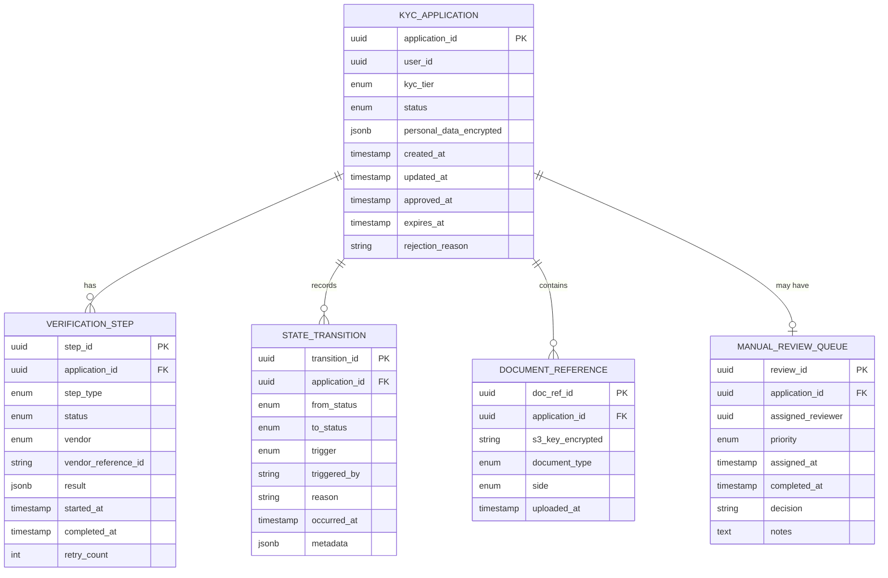

# 02 — Domain Modeling: KYC / Identity Verification Pipeline

---

## Objective

Define the core domain model for the KYC pipeline using DDD aggregates, entities, value objects, and domain events. Establish the language shared between compliance, operations, and engineering teams.

---

## Ubiquitous Language

| Term | Definition |
|---|---|
| **KYC Application** | A request by a user to verify their identity; the primary aggregate |
| **State Transition** | An immutable record of moving the application from one status to another |
| **Verification Step** | A single check in the pipeline (Document OCR, Liveness, Watchlist) |
| **Verification Result** | The outcome of a single verification step (PASS, FAIL, MANUAL) |
| **OCR Result** | Structured data extracted from a document image (name, DOB, ID number) |
| **Liveness Check** | Confirming the selfie/video is from a live person, not a photo or mask |
| **Watchlist Hit** | A match found in sanctions, PEP, or adverse media lists |
| **Manual Review** | A compliance officer reviews a case that automated systems cannot resolve |
| **KYC Tier** | The level of verification required: BASIC (OTP-only), STANDARD (doc + liveness), FULL (+ enhanced watchlist) |
| **Vendor** | An external identity verification provider (Onfido, DigiLocker, Jumio, LexisNexis) |
| **PII** | Personally Identifiable Information: name, DOB, address, document numbers, biometrics |
| **Re-verification** | Repeating KYC for an already-approved customer due to trigger event |
| **Data Residency** | The requirement that PII must be stored in a specific geographic region |

---

## Aggregate Design

### Aggregate 1: `KycApplication` (Root)

The central aggregate. Owns all verification steps, state transitions, and the identity data of one KYC attempt.

```
KycApplication (Aggregate Root)
├── application_id: UUID (identity)
├── user_id: UUID (reference to user in Onboarding domain)
├── kyc_tier: KycTier (BASIC | STANDARD | FULL)
├── status: KycStatus (state machine current state)
├── document_references: List<DocumentReference>
│   └── DocumentReference (Value Object)
│       ├── s3_key: EncryptedS3Key
│       ├── document_type: DocumentType (AADHAAR | PAN | PASSPORT | DRIVER_LICENSE)
│       ├── side: FRONT | BACK
│       └── uploaded_at: Instant
├── personal_data: PersonalData (Value Object, encrypted at rest)
│   ├── full_name: EncryptedString
│   ├── date_of_birth: EncryptedDate
│   ├── nationality: String (ISO 3166-1 alpha-2)
│   └── address: EncryptedAddress
├── verification_steps: List<VerificationStep> (Entities, owned by application)
├── state_transitions: List<StateTransition> (Entities, append-only)
├── assigned_reviewer: ReviewerId (nullable — set on MANUAL_REVIEW transition)
├── rejection_reason: String (nullable — set on REJECTED transition)
├── created_at: Instant
├── updated_at: Instant
├── approved_at: Instant (nullable)
├── rejected_at: Instant (nullable)
└── expires_at: Instant (PII retention expiry)

Invariants enforced by KycApplication aggregate:
  1. status transitions must follow the defined state machine
  2. Terminal states (APPROVED, REJECTED) cannot be transitioned out of
  3. Each VerificationStep type appears at most once per application
  4. personal_data must be encrypted before storage
```

---

### Entity: `VerificationStep`

A single check performed as part of the KYC pipeline. Owned by the `KycApplication` aggregate.

```
VerificationStep (Entity)
├── step_id: UUID
├── step_type: StepType (DOCUMENT_OCR | LIVENESS | WATCHLIST_SCREENING | MANUAL_REVIEW)
├── status: StepStatus (PENDING | IN_PROGRESS | PASS | FAIL | MANUAL | SKIPPED)
├── vendor: VendorId (DIGILOCKER | ONFIDO | JUMIO | LEXISNEXIS | MANUAL)
├── vendor_reference_id: String (vendor's internal ID for this check)
├── result: VerificationResult (Value Object, polymorphic)
│   Subtypes:
│   ├── OcrResult { extracted_name, extracted_dob, confidence_score, field_matches }
│   ├── LivenessResult { is_live, confidence_score, spoof_type }
│   ├── WatchlistResult { hits: List<WatchlistHit>, risk_level }
│   └── ManualReviewResult { approved: boolean, operator_id, notes }
├── started_at: Instant
├── completed_at: Instant (nullable)
├── retry_count: Int
└── failure_reason: String (nullable)
```

---

### Entity: `StateTransition`

An immutable record of a state change. Append-only — never updated.

```
StateTransition (Entity, immutable)
├── transition_id: UUID
├── from_status: KycStatus
├── to_status: KycStatus
├── trigger: TransitionTrigger (SYSTEM | OPERATOR | API_CALLBACK)
├── triggered_by: String (service_name or operator_id)
├── reason: String
├── occurred_at: Instant
└── metadata: Map<String, String>
```

---

## Value Objects

### `KycStatus` (State Machine Enum)

```
SUBMITTED
DOCUMENT_VERIFICATION_PENDING
DOCUMENT_VERIFIED
DOCUMENT_REJECTED
LIVENESS_PENDING
LIVENESS_PASSED
LIVENESS_FAILED
WATCHLIST_SCREENING
WATCHLIST_CLEAR
WATCHLIST_HIT
MANUAL_REVIEW
APPROVED
REJECTED
```

### `EncryptedString`

```
EncryptedString
├── ciphertext: byte[] (AES-256-GCM encrypted)
├── key_version: String (KMS key version used for encryption)
├── iv: byte[] (initialization vector)
```

All PII fields are stored as `EncryptedString`. The KMS key ID is stored alongside for future re-encryption on key rotation.

### `WatchlistHit`

```
WatchlistHit
├── list_name: String (e.g., "OFAC SDN", "UN Consolidated List", "PEP")
├── match_type: EXACT | FUZZY | ALIAS
├── match_score: Double (0.0–1.0)
├── entity_name: String (name on the list)
├── entity_id: String (list-internal ID)
├── reason: String (why they're listed)
```

### `KycTier`

```
KycTier enum:
  BASIC    — Aadhaar OTP only (< ₹10,000 monthly limit)
  STANDARD — Document + liveness (standard account limits)
  FULL     — Standard + enhanced watchlist + income proof (higher limits)

Determines which VerificationSteps are required.
```

---

## Domain Services

### `KycApplicationStateMachine`

Enforces valid transitions. Throws `InvalidTransitionException` for invalid moves.

```
KycApplicationStateMachine
├── transition(application, toStatus, reason, triggeredBy): StateTransition
├── isTerminal(status): boolean
├── getAllowedTransitions(fromStatus): Set<KycStatus>
├── getRequiredStepsForTier(tier): List<StepType>
```

### `VerificationOrchestrator`

Coordinates the sequence of verification steps based on the application's KYC tier.

```
VerificationOrchestrator
├── startVerification(applicationId): void
├── onStepCompleted(applicationId, stepId, result): void
├── determineNextStep(application): Optional<StepType>
├── isAllStepsCompleted(application): boolean
├── makeDecision(application): KycDecision (APPROVE | REJECT | MANUAL_REVIEW)
```

### `VendorRouter`

Selects the appropriate vendor for a given step type, with fallback logic.

```
VendorRouter
├── selectVendor(stepType, documentType, nationality): VendorClient
├── getFallbackVendor(primaryVendor, stepType): Optional<VendorClient>
├── recordVendorMetrics(vendorId, stepType, latency, result): void
```

### `PiiEncryptionService`

Handles encryption/decryption of PII fields using AWS KMS.

```
PiiEncryptionService
├── encrypt(plaintext, keyId): EncryptedString
├── decrypt(encryptedString): String
├── reEncrypt(encryptedString, newKeyId): EncryptedString (for key rotation)
```

---

## Domain Events

| Event | Trigger | Consumers |
|---|---|---|
| `KycApplicationSubmitted` | Application created | Starts async pipeline |
| `KycStepCompleted` | A verification step completes (pass or fail) | Orchestrator (triggers next step) |
| `KycManualReviewRequired` | Application routed to human review | Manual review dashboard |
| `KycOutcomeDecided` | Final APPROVED or REJECTED | Onboarding service, user notification |
| `KycApplicationExpired` | Retention period reached | PII purge job |
| `KycReVerificationTriggered` | Re-KYC required for existing customer | Onboarding flow |

---

## Entity Relationship Overview



---

## Bounded Context

The KYC domain is its own bounded context. It integrates with:

| Upstream/Downstream | Integration | Direction |
|---|---|---|
| Onboarding Service | Submits applications, receives outcome | Customer/Supplier (Onboarding is customer) |
| User Service | Provides user_id reference | Conformist (KYC uses user_id as opaque reference) |
| Document Vault (S3) | Stores/retrieves encrypted documents | Infrastructure (not a domain) |
| Notification Service | Sends approval/rejection notifications | Publisher (KYC publishes events) |
| AML Monitoring | Consumes KYC outcome for ongoing monitoring | Subscriber |

---

## Interview Discussion Points

- **Why is personal_data encrypted as JSONB in PostgreSQL rather than individual columns?** The entire PII block is encrypted as a unit using a customer-specific encryption key. This approach supports (1) key-per-customer isolation — revoking one customer's key doesn't require migrating a shared column, (2) crypto-erasure for GDPR right-to-erasure — delete the KMS key, the data becomes irrecoverable without altering the schema
- **How do you handle PII minimization?** The KYC service stores only the minimum required for regulatory compliance. The OCR result stores the extracted structured data (name, DOB) — not the raw document image beyond the processing window. Document images are retained only for the regulatory minimum retention period, then deleted from S3
- **Why is StateTransition immutable?** A state transition is a legal fact — it records what happened, when, and why. If an operator approves a customer, that decision must be immutable for regulatory purposes. Audit trail integrity requires that transitions cannot be modified or deleted — even by engineers
- **How does the domain model handle re-verification (KYC refresh)?** A re-verification creates a NEW `KycApplication` record with a `parent_application_id` reference. The original approved application remains in APPROVED state. The re-verification application runs through the same state machine. On re-verification approval, the original application's re-verification status is updated
