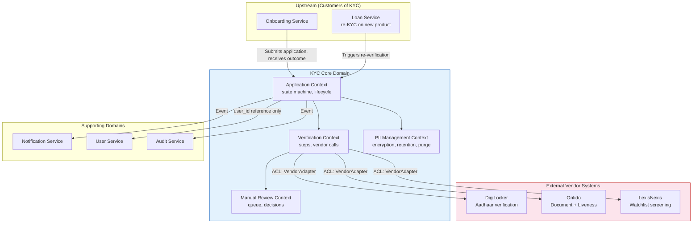

# 03 — DDD Boundaries: KYC / Identity Verification Pipeline

---

## Objective

Define bounded contexts, context mapping, internal module boundaries, and anti-corruption layers for the KYC pipeline.

---

## Bounded Context Map



---

## Internal Module Boundaries

```
com.fintech.kyc
├── application/                     ← Application Management Context
│   ├── domain/
│   │   ├── KycApplication.java
│   │   ├── KycStatus.java
│   │   ├── KycTier.java
│   │   └── StateTransition.java
│   ├── application/
│   │   ├── KycApplicationService.java
│   │   └── KycApplicationStateMachine.java
│   ├── infrastructure/
│   │   └── KycApplicationRepository.java
│   └── api/
│       └── KycApplicationController.java
│
├── verification/                    ← Verification Pipeline Context
│   ├── domain/
│   │   ├── VerificationStep.java
│   │   ├── VerificationOrchestrator.java
│   │   └── results/
│   │       ├── OcrResult.java
│   │       ├── LivenessResult.java
│   │       └── WatchlistResult.java
│   ├── vendor/
│   │   ├── VendorClient.java (interface)
│   │   ├── DigiLockerVendorAdapter.java
│   │   ├── OnfidoVendorAdapter.java
│   │   └── LexisNexisVendorAdapter.java
│   └── application/
│       └── VerificationPipelineService.java
│
├── review/                          ← Manual Review Context
│   ├── domain/
│   │   ├── ReviewCase.java
│   │   └── ReviewDecision.java
│   ├── application/
│   │   └── ManualReviewService.java
│   └── api/
│       └── ManualReviewController.java
│
├── pii/                             ← PII Management Context
│   ├── domain/
│   │   └── PiiRetentionPolicy.java
│   ├── application/
│   │   ├── PiiEncryptionService.java
│   │   └── PiiPurgeService.java
│   └── infrastructure/
│       └── KmsEncryptionAdapter.java
│
└── shared/                          ← Shared Kernel
    ├── VendorId.java
    ├── DocumentType.java
    └── EncryptedField.java
```

**Module Rules:**
- `verification` can call `application` (to update state) — one-way dependency
- `review` can call `application` (to read application, update to APPROVED/REJECTED) — one-way
- `pii` is called by `application` for all encryption/decryption — utility dependency
- No module reaches into another module's repository — all cross-module interactions via application services

---

## Anti-Corruption Layers: Vendor Adapters

Each external vendor has a different API, data format, and error model. The `VendorAdapter` translates vendor-specific language into the KYC domain's canonical model.

### DigiLockerVendorAdapter

Translates DigiLocker's Aadhaar eKYC XML response into the domain's `OcrResult`:

```
DigiLocker response: { "name": "RAVI KUMAR", "dob": "01-01-1990", "uid_masked": "XXXX-XXXX-1234" }
Domain OcrResult:   { extractedName: "Ravi Kumar", extractedDob: LocalDate(1990,1,1), confidence: 0.99 }
```

### OnfidoVendorAdapter

Translates Onfido's `check` object and `report` objects into `OcrResult` and `LivenessResult`.

Onfido uses async callbacks (webhooks). The adapter:
1. Registers a webhook callback URL with Onfido
2. Receives the callback, validates the signature (HMAC-SHA256)
3. Translates the callback payload to domain events
4. Forwards to the `VerificationPipelineService`

### LexisNexisVendorAdapter

Translates LexisNexis InstantID response XML into domain `WatchlistResult`:
- Maps LexisNexis risk scores (0–1400) to domain `risk_level` (LOW / MEDIUM / HIGH)
- Extracts only relevant `WatchlistHit` records (sanctions, PEP — ignores address verification hits)

---

## Published Language: Kafka Event Contracts

| Topic | Event Type | Published By | Consumed By |
|---|---|---|---|
| `kyc.application.submitted` | KycApplicationSubmitted | KYC Service | KYC Pipeline (self-consume) |
| `kyc.step.completed` | KycStepCompleted | KYC Service | KYC Orchestrator (self-consume) |
| `kyc.manual_review.required` | KycManualReviewRequired | KYC Service | Review Dashboard |
| `kyc.outcome.decided` | KycOutcomeDecided | KYC Service | Onboarding, Notification, AML |
| `kyc.application.expired` | KycApplicationExpired | Purge Scheduler | PII Purge Job |

**Schema: `KycOutcomeDecided`**

```json
{
  "schema_version": "1.0",
  "event_id": "uuid",
  "event_type": "kyc.outcome.decided",
  "application_id": "uuid",
  "user_id": "uuid",
  "kyc_tier": "STANDARD",
  "outcome": "APPROVED",
  "decided_at": "2024-01-15T10:30:00Z",
  "decision_source": "AUTOMATED",
  "metadata": {
    "document_type": "AADHAAR",
    "nationality": "IN"
  }
}
```

Note: No PII in Kafka events. Only identifiers and non-sensitive metadata.

---

## Context Relationships

| Pair | Relationship Type | Integration Pattern |
|---|---|---|
| Onboarding → KYC | Customer/Supplier | REST API (submit), Kafka (outcome) |
| KYC → Notification | Publisher/Subscriber | Kafka `kyc.outcome.decided` |
| KYC → DigiLocker | Conformist with ACL | VendorAdapter translates |
| KYC → Onfido | Conformist with ACL | VendorAdapter + webhook |
| KYC → AML | Published Language | Kafka event — AML reads KYC outcome |
| KYC ↔ PII Vault | Shared Infrastructure | KMS key management (not a domain) |

---

## Interview Discussion Points

- **Why is the vendor adapter critical?** Vendor APIs change. Onfido changed their check API schema twice in 2023. Without the adapter, every schema change requires modifying business logic throughout the codebase. With the adapter, only the adapter class changes — all business logic uses the stable domain model
- **How does the KYC service know which vendor to call?** The `VendorRouter` consults a configuration table (or feature flag) per `(stepType, documentType, nationality)`. For India + Aadhaar → DigiLocker. For passport in any country → Onfido. This routing is data-driven, not hardcoded
- **What if Onfido's webhook is delayed or lost?** The application polls for pending steps on a schedule (every 60 seconds). If a step has been IN_PROGRESS for > 10 minutes without a callback, the orchestrator polls the vendor's status API. If still no result, it retries the step or routes to manual review. No application is orphaned in IN_PROGRESS state
- **How does the AML service use the KYC outcome?** AML subscribes to `kyc.outcome.decided` to create a customer risk profile. The KYC outcome (watchlist hits, document type, nationality) feeds the AML risk scoring model. KYC and AML are different domains — KYC verifies identity, AML monitors behavior — but they share the customer identity as a join key (user_id)
