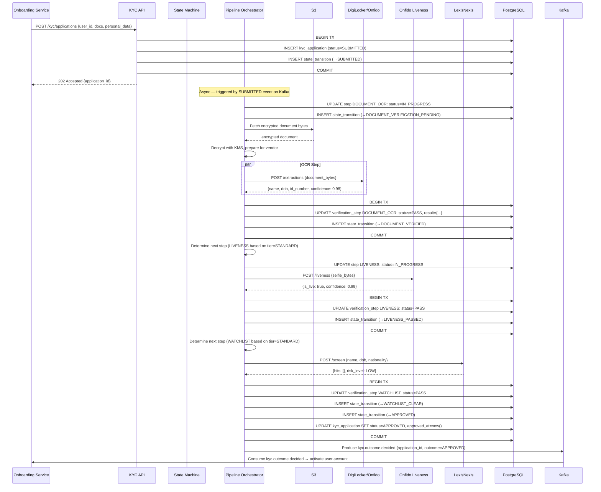
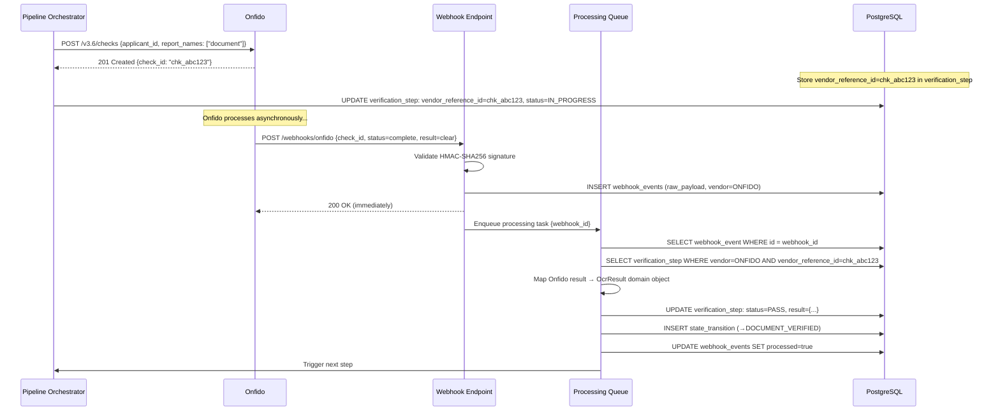
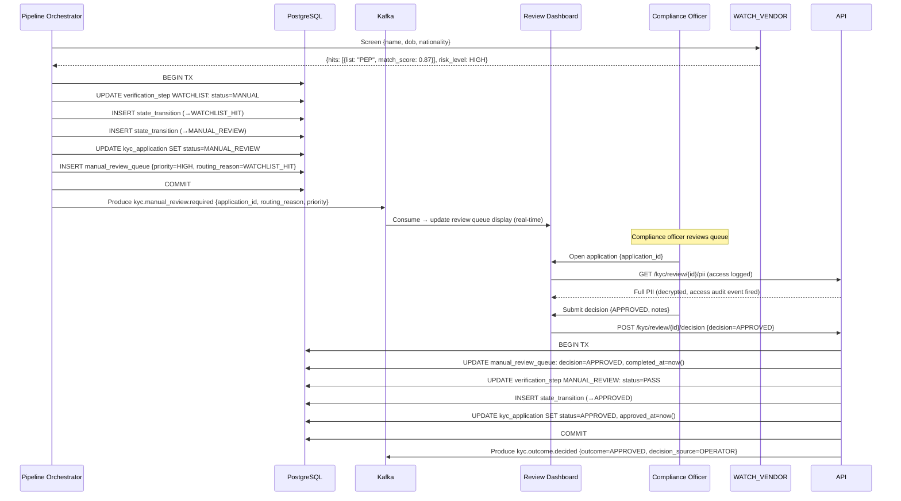
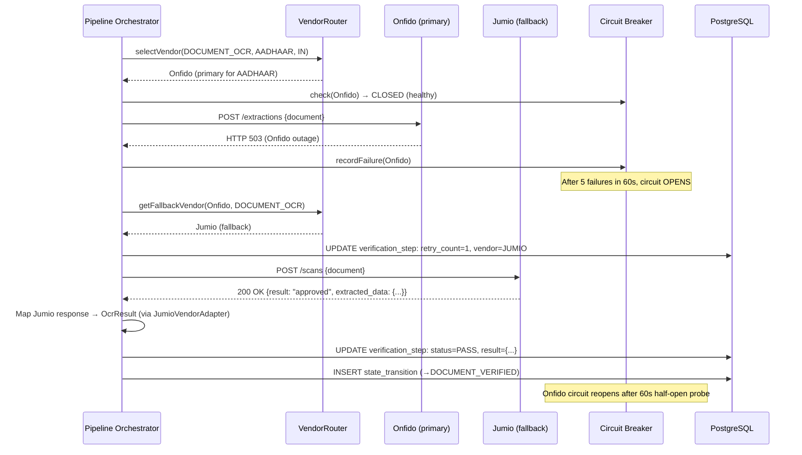
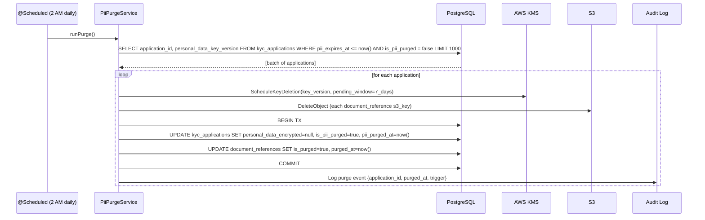

# 06 — Event Flow: KYC / Identity Verification Pipeline

---

## Objective

Document the complete event flows for KYC application processing, vendor callbacks, manual review, and downstream event consumption. The pipeline is async — events drive step transitions.

---

## Event Flows Overview

| Flow | Trigger | Duration |
|---|---|---|
| 1. Automated KYC (happy path) | Application submitted | 2–5 minutes |
| 2. Vendor callback (webhook) | Vendor posts result | < 2 seconds |
| 3. Manual review routing | Watchlist hit or quality issue | < 5 minutes to route; up to 24h for decision |
| 4. Re-verification trigger | Regulatory or risk event | Same as Flow 1 |
| 5. PII purge | Scheduled or user request | Background job |
| 6. Vendor fallback | Primary vendor unavailable | + 1–2 minutes |

---

## Flow 1: Automated KYC (Happy Path)

**Total time:** Document fetch (1s) + OCR (2s) + Liveness (3s) + Watchlist (0.5s) + DB operations (0.3s) ≈ **~7 seconds**. Well within the 3-minute target.

---

## Flow 2: Vendor Webhook Callback (Async Vendor)

Some vendors (Onfido) do not return results synchronously — they process and call back via webhook.

**Key pattern:** The webhook endpoint MUST return 200 within 3 seconds (Onfido's timeout). It stores the payload and queues processing. Never do business logic synchronously in the webhook handler.

---

## Flow 3: Manual Review Routing (Watchlist Hit)

---

## Flow 4: Vendor Fallback (Primary Vendor Unavailable)

---

## Flow 5: PII Purge (Scheduled)

---

## Kafka Event Schema Catalog

| Topic | Key | Retention | Payload Size |
|---|---|---|---|
| `kyc.application.submitted` | application_id | 7 days | < 1 KB (no PII) |
| `kyc.step.completed` | application_id | 7 days | < 2 KB (result metadata, no raw data) |
| `kyc.manual_review.required` | application_id | 30 days | < 1 KB |
| `kyc.outcome.decided` | application_id | 90 days | < 1 KB |
| `kyc.application.expired` | application_id | 7 days | < 500 bytes |

**No PII in Kafka events.** All events reference `application_id` and `user_id` as opaque UUIDs. No names, document numbers, or extracted data in the message payload.

---

## Failure Paths in Event Flow

| Failure | Detection | Recovery |
|---|---|---|
| Vendor OCR timeout | Timeout after 10s, retry circuit | Retry with same/fallback vendor; escalate to manual after 3 retries |
| Webhook signature invalid | 401 returned, security alert | Drop the event, security team investigates |
| DB transaction fails mid-transition | Rollback; state unchanged | Pipeline retries the step from current state |
| Kafka publish fails for outcome | Outbox pattern: retry until Kafka available | Onboarding polls status as fallback |
| Manual review not assigned for > 24h | Scheduled check for queue age | Auto-escalate priority; page compliance manager |

---

## Interview Discussion Points

- **Why not use a workflow engine (Temporal, Camunda) for the pipeline orchestration?** A custom state machine in PostgreSQL + Kafka is sufficient for 10,000 applications/day with 5–8 steps. Temporal adds value when workflows run for days or weeks (like loan servicing). KYC typically completes in minutes. The complexity cost of Temporal is not justified at this scale
- **What happens if the pipeline service restarts mid-processing?** The state machine is persisted in PostgreSQL. On restart, the pipeline queries for applications in non-terminal states that have been updated > 5 minutes ago (stalled) and re-triggers the current pending step. This is the "resumable pipeline" guarantee
- **How do you ensure exactly-once state transitions?** Each transition is written in a PostgreSQL transaction that also updates the application status. The UNIQUE index on `(application_id, step_type)` prevents duplicate steps. The state machine validates that the requested transition is valid from the current state — an already-completed step cannot be re-run
