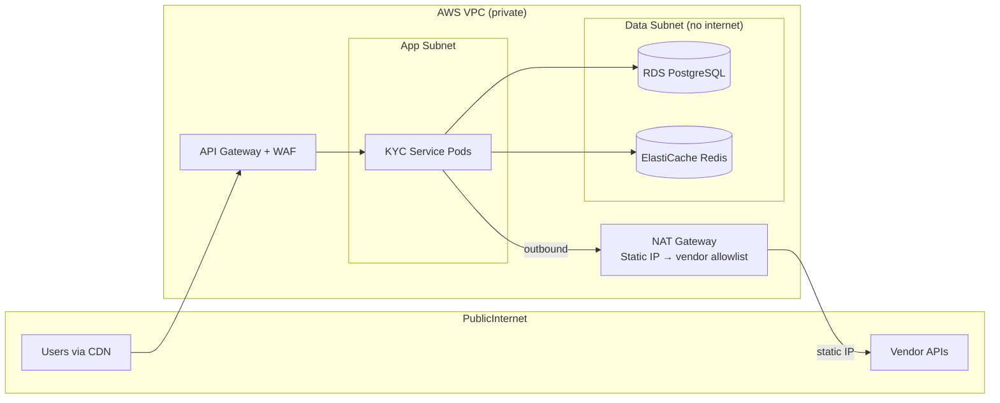

# 13 — Deployment Architecture: KYC / Identity Verification Pipeline

---

## Objective

Define the containerization, Kubernetes deployment, CI/CD pipeline, and environment strategy for the KYC service. Compliance requirements impose strict environment promotion gates.

---

## Container Strategy

- Base image: `eclipse-temurin:21-jre-alpine`
- Multi-stage build: compile JAR in `maven:3.9`, copy to runtime image
- Image scanning: Trivy — block on CRITICAL CVEs (financial service, no exception)
- Image signing: cosign with Sigstore for supply chain security
- No secrets in image: all injected via Kubernetes Secrets + AWS Secrets Manager

---

## Kubernetes Deployment

### Deployments

```yaml
# KYC API — handles HTTP requests
apiVersion: apps/v1
kind: Deployment
metadata:
  name: kyc-api
spec:
  replicas: 3
  strategy:
    type: RollingUpdate
    rollingUpdate:
      maxSurge: 2
      maxUnavailable: 0
  template:
    spec:
      containers:
      - name: kyc-api
        resources:
          requests: { cpu: "1", memory: "2Gi" }
          limits: { cpu: "2", memory: "4Gi" }

---
# KYC Pipeline Workers (OCR, Liveness, Watchlist, Orchestrator)
apiVersion: apps/v1
kind: Deployment
metadata:
  name: kyc-worker
spec:
  replicas: 3
  template:
    spec:
      containers:
      - name: kyc-worker
        resources:
          requests: { cpu: "2", memory: "4Gi" }  # Larger — holds decrypted PII in memory
          limits: { cpu: "4", memory: "8Gi" }
        env:
        - name: WORKER_THREAD_POOL_SIZE
          value: "20"
```

### HPA

```yaml
apiVersion: autoscaling/v2
kind: HorizontalPodAutoscaler
metadata:
  name: kyc-api-hpa
spec:
  minReplicas: 3
  maxReplicas: 15
  metrics:
  - type: Resource
    resource:
      name: cpu
      target:
        type: Utilization
        averageUtilization: 60
  - type: External
    external:
      metric:
        name: kafka_consumer_lag
        selector:
          matchLabels:
            consumer_group: kyc-ocr-worker
      target:
        type: AverageValue
        averageValue: 50    # Scale up if OCR lag > 50 per pod
```

### Pod Security Context

```yaml
securityContext:
  runAsNonRoot: true
  runAsUser: 1000
  readOnlyRootFilesystem: true
  allowPrivilegeEscalation: false
  capabilities:
    drop: [ALL]
```

No root access. Read-only filesystem. All ephemeral state in emptyDir volumes.

---

## Secrets Management

| Secret | Source | Rotation |
|---|---|---|
| DB credentials | AWS Secrets Manager (auto-rotate every 30 days) | Via secrets-store-csi-driver |
| KMS key ARN | AWS IAM (pod IAM role) | IAM role = no secret to rotate |
| Vendor API keys (Onfido, DigiLocker) | AWS Secrets Manager | Every 90 days |
| Kafka credentials | AWS Secrets Manager | Every 90 days |
| Webhook HMAC secrets | AWS Secrets Manager | Every 90 days |

**secrets-store-csi-driver:** Mounts Secrets Manager values as files into the pod. Application reads from files — secrets never appear in environment variables (which are visible in `kubectl describe pod`).

---

## CI/CD Pipeline

```mermaid
graph LR
    PR[Pull Request] --> CI
    CI --> UNIT[Unit Tests<br/>JUnit 5]
    UNIT --> INT[Integration Tests<br/>TestContainers<br/>+ Mock Vendor APIs]
    INT --> COMPLIANCE[Compliance Test Suite<br/>State machine invariants<br/>PII encryption verification<br/>Audit trail completeness]
    COMPLIANCE --> SCAN[Trivy Image Scan<br/>SAST (Checkmarx)]
    SCAN --> BUILD[Docker Build + Push]
    BUILD --> STAGING[Deploy to Staging<br/>Automated]
    STAGING --> E2E[End-to-End Tests<br/>Full KYC flow with<br/>sandbox vendor APIs]
    E2E --> APPROVAL{Manual Gate<br/>Tech Lead +<br/>Compliance Officer}
    APPROVAL -->|approved| PROD[Canary Deploy<br/>5% → 25% → 100%]
    PROD --> MONITOR[Monitor 20 minutes]
    MONITOR -->|healthy| FULL[Full Rollout]
    MONITOR -->|degraded| ROLLBACK[Auto Rollback]
```

### Compliance Test Suite (required before any production deploy)

A dedicated test suite that verifies:
1. State machine: every valid transition tested; every invalid transition throws exception
2. PII encryption: personal_data is encrypted before DB insert; decrypts correctly
3. Audit trail: every state transition generates a `state_transition` row
4. PII not in logs: log output scanned for patterns matching name/DOB/document formats
5. Vendor adapter: each adapter maps vendor responses to correct domain objects
6. Watchlist routing: WATCHLIST_HIT always routes to MANUAL_REVIEW (never auto-approve)

**No production deploy if compliance tests fail — not just unit tests.**

### Manual Approval Gate

Unlike most services, the KYC pipeline requires a compliance officer's sign-off before production deployment. This ensures:
- No regulatory features are changed without compliance awareness
- Configuration changes (watchlist thresholds, KYC tier rules) are reviewed

Implemented as a GitHub environment protection rule: `production` environment requires approval from `@compliance-reviewers` team.

---

## Vendor Sandbox Environments

Each external vendor provides a sandbox environment for testing:

| Vendor | Sandbox Feature | Use In |
|---|---|---|
| Onfido | Sandbox API key, test document sets | Integration tests, staging |
| DigiLocker | Sandbox with mock Aadhaar responses | Integration tests, staging |
| LexisNexis | Test mode with configurable hit/no-hit responses | Integration tests, staging |

**Vendor mock for unit/integration tests:** A `MockVendorClient` returns canned responses. TestContainers provides real PostgreSQL, Redis, and Kafka. No real vendor calls in CI.

---

## Environment Strategy

| Environment | Purpose | Data | Vendor |
|---|---|---|---|
| `dev` | Developer local | Synthetic | Mock VendorClient |
| `integration` | CI pipeline | Synthetic (TestContainers) | Mock VendorClient |
| `staging` | Pre-production | Anonymized production clone | Vendor sandbox APIs |
| `production` | Live | Real PII | Real vendor APIs |

**Staging data:** Anonymized production clone:
- `personal_data_encrypted` re-encrypted with staging KMS key
- Staging KMS key is separate from production — staging cannot decrypt production data
- Document images: replaced with synthetic test images (no real user documents in staging)

---

## Network Isolation



- Data subnet: no internet route — RDS and Redis are not accessible from outside the VPC
- KYC pods → vendors: all outbound through NAT Gateway with static IP — vendor allowlists this IP
- Inbound vendor webhooks: API Gateway WAF + IP restriction (vendor IP ranges only)

---

## Interview Discussion Points

- **Why does KYC deployment require a compliance officer sign-off?** KYC is a regulated function. A code change that accidentally lowers the watchlist screening threshold or skips a required step is a regulatory violation — not just a bug. The compliance officer sign-off ensures that no "engineering optimization" inadvertently weakens a legal requirement. This is a process control, not just a technical one
- **How do you test vendor API changes in staging?** Vendor sandbox APIs mirror production behavior. We maintain a test suite that runs against the sandbox: submit test documents, verify OCR extraction, check watchlist with known test cases (vendors provide "known PEP" test identities). Before a vendor's API version upgrade, run the full test suite against their new API version in staging
- **How do you ensure the compliance test suite is not just theater?** The test suite is maintained by the compliance engineering team (not the feature team). It uses production-style vendor adapter classes and real database transactions — not mocks of business logic. Quarterly review with the compliance officer to add new test cases for regulatory updates
- **What is the deployment strategy when you need to change the watchlist screening threshold (from 0.7 to 0.85)?** Feature flag: `kyc.watchlist.auto_review_threshold`. In staging, set to 0.85 and run a shadow test against historical application data — compare how many applications would have been auto-approved vs. routed to manual review. Present the analysis to the compliance officer. Deploy with flag disabled in production, compliance officer reviews the analysis and enables the flag. Rollback = flip the flag
