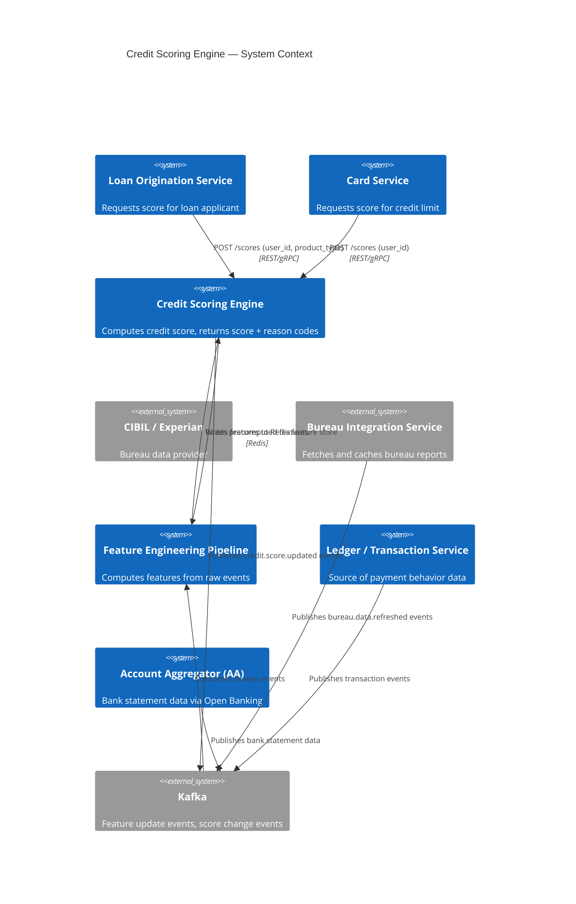
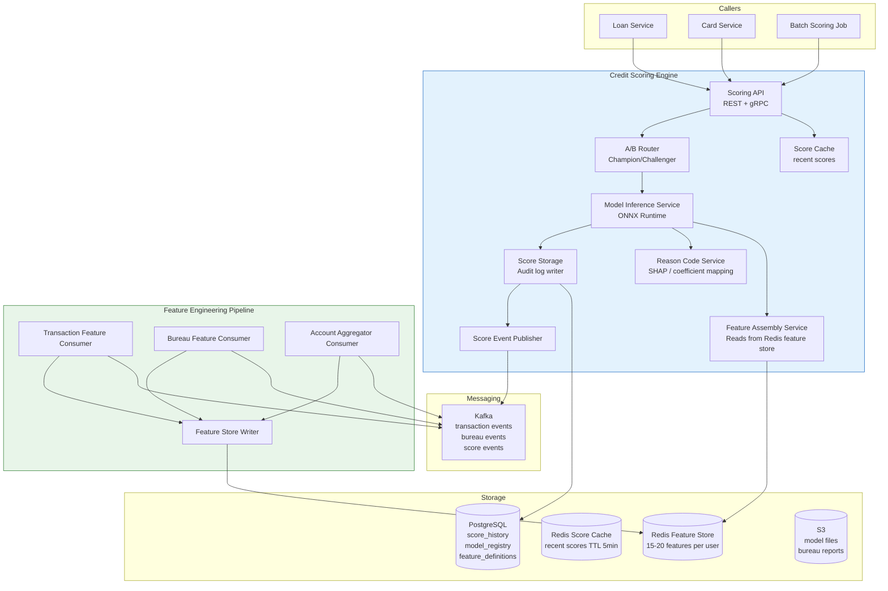
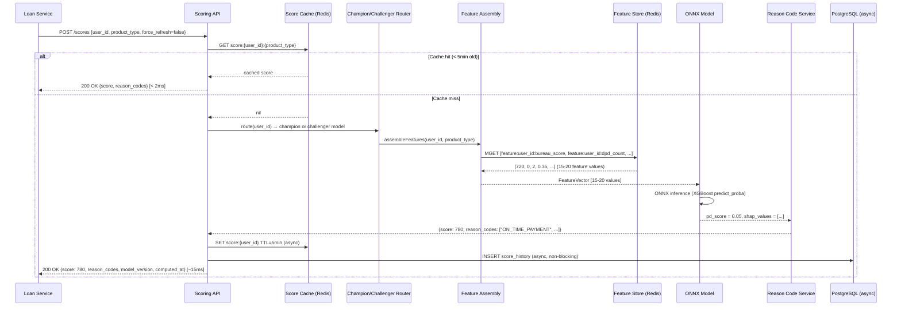
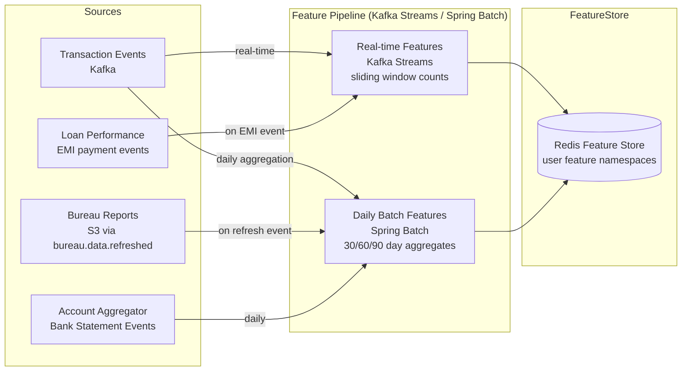

# 01 — High-Level Architecture: Credit Scoring Engine

---

## Objective

Define the architectural style, component model, and interaction patterns for the credit scoring engine. Justify the feature store + CQRS + event-driven architecture.

---

## Architecture Decision: CQRS + Feature Store + Event-Driven Feature Updates

### Chosen Architecture: CQRS with Precomputed Feature Store

**Why CQRS here?**

The credit scoring engine has two fundamentally different workloads:
1. **Command side:** Feature updates (transaction events, bureau data, account performance) — append-heavy, async
2. **Query side:** Score computation — read-heavy, latency-critical (< 200ms)

These two workloads have incompatible optimization requirements. The command side needs high write throughput and eventual consistency. The query side needs sub-10ms feature retrieval. CQRS separates them.

**The Feature Store is the read model.** Features are precomputed and stored in Redis. The real-time scoring path reads from Redis — no joins, no aggregations, no bureau API calls in the critical path.

**Why NOT compute features on-the-fly during scoring?**

If every score request triggered a live computation of all features (SQL aggregations over transaction history, bureau API call, etc.), the scoring latency would be 1–5 seconds — too slow for a loan application flow. The feature store trades feature freshness for speed.

**Why NOT use a dedicated ML platform (SageMaker, Vertex AI)?**

At the initial scale (50 RPS peak, 5M batch nightly), the operational overhead of SageMaker is not justified. An ONNX model served by the scoring engine itself is simpler. At 500 RPS+ or when model training + serving must be decoupled across teams, migrate to a managed ML platform.

---

## System Context



---

## Component Architecture



---

## Scoring Request Flow



---

## Feature Engineering Pipeline



---

## Champion-Challenger Architecture

The credit scoring engine runs two model versions simultaneously:

```
Incoming scoring request
  └── User ID hash % 100
        ├── 0–89 (90%) → Champion Model (production model, stable)
        └── 90–99 (10%) → Challenger Model (candidate model, being evaluated)

Score returned to caller: the model's output (caller doesn't know which model served)
Both scores stored in score_history with model_version column
```

**Purpose:** Scientifically compare model performance over time on real production data. After 30–60 days, the data science team compares:
- Default rates for champion-scored applications
- Default rates for challenger-scored applications

If the challenger performs better (lower default rate at same approval rate), promote it to champion.

**Promotion process:**
1. Data science team approves promotion after statistical significance check
2. Risk team reviews model validation report
3. Engineering deploys new model file to S3
4. Model registry updated: `champion_model_version` → new version
5. Scoring service loads new model on next hot-reload cycle (no redeploy)

---

## Architectural Tradeoffs

| Decision | Pro | Con |
|---|---|---|
| Precomputed feature store (Redis) | Sub-5ms feature retrieval; no DB joins on hot path | Features can be up to 24h stale for batch-updated features |
| ONNX model serving (in-process) | No network hop; < 3ms inference | Model update requires pod restart or hot-reload mechanism |
| Champion-challenger split | Scientific model comparison | Operational complexity; 10% of users get potentially worse scores |
| Score cache (5-minute TTL) | < 2ms for repeated requests | Loan application submitted minutes after a positive event may get slightly stale score |
| Async score storage | Non-blocking critical path | Score storage failure means audit gap (handled by Kafka outbox) |

---

## Interview Discussion Points

- **Why not call the bureau API on every score request?** Bureau API calls cost ₹15–₹50 per call and take 500ms–2 seconds. At 50 RPS: 50 × ₹50 = ₹2,500/minute = ₹3.6M/day. And the latency would exceed 200ms. The feature store pre-fetches bureau data and refreshes it every 30 days — aligns with bureau update frequency
- **Why precompute features instead of computing at score time?** At 50 RPS real-time scoring, computing `SELECT SUM(amount) FROM transactions WHERE user_id=? AND date > ? GROUP BY month` in real-time across 24 months of history is a scan of potentially millions of rows. With the feature store, this aggregate is precomputed and stored as a single Redis key — O(1) retrieval
- **What is the feature freshness problem and how do you handle it?** A user makes an EMI payment 10 minutes before applying for a new loan. The batch feature pipeline runs at midnight — the payment isn't reflected in the feature store yet. The real-time feature pipeline (Kafka Streams) processes payment events within 60 seconds and updates the relevant features (DPD count, payment velocity). This hybrid approach balances freshness and cost
