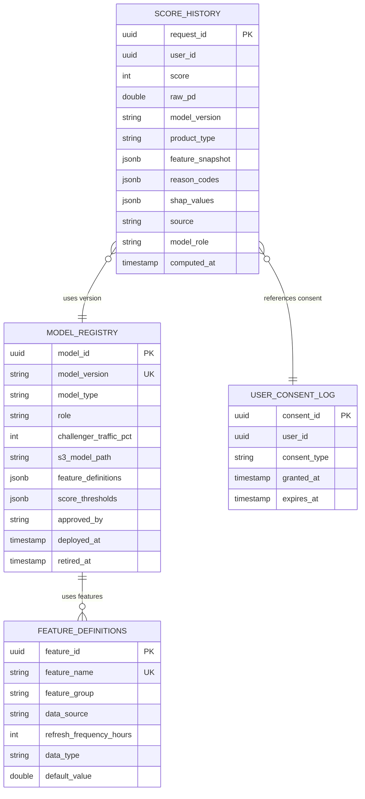

# 02 — Domain Modeling: Credit Scoring Engine

---

## Objective

Define the core domain model for the credit scoring engine: aggregates, feature definitions, model registry, and domain events.

---

## Ubiquitous Language

| Term | Definition |
|---|---|
| **Credit Score** | A number (300–900) representing the probability of default; higher = lower risk |
| **Probability of Default (PD)** | Model output (0.0–1.0): the likelihood that the borrower will default within 12 months |
| **Feature** | A single input variable to the model (e.g., CIBIL score, number of DPDs in last 6 months) |
| **Feature Vector** | The ordered list of all feature values for a single user passed to the model |
| **Feature Store** | Pre-computed, indexed store of the latest feature values per user |
| **Model Version** | A specific trained model artifact with a defined set of input features |
| **Champion Model** | The current production model serving the majority of requests |
| **Challenger Model** | A candidate model being tested against the champion on live traffic |
| **DPD (Days Past Due)** | How many days a borrower is overdue on a payment; key credit risk signal |
| **Thin File** | A user with little or no credit bureau history — requires alternative data scoring |
| **Reason Code** | A standardized string explaining why a score is high or low (regulatory requirement) |
| **Adverse Action** | The notice given to a declined applicant stating the reason for decline (ECOA mandate) |
| **SHAP Value** | A game-theoretic measure of each feature's contribution to the model output |
| **Score Vintage** | The date a score was computed — scores age and must be refreshed |

---

## Aggregate Design

### Aggregate 1: `CreditScoreRequest` (Write-side Command)

Represents a single scoring event — what was computed, from what inputs, at what time.

```
CreditScoreRequest (Aggregate Root)
├── request_id: UUID (identity)
├── user_id: UUID
├── product_type: ProductType (PERSONAL_LOAN | HOME_LOAN | CREDIT_CARD | BNPL)
├── score: CreditScore (Value Object)
├── model_version: ModelVersion
├── feature_snapshot: FeatureSnapshot (Value Object — all features used)
├── reason_codes: List<ReasonCode>
├── shap_values: Map<FeatureName, Double> (explainability)
├── computed_at: Instant
├── source: ScoreSource (REAL_TIME | BATCH | CACHE)
├── champion_or_challenger: ModelRole (CHAMPION | CHALLENGER)
├── consent_reference_id: UUID (bureau data consent)
└── is_thin_file: Boolean

Domain Events emitted:
  CreditScoreComputed { request_id, user_id, score, model_version, computed_at }
  CreditScoreSignificantChange { user_id, old_score, new_score, change_delta }
```

---

### Aggregate 2: `UserFeatureProfile` (Read-side Projection)

The precomputed feature set for a user. This IS the feature store entity.

```
UserFeatureProfile (managed by Feature Pipeline, read by Scoring Engine)
├── user_id: UUID (identity / partition key)
├── features: Map<FeatureName, FeatureValue>
│   Example features:
│   ├── bureau.cibil_score: 720
│   ├── bureau.account_count: 5
│   ├── bureau.dpd_last_6m: 0
│   ├── bureau.credit_utilization: 0.35
│   ├── bureau.inquiry_count_last_90d: 2
│   ├── behavior.upi_txn_count_last_30d: 45
│   ├── behavior.avg_monthly_credit: 85000
│   ├── behavior.salary_credit_regular: true
│   ├── performance.current_emi_dpd: 0
│   ├── performance.ever_dpd_30plus: false
│   ├── account.age_months: 36
│   └── account.product_mix_diversity: 3
├── thin_file: Boolean
├── bureau_as_of: Instant (when bureau data was last refreshed)
├── behavior_as_of: Instant (when behavioral features were last refreshed)
└── profile_version: Long (optimistic lock for feature store writes)
```

---

### Aggregate 3: `ModelRegistration` (Model Lifecycle)

Tracks deployed model versions and their status.

```
ModelRegistration (Aggregate Root)
├── model_id: UUID
├── model_version: String (e.g., "xgb-v2.3.1")
├── model_type: ModelType (XGBOOST | LOGISTIC_REGRESSION | LIGHTGBM)
├── product_types: List<ProductType> (which products this model serves)
├── role: ModelRole (CHAMPION | CHALLENGER | SHADOW | RETIRED)
├── challenger_traffic_pct: Int (e.g., 10 for 10% of traffic)
├── s3_model_path: String (ONNX model file location)
├── feature_definitions: List<FeatureDefinition> (ordered list of features the model expects)
├── score_thresholds: ScoreThresholds (min/max PD to score mapping)
├── validation_report_s3_path: String
├── approved_by: String (risk team approval)
├── deployed_at: Instant
└── retired_at: Instant (nullable)
```

---

## Value Objects

### `CreditScore`

```
CreditScore
├── raw_pd: Double (probability of default 0.0–1.0)
├── score: Int (mapped to 300–900 scale)
└── band: ScoreBand (EXCELLENT | GOOD | FAIR | POOR | VERY_POOR)

Mapping: score = 900 - (raw_pd × 600) [simplified linear scaling]
Band:
  EXCELLENT: 750–900
  GOOD:      700–749
  FAIR:      650–699
  POOR:      550–649
  VERY_POOR: 300–549
```

### `ReasonCode`

```
ReasonCode
├── code: String (e.g., "HIGH_DPD", "HIGH_UTILIZATION", "LOW_INCOME_ESTIMATE")
├── description: String (regulatory-compliant English description)
├── feature_name: String (which feature drove this reason code)
├── direction: NEGATIVE | POSITIVE (is it hurting or helping the score)
└── rank: Int (1 = most impactful reason code)

Standard reason codes (ECOA-compliant):
  01 - "Delinquency on accounts"
  02 - "Too high utilization of revolving credit"
  03 - "Too many recent credit inquiries"
  04 - "Short length of credit history"
  05 - "Limited credit history (thin file)"
  06 - "Poor payment history on current loans"
```

### `FeatureSnapshot`

```
FeatureSnapshot
├── features: Map<FeatureName, FeatureValue>  (all features at time of scoring)
├── snapshot_at: Instant
└── feature_source: Map<FeatureName, DataSource>  (where each feature came from)

DataSource: BUREAU | BEHAVIORAL | ACCOUNT_AGGREGATOR | INTERNAL_ACCOUNT | ALTERNATIVE
```

### `ModelVersion`

```
ModelVersion
├── version_string: String (e.g., "xgb-v2.3.1")
├── deployed_at: Instant
└── role: CHAMPION | CHALLENGER
```

---

## Domain Services

### `ScoringOrchestrator`

Coordinates the scoring flow: feature assembly → model inference → reason code generation → score storage.

```
ScoringOrchestrator
├── computeScore(userId, productType, forceRefresh): CreditScoreResult
├── routeToModel(userId): ModelRegistration (champion or challenger)
├── isCacheEligible(userId, productType): boolean
└── computeScoreBatch(userIds, productType): List<CreditScoreResult>
```

### `FeatureAssemblyService`

Retrieves and validates features from the feature store for a given user.

```
FeatureAssemblyService
├── assembleFeatures(userId, modelVersion): FeatureVector
├── isThinFile(userId): boolean
├── getFeatureFreshness(userId): Map<FeatureName, Instant>
└── validateFeatureCompleteness(featureVector, model): ValidationResult
```

### `ModelInferenceService`

Wraps ONNX Runtime for model inference.

```
ModelInferenceService
├── predict(featureVector, model): InferenceResult { pd, rawScores, shapValues }
├── loadModel(s3Path): OnnxSession
├── hotReload(newModelVersion): void
└── warmup(model): void  (pre-warm JVM JIT on startup)
```

### `ReasonCodeService`

Maps SHAP values to regulatory reason codes.

```
ReasonCodeService
├── generateReasonCodes(shapValues, featureVector): List<ReasonCode>
├── getAdverseActionNotice(reasonCodes, locale): String
└── isDeclineReason(reasonCode): boolean
```

### `ScoreChangeDetector`

Compares the new score against the previous score for the same user. Emits events on significant changes.

```
ScoreChangeDetector
├── detectChange(userId, newScore): Optional<ScoreChangedEvent>
└── isSignificantChange(oldScore, newScore): boolean  // threshold: ±20 points
```

---

## Domain Events

| Event | Trigger | Consumers |
|---|---|---|
| `CreditScoreComputed` | Every score computation (real-time + batch) | Score history DB (async), Audit log |
| `CreditScoreSignificantChange` | Score changes by ± 20+ points | Loan service (may re-evaluate pending application), Risk, CRM |
| `UserFeatureProfileUpdated` | Feature pipeline writes new values | Score cache invalidation |
| `ModelPromoted` | Challenger promoted to champion | Scoring engine reloads model |
| `BureauDataRefreshed` | Bureau integration fetches fresh bureau report | Feature pipeline processes new bureau data |

---

## Entity Relationship



---

## Interview Discussion Points

- **Why store the full feature snapshot with every score?** Reproducibility + audit. If a loan was declined and the customer disputes the decision, the exact feature values used for that score must be provable. The feature store may have been updated since; the snapshot preserves the point-in-time view used for the decision
- **How does the reason code map to a SHAP value?** SHAP values tell us the contribution of each feature to the model output. We sort features by |SHAP value| descending. The top 4 features → reason codes. Each feature_name maps to a standardized reason code string (e.g., `bureau.dpd_last_6m → "01 - Delinquency on accounts"`). This mapping is maintained as a configuration table
- **Why does ModelRegistration include feature_definitions?** Different model versions may use different feature sets. The scoring engine must know which features to retrieve from the feature store for each model. Feature definitions also ensure backward compatibility: if a new model adds a feature, the feature pipeline must be updated to compute it before the model is deployed
- **What is the difference between raw_pd and score?** `raw_pd` is the model's native output (probability of default, 0.0–1.0). `score` is the user-facing number (300–900). The transformation: `score = round(900 - raw_pd × 600)`. Both are stored in `score_history` — raw_pd for model performance monitoring, score for regulatory reporting and customer communication
