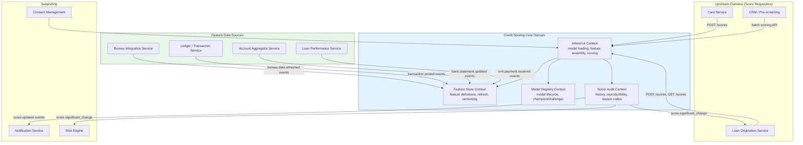

# 03 — DDD Boundaries: Credit Scoring Engine

---

## Objective

Define bounded contexts, context mapping, module boundaries, and anti-corruption layers for the credit scoring engine.

---

## Bounded Context Map



---

## Internal Module Boundaries

```
com.fintech.scoring
├── inference/                      ← Inference Context
│   ├── domain/
│   │   ├── CreditScoreRequest.java
│   │   ├── CreditScore.java
│   │   ├── FeatureVector.java
│   │   └── ReasonCode.java
│   ├── application/
│   │   ├── ScoringOrchestrator.java
│   │   ├── ChampionChallengerRouter.java
│   │   └── ScoreCacheService.java
│   ├── model/
│   │   ├── ModelInferenceService.java  (ONNX Runtime wrapper)
│   │   └── OnnxModelLoader.java
│   └── api/
│       └── ScoringController.java
│
├── features/                       ← Feature Store Context
│   ├── domain/
│   │   ├── UserFeatureProfile.java
│   │   ├── FeatureDefinition.java
│   │   └── FeatureGroup.java
│   ├── application/
│   │   ├── FeatureAssemblyService.java
│   │   └── ThinFileDetector.java
│   ├── pipeline/
│   │   ├── BureauFeatureConsumer.java
│   │   ├── TransactionFeatureConsumer.java
│   │   └── AccountAggregatorFeatureConsumer.java
│   └── infrastructure/
│       ├── RedisFeatureStoreAdapter.java
│       └── FeatureStoreRepository.java
│
├── models/                         ← Model Registry Context
│   ├── domain/
│   │   ├── ModelRegistration.java
│   │   └── ModelRole.java
│   ├── application/
│   │   ├── ModelRegistryService.java
│   │   └── ModelPromotionService.java
│   └── infrastructure/
│       └── S3ModelRepository.java
│
├── audit/                          ← Score Audit Context
│   ├── domain/
│   │   ├── ScoreHistoryRecord.java
│   │   └── ScoreChangedEvent.java
│   ├── application/
│   │   ├── ScoreHistoryService.java
│   │   ├── ScoreChangeDetector.java
│   │   └── ReasonCodeService.java
│   └── infrastructure/
│       └── ScoreHistoryRepository.java
│
└── shared/
    ├── ModelVersion.java
    ├── ProductType.java
    └── FeatureName.java (enum or constant class)
```

---

## Anti-Corruption Layers

### BureauDataAdapter (translates CIBIL/Experian → domain features)

CIBIL returns a complex report XML. The ACL maps specific fields to canonical feature names:

```
CIBIL Report field → Feature Name
  CIBILTUScore        → bureau.cibil_score
  TotalAccountCount   → bureau.account_count
  NumberOfDPDs(6M)    → bureau.dpd_last_6m
  SummaryUtilization  → bureau.credit_utilization
  InquiryCount(90D)   → bureau.inquiry_count_last_90d
  AgeOfOldestAccount  → bureau.oldest_account_months
  CurrentBalanceTotal → bureau.total_outstanding
```

The scoring engine never sees CIBIL's data model — only canonical feature names.

### TransactionFeatureAdapter (translates Ledger events → behavioral features)

```
Ledger transaction events → Feature
  count(EMI payments, 30d)       → behavior.emi_count_last_30d
  sum(credits, 30d)              → behavior.avg_monthly_credit
  streak(salary credit, months)  → behavior.salary_credit_streak_months
  count(UPI txn, 30d)            → behavior.upi_txn_count_last_30d
  max_single_credit              → behavior.max_single_credit_event
```

---

## Published Language: Score Event Schema

```json
{
  "schema_version": "1.0",
  "event_id": "uuid",
  "event_type": "credit.score.updated",
  "user_id": "uuid",
  "score": 780,
  "score_band": "GOOD",
  "model_version": "xgb-v2.3.1",
  "product_type": "PERSONAL_LOAN",
  "reason_codes": ["01", "03"],
  "computed_at": "2024-01-15T10:30:00Z",
  "is_significant_change": false
}
```

No raw_pd in the event — raw probability of default is internal model information, not shared externally.

---

## Context Relationships

| Pair | Relationship | Pattern |
|---|---|---|
| Loan Service → Scoring Engine | Customer/Supplier | REST/gRPC API |
| Bureau Integration → Feature Pipeline | Published Language | Kafka `bureau.data.refreshed` event |
| Ledger → Feature Pipeline | Published Language | Kafka `transaction.posted` event |
| Scoring Engine → Loan Service | Publisher/Subscriber | `credit.score.significant_change` |
| Consent Management → Scoring Engine | Conformist | Scoring checks consent before using bureau data |
| Model Registry → Inference Engine | Shared Kernel (internal) | Loaded model file + feature definitions |

---

## Interview Discussion Points

- **Why does the scoring engine not call the bureau API directly?** Bureau API calls cost money and take 500ms–2s. The Bureau Integration Service handles bureau API calls asynchronously (on application submission, on periodic refresh). The scoring engine reads from the feature store — pure read, sub-5ms. This separation of concerns also means consent management and bureau API error handling are centralized
- **How does consent management integrate?** Before assembling bureau features for a score, the `FeatureAssemblyService` checks: `ConsentManagement.hasValidConsent(userId, BUREAU_DATA_CONSENT)`. If no consent: exclude bureau features, use only behavioral + internal account features. This produces a "no-bureau" score — typically lower, as bureau features are strong predictors. Consent expiry triggers a re-consent request before the next bureau-dependent scoring
- **What is the risk of the feature store becoming stale?** Real-time events (EMI payment, UPI transaction) are processed within 60 seconds via Kafka Streams. Bureau data is refreshed every 30 days (per CIBIL's data license). The score cache (5-minute TTL) means a loan application submitted immediately after an EMI payment could use a 5-minute-old score. For high-value decisions: `force_refresh=true` bypasses cache and reads from the feature store directly (still < 15ms since feature store is Redis)
