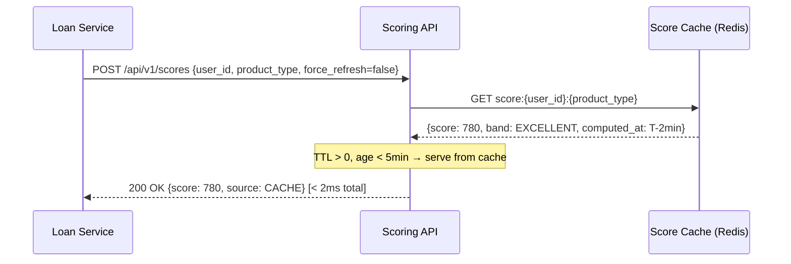
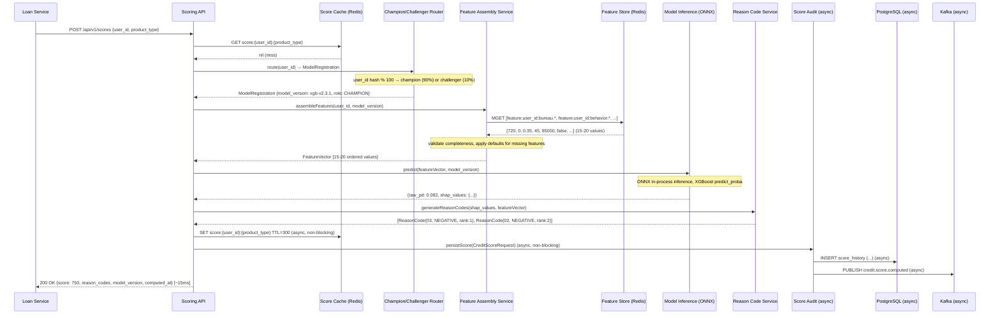
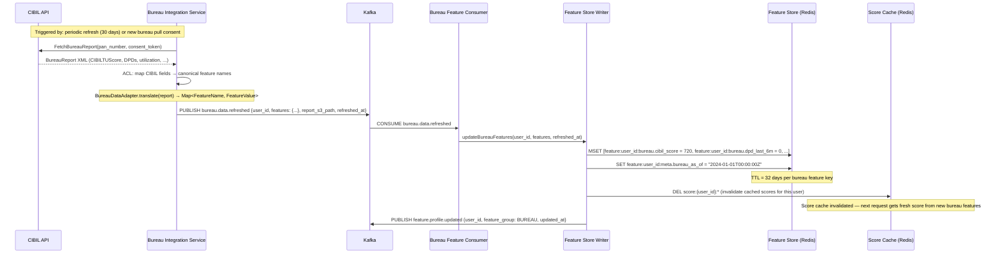
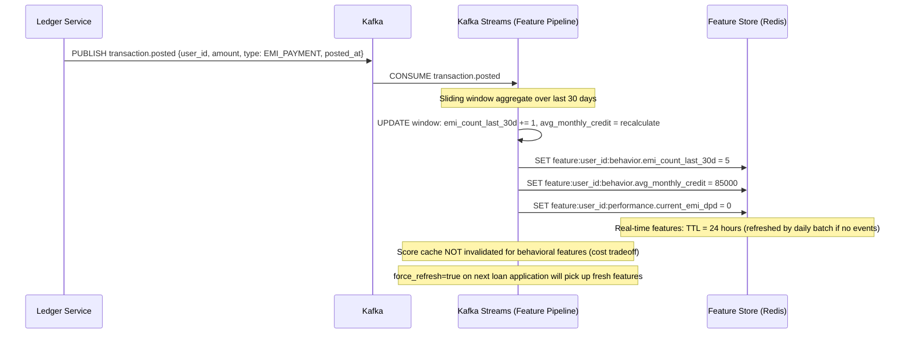
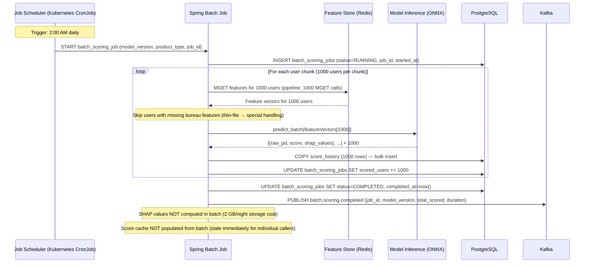
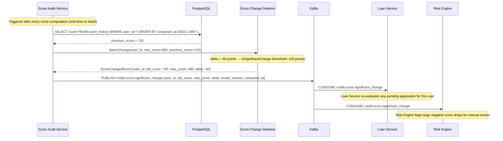
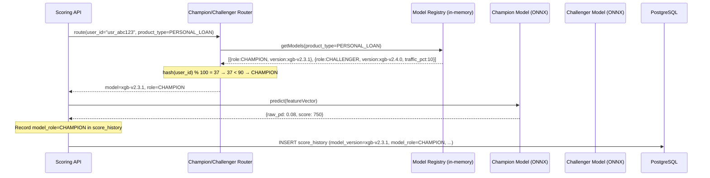
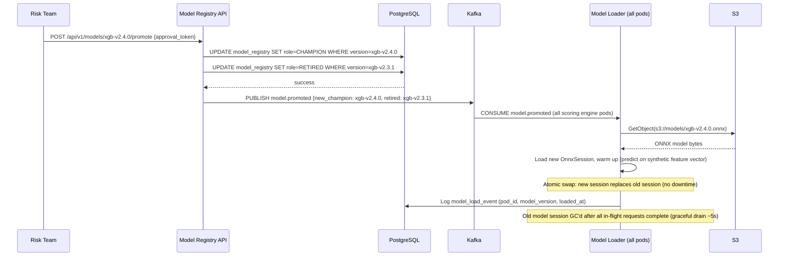

# 06 — Event Flow: Credit Scoring Engine

---

## Objective

Document the complete event flows for real-time scoring, batch scoring, feature pipeline updates, score change detection, and champion-challenger routing. Include timing budgets and failure handling at each step.

---

## Flow 1: Real-Time Score Request (Cache Hit)

**Timing budget:** Redis GET = 0.5ms, JSON deserialization = 0.2ms, response = < 2ms total.

No database read. No model inference. No Kafka events emitted on cache hit.

---

## Flow 2: Real-Time Score Request (Cache Miss — Full Inference)

**Timing budget:**

| Step | Budget |
|---|---|
| Score cache miss check | 0.5ms |
| Champion/challenger routing (in-memory) | < 0.1ms |
| Feature assembly — Redis MGET | 3–5ms |
| ONNX model inference | 1–3ms |
| Reason code generation | 0.5ms |
| JSON serialization + network | 2–5ms |
| **Total P50** | **~10ms** |
| **Total P99** | **< 200ms** |

Async paths (score cache write, DB insert, Kafka publish) do NOT block the response.

---

## Flow 3: Feature Update — Bureau Data Refreshed

**Lag budget:** CIBIL API call (async, non-blocking from scoring path) → Kafka message → consumer → Redis update. Total feature store update lag: < 60 seconds from bureau data received.

---

## Flow 4: Real-Time Feature Update — Transaction Event

**Freshness SLA:** transaction event → behavioral feature update in Redis: < 60 seconds.

**Tradeoff:** score cache is NOT invalidated on every transaction (too expensive at 50 RPS × many transactions). The 5-minute TTL naturally expires stale scores. For final loan decision: caller sets `force_refresh=true`.

---

## Flow 5: Batch Scoring (Nightly Job)

**Scale:** 5M users / 1000 per chunk = 5000 chunks. At 2 chunks/second = 2500 seconds (~42 minutes). Target: complete before 6:00 AM.

**Parallelism:** 10 Spring Batch partitions (5 parallel workers, 2 chunks each in flight). Estimated runtime: < 15 minutes.

---

## Flow 6: Score Change Detection and Event Publishing

**Threshold rationale:** ±20 points chosen because:
- < 20 points: normal model variance, credit line fluctuation — not actionable
- ≥ 20 points: meaningful change (e.g., new DPD, resolved collection) — upstream decisions should be re-evaluated

---

## Flow 7: Champion-Challenger Routing

**For challenger traffic (hash % 100 ≥ 90):**
- Route to `xgb-v2.4.0`, record `model_role=CHALLENGER`
- Caller receives identical response format — does not know it received challenger model
- Both champion and challenger scores independently persisted in `score_history`

**Shadow mode:** `model_role=SHADOW` — compute score but do NOT return to caller. Used for new model validation before challenger traffic is enabled.

---

## Flow 8: Model Hot-Reload

**No pod restart required.** Hot-reload via Kafka event → S3 fetch → in-memory session swap. All pods load independently.

---

## Flow Timing Summary

| Flow | P50 Latency | P99 Latency | Async? |
|---|---|---|---|
| Real-time score (cache hit) | < 2ms | < 5ms | No |
| Real-time score (cache miss) | ~10ms | < 200ms | Score write async |
| Bureau feature update | ~60s end-to-end | ~120s | Yes (Kafka) |
| Transaction feature update | ~30s | ~60s | Yes (Kafka Streams) |
| Batch scoring (5M users) | 42 min single / 15 min parallel | — | Yes (CronJob) |
| Score change detection | < 5ms | < 20ms | Yes (Kafka) |
| Model hot-reload | ~15s per pod | ~30s | Yes (Kafka) |

---

## Interview Discussion Points

- **Why is score cache NOT invalidated on every transaction event?** At 50 RPS scoring and millions of users transacting daily, invalidating the score cache on every transaction would flood the scoring path with cache misses. The 5-minute TTL is a deliberate staleness tolerance. For high-value decisions (final loan submission), `force_refresh=true` bypasses cache and reads fresh features
- **What happens if the batch scoring job fails midway?** Spring Batch checkpoints at the chunk level (1000 users). Restart resumes from the last committed chunk. `scored_users` counter tracks progress. Users scored in the failed run are skipped (idempotent: upsert by request_id). The job failure triggers a PagerDuty alert — must complete before business hours
- **How are champion and challenger scores compared?** `score_history` stores `model_role` per row. After 45 days: `SELECT model_role, model_version, AVG(raw_pd), COUNT(*) FROM score_history WHERE computed_at > NOW() - INTERVAL '45 days' GROUP BY model_role, model_version` — then joined against loan performance data (did the user actually default?). Gini coefficient and KS statistic compared
- **Why use Kafka Streams for behavioral features instead of batch?** Loan EMI payment at 11:45 PM should be reflected before the 2 AM batch scoring run. Real-time Kafka Streams updates `behavior.current_emi_dpd = 0` within 60 seconds. Without real-time features, a user who just paid off a DPD would be batch-scored with stale negative signals — materially affecting their credit limit decision next morning
