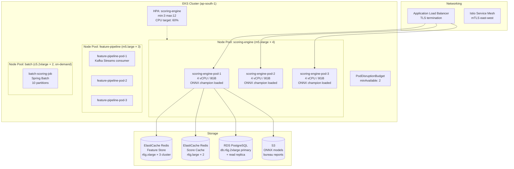
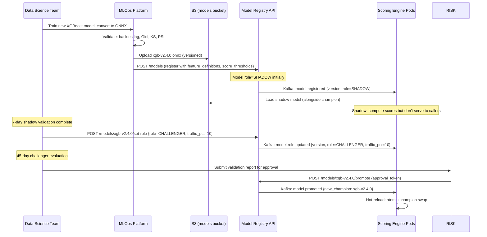

# 13 — Deployment Architecture: Credit Scoring Engine

---

## Objective

Define the Kubernetes deployment topology, CI/CD pipeline, zero-downtime deployment strategy, model deployment lifecycle (separate from application deployment), environment separation, and infrastructure-as-code approach for the credit scoring engine.

---

## Kubernetes Deployment Topology



---

## Scoring Engine Pod Specification

```yaml
resources:
  requests:
    cpu: "2"
    memory: "4Gi"
  limits:
    cpu: "4"
    memory: "8Gi"

# ONNX model + JVM heap + feature assembly overhead
# JVM: -Xms2g -Xmx4g -XX:+UseG1GC -XX:MaxGCPauseMillis=10

readinessProbe:
  httpGet:
    path: /actuator/health/readiness
    port: 8080
  initialDelaySeconds: 30  # ONNX model load time
  periodSeconds: 5
  failureThreshold: 3

livenessProbe:
  httpGet:
    path: /actuator/health/liveness
    port: 8080
  initialDelaySeconds: 60
  periodSeconds: 10

lifecycle:
  preStop:
    exec:
      command: ["sleep", "15"]  # drain in-flight requests before pod shutdown
```

**Readiness probe:** pod is NOT ready until ONNX model is loaded (warmup complete). New pods receive traffic only after model is initialized. Prevents "model not loaded" 503s during rolling deployments.

**preStop sleep:** Kubernetes removes pod from service endpoints before SIGTERM. 15-second sleep allows in-flight scoring requests to complete before process exits.

---

## Zero-Downtime Deployment Strategy

### Application Rolling Update

```yaml
strategy:
  type: RollingUpdate
  rollingUpdate:
    maxUnavailable: 0   # never reduce below current replica count
    maxSurge: 1         # add 1 new pod before terminating 1 old pod
```

**Flow:**
1. New pod starts → ONNX model loads (~10s) → warmup inference on synthetic vectors
2. Readiness probe passes → pod added to service
3. Old pod receives SIGTERM → preStop sleep (15s) → graceful shutdown
4. Repeat for next pod

**Total deployment time:** (load + warmup: 30s) × N pods sequentially. For 3 pods: ~3 minutes. For 12 pods (auto-scaled): ~6 minutes. Acceptable — no business-hours impact.

### Canary Deployment for High-Risk Changes

For changes affecting scoring logic, feature assembly, or caching:

```
Stage 1: Deploy to 1 pod (Argo Rollouts canary)
  → Monitor: P99 latency, error rate, score distribution
  → Duration: 30 minutes

Stage 2: 30% of pods (Istio traffic split)
  → Monitor: same metrics, plus compare score distributions
  → Duration: 1 hour

Stage 3: Full rollout
  → Auto-promote if no alerts fired
```

**Argo Rollouts analysis template:**
```yaml
metrics:
- name: score-error-rate
  successCondition: result[0] < 0.001
  provider:
    prometheus:
      query: sum(rate(credit_scoring_computations_total{result="error"}[5m]))
           / sum(rate(credit_scoring_computations_total[5m]))
```

---

## Model Deployment Lifecycle (Separate from Application)

**Key principle:** model promotion does NOT require application redeployment. Model lifecycle is managed independently via model registry + hot-reload.



**S3 path naming convention:** `s3://ml-models-prod/xgb/{model_version}/model.onnx`
**IAM policy:** only scoring engine pod role can `s3:GetObject` on model files. MLOps pipeline has `s3:PutObject`. No public access.

---

## CI/CD Pipeline

```
GitHub → GitHub Actions → ECR → EKS

Stages:
1. Build (PR)
   ├── mvn clean verify (unit + integration tests)
   ├── Model feature compatibility check (verify feature_definitions match model expectations)
   └── Docker build: scoring-engine:{git-sha}

2. Security scan
   ├── Trivy: container vulnerability scan
   ├── OWASP Dependency Check: Java dependencies
   └── Block on HIGH/CRITICAL findings

3. Integration (PR merged to main)
   ├── Deploy to staging EKS namespace
   ├── Run integration test suite:
   │   ├── Score computation with mock feature store
   │   ├── Champion/challenger routing distribution test
   │   ├── Idempotency test (same request_id returns same score)
   │   ├── Feature fallback test (missing features → default values)
   │   └── Adverse action notice generation test
   └── Run regulatory compliance test suite:
       ├── Reason codes present in every response
       ├── Score in 300–900 range
       └── Consent enforcement: no bureau features without consent

4. Production deploy (approved)
   ├── Argo Rollouts canary (1 pod → 30% → 100%)
   ├── Automated rollback on error rate > 0.1%
   └── Slack notify: deployment complete + key metrics
```

### Compliance Test Suite

Added as mandatory CI gate (separate from unit tests):

| Test | Assertion |
|---|---|
| `testReasonCodesAlwaysPresent` | Every 200 score response has ≥ 1 reason code |
| `testScoreRangeEnforced` | Score always 300–900 |
| `testNoBureauFeaturesWithoutConsent` | Consent check fails → feature_snapshot has no bureau.* keys |
| `testFeatureSnapshotStoredWithEveryScore` | score_history.feature_snapshot is non-null for every INSERT |
| `testIdempotencyPreserved` | Same request_id → same score returned |
| `testAdverseActionForDeclinedScore` | Score < 550 → adverse action notice available |

---

## Environment Strategy

| Environment | Purpose | Scale | Feature Store |
|---|---|---|---|
| Local (Docker Compose) | Developer testing | 1 pod, 1 Redis, 1 Postgres | Seeded with synthetic features |
| Dev (EKS namespace) | Integration testing | 2 pods | Synthetic user profiles only |
| Staging (EKS namespace) | Pre-production validation | 3 pods | Anonymized production data subset |
| Production (EKS cluster) | Live traffic | 3–12 pods (HPA) | Full production feature store |

**Staging → Production difference:** staging uses anonymized features (user_ids hashed, feature values perturbed ±5%). Prevents PII in non-production environment. Sufficient for scoring logic validation.

---

## Database Migration Strategy

**Expand-contract pattern for zero-downtime:**

```
Phase 1 (Expand): Add new column with DEFAULT, deploy new code that writes to both columns
Phase 2 (Migrate): Backfill existing rows with new column value
Phase 3 (Contract): Remove old column after confirming new column used everywhere
```

**Critical:** Never remove or rename a column used by running application code. Multiple pods run simultaneously during rolling update — old and new code coexist.

**Migration tooling:** Flyway (Spring Boot auto-runs on startup). Migrations that lock tables (ALTER TABLE ADD COLUMN NOT NULL without DEFAULT) are scheduled for off-peak (2 AM) with explicit downtime notice.

---

## Disaster Recovery

| Component | Recovery Strategy | RTO | RPO |
|---|---|---|---|
| Scoring Engine pods | EKS deployment auto-restart + HPA | < 2 min | 0 |
| Redis Feature Store | ElastiCache Multi-AZ failover | < 30 sec | 0 (replication lag) |
| Redis Score Cache | Accept cold cache → recompute | < 1 min (cache warms) | Data loss OK |
| PostgreSQL | RDS Multi-AZ failover | < 60 sec | < 5 sec (sync replication) |
| ONNX Model Files | S3 (11 nines durability, multi-AZ) | < 30 sec (hot-reload) | 0 |
| Kafka Topics | MSK Multi-AZ (3 brokers) | < 30 sec | 0 |

**Multi-region DR:** score_history PostgreSQL replicated to secondary region via AWS DMS for disaster recovery. 15-minute RPO acceptable for audit data (RTO: 1 hour for full failover). Real-time scoring in primary region only.

---

## Interview Discussion Points

- **Why separate batch scoring nodes from real-time scoring pods?** Batch scoring is compute-intensive: 5M × ONNX inference = significant CPU. Running batch on the same nodes as real-time scoring would spike CPU → HPA adds nodes → increased cost → or worse, P99 latency spikes for real-time requests. Dedicated batch node pool (spot instances, c5.2xlarge) isolates batch compute. Batch runs 2–6 AM (off-peak) and can tolerate node preemption (Spring Batch checkpointing)
- **How do you handle the `initialDelaySeconds: 30` for ONNX model load?** Scoring pods are NOT considered ready until ONNX model is loaded. Rolling update waits for readiness probe to pass before terminating the old pod. If model load takes 45 seconds (model file grown to 200MB), adjust `initialDelaySeconds: 60`. Monitoring: track `credit_scoring_model_load_duration_seconds` — alert if > 90% of readiness timeout
- **What prevents a bad Flyway migration from taking down production?** Flyway runs on application startup. If migration fails, Spring Boot fails to start → pod never becomes ready → rolling update halts (maxUnavailable=0 means old pods keep running). Zero downtime: bad migration cannot replace running pods. Fix migration → redeploy. Constraint: cannot exceed `initialDelaySeconds` timeout (migration must be fast — < 30 seconds for online migrations)
- **How do you manage feature definition changes across model versions?** Model v2.3 uses 15 features. Model v2.4 adds `bureau.default_count_2y` (16 features). The feature pipeline must start populating `bureau.default_count_2y` in Redis BEFORE v2.4 is deployed (otherwise: v2.4 assembles feature vector with nil → uses default value → slightly inaccurate scores during transition). Process: (1) deploy feature pipeline update to populate new feature key; (2) wait 24 hours for feature store population; (3) register model v2.4 in registry; (4) start shadow mode. Feature pipeline changes are always deployed before model changes
