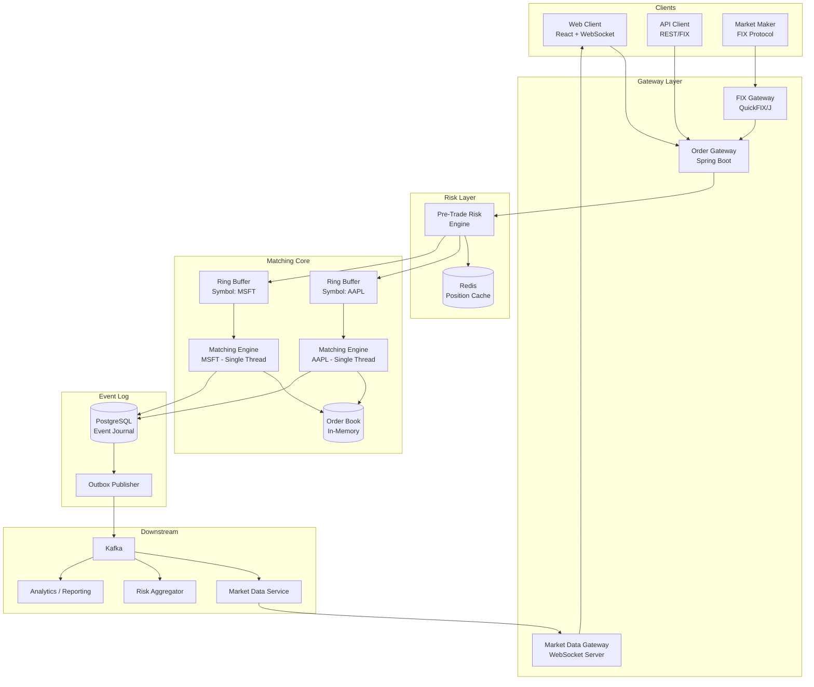
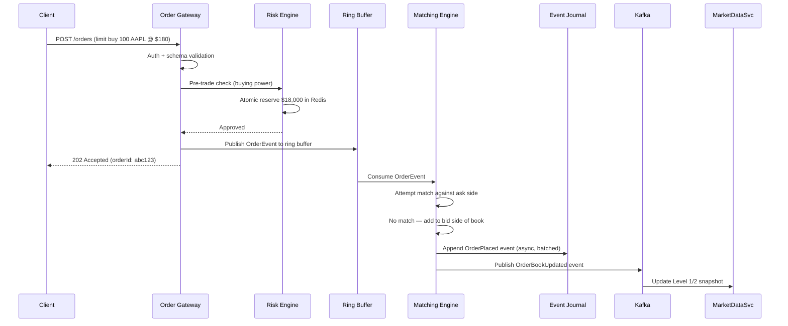
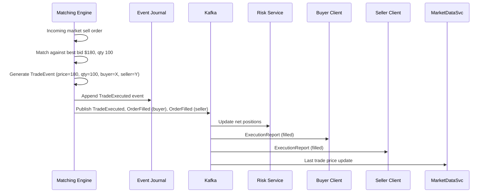
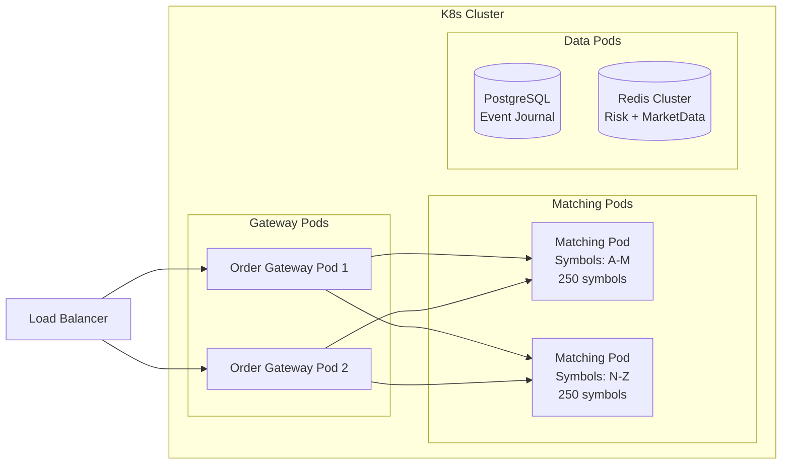

# 01 — High-Level Architecture: Stock Trading Order Book

## Objective

Define overall system structure, component responsibilities, and communication patterns. Justify architecture choice for a latency-sensitive, high-throughput matching system.

---

## Architecture Decision: Event-Driven + Single-Writer Per Symbol

### Chosen: Disruptor-Based Single-Writer Architecture (per symbol)

Each trading symbol gets its own dedicated matching loop — a single thread that owns the order book and processes all order events sequentially. No locking needed inside the matching engine because there is no concurrency within one symbol's loop.

Communication between components uses the LMAX Disruptor pattern: a ring buffer that allows multiple producers (order gateways) to hand off to the single consumer (matcher) without locks.

### Why Not Microservices With Shared DB?

- Shared DB serializes writes through lock contention — destroys sub-millisecond latency
- Network hops between services add 0.5–2ms per hop — unacceptable on hot path
- Distributed transactions for order + risk check would require 2PC or Saga — incompatible with microsecond SLA

### Why Not Actor Model (Akka)?

- Actor mailboxes add overhead vs Disruptor's mechanical sympathy (CPU cache-line awareness)
- Akka is appropriate for 10ms-range latency; Disruptor targets sub-millisecond
- Both are valid — Akka is the "less extreme" choice for a 1ms p99 target instead of microseconds

### When NOT to Use This Architecture

- Small exchange or broker (< 10 symbols, < 1000 orders/day) — overkill; Spring Boot + PostgreSQL suffices
- Non-HFT retail platform — standard queue-based approach is maintainable and sufficient
- When operational team lacks JVM tuning expertise — GC pauses will kill latency guarantees

---

## System Components

---

## Component Responsibilities

| Component | Role | Technology |
|-----------|------|------------|
| Order Gateway | Validate, authenticate, route orders | Spring Boot |
| FIX Gateway | Translate FIX protocol messages to internal format | QuickFIX/J |
| Pre-Trade Risk Engine | Check buying power, position limits, duplicate detection | Java + Redis |
| Ring Buffer | Lock-free handoff from gateway to matcher | LMAX Disruptor |
| Matching Engine | Price-time priority matching, order book management | Pure Java, single thread per symbol |
| Order Book (in-memory) | Sorted bid/ask structure | TreeMap keyed by price |
| Event Journal | Append-only log of all order/trade events | PostgreSQL |
| Outbox Publisher | Reliable downstream fan-out from event log | CDC or polling |
| Market Data Service | Distribute Level 1/2 data to subscribers | Redis Pub/Sub + WebSocket |
| Kafka | Decouple matching engine from downstream consumers | Kafka |

---

## Request Flow: New Limit Order

---

## Request Flow: Matching Trade

---

## Deployment View

---

## Key Architectural Decisions

### Single-Writer Per Symbol

Each symbol's matching engine is a single thread. This eliminates all locking inside the matcher. The Disruptor ring buffer handles multi-producer → single-consumer handoff with mechanical sympathy (cache-line padding, memory barriers instead of locks).

**Tradeoff:** vertical scaling limit per symbol. If one symbol generates 500K orders/sec alone (flash crash scenario), a single thread may lag. Mitigation: partition order book by price range (experimental, rarely needed).

### Async Persistence, Sync Ack

Gateway returns 202 Accepted before the order is persisted. Matching engine writes events asynchronously in batches. This means a crash between accept and persist can lose an order — mitigated by crash recovery protocol that resends any in-flight orders on reconnect.

**Alternative:** sync write before ack — adds 2-5ms per order, kills latency SLA.

### Pre-Trade Risk in Redis

Buying power check uses Redis DECRBY + check. Atomic and fast (< 0.1ms). If Redis is unavailable, orders are rejected conservatively (fail-closed).

**Risk:** Redis failure = trading halt. Mitigation: Redis Sentinel / Cluster with 3 replicas.

### Market Data via Kafka + Redis

Matching engine publishes to Kafka. Market Data Service consumes Kafka and pushes to Redis Pub/Sub channels. WebSocket servers subscribe to Redis channels and fan out to clients.

**Why not direct WebSocket from matcher?** Matcher must never block on slow clients. Decoupling via Kafka ensures matching continues even if market data delivery is slow.
