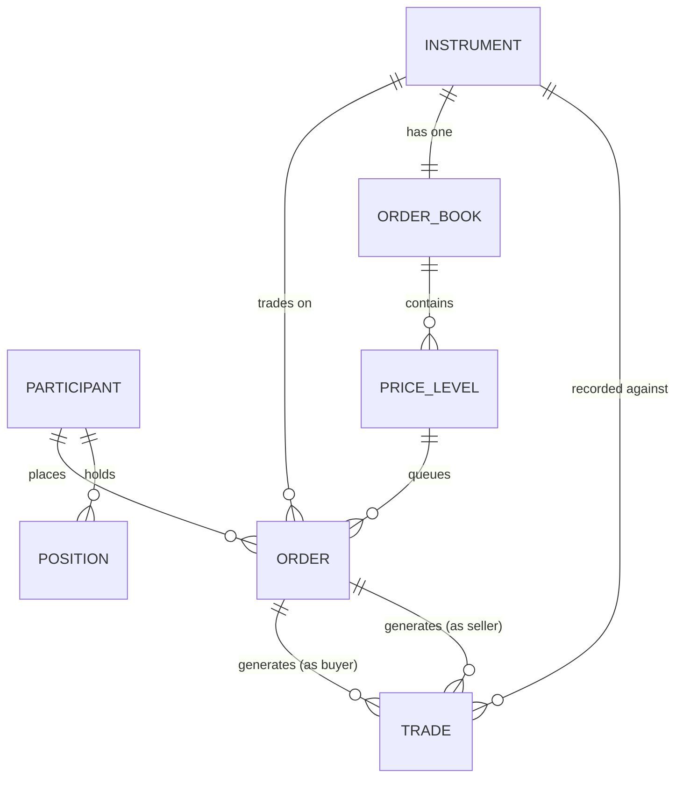
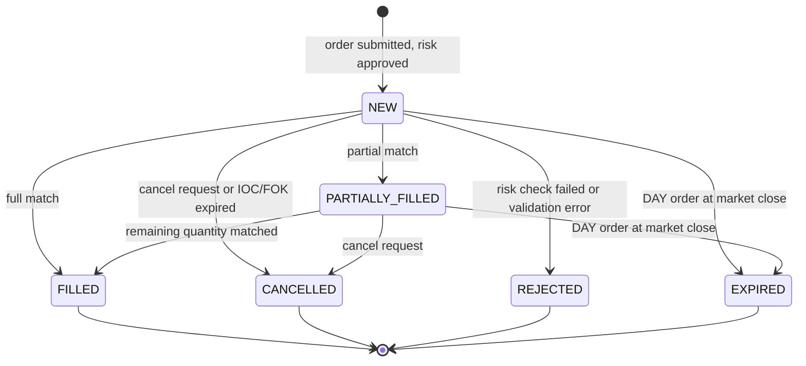

# 02 — Domain Modeling: Stock Trading Order Book

## Objective

Define core domain entities, value objects, aggregates, and their invariants. Establish the ubiquitous language used across matching engine, risk, and settlement domains.

---

## Ubiquitous Language

| Term | Definition |
|------|-----------|
| Order | Instruction from a participant to buy or sell a quantity of an instrument at a price |
| Instrument | Tradeable asset identified by a symbol (e.g., AAPL, MSFT) |
| Order Book | Sorted collection of resting limit orders for one instrument — bids (buys) and asks (sells) |
| Bid | Buy-side order — buyer willing to pay up to this price |
| Ask | Sell-side order — seller willing to accept at least this price |
| Spread | Difference between best ask and best bid |
| Trade / Fill | Execution event where a buyer and seller are matched |
| Partial Fill | Trade that satisfies only part of an order's quantity |
| Price-Time Priority | Matching rule: best price wins; ties broken by earliest submission time |
| IOC | Immediate-Or-Cancel — any unfilled portion cancelled immediately |
| FOK | Fill-Or-Kill — entire order must fill immediately or entire order cancelled |
| GTC | Good-Till-Cancelled — order remains active across trading sessions |
| Circuit Breaker | Automatic trading halt when price moves exceed threshold |
| Execution Report | Notification to order owner of fill, cancellation, or rejection |
| Position | Net quantity of an instrument held by a participant |
| Buying Power | Cash available for new purchases (accounting for open orders) |

---

## Core Entities

### Order

```
Order
├── orderId: UUID
├── clientOrderId: String (idempotency key from client)
├── participantId: UUID
├── instrumentId: String (symbol)
├── side: Enum { BUY, SELL }
├── type: Enum { LIMIT, MARKET, STOP_LIMIT, IOC, FOK }
├── price: BigDecimal (null for MARKET orders)
├── stopPrice: BigDecimal (for STOP_LIMIT only)
├── quantity: Long (in shares/units)
├── filledQuantity: Long
├── remainingQuantity: Long (derived: quantity - filledQuantity)
├── status: Enum { NEW, PARTIALLY_FILLED, FILLED, CANCELLED, REJECTED, EXPIRED }
├── timeInForce: Enum { DAY, GTC, GTD, IOC, FOK }
├── expiryDate: LocalDate (for GTD)
├── submittedAt: Instant (nanosecond precision for priority)
└── version: Long (optimistic lock for concurrent cancel/modify)
```

**Invariants:**
- `quantity > 0`
- LIMIT order must have `price != null`
- MARKET order must have `price == null`
- `filledQuantity <= quantity`
- FILLED order cannot be cancelled
- `status` transitions are one-way (no going back from FILLED)

### Trade (Execution Record)

```
Trade
├── tradeId: UUID
├── instrumentId: String
├── buyOrderId: UUID
├── sellOrderId: UUID
├── buyParticipantId: UUID
├── sellParticipantId: UUID
├── price: BigDecimal (execution price)
├── quantity: Long (filled quantity)
├── executedAt: Instant (nanosecond precision)
└── sequenceNumber: Long (monotonic, per-symbol)
```

**Invariants:**
- `tradeId` is globally unique
- `price` is always the resting order's price (passive side), not the aggressive order's
- `quantity > 0`
- `sequenceNumber` must be strictly monotonic per symbol — used for gap detection by consumers

### Order Book

```
OrderBook
├── instrumentId: String
├── bids: TreeMap<Price, PriceLevel> (descending — highest bid first)
├── asks: TreeMap<Price, PriceLevel> (ascending — lowest ask first)
├── lastTradePrice: BigDecimal
├── lastTradeTime: Instant
├── tradingStatus: Enum { OPEN, HALTED, CLOSED, PRE_OPEN }
└── sequence: AtomicLong (monotonic counter for all events)

PriceLevel
├── price: BigDecimal
├── orders: LinkedList<Order> (time-priority queue at this price)
└── totalQuantity: Long (sum of all order quantities at this level)
```

**Invariants:**
- Best bid < Best ask (otherwise match should occur)
- Orders within a PriceLevel are sorted by submittedAt ascending (FIFO)
- `totalQuantity` always consistent with sum of order quantities at level

### Participant (Account)

```
Participant
├── participantId: UUID
├── type: Enum { RETAIL, INSTITUTIONAL, MARKET_MAKER }
├── status: Enum { ACTIVE, SUSPENDED, RESTRICTED }
├── cashBalance: BigDecimal
├── reservedCash: BigDecimal (held against open buy orders)
└── positions: Map<Symbol, Position>

Position
├── symbol: String
├── quantity: Long (positive = long, negative = short)
└── reservedQuantity: Long (held against open sell orders)
```

### Instrument

```
Instrument
├── symbol: String (AAPL)
├── name: String (Apple Inc.)
├── type: Enum { EQUITY, ETF }
├── status: Enum { ACTIVE, SUSPENDED, DELISTED }
├── lotSize: Int (min order quantity, usually 1)
├── tickSize: BigDecimal (min price increment, e.g., 0.01)
├── tradingHours: TradingSchedule
└── circuitBreakerThresholds: CircuitBreakerConfig
```

---

## Domain Events

| Event | Trigger | Consumers |
|-------|---------|-----------|
| `OrderPlaced` | New valid order enters book | Risk service, audit log |
| `OrderMatched` | Full or partial fill occurs | Risk service, notification, audit |
| `TradeExecuted` | Match generates a trade | Settlement, market data, analytics |
| `OrderCancelled` | Cancel request processed | Risk service (release reserved funds), audit |
| `OrderRejected` | Order fails validation or risk check | Notification, audit |
| `OrderExpired` | DAY order not filled by close | Risk service, audit |
| `OrderBookUpdated` | Book depth changes | Market data service |
| `TradingHalted` | Circuit breaker triggered | All participants, regulators |
| `TradingResumed` | Circuit breaker released | All participants |

---

## Entity Relationships



---

## Value Objects

### Price

- Immutable decimal with fixed precision (4 decimal places for equities)
- Must be a positive multiple of tick size
- Comparison: price equality uses exact decimal match (no floating point)

### Quantity

- Immutable positive integer (shares)
- Must be positive multiple of lot size

### Money

- Amount + Currency pair
- Never stored as float — always BigDecimal with scale

---

## Aggregate Boundaries

| Aggregate Root | Contains | Consistency Boundary |
|----------------|----------|---------------------|
| Order | Order state, partial fills | One order's lifecycle |
| OrderBook | All resting orders for one symbol | Atomic matching decisions |
| Participant | Cash balance, positions, reserved amounts | Risk and settlement |
| Instrument | Trading rules, circuit breaker state | Symbol configuration |

**Key decision:** `Order` and `OrderBook` are separate aggregates. The order book holds references (order IDs and snapshots of price/qty) — not the full order entity. This allows the order entity to be queried/cancelled without locking the entire book.

---

## State Machine: Order Lifecycle


