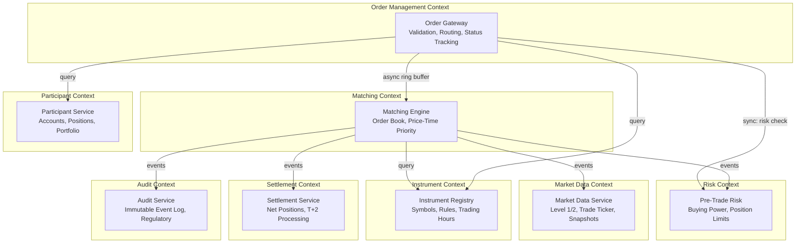

# 03 — DDD Boundaries: Stock Trading Order Book

## Objective

Define bounded contexts, their responsibilities, inter-context communication patterns, and anti-corruption layers. Each context maps to a potential independent service in a microservices evolution.

---

## Bounded Contexts

---

## Context Map

| Context | Type | Owner | Key Responsibility |
|---------|------|-------|--------------------|
| Matching | Core Domain | Exchange | Price-time priority matching — competitive differentiator |
| Risk | Core Domain | Exchange | Pre-trade controls — regulatory requirement |
| Order Management | Supporting | Exchange | Routing, lifecycle tracking, client API |
| Market Data | Generic Subdomain | Exchange | Data distribution — standardized problem |
| Participant | Supporting | Exchange | Account management |
| Instrument | Supporting | Exchange | Symbol configuration |
| Settlement | Supporting / External | External Clearinghouse | T+2 net settlement |
| Audit | Generic Subdomain | Compliance | Immutable log — regulatory |

**Core domain focus:** Matching engine and Risk engine deserve the best engineers, the most performance investment, and the fewest external dependencies.

---

## Context: Order Management

**Responsibility:** Client-facing API. Accepts orders, validates schemas, routes to Risk then Matching, returns status. Tracks order state from the client's perspective.

**Models it owns:**
- `OrderSubmissionRequest` (client DTO)
- `OrderStatusResponse` (client view)
- `ClientOrderId` → `SystemOrderId` mapping

**Integration with Matching Context:**
- Translator: converts `OrderSubmissionRequest` → `OrderEvent` (matching's internal type)
- Anti-Corruption Layer prevents matching engine's internal model from leaking to client API

**Integration with Risk Context:**
- Synchronous call before publishing to ring buffer
- If Risk rejects, Order Management returns 422 immediately

---

## Context: Matching Engine

**Responsibility:** Owns the order book. Only context that writes to the order book. Produces trade and fill events.

**Models it owns:**
- `OrderBook` (in-memory, per symbol)
- `PriceLevel`
- `Trade`
- `MatchResult`

**What it does NOT own:**
- Participant accounts (Participant Context owns those)
- Buying power validation (Risk Context)
- Market data distribution (Market Data Context)

**Events produced (published to Kafka):**
- `TradeExecuted`
- `OrderFilled` / `OrderPartiallyFilled`
- `OrderCancelled`
- `OrderExpired`
- `OrderBookSnapshotPublished`
- `TradingHalted` / `TradingResumed`

**Events consumed:**
- None — matching engine is upstream of everything. It reacts only to ring buffer entries.

---

## Context: Risk Engine

**Responsibility:** Pre-trade checks only. Not post-trade settlement. Maintains real-time view of reserved cash and reserved positions.

**Models it owns:**
- `BuyingPower` (available cash minus reserved cash)
- `PositionLimit` (max net long/short per participant)
- `DuplicateOrderDetector` (client order ID cache)

**Sync interaction (critical path):**
- Order Management calls Risk synchronously before ring buffer submission
- Risk atomically reserves funds (DECRBY in Redis)
- On rejection, no reservation made

**Async updates (off critical path):**
- Consumes `TradeExecuted` → update net positions
- Consumes `OrderCancelled` → release reserved funds
- Consumes `OrderExpired` → release reserved funds

**Anti-Corruption Layer:**
- Risk maintains its own simplified view of positions — does NOT query Participant Context on the hot path (would add network hop latency)
- Periodic reconciliation (every 5 minutes) with Participant Context for drift detection

---

## Context: Market Data

**Responsibility:** Distribute real-time market data to downstream consumers (WebSocket clients, trading systems).

**Models it owns:**
- `Level1Quote` (best bid, best ask, last trade)
- `Level2Snapshot` (top N price levels per side)
- `TradeTicker` (stream of executed trades)
- `SubscriptionManager` (WebSocket session tracking)

**Consumption:**
- Consumes `TradeExecuted`, `OrderBookUpdated` from Kafka (via Matching Context)
- No direct coupling to Matching Engine internals

**Publication:**
- Redis Pub/Sub channels per symbol (subscribers = WebSocket servers)
- REST snapshot API for initial connection (full order book depth)

**Fairness concern:** All subscribers must receive updates simultaneously — no priority access. Fan-out must be parallel, not sequential.

---

## Context: Settlement

**Responsibility:** Post-trade net settlement. Aggregate trades by participant per day, instruct custodian/clearinghouse for T+2 delivery.

**Scope:** deliberately out of scope for MVP. Interface defined, implementation external.

**Events consumed:**
- `TradeExecuted` — accumulate net positions per participant per symbol

**Output:**
- Daily settlement instruction file (DTCC/SWIFT format)
- Netting report per participant

---

## Context: Audit

**Responsibility:** Immutable, tamper-evident log of every order event with nanosecond timestamps. Regulatory requirement (FINRA Rule 4370, SEC 17a-4).

**Design decisions:**
- Append-only writes — no updates, no deletes
- Every event signed with server's private key (HMAC chain)
- Separate storage from operational DB — cold storage after 30 days
- Supports point-in-time reconstruction of any order's full history

**Events consumed:** All events from Matching, Risk, Order Management

---

## Anti-Corruption Layers

| Boundary | ACL Mechanism | Purpose |
|----------|--------------|---------|
| Client → Order Management | Request/Response DTO translation | Isolate internal model from client API version |
| Order Management → Matching | `OrderEvent` adapter | Matching engine speaks its own language |
| Matching → Settlement | Event translator | Settlement uses T+2 netting language, not order language |
| Risk → Participant | Reconciliation adapter | Risk's cached view vs Participant's authoritative view |

---

## Inter-Context Communication Patterns

| From | To | Pattern | Justification |
|------|----|---------|---------------|
| Order Management | Risk | Synchronous (gRPC / in-process) | Blocking — must pass before ring buffer |
| Order Management | Matching | Ring Buffer (Disruptor) | Lock-free, sub-millisecond handoff |
| Matching | Market Data | Kafka (async) | Decoupled fan-out |
| Matching | Audit | Kafka (async) | Eventual durability OK |
| Matching | Settlement | Kafka (async) | T+2 is inherently async |
| Risk | Participant | Async (reconciliation batch) | Periodic drift check only |
| Market Data | Clients | WebSocket (push) | Real-time requirement |

---

## Shared Kernel

Shared between Matching, Risk, and Order Management:

- `OrderId` type (UUID)
- `InstrumentId` type (symbol string)
- `OrderSide` enum (BUY/SELL)
- `OrderStatus` enum
- `Price` / `Quantity` value objects

These are deliberately minimal — shared kernel grows slowly and changes require coordination across contexts.
