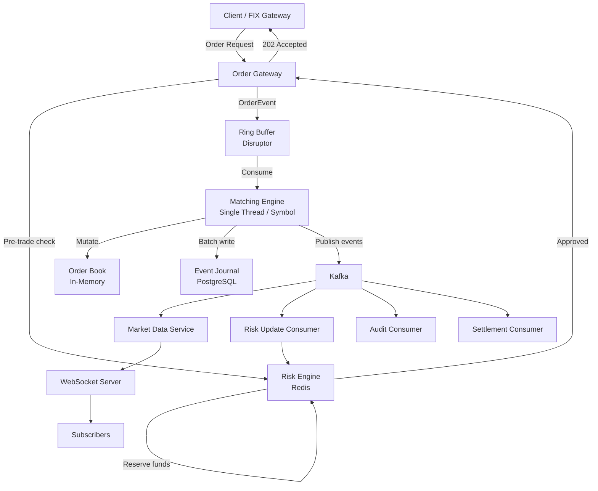
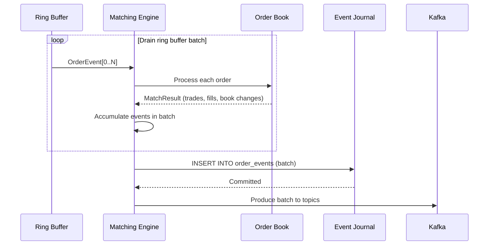

# 06 — Event Flow: Stock Trading Order Book

## Objective

Document the complete event lifecycle from order submission through matching, persistence, and downstream fan-out. Map Kafka topics, event schemas, and consumer responsibilities.

---

## Event Flow Overview



---

## Kafka Topic Design

| Topic | Partitioned By | Producers | Consumers | Retention |
|-------|----------------|-----------|-----------|-----------|
| `order-events` | symbol | Matching Engine | Audit, Read Model Builder | 7 days |
| `trade-executed` | symbol | Matching Engine | Settlement, Market Data, Risk Update | 7 days |
| `order-book-updates` | symbol | Matching Engine | Market Data Service | 1 hour |
| `execution-reports` | participantId | Matching Engine | Notification, Client Delivery | 7 days |
| `risk-updates` | participantId | Risk Engine | Position Service | 7 days |
| `market-data-alerts` | symbol | Market Data Service | External feeds | 1 day |

**Partitioning by symbol:** All events for one symbol go to the same partition → guaranteed ordering per symbol. Consumers can maintain per-symbol sequence counters and detect gaps.

**Partitioning by participantId:** Execution reports partitioned by participant → one consumer instance handles all reports for a participant → no out-of-order delivery per participant.

---

## Event Schemas

### OrderPlaced

```json
{
  "eventType": "ORDER_PLACED",
  "eventId": "uuid",
  "orderId": "uuid",
  "clientOrderId": "client-001",
  "participantId": "uuid",
  "symbol": "AAPL",
  "side": "BUY",
  "orderType": "LIMIT",
  "price": "180.50",
  "quantity": 100,
  "timeInForce": "GTC",
  "sequenceNumber": 10023456,
  "occurredAt": "2024-01-15T09:30:00.123456789Z"
}
```

### TradeExecuted

```json
{
  "eventType": "TRADE_EXECUTED",
  "eventId": "uuid",
  "tradeId": "uuid",
  "symbol": "AAPL",
  "buyOrderId": "uuid",
  "sellOrderId": "uuid",
  "buyParticipantId": "uuid",
  "sellParticipantId": "uuid",
  "price": "180.50",
  "quantity": 100,
  "aggressorSide": "SELL",
  "sequenceNumber": 10023457,
  "occurredAt": "2024-01-15T09:30:00.200000000Z"
}
```

### OrderFilled

```json
{
  "eventType": "ORDER_FILLED",
  "eventId": "uuid",
  "orderId": "uuid",
  "tradeId": "uuid",
  "participantId": "uuid",
  "symbol": "AAPL",
  "fillPrice": "180.50",
  "fillQuantity": 100,
  "cumulativeQuantity": 100,
  "leavesQuantity": 0,
  "orderStatus": "FILLED",
  "sequenceNumber": 10023458,
  "occurredAt": "2024-01-15T09:30:00.200000000Z"
}
```

### OrderBookUpdated

```json
{
  "eventType": "ORDER_BOOK_UPDATED",
  "symbol": "AAPL",
  "bids": [
    { "price": "180.48", "quantity": 500 },
    { "price": "180.47", "quantity": 1200 }
  ],
  "asks": [
    { "price": "180.52", "quantity": 300 },
    { "price": "180.53", "quantity": 800 }
  ],
  "sequenceNumber": 10023459,
  "timestamp": "2024-01-15T09:30:00.201000000Z"
}
```

### TradingHalted

```json
{
  "eventType": "TRADING_HALTED",
  "symbol": "AAPL",
  "reason": "CIRCUIT_BREAKER",
  "triggerPrice": "162.45",
  "referencePrice": "180.50",
  "movePct": -10.0,
  "haltedAt": "2024-01-15T10:15:00.000Z",
  "expectedResumeAt": "2024-01-15T10:20:00.000Z"
}
```

---

## Matching Engine Event Production

The matching engine produces events synchronously during the match loop, then flushes to Kafka in batches after processing a ring buffer drain.



**Batch size:** 50–500 events per flush, or 1ms timeout (whichever comes first). Batching reduces Kafka producer overhead dramatically.

**Ordering guarantee:** Events within a symbol are produced to Kafka in sequence number order. Kafka partition ordering preserves this for consumers.

---

## Consumer: Read Model Builder

Consumes `order-events` topic. Maintains the `orders` table in PostgreSQL as a CQRS read model.

- Processes events in sequence number order per symbol
- Upserts order state on `ORDER_PLACED`, `ORDER_FILLED`, `ORDER_CANCELLED`, etc.
- Idempotent: re-processing same sequence number is a no-op (checks `version`)
- Lag tolerance: 5-second eventual consistency acceptable for order status queries

---

## Consumer: Market Data Service

Consumes `order-book-updates` and `trade-executed` topics.

1. Receives `OrderBookUpdated` event
2. Updates in-memory Level 1/2 snapshot
3. Publishes to Redis Pub/Sub channel `market-data:{symbol}`
4. WebSocket servers subscribed to Redis channels push to connected clients

```
Kafka → Market Data Consumer → Redis Pub/Sub → WebSocket Server → Client
         (< 1ms)              (< 0.5ms)         (< 1ms)
                                                Total: ~3ms fan-out
```

---

## Consumer: Risk Update Service

Consumes `trade-executed` and `order-cancelled` / `order-expired` events.

On `TradeExecuted`:
- Buyer: increase position by `quantity`, release `quantity * price` from cash reserve
- Seller: decrease position by `quantity`, release reserved position

On `OrderCancelled`:
- Release reserved cash (buy orders) or reserved position (sell orders)

All updates via Redis atomic operations. Lag < 2 seconds acceptable (pre-trade check uses conservative reserve, not real-time net position).

---

## Consumer: Settlement Service

Consumes `trade-executed` topic.

- Aggregates net buys/sells per participant per symbol per day
- At 4:00 PM, generates settlement instructions for T+2 clearing
- Output: ISO 20022 settlement instruction file sent to clearinghouse

---

## Consumer: Audit Service

Consumes all topics. Writes immutable records to append-only audit log (separate PostgreSQL schema or dedicated compliance DB).

- No updates — every event appended with received timestamp
- HMAC chain: each record includes HMAC of (previous record hash + current event payload) — tamper detection
- Indexed by: orderId, participantId, symbol, tradeId, timestamp range

---

## Dead Letter Queue Strategy

| Topic | DLQ Topic | Retry Policy | Alert |
|-------|-----------|-------------|-------|
| `order-events` | `order-events-dlq` | 3 retries, exponential backoff | PagerDuty if DLQ grows |
| `trade-executed` | `trade-executed-dlq` | 5 retries (critical) | Immediate alert |
| `order-book-updates` | None | Drop — stale data | Log only |
| `execution-reports` | `execution-reports-dlq` | 3 retries | Alert |

Market data updates are dropped on consumer failure (data becomes stale immediately — retrying old market data is worse than missing it).

---

## Event Ordering and Gap Detection

Each symbol's events carry a monotonic `sequenceNumber` starting from 1.

**Gap detection flow:**
1. Consumer tracks `lastProcessedSeq` per symbol
2. On receiving event with `seq = lastProcessedSeq + 1` → process normally
3. On gap (`seq > lastProcessedSeq + 1`) → request replay from `order-events` topic from `lastProcessedSeq + 1`
4. On duplicate (`seq <= lastProcessedSeq`) → idempotent ignore

**Kafka retention:** `order-events` topic retained 7 days → allows consumers to replay up to 7 days of events to recover from extended outages.
