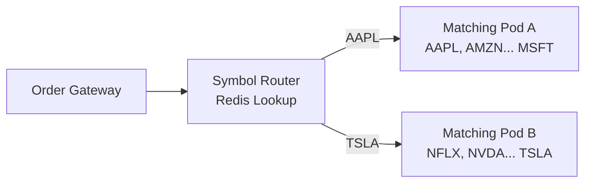

# 07 — Scaling Strategy: Stock Trading Order Book

## Objective

Define horizontal and vertical scaling strategies for each system component. Address the unique constraint that the matching engine is fundamentally single-threaded per symbol.

---

## Scaling Dimensions

| Component | Scaling Axis | Bottleneck | Strategy |
|-----------|-------------|-----------|---------|
| Order Gateway | Horizontal (stateless) | Network I/O | Add pods |
| Matching Engine | Horizontal by symbol | CPU single-core | Shard by symbol across pods |
| Risk Engine | Horizontal (read-heavy) | Redis throughput | Redis Cluster |
| Market Data Service | Horizontal (stateless) | WebSocket connections | Add pods |
| Event Journal (PostgreSQL) | Vertical + Read Replicas | Write throughput | Write batching + replicas |
| Kafka | Partition increase | Consumer throughput | More partitions + consumers |

---

## Matching Engine: The Core Scaling Problem

The matching engine is single-threaded per symbol by design. This cannot be changed without sacrificing correctness guarantees. The only scaling lever is: **run more symbols on more machines**.

### Sharding by Symbol

```
Matching Pod A: Symbols A-M (250 symbols)
Matching Pod B: Symbols N-Z (250 symbols)
```

Symbol-to-pod mapping stored in Redis (or ZooKeeper). Order Gateway reads this mapping and routes each order to the correct matching pod's ring buffer.



**Pod failure:** if Matching Pod A fails, the 250 symbols it handles halt. Recovery: start new pod, load snapshots, replay events from Kafka. Trading resumes within 30 seconds (circuit-breaker halt window).

### Hot Symbol Problem

AAPL, TSLA at market open can generate 10x the order flow of mid-cap symbols. Mitigation:
- Place hot symbols on separate pods (AAPL alone on one pod)
- Capacity planning: size matching pod for the busiest single symbol it will handle
- No dynamic rebalancing (too risky during trading hours) — static assignment, adjusted before market open

### Vertical Scaling Within Pod

Each matching pod can host multiple symbols, each running in their own thread. The thread count per pod = number of active symbols on that pod.

```
Matching Pod: 250 threads (one per symbol)
CPU cores: 32 physical cores
Thread scheduling: OS-managed, but each thread is nearly always runnable (not blocking)
```

This is CPU-bound. Each symbol thread processes ring buffer events at ~100K ops/sec. With 250 symbols × 100K ops/sec, a 32-core pod is adequate for average load but may spike at market open.

---

## Order Gateway: Horizontal Scaling

Fully stateless — any gateway can handle any order (routes to correct matching pod). Load balanced via Kubernetes ingress.

```
Order Gateway pods: auto-scale from 3 to 20 based on CPU and connection count
RPS per pod: ~5,000 orders/sec (validated under load)
Target: 100,000 orders/sec total → 20 pods at peak
```

**Session affinity:** NOT used for REST API (stateless). WebSocket execution report connections use sticky sessions (participant-to-pod mapping) to avoid multi-pod delivery.

---

## Redis: Risk Engine Scaling

Risk operations are:
- `DECRBY buying_power:{participantId}` — atomic
- `GET position:{participantId}:{symbol}` — read

Heavy read pattern. Redis Cluster with 6 nodes (3 primary, 3 replica):
- Horizontal sharding by key prefix (participant-based hash slot)
- Read replicas serve `GET` operations
- Only primaries handle `DECRBY` (write operations)

**Throughput:** Redis can handle 1M+ ops/sec per node. Risk check adds < 0.1ms.

---

## Kafka: Scaling Partitions

Initial: 10 partitions per topic.
Scaling: increase partition count as consumer lag grows.

| Symbol Count | Partitions | Consumer Instances |
|-------------|-----------|-------------------|
| 100 symbols | 10 partitions | 5 instances |
| 500 symbols | 50 partitions | 25 instances |
| 2000 symbols | 200 partitions | 100 instances |

**Warning:** Partition count can only increase, not decrease. Plan for growth. Increasing partitions causes consumer rebalance — brief processing pause (< 30 seconds).

---

## PostgreSQL: Write Throughput

### Bottleneck

Event journal receives ~25M writes/day = ~300 writes/sec average, ~3,000 writes/sec at peak (market open burst). PostgreSQL single-node handles ~10,000-50,000 simple inserts/sec with appropriate tuning.

### Mitigation: Batch Inserts

Matching engine doesn't write one row per event. It batches 100-500 events and uses PostgreSQL `COPY` or multi-row `INSERT`. This reduces per-event overhead dramatically.

```
100 single inserts: ~100ms
1 batch insert (100 rows): ~5ms
Throughput improvement: 20x
```

### Read Replicas

- 2 read replicas for order status queries (client-facing)
- 1 replica dedicated to analytics / compliance queries
- Primary handles writes only

### Connection Pooling

PgBouncer in transaction pooling mode:
- Application pods connect to PgBouncer (10 connections each × 20 pods = 200 app connections)
- PgBouncer maintains 50 actual PostgreSQL connections
- Prevents connection exhaustion during pod scaling

---

## Market Data: WebSocket Scaling

10,000+ concurrent WebSocket connections is the target. Constraint: WebSocket is long-lived (not stateless).

### Architecture

```
Redis Pub/Sub (per symbol channel)
    ↓
WebSocket Server pods (each subscribes to all Redis channels)
    ↓
Connected clients (each pod serves ~1,000 connections)
```

10 WebSocket Server pods × 1,000 connections/pod = 10,000 connections.

Scaling to 100,000 connections:
- 100 pods × 1,000 connections, OR
- Switch to distributed WebSocket framework (Vert.x, Netty-based) — each pod handles 10,000 connections
- Redis Pub/Sub fan-out becomes bottleneck: consider Kafka Consumer per WebSocket pod instead

---

## Caching Strategy

| Data | Cache | TTL | Invalidation |
|------|-------|-----|-------------|
| Instrument config (tick size, lot size) | Local in-memory in each pod | 5 min | Reload on market-data-alerts event |
| Symbol → Matching Pod mapping | Redis | No TTL | Explicit update on pod change |
| Level 1 quotes | Redis (market data state) | Real-time | Overwrite on each tick |
| Participant buying power | Redis | Real-time | Atomic update on each order |
| Order status (read model) | No cache — PostgreSQL read replica | N/A | N/A |

**Anti-pattern avoided:** caching order book state in Redis. Order book lives in-memory in matching engine — Redis copy would be stale. Market Data Service publishes book snapshots to subscribers directly; Redis is used only for Pub/Sub channel, not book storage.

---

## Load Testing Targets

| Scenario | Target | Measurement |
|----------|--------|------------|
| Order submission throughput | 100K orders/sec sustained | Gatling load test |
| Matching latency p99 | < 1ms (gateway-to-ack) | Percentile histograms |
| Market data fan-out latency | < 5ms (match-to-client) | End-to-end trace |
| Recovery from matching pod crash | < 30s to resume trading | Chaos test |
| Redis failure and recovery | Reject orders (fail-closed), recover < 10s | Chaos test |
| Kafka consumer lag | < 5 seconds under sustained load | Kafka consumer group lag |

---

## Overengineering Risks

| Temptation | Why to Resist |
|------------|--------------|
| Lock-free order book with custom data structures | TreeMap with single-thread access is already lock-free enough — only needed for HFT (microsecond) |
| DPDK / kernel bypass networking | Only justifiable for co-location HFT, not retail exchange (< 1ms target) |
| Custom binary serialization | Avro/Protobuf is fast enough — custom serialization is ops burden |
| Multi-level cache hierarchy | Market data is best-effort, adding cache layers adds complexity without meaningful latency reduction |
| Global real-time risk calculation | Per-order atomic reserve in Redis is sufficient; real-time P&L calculation is a different system |
