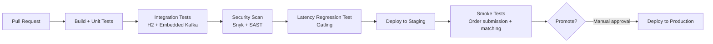

# 13 — Deployment Architecture: Stock Trading Order Book

## Objective

Define Kubernetes deployment topology, CI/CD pipeline, JVM tuning, operational procedures, and environment strategy for a latency-sensitive trading system.

---

## Infrastructure Overview

```mermaid
graph TB
    subgraph AWS Region: us-east-1
        subgraph AZ-1a
            OG1[Order Gateway Pod ×3]
            MP1[Matching Pod A<br/>Symbols A-M]
            PG_P[(PostgreSQL Primary)]
            RD1[Redis Primary]
            KF1[Kafka Broker 1-2]
        end
        subgraph AZ-1b
            OG2[Order Gateway Pod ×3]
            MP2[Matching Pod B<br/>Symbols N-Z]
            PG_R1[(PostgreSQL Replica 1)]
            RD2[Redis Replica]
            KF2[Kafka Broker 3-4]
        end
        subgraph AZ-1c
            OG3[Order Gateway Pod ×2]
            PG_R2[(PostgreSQL Replica 2)]
            RD3[Redis Replica]
            KF3[Kafka Broker 5-6]
        end
        ALB[Application Load Balancer]
        NLB[Network Load Balancer<br/>FIX Gateway]
    end
    subgraph AWS Region: us-west-2 (DR)
        DR_MP[Matching Pods<br/>Cold Standby]
        DR_KF[Kafka Mirror]
        DR_PG[(PostgreSQL Replica)]
    end

    Internet --> ALB
    Institutions --> NLB
    ALB --> OG1
    ALB --> OG2
    ALB --> OG3
    KF1 -.->|MirrorMaker 2| DR_KF
```

---

## Kubernetes Configuration

### Matching Engine Pod

Matching engine has strict resource requirements to guarantee latency:

```yaml
resources:
  requests:
    cpu: "16"           # 16 cores dedicated
    memory: "32Gi"
  limits:
    cpu: "16"           # Hard limit — no CPU sharing
    memory: "32Gi"

# Prevent pod from being scheduled with other matching pods
affinity:
  podAntiAffinity:
    requiredDuringSchedulingIgnoredDuringExecution:
      - labelSelector:
          matchLabels:
            app: matching-engine
        topologyKey: kubernetes.io/hostname  # One pod per node

# Dedicated nodes for matching engine (no other workloads)
nodeSelector:
  workload-type: matching-engine
tolerations:
  - key: "matching-engine"
    operator: "Exists"
    effect: "NoSchedule"
```

**CPU isolation:** Matching engine threads pinned to specific CPU cores using `taskset` or JVM `-XX:+UseNUMA` with NUMA-aware allocation. Prevents OS scheduler interference.

**Huge pages:** Matching engine requests 2MB huge pages to reduce TLB misses for the pre-allocated ring buffers:
```yaml
resources:
  limits:
    hugepages-2Mi: "4Gi"
```

### Order Gateway Pod

```yaml
replicas: 8  # HPA min
autoscaling:
  minReplicas: 8
  maxReplicas: 20
  metrics:
    - type: Resource
      resource:
        name: cpu
        target:
          averageUtilization: 60
resources:
  requests:
    cpu: "4"
    memory: "8Gi"
  limits:
    cpu: "4"
    memory: "8Gi"
```

### Market Data Service Pod

```yaml
replicas: 5
resources:
  requests:
    cpu: "2"
    memory: "4Gi"
```

---

## JVM Tuning (Matching Engine)

JVM defaults are unsuitable for sub-millisecond latency. GC pauses are the primary enemy.

### GC Configuration

**Option A: G1GC (easier, good enough for 1ms target)**
```
-XX:+UseG1GC
-XX:MaxGCPauseMillis=5        # Target 5ms pause (best effort)
-XX:G1HeapRegionSize=32m
-XX:InitiatingHeapOccupancyPercent=45
-Xms28G -Xmx28G              # Pre-allocate heap — no resize pauses
-XX:+AlwaysPreTouch           # Touch all heap pages at startup
```

**Option B: ZGC (better for stricter latency, Java 17+)**
```
-XX:+UseZGC
-XX:+ZGenerational            # Java 21+ generational ZGC
-Xms28G -Xmx28G
-XX:+AlwaysPreTouch
-XX:ZUncommitDelay=300       # Keep memory for 5 min before returning to OS
```

**Option C: Azul Zing (commercial, pauseless)**
- License cost justified only for HFT or exchange with sub-100µs requirement
- ZGC is free and achieves < 1ms pause consistently

### Other JVM Flags

```
-server
-XX:+UseCompressedOops
-XX:+UseCompressedClassPointers
-XX:ReservedCodeCacheSize=256m
-XX:+TieredCompilation
--add-opens java.base/sun.misc=ALL-UNNAMED   # For Disruptor Unsafe access
-Djava.lang.invoke.stringConcat=MH_INLINE_SIZED_EXACT  # Reduce string alloc
```

---

## CI/CD Pipeline

### Pipeline Stages



### Latency Regression Gate

Every CI build runs a 60-second Gatling load test:
- Submit 10,000 orders/sec
- Assert: p99 latency < 5ms (2x production SLO — buffer for CI environment noise)
- If latency exceeds threshold: build fails, PR blocked

This prevents latency regressions from shipping. Critical for a trading system.

### Deployment Strategy

**Matching Engine:** Blue-Green only.
- No rolling updates — partial deployment means some orders go to old matching pods, some to new
- Market data sequence numbers would diverge across versions
- Blue-green: full switch at market close (4:00 PM - 9:30 AM window)

**Order Gateway:** Rolling update (stateless).
- Drain connections from pod being replaced
- New pod starts and passes health check
- Load balancer shifts traffic
- Zero downtime

**Market Data Service:** Rolling update (stateless).

### Release Window

All matching engine deployments: Saturday 2:00 AM - 6:00 AM (minimum trading impact).
Order gateway hot fixes: can deploy during trading hours (rolling, stateless).

---

## Feature Flags

Managed via LaunchDarkly or Spring Cloud Config:

| Flag | Default | Use |
|------|---------|-----|
| `circuit-breaker-enabled` | true | Disable during testing, enable for production |
| `self-trade-prevention` | true | Toggle self-trade prevention per symbol |
| `market-maker-obligations` | false | Enable MM spread obligations |
| `dark-pool-enabled` | false | Enable non-displayed order types |
| `pre-open-auction` | true | Enable auction-style market open |

Feature flags read at startup and cached in-process. Changes take effect on next pod restart (not hot-reload) for matching engine — hot-reload risks race conditions during mid-session change.

---

## Local Development Setup

```yaml
# docker-compose.yml services
services:
  postgres:
    image: postgres:15
    ports: ["5432:5432"]

  redis:
    image: redis:7-alpine
    ports: ["6379:6379"]

  kafka:
    image: confluentinc/cp-kafka:7.5.0
    ports: ["9092:9092"]
    environment:
      KAFKA_AUTO_CREATE_TOPICS_ENABLE: "true"

  matching-engine:
    build: ./matching-engine
    environment:
      SYMBOL_RANGE: "AAPL,MSFT,TSLA"  # Small set for local dev
      JVM_OPTS: "-Xms512m -Xmx512m"   # Small heap for dev

  order-gateway:
    build: ./order-gateway
    ports: ["8080:8080"]
```

**Local matching engine:** runs with G1GC, small heap, single ring buffer per symbol. Latency targets not achievable locally (shared CPU, containerized) — use staging for latency validation.

---

## Environment Strategy

| Environment | Purpose | Scale | Matching Engine |
|-------------|---------|-------|----------------|
| Local | Developer testing | 5 symbols, H2 | Simplified |
| Dev | Feature integration | 20 symbols | Full stack |
| Staging | Pre-prod, load test | 100 symbols | Production-grade |
| Production | Live trading | 500 symbols | Full |
| DR | Disaster recovery | 500 symbols | Cold standby |

**Data isolation:** Each environment uses isolated PostgreSQL instances. No shared databases. Staging uses anonymized production snapshots (no real participant PII).

---

## Operational Runbooks

Key runbooks maintained in confluence / internal wiki:

| Scenario | Runbook |
|----------|--------|
| Halt trading for a symbol | How to trigger manual circuit breaker |
| Deploy matching engine | Blue-green switch procedure |
| Redis failover | Sentinel promotion steps |
| Kafka broker failure | Broker restart + leader rebalance |
| EOD reconciliation failure | Investigation checklist |
| Participant account suspension | Steps to halt participant, release reserves |
| DR activation | Full DR failover procedure |
