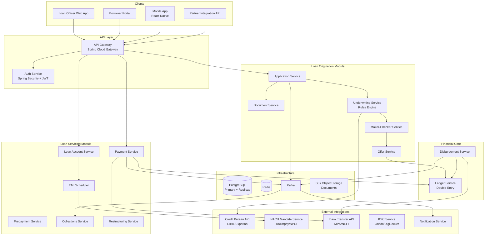
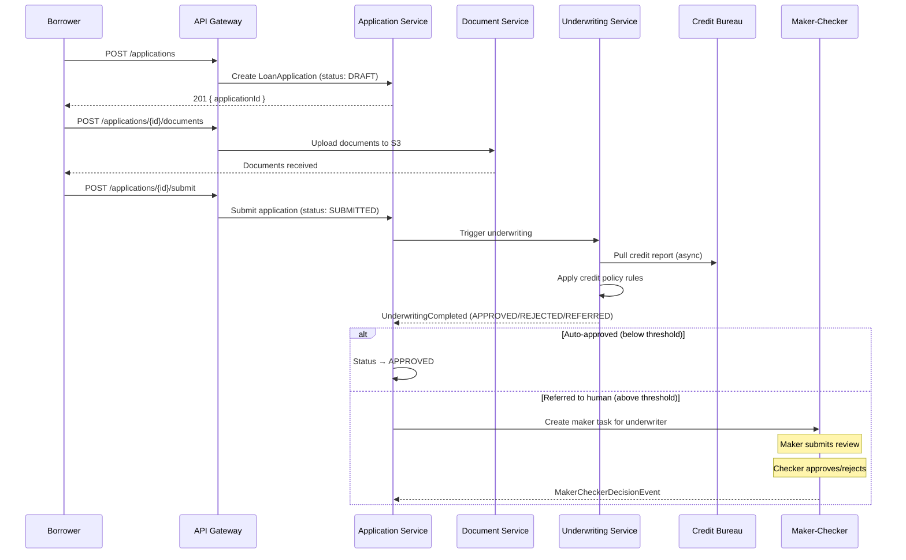

# 01 — High-Level Architecture: Loan Origination & Servicing System

## Objective

Define system structure and justify the architecture choice. A loan system spans months-to-years of business operations — it is NOT a real-time system but a long-running, state-machine-driven system with strong consistency requirements.

---

## Architecture Decision: Modular Monolith with DDD

### Chosen: Modular Monolith → Microservices Migration Path

**Phase 1 (MVP/V1):** Modular Monolith with well-defined DDD boundaries. All modules in one deployment unit but with clear package-level separation.

**Phase 2 (V2/V3):** Extract high-traffic or compliance-isolated modules to independent services.

### Why Modular Monolith (Not Microservices from Day 1)?

| Factor | Monolith | Microservices |
|--------|---------|--------------|
| Team size (early) | 5 engineers — monolith is appropriate | Too much operational overhead |
| Loan lifecycle spans 24 months | Simple in-process state machine | Cross-service saga = complexity risk |
| Domain boundaries unclear early | Can be clarified in monolith first | Microservices freeze wrong boundaries |
| Distributed transactions (disbursement) | In-process atomicity | Needs saga, eventual consistency |
| Regulatory audit | Easier to audit one system | Distributed tracing required for compliance |

### Why Not Full Microservices from Day 1?

Premature microservices cause:
- Distributed transaction complexity for every loan state change
- Network partitions during critical operations (disbursement)
- 3x deployment complexity with 5-engineer team
- Wrong service boundaries discovered only after launch

**Rule:** Extract services only when a module's scaling requirement or team ownership justifies the operational cost.

### When to Extract to Microservices

| Module | Extract When |
|--------|-------------|
| Notification Service | Becomes independent product or reaches 1M notifications/day |
| Collection Service | Compliance team owns it independently |
| Credit Decision Engine | ML team owns it, separate deployment cycle |
| EMI Processing | Scale demands isolated failure domain |

### When NOT to Use This Architecture

- When team has > 20 engineers per domain — monolith becomes merge conflict nightmare
- When different modules need different deployment cycles with zero coordination
- When regulatory isolation (PCI, GDPR) requires process-level separation

---

## System Components



---

## Request Flow: Loan Application



---

## Request Flow: Disbursement Saga

```mermaid
sequenceDiagram
    participant BOR as Borrower
    participant OFF as Offer Service
    participant LED as Ledger Service
    participant DIS as Disbursement Service
    participant BANK as Bank API
    participant LA as Loan Account Service
    participant KF as Kafka

    BOR->>OFF: Accept offer (POST /offers/{id}/accept)
    OFF->>KF: LoanOfferAccepted event
    KF->>DIS: Trigger disbursement saga

    DIS->>LED: Debit lending pool (amount)
    LED-->>DIS: Ledger entry created

    DIS->>BANK: Initiate IMPS transfer to borrower
    BANK-->>DIS: Transfer initiated (txn ref)

    alt Transfer success
        BANK->>KF: BankTransferSucceeded (webhook)
        KF->>DIS: Update disbursement status
        DIS->>LED: Confirm debit entry
        DIS->>LA: Activate loan account
        LA->>LA: Generate amortization schedule
        LA->>KF: LoanActivated event
        KF->>NOTIF: Send disbursement confirmation
    else Transfer failed
        BANK->>KF: BankTransferFailed
        KF->>DIS: Compensate — reverse ledger debit
        KF->>OFF: Reset offer to ACCEPTED (allow retry)
        KF->>NOTIF: Notify borrower of failure
    end
```

---

## Key Architectural Decisions

### Decision 1: State Machine in Code (Not Workflow Engine)

Loan lifecycle is a long-running state machine spanning weeks. Two options:
- **Option A:** Code-based state machine (Spring State Machine)
- **Option B:** Workflow engine (Temporal, Camunda)

**Chosen: Code-based state machine for MVP.**

Temporal is better for production at scale (handles retries, timeouts, replay natively) but adds significant infrastructure complexity. Spring State Machine is simpler to operate and sufficient for 50,000 applications/day.

**Migration path:** Temporal introduced in V2 when loan lifecycle complexity grows (multi-party loans, international, restructuring chains).

### Decision 2: Saga for Disbursement, ACID for Servicing

Disbursement crosses system boundaries (ledger + bank API + loan account) — must use Saga.
EMI collection is internal — uses database transactions (ACID).

This is a critical distinction: not everything needs a saga. Saga adds complexity — apply only where truly needed.

### Decision 3: Maker-Checker as a First-Class Domain

Maker-checker is not a UI concern — it is a domain concept built into the Underwriting bounded context. Every credit decision above threshold requires two human actors. The system enforces this, not process documentation.

### Decision 4: Separate Origination and Servicing Modules

Origination ends at loan activation. Servicing begins at loan activation. These have different:
- User personas (loan officer vs servicing agent)
- Data access patterns (write-heavy origination vs read-heavy servicing)
- Scaling requirements (spike at application campaigns vs steady EMI processing)

Separate modules now = easy service extraction later.
