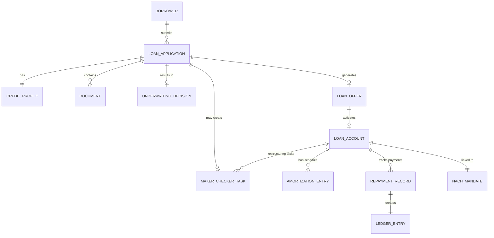

# 02 — Domain Modeling: Loan Origination & Servicing System

## Objective

Define core domain entities, value objects, aggregates, and their invariants. Establish the ubiquitous language for loan origination and servicing operations.

---

## Ubiquitous Language

| Term | Definition |
|------|-----------|
| Loan Application | Request from borrower to receive a loan — not yet a loan |
| Loan Account | Active loan post-disbursement — has an account number, balance, schedule |
| Underwriting | Process of evaluating application risk and creditworthiness |
| Maker | Person who initiates a credit decision or action |
| Checker | Person who independently approves the maker's decision |
| Offer | Approved loan terms presented to borrower (amount, rate, tenure) |
| Amortization Schedule | Month-by-month breakdown of principal and interest payments |
| EMI | Equated Monthly Installment — fixed monthly repayment amount |
| Principal | Loan amount outstanding (decreasing) |
| Interest | Cost of borrowing, computed on outstanding principal |
| Due Date | Date an EMI payment is expected |
| Grace Period | Days after due date before penalty is applied (typically 3-7 days) |
| Overdue | Payment not received by end of grace period |
| DPD | Days Past Due — how many days since payment was missed |
| NPA | Non-Performing Asset — loan where borrower is 90+ DPD |
| Restructuring | Modification of loan terms (tenure extension, rate change) for borrower in distress |
| Foreclosure | Early full repayment of outstanding principal |
| Write-off | Accounting entry when loan is deemed unrecoverable |
| NACH Mandate | Electronic standing instruction to debit borrower's bank account monthly |
| DTI Ratio | Debt-to-Income Ratio — monthly obligations / monthly income |
| LTV Ratio | Loan-to-Value — loan amount / collateral value (for secured loans) |

---

## Core Aggregates

### LoanApplication (Aggregate Root)

```
LoanApplication
├── applicationId: UUID
├── applicantId: UUID (link to Borrower — separate bounded context)
├── productType: Enum { PERSONAL_LOAN, HOME_LOAN, BNPL }
├── requestedAmount: Money
├── requestedTenureMonths: Int
├── purpose: String
├── status: ApplicationStatus (state machine)
├── creditProfile: CreditProfile
│   ├── bureauScore: Int (CIBIL 300-900)
│   ├── monthlyIncome: Money
│   ├── existingObligations: Money
│   ├── dtiRatio: Decimal (derived: existingObligations / monthlyIncome)
│   └── bureauReportId: String
├── documents: List<Document>
├── underwritingDecision: UnderwritingDecision (nullable until decided)
├── offer: LoanOffer (nullable until approved)
├── makerCheckerTask: MakerCheckerTask (nullable, if referred)
├── submittedAt: Instant
├── decidedAt: Instant
└── version: Long (optimistic locking)
```

**ApplicationStatus State Machine:**
```
DRAFT → SUBMITTED → UNDER_REVIEW → [APPROVED / REJECTED / REFERRED]
REFERRED → CHECKER_REVIEW → [APPROVED / REJECTED]
APPROVED → OFFER_EXTENDED → [OFFER_ACCEPTED / OFFER_EXPIRED]
OFFER_ACCEPTED → DISBURSED (ownership transfers to LoanAccount)
```

**Invariants:**
- `dtiRatio` cannot exceed product-specific max (e.g., 50% for personal loan)
- Cannot submit without all mandatory documents
- Once REJECTED, cannot transition to any other status
- Maker and checker must be different persons (enforced by system)

---

### LoanAccount (Aggregate Root — Post-Disbursement)

```
LoanAccount
├── loanAccountId: UUID
├── loanAccountNumber: String (human-readable: LOAN-2024-000001)
├── applicationId: UUID (link to originating application)
├── borrowerId: UUID
├── productType: Enum
├── status: LoanStatus
├── principal: Money (original disbursed amount)
├── outstandingPrincipal: Money (decreasing with payments)
├── interestRate: Decimal (annual, e.g., 12.0%)
├── tenureMonths: Int (original)
├── remainingTermMonths: Int (can decrease on prepayment)
├── disbursedAt: Instant
├── firstDueDate: LocalDate
├── nextDueDate: LocalDate
├── emiAmount: Money
├── amortizationSchedule: List<AmortizationEntry>
├── repaymentHistory: List<RepaymentRecord>
├── nachMandateId: String (reference to bank mandate)
├── dpd: Int (Days Past Due — computed daily)
├── npaClassifiedAt: Instant (null until classified)
└── version: Long
```

**LoanStatus State Machine:**
```
ACTIVE → [CLOSED / NPA / WRITTEN_OFF / RESTRUCTURED]
RESTRUCTURED → ACTIVE (on successful restructuring)
NPA → [WRITTEN_OFF / ACTIVE (on recovery)]
```

---

### AmortizationEntry (Value Object inside LoanAccount)

```
AmortizationEntry
├── installmentNumber: Int (1 to tenureMonths)
├── dueDate: LocalDate
├── openingPrincipal: Money
├── emiAmount: Money
├── principalComponent: Money
├── interestComponent: Money
├── closingPrincipal: Money
└── status: Enum { SCHEDULED, PAID, PARTIAL, MISSED, WAIVED }
```

**Business rule:** `principalComponent + interestComponent == emiAmount` exactly (rounded to 2 decimal places, adjustment on last installment).

---

### MakerCheckerTask (Aggregate Root)

```
MakerCheckerTask
├── taskId: UUID
├── entityType: String ("LOAN_APPLICATION" / "LOAN_RESTRUCTURING")
├── entityId: UUID
├── action: String ("CREDIT_APPROVAL" / "RESTRUCTURING_APPROVAL")
├── makerId: UUID
├── makerDecision: Decision
│   ├── approved: Boolean
│   ├── notes: String
│   └── decidedAt: Instant
├── checkerId: UUID (nullable — assigned after maker submits)
├── checkerDecision: Decision (nullable)
├── status: Enum { PENDING_MAKER, PENDING_CHECKER, APPROVED, REJECTED }
├── amount: Money (loan amount for limit-based routing)
├── createdAt: Instant
└── expiresAt: Instant (SLA: 24 hours to decide)
```

**Invariants:**
- `makerId != checkerId` (enforced at assignment — cannot check your own submission)
- Checker cannot be assigned from same team as maker (configurable four-eyes principle)
- Task expires if not resolved within SLA → auto-rejected with escalation alert

---

### RepaymentRecord (Value Object inside LoanAccount)

```
RepaymentRecord
├── repaymentId: UUID
├── installmentNumber: Int
├── amount: Money
├── principalPaid: Money
├── interestPaid: Money
├── penaltyPaid: Money (if any)
├── paymentMethod: Enum { NACH_DEBIT, NEFT, UPI, CASH }
├── paymentReference: String (bank transaction ID)
├── receivedAt: Instant
├── appliedAt: Instant (when ledger entry processed)
└── source: Enum { AUTO_DEBIT, MANUAL, PREPAYMENT }
```

---

## Domain Events

| Event | Trigger | Consumers |
|-------|---------|-----------|
| `LoanApplicationSubmitted` | Borrower submits application | Underwriting Service, Notification |
| `CreditBureauReportReceived` | Bureau API callback | Underwriting Service |
| `ApplicationApproved` | Underwriting decision | Offer Service, Notification, Audit |
| `ApplicationRejected` | Underwriting decision | Notification, Audit |
| `MakerCheckerApproved` | Checker approves | Application Service, Notification |
| `LoanOfferAccepted` | Borrower accepts offer | Disbursement Service |
| `LoanDisbursed` | Bank confirms transfer | Loan Account Service, Ledger, Notification |
| `LoanActivated` | Loan account created | EMI Scheduler, Collections Service |
| `EMIPaymentDue` | Scheduler triggers | NACH Debit Service, Notification |
| `EMIPaymentReceived` | Payment processor confirms | Loan Account, Ledger, Notification |
| `EMIMissed` | Due date passed, no payment | Collections Service, Notification |
| `LoanOverdue` | 1-89 DPD | Collections escalation |
| `LoanNPAClassified` | 90+ DPD | NPA management, Regulatory reporting |
| `LoanRestructured` | Restructuring approved | Loan Account (new schedule), Ledger |
| `LoanClosed` | Full repayment received | Ledger, Notification, Archive |
| `LoanWrittenOff` | Write-off approved | Ledger, Regulatory reporting |

---

## Entity Relationship Diagram



---

## Value Objects

### Money

- Amount (BigDecimal, scale=2) + Currency (ISO 4217)
- Immutable — arithmetic produces new Money instances
- Comparison: exact decimal match, not floating point
- Prevents mixing currencies (INR != USD) at compile time

### CreditGrade

- Derived from bureau score bands: A (750-900), B (700-749), C (650-699), D (< 650)
- Maps to interest rate bands in product configuration
- Value object — no identity, compared by value

### InterestRate

- Annual rate as decimal (12.0% = 0.12)
- Type: Enum { FIXED, FLOATING }
- Floating rates carry a benchmark (REPO rate) + spread
