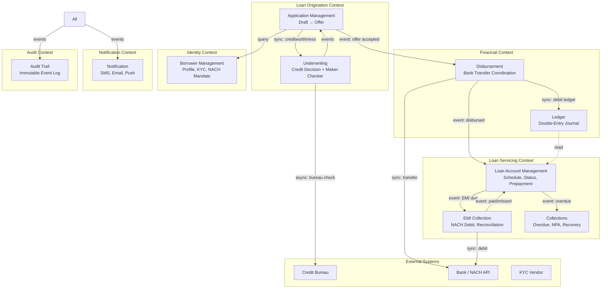

# 03 — DDD Boundaries: Loan Origination & Servicing System

## Objective

Define bounded contexts, inter-context communication, anti-corruption layers, and the mapping between DDD concepts and system modules.

---

## Bounded Contexts Overview



---

## Context: Application Management

**Responsibility:** Capture borrower intent. Manage application lifecycle from DRAFT to OFFER_ACCEPTED.

**Aggregate Root:** `LoanApplication`

**Owns:**
- Application state and transitions
- Document collection tracking
- Offer generation and presentation
- Borrower-facing status visibility

**Does NOT own:**
- Credit scoring (Underwriting Context)
- Account creation (Servicing Context)
- Fund movement (Disbursement Context)

**Integration:**
- Calls Underwriting Context synchronously to trigger credit evaluation
- Listens to `MakerCheckerDecisionEvent` from Underwriting Context
- Publishes `LoanOfferAccepted` to trigger Disbursement Context

**Anti-Corruption Layer (ACL):** Bureau report from external CIBIL API is translated to internal `CreditProfile` by an ACL in the Underwriting Context — the Application Context never sees raw CIBIL schema.

---

## Context: Underwriting

**Responsibility:** Evaluate loan risk and produce a credit decision. Enforce maker-checker on high-value decisions.

**Aggregates:** `UnderwritingDecision`, `MakerCheckerTask`

**Owns:**
- Credit policy rules (DTI limits, minimum bureau score, LTV limits)
- Maker-checker workflow (task assignment, SLA tracking)
- Bureau integration and report caching

**Shared Kernel with Application Context:**
- `ApplicationId` reference (not the full Application entity)
- `Decision` value object (APPROVED / REJECTED / REFERRED, with reason)

**Integration with external Bureau:**
- ACL translates external bureau response to `CreditProfile`
- Bureau calls are async (bureau API may take 2-5 seconds)
- Result cached per borrower per date (bureau charges per pull — cache within 24 hours)

**Maker-Checker Routing Rules:**

| Loan Amount | Required Approval |
|-------------|------------------|
| < ₹1 lakh | Auto-approved if bureau score > 750 |
| ₹1-5 lakh | Maker review mandatory |
| ₹5-25 lakh | Maker + Checker (senior underwriter) |
| > ₹25 lakh | Maker + Checker + Credit Committee |

---

## Context: Loan Servicing

**Responsibility:** Manage the loan from activation to closure. The authoritative source for loan account state.

**Aggregate Root:** `LoanAccount`

**Owns:**
- Outstanding balance tracking
- Amortization schedule
- Repayment recording
- DPD tracking
- Prepayment and foreclosure processing
- Restructuring (with maker-checker approval from Underwriting Context)

**Does NOT own:**
- EMI collection mechanics (EMI Collection Context)
- Collections workflow (Collections Context)
- Ledger entries (Financial Context)

**Key invariants enforced here:**
- `sum of all principal components in schedule = original principal`
- `outstanding principal never negative`
- `DPD = days since last missed due date (if any)`

---

## Context: EMI Collection

**Responsibility:** Automated monthly EMI debit via NACH mandate.

**Owns:**
- NACH mandate lifecycle (setup, presentation, cancellation)
- EMI batch job scheduling
- Bounce handling and retry logic
- Reconciliation against bank statement

**Process:**
1. On T-3 (3 days before due date): send pre-debit notification to borrower
2. On due date: present NACH debit instruction to bank via NPCI
3. Bank processes overnight → response next morning (T+1)
4. On success: publish `EMIPaymentReceived` → Servicing Context updates schedule
5. On bounce: publish `EMIBounced` → retry next day, then Collections Context notified

**ACL with Bank API:**
Translates NACH return codes (e.g., "INSU" = insufficient funds) to internal `BounceReason` enum. Bank codes change; internal enum stays stable.

---

## Context: Collections

**Responsibility:** Manage recovery from overdue to NPA classification and beyond.

**Owns:**
- Collections case management
- Escalation workflow (reminder → field agent → legal)
- Settlement offer workflow
- NPA classification triggers
- Write-off approval workflow

**Trigger:** `LoanOverdue` event from Servicing Context (when DPD > 0 after grace period).

**Does NOT own:** loan account state. Collections can only recommend actions — Servicing Context applies them.

**Key workflow:**

```
DPD 1-7:     Automated SMS/call reminders
DPD 8-30:    Telecalling agent assigned
DPD 31-60:   Senior collections agent + settlement offer
DPD 61-89:   Legal notice issued
DPD 90:      NPA classification (regulatory trigger)
DPD 90+:     Asset reconstruction / write-off consideration
```

---

## Context: Disbursement

**Responsibility:** Coordinate the complex multi-step disbursement: ledger debit + bank transfer + loan activation.

This is a Saga — compensating transactions required for each step.

**Saga Steps:**

1. `Reserve funds in lending pool` (Ledger Context)
2. `Initiate bank transfer` (Bank API)
3. `Await bank confirmation` (async, may take seconds to hours)
4. `Confirm ledger entry` + `Activate loan account` (atomic, in same transaction)

**Compensating transactions (on failure):**
- Bank transfer failed → `Release ledger reservation`
- Loan activation failed (after transfer succeeded) → `Create suspense entry in ledger, alert ops team`

**Saga state stored in:** `disbursement_sagas` table — persisted, recoverable.

---

## Context: Financial / Ledger

**Responsibility:** Maintain double-entry ledger of all money movements.

**Accounts modeled:**
- Lending Pool (liability)
- Loan Receivable per loan account (asset)
- Interest Earned (income)
- Penalty Income (income)
- Provisioning (expense — for NPA)

**Context Map type:** Shared Kernel is deliberately avoided — Ledger is a conformist. Other contexts call Ledger's API. Ledger does not depend on any other domain context.

---

## Anti-Corruption Layers

| Boundary | ACL | Why |
|----------|-----|-----|
| CIBIL API → Underwriting Context | `CreditBureauACL` | CIBIL response schema changes; internal model stable |
| NACH API → EMI Collection Context | `NachResponseACL` | NPCI return codes → internal BounceReason enum |
| Bank Transfer API → Disbursement Context | `BankTransferACL` | Bank-specific transaction formats → internal TransferResult |
| KYC Vendor API → Borrower Context | `KycACL` | Vendor-specific payload → internal VerificationStatus |

---

## Shared Kernel (Minimal)

Shared across Origination and Servicing:
- `BorrowerId` type (UUID)
- `Money` value object (amount + currency)
- `LoanProductType` enum
- Domain event envelope schema

Deliberately small. Shared kernel is a coupling point — keep it minimal.

---

## Context Map

| Relationship | Type | Communication |
|-------------|------|--------------|
| Application ↔ Underwriting | Partnership (same team) | Synchronous in-process call (monolith) |
| Origination → Servicing | Customer/Supplier | Event: `LoanOfferAccepted` |
| Servicing → Collections | Customer/Supplier | Event: `LoanOverdue` |
| Servicing → Ledger | Conformist | Sync API call |
| Disbursement → Bank API | Conformist + ACL | External REST |
| Underwriting → Bureau | Conformist + ACL | External REST |
| All → Notification | Published Language | Kafka events |
| All → Audit | Published Language | Kafka events |
