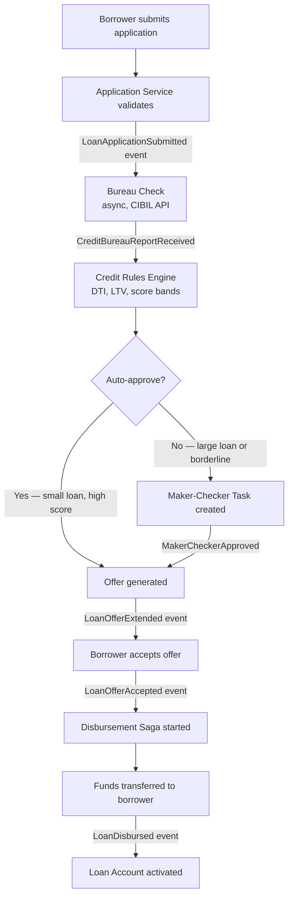
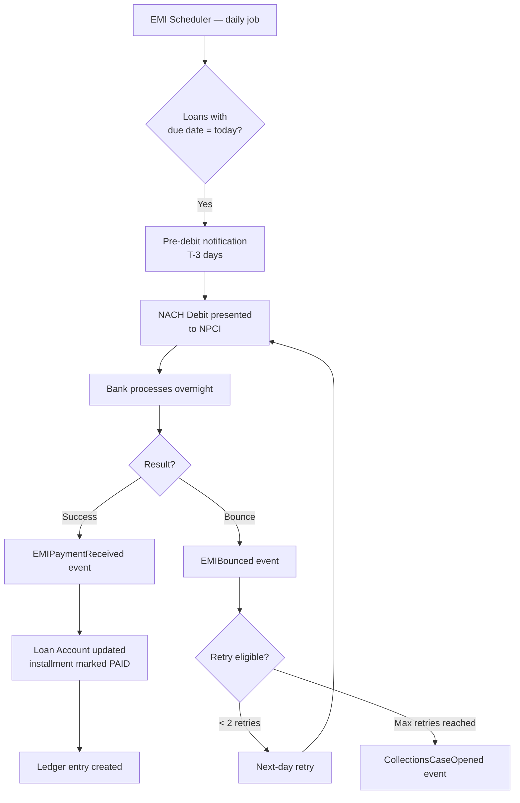
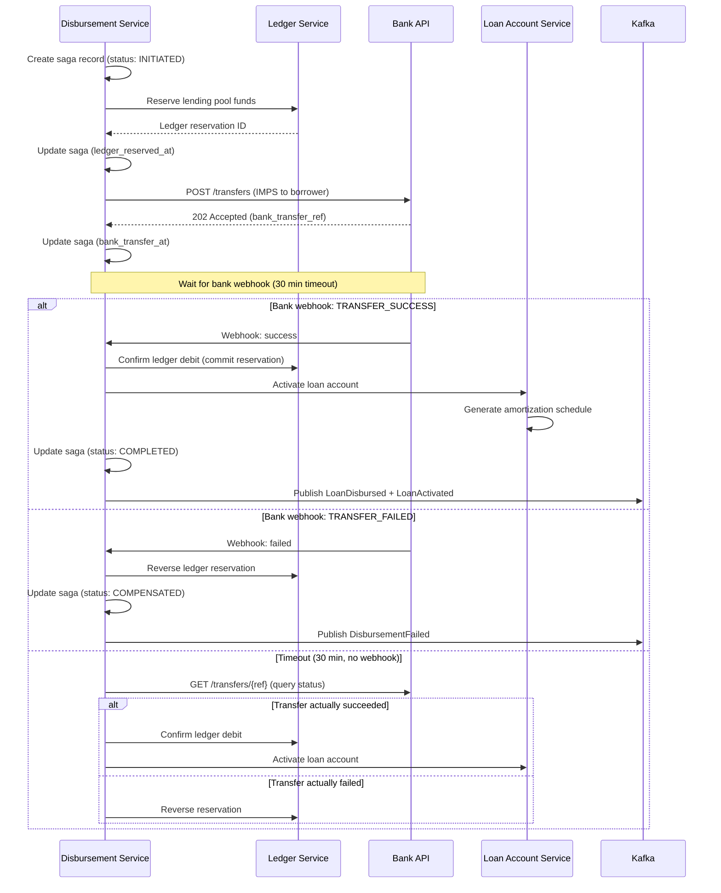

# 06 — Event Flow: Loan Origination & Servicing System

## Objective

Document complete event lifecycle from application submission through loan closure. Map Kafka topics, saga flows, and consumer responsibilities.

---

## Event Flow: Loan Origination



---

## Event Flow: EMI Collection



---

## Kafka Topic Design

| Topic | Partitioned By | Producers | Consumers | Retention |
|-------|----------------|-----------|-----------|-----------|
| `loan-application-events` | applicationId | Application Service | Underwriting, Audit, Notification | 30 days |
| `underwriting-events` | applicationId | Underwriting Service | Application Service, Audit | 30 days |
| `disbursement-events` | offerId | Disbursement Service | Servicing, Ledger, Notification, Audit | 30 days |
| `loan-account-events` | loanAccountId | Servicing Service | EMI Scheduler, Collections, Audit | 90 days |
| `emi-collection-events` | loanAccountId | EMI Service | Servicing, Ledger, Notification, Audit | 30 days |
| `collections-events` | loanAccountId | Collections Service | Notification, Audit, Regulatory | 90 days |
| `notification-commands` | borrowerId | All services | Notification Service | 7 days |
| `audit-events` | entityType | All services | Audit Service | 365 days |

---

## Event Schemas

### LoanApplicationSubmitted

```json
{
  "eventType": "LOAN_APPLICATION_SUBMITTED",
  "eventId": "uuid",
  "applicationId": "uuid",
  "borrowerId": "uuid",
  "productType": "PERSONAL_LOAN",
  "requestedAmount": { "amount": "500000.00", "currency": "INR" },
  "requestedTenureMonths": 24,
  "submittedAt": "2024-01-15T10:05:00Z",
  "correlationId": "trace-abc123"
}
```

### ApplicationApproved

```json
{
  "eventType": "APPLICATION_APPROVED",
  "eventId": "uuid",
  "applicationId": "uuid",
  "approvedAmount": { "amount": "500000.00", "currency": "INR" },
  "interestRate": 0.1250,
  "tenureMonths": 24,
  "approvalChannel": "AUTO",  // or MAKER_CHECKER
  "decidedAt": "2024-01-15T10:35:00Z",
  "correlationId": "trace-abc123"
}
```

### LoanOfferAccepted

```json
{
  "eventType": "LOAN_OFFER_ACCEPTED",
  "eventId": "uuid",
  "offerId": "uuid",
  "applicationId": "uuid",
  "borrowerId": "uuid",
  "approvedAmount": { "amount": "500000.00", "currency": "INR" },
  "disbursementAccountNumber": "9876543210",
  "disbursementIfsc": "SBIN0001234",
  "acceptedAt": "2024-01-15T11:00:00Z",
  "correlationId": "trace-abc123"
}
```

### LoanDisbursed

```json
{
  "eventType": "LOAN_DISBURSED",
  "eventId": "uuid",
  "sagaId": "uuid",
  "offerId": "uuid",
  "loanAccountId": "uuid",
  "borrowerId": "uuid",
  "disbursedAmount": { "amount": "495000.00", "currency": "INR" },
  "netAmount": { "amount": "495000.00", "currency": "INR" },
  "processingFeeDeducted": { "amount": "5000.00", "currency": "INR" },
  "bankTransactionRef": "IMPS-txn-ref-abc",
  "disbursedAt": "2024-01-15T12:00:00Z",
  "correlationId": "trace-abc123"
}
```

### EMIPaymentReceived

```json
{
  "eventType": "EMI_PAYMENT_RECEIVED",
  "eventId": "uuid",
  "loanAccountId": "uuid",
  "borrowerId": "uuid",
  "installmentNumber": 6,
  "amountReceived": { "amount": "23718.45", "currency": "INR" },
  "principalPaid": { "amount": "19098.45", "currency": "INR" },
  "interestPaid": { "amount": "4620.00", "currency": "INR" },
  "paymentReference": "NACH-202401-001234",
  "receivedAt": "2024-01-01T06:00:00Z",
  "correlationId": "trace-def456"
}
```

### EMIBounced

```json
{
  "eventType": "EMI_BOUNCED",
  "eventId": "uuid",
  "loanAccountId": "uuid",
  "borrowerId": "uuid",
  "installmentNumber": 6,
  "attemptNumber": 1,
  "bounceReason": "INSUFFICIENT_FUNDS",
  "bancReturnCode": "INSU",
  "bounceCharges": { "amount": "500.00", "currency": "INR" },
  "nextRetryDate": "2024-01-02",
  "occurredAt": "2024-01-01T22:00:00Z"
}
```

---

## Disbursement Saga — Detailed Flow



**Key insight:** Saga state is persisted to PostgreSQL at every step. If Disbursement Service crashes mid-saga, it can reload saga state on restart and continue from the last completed step.

---

## Consumer Responsibilities

### Underwriting Service (consumes `loan-application-events`)

On `LoanApplicationSubmitted`:
1. Pull credit bureau report (async, stores result in `underwriting_payload`)
2. Apply credit policy rules
3. If auto-approvable: publish `ApplicationApproved`
4. If refers: create `MakerCheckerTask`, publish `ApplicationReferred`

**Idempotency:** Check `underwriting_evaluations` table for existing result by `applicationId` before processing. Re-process is safe (same result, same event).

### EMI Scheduler (consumes `loan-account-events`)

On `LoanActivated`:
1. Register loan for daily EMI due-date check
2. On each calendar day: query `amortization_schedule` for `due_date = today` and `status = SCHEDULED`
3. For T-3 days: publish `EMINotificationDue`
4. For T=0: publish `EMICollectionDue` → triggers NACH debit batch

**Implementation note:** EMI Scheduler is a cron-driven service (K8s CronJob at 6 AM daily), not an event-driven consumer. It reads the database directly for the batch run. It consumes `LoanActivated` only to maintain its internal registry of active loans.

### Collections Service (consumes `emi-collection-events`)

On `EMIBounced` (final, after retries exhausted):
1. Create collections case for borrower
2. Assign to telecalling agent (round-robin from available pool)
3. Start DPD clock

On `LoanOverdue` (from daily DPD calculator job):
1. Escalate collections case based on DPD tier
2. Trigger appropriate workflow (reminder / field agent / legal)

---

## Dead Letter Queue Design

| Topic | DLQ | Retry Policy | Alert |
|-------|-----|-------------|-------|
| `loan-application-events` | `loan-application-events-dlq` | 3 retries, 5min backoff | Slack |
| `disbursement-events` | `disbursement-events-dlq` | 5 retries, 10min backoff | PagerDuty (financial) |
| `emi-collection-events` | `emi-collection-events-dlq` | 3 retries | PagerDuty if DLQ grows |
| `notification-commands` | `notification-commands-dlq` | 3 retries | Slack |

**Critical rule:** DLQ for `disbursement-events` is a P1 alert. A failed disbursement event means money may have moved without loan activation — financial exposure.
