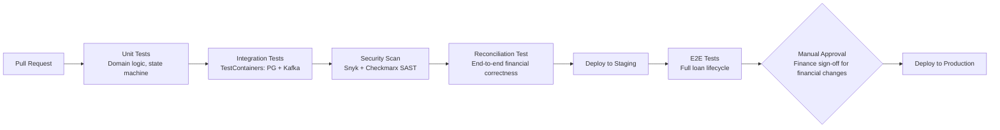

# 13 — Deployment Architecture: Loan Origination & Servicing System

## Objective

Define Kubernetes deployment topology, CI/CD pipeline, environment strategy, and operational procedures for a lending platform that handles multi-year financial data.

---

## Infrastructure Overview

```mermaid
graph TB
    subgraph AWS Region: ap-south-1 (Mumbai)
        subgraph AZ-1a
            APP1[App Services<br/>Pods: Gateway, Origination, Servicing]
            PG_P[(PostgreSQL Primary<br/>r6g.2xlarge)]
            RD1[Redis Primary]
            KF1[Kafka Broker 1-2]
        end
        subgraph AZ-1b
            APP2[App Services<br/>Pods: EMI Workers, Collections]
            PG_R1[(PostgreSQL Replica 1<br/>Borrower Portal)]
            RD2[Redis Replica]
            KF2[Kafka Broker 3-4]
        end
        subgraph AZ-1c
            APP3[App Services<br/>Pods: Audit, Notifications]
            PG_R2[(PostgreSQL Replica 2<br/>Back-office Reports)]
            RD3[Redis Replica]
            KF3[Kafka Broker 5-6]
        end
        S3[S3<br/>Documents + NACH Files + Archival]
        ALB[Application Load Balancer]
    end
    subgraph AWS Region: ap-south-2 (Hyderabad) — DR
        PG_DR[(PostgreSQL Read Replica<br/>DR standby)]
        KF_DR[Kafka MirrorMaker]
    end

    Internet --> ALB
    ALB --> APP1
    ALB --> APP2
```

**Region choice:** India-based AWS regions (Mumbai primary, Hyderabad DR) for RBI data localization requirements — financial data must reside in India.

---

## Kubernetes Configuration

### Application Services

```yaml
# Loan Origination Service
replicas: 5
autoscaling:
  minReplicas: 5
  maxReplicas: 30   # Campaign surge headroom
  metrics:
    - type: Resource
      resource:
        name: cpu
        target:
          averageUtilization: 65
resources:
  requests:
    cpu: "2"
    memory: "4Gi"
  limits:
    cpu: "2"
    memory: "4Gi"

# EMI Worker (scales for monthly batch)
replicas: 5         # Normal: 5
# Manual scale to 50 pods on EMI day (or KEDA-based autoscaling triggered by Kafka lag)
autoscaling:
  minReplicas: 5
  maxReplicas: 50

# Disbursement Service (low volume, high criticality)
replicas: 3
# No autoscaling — stable pod count preferred for critical financial service
```

### Stateful Services

PostgreSQL: AWS RDS (managed) — not self-managed on K8s. Operational simplicity > cost savings for primary data store.

Redis: AWS ElastiCache (managed) — similarly, avoid self-managing Redis on K8s.

Kafka: MSK (Amazon Managed Streaming for Kafka) — removes broker management overhead.

---

## CI/CD Pipeline



### Reconciliation Test in CI

Every PR that touches financial calculation logic (amortization, interest, penalty) must pass a reconciliation test suite:
- Input: set of 1,000 pre-defined loan scenarios
- Expected output: pre-computed amortization schedules (golden dataset)
- Actual output: calculated by the code under test
- Comparison: exact match (no "close enough" for financial calculations)

This prevents rounding errors or formula changes from shipping without detection.

### Finance Sign-Off Gate

Changes to:
- Interest calculation formula
- Amortization logic
- Penalty computation
- Disbursement flow

Require manual approval from Finance team (not just engineering). Gate enforced in GitHub Actions via required reviewers rule linked to CODEOWNERS.

---

## Deployment Strategy

### Standard Services (Origination, Servicing, Notifications): Rolling Update

```
Strategy: RollingUpdate
maxSurge: 2
maxUnavailable: 0
```

Stateless services roll without downtime. Borrowers experience no disruption.

### EMI Scheduler CronJob: Cannot Roll During Batch

EMI batch runs on 1st of month, 6 AM to ~10 AM. No deployments allowed during this window.

Deployment freeze: automated check in CI/CD prevents production deployment between 5:30 AM and 11 AM on 1st of month.

### Database Schema Changes: Expand-Contract Pattern

Never apply breaking schema changes in one deployment:

1. **Expand:** Add new column (nullable), deploy new code that writes to both old and new column
2. **Migrate:** Backfill old data to new column (background job)
3. **Contract:** Deploy code that reads only new column, drop old column

No table locks that block application. No deployment downtime. Takes longer but zero risk.

### Blue-Green for Major Releases

For major version changes (V1 → V2):
- Deploy V2 as blue environment
- Route 5% traffic (canary) to blue
- Monitor error rate, latency, financial metrics for 24 hours
- If clean: route 100% to blue, decommission green

---

## Feature Flags

Managed via environment config + Spring Cloud Config:

| Flag | Default | Use |
|------|---------|-----|
| `auto-approval-enabled` | true | Disable auto-approval (manual review all applications) |
| `bureau-cache-enabled` | true | Disable for testing fresh bureau pulls |
| `nach-live-mode` | true | `false` = dry run (don't actually submit to NPCI) |
| `new-amortization-formula` | false | Gradual rollout of formula change |
| `bnpl-product-enabled` | false | Enable BNPL loan type |
| `prepayment-penalty-enabled` | true | Disable for promotional campaigns |

**Flag `nach-live-mode`:** Critical. Developers testing EMI flows must set this to `false` in staging. Accidentally submitting real NACH debits from staging would be a serious incident.

---

## Environment Strategy

| Environment | Purpose | Data | External APIs |
|-------------|---------|------|--------------|
| Local | Developer testing | H2 + embedded Kafka | Mocked (WireMock) |
| Dev | Feature integration | Dedicated PG + Kafka | Sandbox APIs |
| Staging | Pre-prod validation | Anonymized prod clone | Test credentials |
| Production | Live | Real data | Live APIs |
| DR | Disaster recovery | Real data replica | Live APIs (standby) |

**Data sanitization for staging:** Monthly job anonymizes production clone:
- Names replaced with synthetic names
- PAN numbers replaced with test PANs (AAAAA9999A format for testing)
- Mobile numbers replaced with test numbers
- Bank account numbers replaced with test accounts

Staging environment reflects production data size (2M loan accounts) for realistic performance testing.

---

## Cron Job Schedule

| Job | Schedule | Description |
|-----|----------|-------------|
| EMI due reminder | 6 AM daily | Send T-3 day pre-debit notification |
| EMI batch generator | 6 AM on 1st | Generate NACH debit instructions |
| NACH result processor | 8 AM on 2nd | Process T+1 bank result file |
| DPD calculator | 7 AM daily | Update days past due for all active loans |
| SLA monitor | Every 15 min | Check maker-checker task SLA breaches |
| Reconciliation | 2 AM daily | Financial reconciliation |
| Offer expiry cleanup | 9 AM daily | Expire unaccepted offers |
| S3 archival | 3 AM Sunday | Move old documents to cold storage |
| Bureau cache cleaner | Midnight daily | Clear expired bureau report cache |
| Audit log archival | 3 AM 1st of month | Export month-old audit logs to S3 |

---

## Operational Runbooks

| Scenario | Runbook |
|----------|--------|
| Stuck disbursement saga | Query saga table, verify bank status, manually advance saga |
| NACH batch failure | Re-generate + re-submit batch, coordinate with bank on late submission |
| Maker-checker SLA breach | Escalation matrix — assign to senior underwriter |
| PostgreSQL primary failure | RDS automatic failover; verify app reconnects via connection pool |
| Reconciliation discrepancy | Investigation checklist (query audit log, trace all events for affected loan) |
| Campaign surge preparation | Pre-scale application pods, verify Redis capacity, alert DBA team |
| DR activation | Full DR runbook: promote replica, update DNS, verify Kafka consumer catchup |
